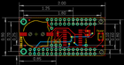
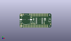
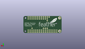
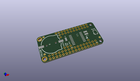

Contents
========

* [PROJ-ADAF-3028-STAN-01>Adafruit DS3231 Precision RTC FeatherWing PCB](#proj-adaf-3028-stan-01adafruit-ds3231-precision-rtc-featherwing-pcb)
	* [Images](#images)
	* [Interactive BOM](#interactive-bom)
	* [OOMP Parts](#oomp-parts)
	* [Tags](#tags)
  
![][im]
# PROJ-ADAF-3028-STAN-01>Adafruit DS3231 Precision RTC FeatherWing PCB

- ID: PROJ-ADAF-3028-STAN-01
- Hex ID: PRA3028
- Name: Adafruit DS3231 Precision RTC FeatherWing PCB
- Description: 

## Images
  
  

|eagleImage|kicadPcb3dFront|kicadPcb3dBack|kicadPcb3d|
| :---: | :---: | :---: | :---: |
|||||

## Interactive BOM

- Interactive BOM page: [ibom.html](kicad/bom/ibom.html)

## OOMP Parts
  

|OOMP Parts|
| :---: |
|UNMATCHED-UNMATCHED-X-UNMATCHED-01, B1, 9.906, 12.953999999999999, 0,B1, CR1220, CR1220-2, microbuilder, (0.39, 0.51), R0|
|CAPC-0805-X-UNMATCHED-01, C1, 22.605999999999998, 13.208, 90,C1, 1uF, 0805-NO, microbuilder, (0.89, 0.52), R90|
|UNMATCHED-UNMATCHED-X-UNMATCHED-01, IC1, 31.496, 10.921999999999999, 270,IC1, DS3231/SO, SO16W, adafruit, (1.24, 0.43), R270|
|<table><tr><td></td><td> JP1</td><td>[HEAD-I01-X-PI16-01 2.54 mm 16 Pin Header](https://github.com/oomlout/oomlout_OOMP_parts/tree/main/HEAD-I01-X-PI16-01/)</td><td>[H16](https://github.com/oomlout/oomlout_OOMP_parts/tree/main/HEAD-I01-X-PI16-01/)</td></tr></table>|
|<table><tr><td></td><td> JP2</td><td>[HEAD-I01-X-PI03-01 2.54 mm 3 Pin Header](https://github.com/oomlout/oomlout_OOMP_parts/tree/main/HEAD-I01-X-PI03-01/)</td><td>[H03](https://github.com/oomlout/oomlout_OOMP_parts/tree/main/HEAD-I01-X-PI03-01/)</td></tr></table>|
|HEAD-I01-X-PI01-01, JP3, 19.049999999999997, 16.509999999999998, 0,JP3, 1X01_ROUND, microbuilder, (0.75, 0.65), R0|
|HEAD-I01-X-PI11-01, JP4, 31.75, 19.049999999999997, 0,JP4, 1X11_ROUND, microbuilder, (1.25, 0.75), R0|
|HEAD-I01-X-PI01-01, JP5, 39.37, 6.35, 0,JP5, 1X01_ROUND, microbuilder, (1.55, 0.25), R0|
|UNMATCHED-UNMATCHED-X-UNMATCHED-01, MS1, 0.0, 0.0, 0,MS1, MICROSHIELD_NODIM, MICROSHIELD_DIM, microbuilder, (0, 0), R0|
|<table><tr><td></td><td> R1</td><td>[RESE-0805-X-O103-01 SMD (0805) 10k Ohm Resistor](https://github.com/oomlout/oomlout_OOMP_parts/tree/main/RESE-0805-X-O103-01/)</td><td>[R85103](https://github.com/oomlout/oomlout_OOMP_parts/tree/main/RESE-0805-X-O103-01/)</td></tr></table>|
|<table><tr><td></td><td> R2</td><td>[RESE-0805-X-O103-01 SMD (0805) 10k Ohm Resistor](https://github.com/oomlout/oomlout_OOMP_parts/tree/main/RESE-0805-X-O103-01/)</td><td>[R85103](https://github.com/oomlout/oomlout_OOMP_parts/tree/main/RESE-0805-X-O103-01/)</td></tr></table>|
|UNMATCHED-UNMATCHED-X-UNMATCHED-01, SW1, 48.26, 11.43, 90,SW1, KMR2, BTN_KMR2_4.6X2.8, microbuilder, (1.9, 0.45), R90|

## Tags

- hexID: PRA3028
- oompType: PROJ
- oompSize: ADAF
- oompColor: 3028
- oompDesc: STAN
- oompIndex: 01
- oompName: Adafruit DS3231 Precision RTC FeatherWing PCB
- sources: All source files from https://github.com/adafruit/Adafruit-DS3231-Precision-RTC-FeatherWing-PCB (source licence details in srcLicense.md)
- linkBuyPage: http://www.adafruit.com/products/3028
- oompID: PROJ-ADAF-3028-STAN-01
- oompPart: UNMATCHED-UNMATCHED-X-UNMATCHED-01, B1, 9.906, 12.953999999999999, 0
- oompPart: CAPC-0805-X-UNMATCHED-01, C1, 22.605999999999998, 13.208, 90
- oompPart: SKIP-UNMATCHED-X-UNMATCHED-01, FID1, 3.302, 6.095999999999999, 0
- oompPart: SKIP-UNMATCHED-X-UNMATCHED-01, FID2, 5.842, 21.336, 0
- oompPart: SKIP-UNMATCHED-X-UNMATCHED-01, FID3, 49.275999999999996, 5.588, 0
- oompPart: UNMATCHED-UNMATCHED-X-UNMATCHED-01, IC1, 31.496, 10.921999999999999, 270
- oompPart: HEAD-I01-X-PI16-01, JP1, 25.4, 3.8099999999999996, 180
- oompPart: HEAD-I01-X-PI03-01, JP2, 21.59, 6.35, 180
- oompPart: HEAD-I01-X-PI01-01, JP3, 19.049999999999997, 16.509999999999998, 0
- oompPart: HEAD-I01-X-PI11-01, JP4, 31.75, 19.049999999999997, 0
- oompPart: HEAD-I01-X-PI01-01, JP5, 39.37, 6.35, 0
- oompPart: UNMATCHED-UNMATCHED-X-UNMATCHED-01, MS1, 0.0, 0.0, 0
- oompPart: RESE-0805-X-O103-01, R1, 40.386, 12.446, 180
- oompPart: RESE-0805-X-O103-01, R2, 40.386, 14.731999999999998, 180
- oompPart: UNMATCHED-UNMATCHED-X-UNMATCHED-01, SW1, 48.26, 11.43, 90
- rawPart: B1, CR1220, CR1220-2, microbuilder, (0.39, 0.51), R0
- rawPart: C1, 1uF, 0805-NO, microbuilder, (0.89, 0.52), R90
- rawPart: FID1, FIDUCIAL, FIDUCIAL_1MM, microbuilder, (0.13, 0.24), R0
- rawPart: FID2, FIDUCIAL, FIDUCIAL_1MM, microbuilder, (0.23, 0.84), R0
- rawPart: FID3, FIDUCIAL, FIDUCIAL_1MM, microbuilder, (1.94, 0.22), R0
- rawPart: IC1, DS3231/SO, SO16W, adafruit, (1.24, 0.43), R270
- rawPart: JP1, 1X16_ROUND, microbuilder, (1, 0.15), R180
- rawPart: JP2, 1X03_ROUND, microbuilder, (0.85, 0.25), R180
- rawPart: JP3, 1X01_ROUND, microbuilder, (0.75, 0.65), R0
- rawPart: JP4, 1X11_ROUND, microbuilder, (1.25, 0.75), R0
- rawPart: JP5, 1X01_ROUND, microbuilder, (1.55, 0.25), R0
- rawPart: MS1, MICROSHIELD_NODIM, MICROSHIELD_DIM, microbuilder, (0, 0), R0
- rawPart: R1, 10K, 0805-NO, microbuilder, (1.59, 0.49), R180
- rawPart: R2, 10K, 0805-NO, microbuilder, (1.59, 0.58), R180
- rawPart: SW1, KMR2, BTN_KMR2_4.6X2.8, microbuilder, (1.9, 0.45), R90

[im]: kicadPcb3d_450.png
