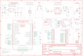

Contents
========

* [PRA3056 > Adafruit](#pra3056--adafruit)
	* [Schematic](#schematic)
	* [Interactive BOM](#interactive-bom)
	* [OOMP Parts](#oomp-parts)
	* [Images](#images)
	* [Tags](#tags)
  
![][im]
# PRA3056 > Adafruit

- ID: PROJ-ADAF-3056-STAN-01
- Hex ID: PRA3056
- Name: Adafruit
- Description: Adafruit
- Long Link: [http://oom.lt/PROJ-ADAF-3056-STAN-01](http://oom.lt/PROJ-ADAF-3056-STAN-01)
- Short Link: [http://oom.lt/PRA3056](http://oom.lt/PRA3056)

## Schematic
  

## Interactive BOM

- Interactive BOM page: [ibom.html](https://htmlpreview.github.io/?https://github.com/oomlout/oomlout_OOMP_projects/blob/main/PROJ-ADAF-3056-STAN-01/kicad/bom/ibom.html)

## OOMP Parts
  

|OOMP Parts|
| :---: |
|C1,CAPC-0805-X-UNMATCHED-01,C1,10µF,CAP_CERAMIC0805-NOOUTLINE,0805-NO,Ceramic Capacitors,,|
|C2,CAPC-0805-X-UNMATCHED-01,C2,10µF,CAP_CERAMIC0805-NOOUTLINE,0805-NO,Ceramic Capacitors,,|
|C3,CAPC-0805-X-UNMATCHED-01,C3,10µF,CAP_CERAMIC0805-NOOUTLINE,0805-NO,Ceramic Capacitors,,|
|C5,CAPC-0603-X-UF1-01,C5,1uF,CAP_CERAMIC0603_NO,0603-NO,Ceramic Capacitors,,|
|C6,CAPC-0805-X-UNMATCHED-01,C6,10µF,CAP_CERAMIC0805-NOOUTLINE,0805-NO,Ceramic Capacitors,,|
|C7,CAPC-0603-X-UF1-01,C7,1uF,CAP_CERAMIC0603_NO,0603-NO,Ceramic Capacitors,,|
|C8,CAPC-0805-X-UNMATCHED-01,C8,10µF,CAP_CERAMIC0805-NOOUTLINE,0805-NO,Ceramic Capacitors,,|
|C10,CAPC-UNMATCHED-X-NF100-01,C10,0.1uF,CAP_CERAMIC0805_10MGAP,0805_10MGAP,Ceramic Capacitors,,|
|CHG,LEDS-0805-G-STAN-01,CHG,ORANGE,LED0805_NOOUTLINE,CHIPLED_0805_NOOUTLINE,LED,,|
|D1,DIOD-UNMATCHED-X-UNMATCHED-01,D1,MBR120,DIODE-SCHOTTKYSOD-123,SOD-123,,,|
|JP1,HEAD-I01-X-PI16-01,JP1,,HEADER-1X16ROUND,1X16_ROUND,PIN HEADER,,|
|JP2,HEAD-I01-X-PI01-01,JP2,,HEADER-1X1ROUND,1X01_ROUND,PIN HEADER,,|
|JP3,HEAD-I01-X-PI12-01,JP3,,HEADER-1X12,1X12_ROUND,,,|
|L,LEDS-0805-G-STAN-01,L,RED,LED0805_NOOUTLINE,CHIPLED_0805_NOOUTLINE,LED,,|
|R1,RESE-0603-X-O1003-01,R1,100K,RESISTOR_0603_NOOUT,0603-NO,Resistors,,|
|R2,RESE-0603-X-O102-01,R2,1K,RESISTOR_0603_NOOUT,0603-NO,Resistors,,|
|R3,RESE-0603-X-O1003-01,R3,100k,RESISTOR_0603_NOOUT,0603-NO,Resistors,,|
|R4,RESE-0603-X-O1003-01,R4,100K,RESISTOR_0603_NOOUT,0603-NO,Resistors,,|
|R6,RESE-0603-X-O1003-01,R6,100K,RESISTOR_0603_NOOUT,0603-NO,Resistors,,|
|R7,RESE-0603-X-UNMATCHED-01,R7,2.2K,RESISTOR_0603_NOOUT,0603-NO,Resistors,,|
|R8,RESE-0603-X-O472-01,R8,4.7K,RESISTOR_0603_NOOUT,0603-NO,Resistors,,|
|SW1,UNMATCHED-UNMATCHED-X-UNMATCHED-01,SJ1,BAT,SOLDERJUMPERREFLOW_NOPASTE,SOLDERJUMPER_REFLOW_NOPASTE,SMD Solder JUMPER,,|
|U1,UNMATCHED-UNMATCHED-X-UNMATCHED-01,SJ2,,SOLDERJUMPER,SOLDERJUMPER_ARROW_NOPASTE,SMD Solder JUMPER,EXCLUDE,|
|U2,UNMATCHED-SO235-X-UNMATCHED-01,SW1,,SWITCH_TACT_SMT4.6X2.8,BTN_KMR2_4.6X2.8,SMT Tact Switches,,|
|U3,UNMATCHED-SO235-X-UNMATCHED-01,U$31,MOUNTINGHOLE2.5,MOUNTINGHOLE2.5,MOUNTINGHOLE_2.5_PLATED,Mounting Hole,EXCLUDE,|
|U4,UNMATCHED-UNMATCHED-X-UNMATCHED-01,U$32,MOUNTINGHOLE2.5,MOUNTINGHOLE2.5,MOUNTINGHOLE_2.5_PLATED,Mounting Hole,EXCLUDE,|
|X1,UNMATCHED-UNMATCHED-X-UNMATCHED-01,U$34,FIDUCIAL,FIDUCIAL,FIDUCIAL_1MM,Fiducial Alignment Points,EXCLUDE,|
|X2,UNMATCHED-UNMATCHED-X-UNMATCHED-01,U$35,FIDUCIAL,FIDUCIAL,FIDUCIAL_1MM,Fiducial Alignment Points,EXCLUDE,|
|X3,UNMATCHED-UNMATCHED-X-UNMATCHED-01,U1,,USI_WM-N-BM-09,USI_WM-N-BM-09,USI WM-N-BM-09 WICED WiFi Module,,|

## Images
  
  

|kicadPcb3d|kicadPcb3dFront|kicadPcb3dBack|eagleImage|eagleSchemImage|
| :---: | :---: | :---: | :---: | :---: |
||||||

## Tags

- hexID: PRA3056
- oompType: PROJ
- oompSize: ADAF
- oompColor: 3056
- oompDesc: STAN
- oompIndex: 01
- oompName: Adafruit WICED WiFi Feather PCB
- sources: All source files from https://github.com/adafruit/Adafruit-WICED-WiFi-Feather-PCB (source licence details in srcLicense.md)
- linkBuyPage: http://www.adafruit.com/products/3056
- oompID: PROJ-ADAF-3056-STAN-01
- oompParts: C1,CAPC-0805-X-UNMATCHED-01
- oompParts: C2,CAPC-0805-X-UNMATCHED-01
- oompParts: C3,CAPC-0805-X-UNMATCHED-01
- oompParts: C5,CAPC-0603-X-UF1-01
- oompParts: C6,CAPC-0805-X-UNMATCHED-01
- oompParts: C7,CAPC-0603-X-UF1-01
- oompParts: C8,CAPC-0805-X-UNMATCHED-01
- oompParts: C10,CAPC-UNMATCHED-X-NF100-01
- oompParts: CHG,LEDS-0805-G-STAN-01
- oompParts: D1,DIOD-UNMATCHED-X-UNMATCHED-01
- oompParts: JP1,HEAD-I01-X-PI16-01
- oompParts: JP2,HEAD-I01-X-PI01-01
- oompParts: JP3,HEAD-I01-X-PI12-01
- oompParts: L,LEDS-0805-G-STAN-01
- oompParts: R1,RESE-0603-X-O1003-01
- oompParts: R2,RESE-0603-X-O102-01
- oompParts: R3,RESE-0603-X-O1003-01
- oompParts: R4,RESE-0603-X-O1003-01
- oompParts: R6,RESE-0603-X-O1003-01
- oompParts: R7,RESE-0603-X-UNMATCHED-01
- oompParts: R8,RESE-0603-X-O472-01
- oompParts: SW1,UNMATCHED-UNMATCHED-X-UNMATCHED-01
- oompParts: U1,UNMATCHED-UNMATCHED-X-UNMATCHED-01
- oompParts: U2,UNMATCHED-SO235-X-UNMATCHED-01
- oompParts: U3,UNMATCHED-SO235-X-UNMATCHED-01
- oompParts: U4,UNMATCHED-UNMATCHED-X-UNMATCHED-01
- oompParts: X1,UNMATCHED-UNMATCHED-X-UNMATCHED-01
- oompParts: X2,UNMATCHED-UNMATCHED-X-UNMATCHED-01
- oompParts: X3,UNMATCHED-UNMATCHED-X-UNMATCHED-01
- rawParts: C1,10µF,CAP_CERAMIC0805-NOOUTLINE,0805-NO,Ceramic Capacitors,,
- rawParts: C2,10µF,CAP_CERAMIC0805-NOOUTLINE,0805-NO,Ceramic Capacitors,,
- rawParts: C3,10µF,CAP_CERAMIC0805-NOOUTLINE,0805-NO,Ceramic Capacitors,,
- rawParts: C5,1uF,CAP_CERAMIC0603_NO,0603-NO,Ceramic Capacitors,,
- rawParts: C6,10µF,CAP_CERAMIC0805-NOOUTLINE,0805-NO,Ceramic Capacitors,,
- rawParts: C7,1uF,CAP_CERAMIC0603_NO,0603-NO,Ceramic Capacitors,,
- rawParts: C8,10µF,CAP_CERAMIC0805-NOOUTLINE,0805-NO,Ceramic Capacitors,,
- rawParts: C10,0.1uF,CAP_CERAMIC0805_10MGAP,0805_10MGAP,Ceramic Capacitors,,
- rawParts: CHG,ORANGE,LED0805_NOOUTLINE,CHIPLED_0805_NOOUTLINE,LED,,
- rawParts: D1,MBR120,DIODE-SCHOTTKYSOD-123,SOD-123,,,
- rawParts: JP1,,HEADER-1X16ROUND,1X16_ROUND,PIN HEADER,,
- rawParts: JP2,,HEADER-1X1ROUND,1X01_ROUND,PIN HEADER,,
- rawParts: JP3,,HEADER-1X12,1X12_ROUND,,,
- rawParts: L,RED,LED0805_NOOUTLINE,CHIPLED_0805_NOOUTLINE,LED,,
- rawParts: R1,100K,RESISTOR_0603_NOOUT,0603-NO,Resistors,,
- rawParts: R2,1K,RESISTOR_0603_NOOUT,0603-NO,Resistors,,
- rawParts: R3,100k,RESISTOR_0603_NOOUT,0603-NO,Resistors,,
- rawParts: R4,100K,RESISTOR_0603_NOOUT,0603-NO,Resistors,,
- rawParts: R6,100K,RESISTOR_0603_NOOUT,0603-NO,Resistors,,
- rawParts: R7,2.2K,RESISTOR_0603_NOOUT,0603-NO,Resistors,,
- rawParts: R8,4.7K,RESISTOR_0603_NOOUT,0603-NO,Resistors,,
- rawParts: SJ1,BAT,SOLDERJUMPERREFLOW_NOPASTE,SOLDERJUMPER_REFLOW_NOPASTE,SMD Solder JUMPER,,
- rawParts: SJ2,,SOLDERJUMPER,SOLDERJUMPER_ARROW_NOPASTE,SMD Solder JUMPER,EXCLUDE,
- rawParts: SW1,,SWITCH_TACT_SMT4.6X2.8,BTN_KMR2_4.6X2.8,SMT Tact Switches,,
- rawParts: U$31,MOUNTINGHOLE2.5,MOUNTINGHOLE2.5,MOUNTINGHOLE_2.5_PLATED,Mounting Hole,EXCLUDE,
- rawParts: U$32,MOUNTINGHOLE2.5,MOUNTINGHOLE2.5,MOUNTINGHOLE_2.5_PLATED,Mounting Hole,EXCLUDE,
- rawParts: U$34,FIDUCIAL,FIDUCIAL,FIDUCIAL_1MM,Fiducial Alignment Points,EXCLUDE,
- rawParts: U$35,FIDUCIAL,FIDUCIAL,FIDUCIAL_1MM,Fiducial Alignment Points,EXCLUDE,
- rawParts: U1,,USI_WM-N-BM-09,USI_WM-N-BM-09,USI WM-N-BM-09 WICED WiFi Module,,
- rawParts: U2,AP2112(3.3V),VREG_SOT23-5,SOT23-5,SOT23-5 Fixed Voltage Regulators,,
- rawParts: U3,MCP73831T-2ACI/OT,MCP73831/2,SOT23-5,MCP73831/2 LIPO Charger,,
- rawParts: U4,S25FL216K,SPIFLASH_SOIC8,SOIC8_150MIL,SOIC8 SPI Flash,,
- rawParts: X1,JSTPH,CON_JST_PH_2PIN,JSTPH2,JST 2-Pin Right-Angle Connector,,
- rawParts: X2,2500AT44M0400,ANTENNA_JOHANSON_2500AT44M0400,ANT_2500AT44M0400,Johanson 2.3-2.7 GHz Chip Antenna,,
- rawParts: X3,20329,USB_MICRO_20329_V2,4UCONN_20329_V2,USB Connectors,,

[im]: kicadPcb3d_450.png
