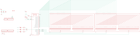

Contents
========

* [PRA3088 > Adafruit LED Backpack FeatherWing PCB](#pra3088--adafruit-led-backpack-featherwing-pcb)
	* [Schematic](#schematic)
	* [PCB](#pcb)
	* [Interactive BOM](#interactive-bom)
	* [OOMP Parts](#oomp-parts)
	* [Images](#images)
	* [Tags](#tags)
  
![][im]
# PRA3088 > Adafruit LED Backpack FeatherWing PCB

- ID: PROJ-ADAF-3088-STAN-01
- Hex ID: PRA3088
- Name: Adafruit
- Description: Adafruit
- Long Link: [http://oom.lt/PROJ-ADAF-3088-STAN-01](http://oom.lt/PROJ-ADAF-3088-STAN-01)
- Short Link: [http://oom.lt/PRA3088](http://oom.lt/PRA3088)

## Schematic
  

## PCB
  

## Interactive BOM

- Interactive BOM page: [ibom.html](https://htmlpreview.github.io/?https://github.com/oomlout/oomlout_OOMP_projects/blob/main/PROJ-ADAF-3088-STAN-01/kicad/bom/ibom.html)

## OOMP Parts
  

|OOMP ID|Name|Identifier|
| :---: | :---: | :---: |
|[CAPC-0805-X-UF10-V10](https://github.com/oomlout/oomlout_OOMP_parts/tree/main/CAPC-0805-X-UF10-V10/)|[SMD (0805) 10 uF Capacitor (Ceramic) 10v](https://github.com/oomlout/oomlout_OOMP_parts/tree/main/CAPC-0805-X-UF10-V10/)|[C1, C2, C3](https://github.com/oomlout/oomlout_OOMP_parts/tree/main/CAPC-0805-X-UF10-V10/)|
|[DIOD-S323-X-K4148-01](https://github.com/oomlout/oomlout_OOMP_parts/tree/main/DIOD-S323-X-K4148-01/)|[SMD (SOD-323) Diode](https://github.com/oomlout/oomlout_OOMP_parts/tree/main/DIOD-S323-X-K4148-01/)|[D1](https://github.com/oomlout/oomlout_OOMP_parts/tree/main/DIOD-S323-X-K4148-01/)|
|[HEAD-I01-X-PI07-01](https://github.com/oomlout/oomlout_OOMP_parts/tree/main/HEAD-I01-X-PI07-01/)|[2.54 mm 7 Pin Header](https://github.com/oomlout/oomlout_OOMP_parts/tree/main/HEAD-I01-X-PI07-01/)|[JP1, JP4, JP5](https://github.com/oomlout/oomlout_OOMP_parts/tree/main/HEAD-I01-X-PI07-01/)|
|[HEAD-I01-X-PI03-01](https://github.com/oomlout/oomlout_OOMP_parts/tree/main/HEAD-I01-X-PI03-01/)|[2.54 mm 3 Pin Header](https://github.com/oomlout/oomlout_OOMP_parts/tree/main/HEAD-I01-X-PI03-01/)|[JP3](https://github.com/oomlout/oomlout_OOMP_parts/tree/main/HEAD-I01-X-PI03-01/)|
|LEDS-UNMATCHED-G-STAN-01||LED1, LED2|
|[RESE-0805-X-O103-01](https://github.com/oomlout/oomlout_OOMP_parts/tree/main/RESE-0805-X-O103-01/)|[SMD (0805) 10k Ohm Resistor](https://github.com/oomlout/oomlout_OOMP_parts/tree/main/RESE-0805-X-O103-01/)|[R1, R2](https://github.com/oomlout/oomlout_OOMP_parts/tree/main/RESE-0805-X-O103-01/)|
|[RESE-0805-X-O473-01](https://github.com/oomlout/oomlout_OOMP_parts/tree/main/RESE-0805-X-O473-01/)|[SMD (0805) 47k Ohm Resistor](https://github.com/oomlout/oomlout_OOMP_parts/tree/main/RESE-0805-X-O473-01/)|[R3, R4, R5](https://github.com/oomlout/oomlout_OOMP_parts/tree/main/RESE-0805-X-O473-01/)|
|UNMATCHED-UNMATCHED-X-UNMATCHED-01||U2|

## Images
  
  

|bominteractivefront|bominteractiveback|kicadPcb3d|kicadPcb3dFront|kicadPcb3dBack|kicadSchem|eagleImage|eagleSchemImage|pcbdraw|pcbdrawback|
| :---: | :---: | :---: | :---: | :---: | :---: | :---: | :---: | :---: | :---: |
|||||||||||

## Tags

- hexID: PRA3088
- oompType: PROJ
- oompSize: ADAF
- oompColor: 3088
- oompDesc: STAN
- oompIndex: 01
- oompName: Adafruit LED Backpack FeatherWing PCB
- sources: All source files from https://github.com/adafruit/Adafruit-LED-Backpack-FeatherWing-PCB (source licence details in srcLicense.md)
- linkBuyPage: http://www.adafruit.com/products/3088
- oompID: PROJ-ADAF-3088-STAN-01
- oompParts: C1,CAPC-0805-X-UF10-V10
- oompParts: C2,CAPC-0805-X-UF10-V10
- oompParts: C3,CAPC-0805-X-UF10-V10
- oompParts: D1,DIOD-S323-X-K4148-01
- oompParts: JP1,HEAD-I01-X-PI07-01
- oompParts: JP3,HEAD-I01-X-PI03-01
- oompParts: JP4,HEAD-I01-X-PI07-01
- oompParts: JP5,HEAD-I01-X-PI07-01
- oompParts: LED1,LEDS-UNMATCHED-G-STAN-01
- oompParts: LED2,LEDS-UNMATCHED-G-STAN-01
- oompParts: R1,RESE-0805-X-O103-01
- oompParts: R2,RESE-0805-X-O103-01
- oompParts: R3,RESE-0805-X-O473-01
- oompParts: R4,RESE-0805-X-O473-01
- oompParts: R5,RESE-0805-X-O473-01
- oompParts: U2,UNMATCHED-UNMATCHED-X-UNMATCHED-01
- rawParts: A0,,SOLDERJUMPERREFLOW_NOPASTE,SOLDERJUMPER_REFLOW_NOPASTE,SMD Solder JUMPER,,
- rawParts: A1,,SOLDERJUMPERREFLOW_NOPASTE,SOLDERJUMPER_REFLOW_NOPASTE,SMD Solder JUMPER,,
- rawParts: A2,,SOLDERJUMPERREFLOW_NOPASTE,SOLDERJUMPER_REFLOW_NOPASTE,SMD Solder JUMPER,,
- rawParts: C1,10uF,CAP_CERAMIC0805-NOOUTLINE,0805-NO,Ceramic Capacitors,,
- rawParts: C2,10uF,CAP_CERAMIC0805-NOOUTLINE,0805-NO,Ceramic Capacitors,,
- rawParts: C3,10uF,CAP_CERAMIC0805-NOOUTLINE,0805-NO,Ceramic Capacitors,,
- rawParts: D1,1N4148,DIODESOD-323F,SOD-323F,Diode,,
- rawParts: JP1,,HEADER-1X770MIL,1X07_ROUND_70,PIN HEADER,,
- rawParts: JP3,,HEADER-1X3ROUND,1X03_ROUND,PIN HEADER,,
- rawParts: JP4,,HEADER-1X770MIL,1X07_ROUND_70,PIN HEADER,,
- rawParts: JP5,,HEADER-1X770MIL,1X07_ROUND_70,PIN HEADER,,
- rawParts: LED1,,DISP_SEGMENT_STARBURST_DUAL_COMMONCATHODE,SEGMENT_STARTBUST_DUAL_KWA-541CBB,2 x Starburst Segment Displays - Common Cathode,,
- rawParts: LED2,,DISP_SEGMENT_STARBURST_DUAL_COMMONCATHODE,SEGMENT_STARTBUST_DUAL_KWA-541CBB,2 x Starburst Segment Displays - Common Cathode,,
- rawParts: R1,10K,RESISTOR0805_NOOUTLINE,0805-NO,Resistors,,
- rawParts: R2,10K,RESISTOR0805_NOOUTLINE,0805-NO,Resistors,,
- rawParts: R3,47K,RESISTOR0805_NOOUTLINE,0805-NO,Resistors,,
- rawParts: R4,47K,RESISTOR0805_NOOUTLINE,0805-NO,Resistors,,
- rawParts: R5,47K,RESISTOR0805_NOOUTLINE,0805-NO,Resistors,,
- rawParts: U$1,FIDUCIAL,FIDUCIAL,FIDUCIAL_1MM,Fiducial Alignment Points,EXCLUDE,
- rawParts: U$2,FIDUCIAL,FIDUCIAL,FIDUCIAL_1MM,Fiducial Alignment Points,EXCLUDE,
- rawParts: U2,,HT16K33_SOP28_SKINNY,SOP28_300MIL_SKINNY,,,

[im]: kicadPcb3d_450.png
