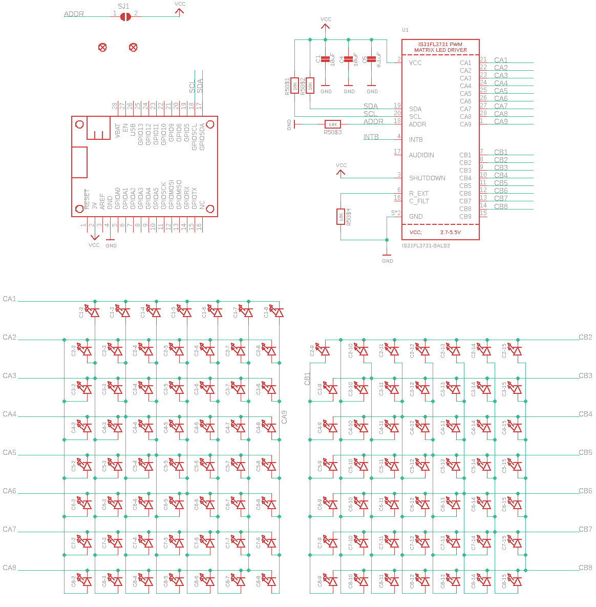
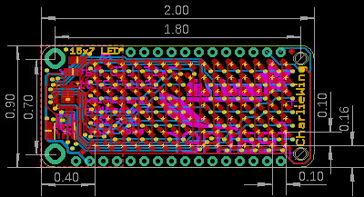
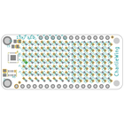
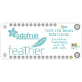
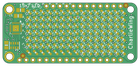
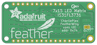

Contents
========

* [PRA3134 > Adafruit 7x15 CharliePlex LED FeatherWing](#pra3134--adafruit-7x15-charlieplex-led-featherwing)
	* [Schematic](#schematic)
	* [PCB](#pcb)
	* [Interactive BOM](#interactive-bom)
	* [OOMP Parts](#oomp-parts)
	* [Images](#images)
	* [Tags](#tags)
  
![][im]
# PRA3134 > Adafruit 7x15 CharliePlex LED FeatherWing

- ID: PROJ-ADAF-3134-STAN-01
- Hex ID: PRA3134
- Name: Adafruit
- Description: Adafruit
- Long Link: [http://oom.lt/PROJ-ADAF-3134-STAN-01](http://oom.lt/PROJ-ADAF-3134-STAN-01)
- Short Link: [http://oom.lt/PRA3134](http://oom.lt/PRA3134)

## Schematic
  

## PCB
  

## Interactive BOM

- Interactive BOM page: [ibom.html](https://htmlpreview.github.io/?https://github.com/oomlout/oomlout_OOMP_projects/blob/main/PROJ-ADAF-3134-STAN-01/kicad/bom/ibom.html)

## OOMP Parts
  

|OOMP ID|Name|Identifier|
| :---: | :---: | :---: |
|[CAPC-0805-X-UF10-V10](https://github.com/oomlout/oomlout_OOMP_parts/tree/main/CAPC-0805-X-UF10-V10/)|[SMD (0805) 10 uF Capacitor (Ceramic) 10v](https://github.com/oomlout/oomlout_OOMP_parts/tree/main/CAPC-0805-X-UF10-V10/)|[C1, C4](https://github.com/oomlout/oomlout_OOMP_parts/tree/main/CAPC-0805-X-UF10-V10/)|
|[LEDS-0603-R-STAN-01](https://github.com/oomlout/oomlout_OOMP_parts/tree/main/LEDS-0603-R-STAN-01/)|[SMD (0603) Red LED](https://github.com/oomlout/oomlout_OOMP_parts/tree/main/LEDS-0603-R-STAN-01/)|[C1-2, C1-3, C1-4, C1-5, C1-6, C1-7, C1-8, C2-2, C2-3, C2-4, C2-5, C2-6, C2-7, C2-8, C2-9, C2-10, C2-11, C2-12, C2-13, C2-14, C2-15, C3-2, C3-3, C3-4, C3-5, C3-6, C3-7, C3-8, C3-9, C3-10, C3-11, C3-12, C3-13, C3-14, C3-15, C4-2, C4-3, C4-4, C4-5, C4-6, C4-7, C4-8, C4-9, C4-10, C4-11, C4-12, C4-13, C4-14, C4-15, C5-2, C5-3, C5-4, C5-5, C5-6, C5-7, C5-8, C5-9, C5-10, C5-11, C5-12, C5-13, C5-14, C5-15, C6-2, C6-3, C6-4, C6-5, C6-6, C6-7, C6-8, C6-9, C6-10, C6-11, C6-12, C6-13, C6-14, C6-15, C7-2, C7-3, C7-4, C7-5, C7-6, C7-7, C7-8, C7-9, C7-10, C7-11, C7-12, C7-13, C7-14, C7-15, C8-2, C8-3, C8-4, C8-5, C8-6, C8-7, C8-8, C8-9, C8-10, C8-11, C8-12, C8-13, C8-14, C8-15](https://github.com/oomlout/oomlout_OOMP_parts/tree/main/LEDS-0603-R-STAN-01/)|
|[CAPC-0805-X-NF100-V50](https://github.com/oomlout/oomlout_OOMP_parts/tree/main/CAPC-0805-X-NF100-V50/)|[SMD (0805) 100 nF Capacitor (Ceramic) 50v](https://github.com/oomlout/oomlout_OOMP_parts/tree/main/CAPC-0805-X-NF100-V50/)|[C5](https://github.com/oomlout/oomlout_OOMP_parts/tree/main/CAPC-0805-X-NF100-V50/)|
|UNMATCHED-UNMATCHED-X-UNMATCHED-01||MS1, U1|
|RESA-06038-X-O103X4-01||R5|

## Images
  
  

|bominteractivefront|bominteractiveback|kicadPcb3d|kicadPcb3dFront|kicadPcb3dBack|eagleImage|eagleSchemImage|pcbdraw|pcbdrawback|
| :---: | :---: | :---: | :---: | :---: | :---: | :---: | :---: | :---: |
||||||||||

## Tags

- hexID: PRA3134
- oompType: PROJ
- oompSize: ADAF
- oompColor: 3134
- oompDesc: STAN
- oompIndex: 01
- oompName: Adafruit 7x15 CharliePlex LED FeatherWing
- sources: All source files from https://github.com/adafruit/Adafruit-7x15-CharliePlex-LED-FeatherWing (source licence details in srcLicense.md)
- linkBuyPage: http://www.adafruit.com/products/3134
- oompID: PROJ-ADAF-3134-STAN-01
- oompParts: C1,CAPC-0805-X-UF10-V10
- oompParts: C1-2,LEDS-0603-R-STAN-01
- oompParts: C1-3,LEDS-0603-R-STAN-01
- oompParts: C1-4,LEDS-0603-R-STAN-01
- oompParts: C1-5,LEDS-0603-R-STAN-01
- oompParts: C1-6,LEDS-0603-R-STAN-01
- oompParts: C1-7,LEDS-0603-R-STAN-01
- oompParts: C1-8,LEDS-0603-R-STAN-01
- oompParts: C2-2,LEDS-0603-R-STAN-01
- oompParts: C2-3,LEDS-0603-R-STAN-01
- oompParts: C2-4,LEDS-0603-R-STAN-01
- oompParts: C2-5,LEDS-0603-R-STAN-01
- oompParts: C2-6,LEDS-0603-R-STAN-01
- oompParts: C2-7,LEDS-0603-R-STAN-01
- oompParts: C2-8,LEDS-0603-R-STAN-01
- oompParts: C2-9,LEDS-0603-R-STAN-01
- oompParts: C2-10,LEDS-0603-R-STAN-01
- oompParts: C2-11,LEDS-0603-R-STAN-01
- oompParts: C2-12,LEDS-0603-R-STAN-01
- oompParts: C2-13,LEDS-0603-R-STAN-01
- oompParts: C2-14,LEDS-0603-R-STAN-01
- oompParts: C2-15,LEDS-0603-R-STAN-01
- oompParts: C3-2,LEDS-0603-R-STAN-01
- oompParts: C3-3,LEDS-0603-R-STAN-01
- oompParts: C3-4,LEDS-0603-R-STAN-01
- oompParts: C3-5,LEDS-0603-R-STAN-01
- oompParts: C3-6,LEDS-0603-R-STAN-01
- oompParts: C3-7,LEDS-0603-R-STAN-01
- oompParts: C3-8,LEDS-0603-R-STAN-01
- oompParts: C3-9,LEDS-0603-R-STAN-01
- oompParts: C3-10,LEDS-0603-R-STAN-01
- oompParts: C3-11,LEDS-0603-R-STAN-01
- oompParts: C3-12,LEDS-0603-R-STAN-01
- oompParts: C3-13,LEDS-0603-R-STAN-01
- oompParts: C3-14,LEDS-0603-R-STAN-01
- oompParts: C3-15,LEDS-0603-R-STAN-01
- oompParts: C4,CAPC-0805-X-UF10-V10
- oompParts: C4-2,LEDS-0603-R-STAN-01
- oompParts: C4-3,LEDS-0603-R-STAN-01
- oompParts: C4-4,LEDS-0603-R-STAN-01
- oompParts: C4-5,LEDS-0603-R-STAN-01
- oompParts: C4-6,LEDS-0603-R-STAN-01
- oompParts: C4-7,LEDS-0603-R-STAN-01
- oompParts: C4-8,LEDS-0603-R-STAN-01
- oompParts: C4-9,LEDS-0603-R-STAN-01
- oompParts: C4-10,LEDS-0603-R-STAN-01
- oompParts: C4-11,LEDS-0603-R-STAN-01
- oompParts: C4-12,LEDS-0603-R-STAN-01
- oompParts: C4-13,LEDS-0603-R-STAN-01
- oompParts: C4-14,LEDS-0603-R-STAN-01
- oompParts: C4-15,LEDS-0603-R-STAN-01
- oompParts: C5,CAPC-0805-X-NF100-V50
- oompParts: C5-2,LEDS-0603-R-STAN-01
- oompParts: C5-3,LEDS-0603-R-STAN-01
- oompParts: C5-4,LEDS-0603-R-STAN-01
- oompParts: C5-5,LEDS-0603-R-STAN-01
- oompParts: C5-6,LEDS-0603-R-STAN-01
- oompParts: C5-7,LEDS-0603-R-STAN-01
- oompParts: C5-8,LEDS-0603-R-STAN-01
- oompParts: C5-9,LEDS-0603-R-STAN-01
- oompParts: C5-10,LEDS-0603-R-STAN-01
- oompParts: C5-11,LEDS-0603-R-STAN-01
- oompParts: C5-12,LEDS-0603-R-STAN-01
- oompParts: C5-13,LEDS-0603-R-STAN-01
- oompParts: C5-14,LEDS-0603-R-STAN-01
- oompParts: C5-15,LEDS-0603-R-STAN-01
- oompParts: C6-2,LEDS-0603-R-STAN-01
- oompParts: C6-3,LEDS-0603-R-STAN-01
- oompParts: C6-4,LEDS-0603-R-STAN-01
- oompParts: C6-5,LEDS-0603-R-STAN-01
- oompParts: C6-6,LEDS-0603-R-STAN-01
- oompParts: C6-7,LEDS-0603-R-STAN-01
- oompParts: C6-8,LEDS-0603-R-STAN-01
- oompParts: C6-9,LEDS-0603-R-STAN-01
- oompParts: C6-10,LEDS-0603-R-STAN-01
- oompParts: C6-11,LEDS-0603-R-STAN-01
- oompParts: C6-12,LEDS-0603-R-STAN-01
- oompParts: C6-13,LEDS-0603-R-STAN-01
- oompParts: C6-14,LEDS-0603-R-STAN-01
- oompParts: C6-15,LEDS-0603-R-STAN-01
- oompParts: C7-2,LEDS-0603-R-STAN-01
- oompParts: C7-3,LEDS-0603-R-STAN-01
- oompParts: C7-4,LEDS-0603-R-STAN-01
- oompParts: C7-5,LEDS-0603-R-STAN-01
- oompParts: C7-6,LEDS-0603-R-STAN-01
- oompParts: C7-7,LEDS-0603-R-STAN-01
- oompParts: C7-8,LEDS-0603-R-STAN-01
- oompParts: C7-9,LEDS-0603-R-STAN-01
- oompParts: C7-10,LEDS-0603-R-STAN-01
- oompParts: C7-11,LEDS-0603-R-STAN-01
- oompParts: C7-12,LEDS-0603-R-STAN-01
- oompParts: C7-13,LEDS-0603-R-STAN-01
- oompParts: C7-14,LEDS-0603-R-STAN-01
- oompParts: C7-15,LEDS-0603-R-STAN-01
- oompParts: C8-2,LEDS-0603-R-STAN-01
- oompParts: C8-3,LEDS-0603-R-STAN-01
- oompParts: C8-4,LEDS-0603-R-STAN-01
- oompParts: C8-5,LEDS-0603-R-STAN-01
- oompParts: C8-6,LEDS-0603-R-STAN-01
- oompParts: C8-7,LEDS-0603-R-STAN-01
- oompParts: C8-8,LEDS-0603-R-STAN-01
- oompParts: C8-9,LEDS-0603-R-STAN-01
- oompParts: C8-10,LEDS-0603-R-STAN-01
- oompParts: C8-11,LEDS-0603-R-STAN-01
- oompParts: C8-12,LEDS-0603-R-STAN-01
- oompParts: C8-13,LEDS-0603-R-STAN-01
- oompParts: C8-14,LEDS-0603-R-STAN-01
- oompParts: C8-15,LEDS-0603-R-STAN-01
- oompParts: MS1,UNMATCHED-UNMATCHED-X-UNMATCHED-01
- oompParts: R5,RESA-06038-X-O103X4-01
- oompParts: U1,UNMATCHED-UNMATCHED-X-UNMATCHED-01
- rawParts: C1,10uF,CAP_CERAMIC0805-NOOUTLINE,0805-NO,Ceramic Capacitors,,
- rawParts: C1-2,,LED0603_NOOUTLINE,CHIPLED_0603_NOOUTLINE,LED,,
- rawParts: C1-3,,LED0603_NOOUTLINE,CHIPLED_0603_NOOUTLINE,LED,,
- rawParts: C1-4,,LED0603_NOOUTLINE,CHIPLED_0603_NOOUTLINE,LED,,
- rawParts: C1-5,,LED0603_NOOUTLINE,CHIPLED_0603_NOOUTLINE,LED,,
- rawParts: C1-6,,LED0603_NOOUTLINE,CHIPLED_0603_NOOUTLINE,LED,,
- rawParts: C1-7,,LED0603_NOOUTLINE,CHIPLED_0603_NOOUTLINE,LED,,
- rawParts: C1-8,,LED0603_NOOUTLINE,CHIPLED_0603_NOOUTLINE,LED,,
- rawParts: C2-2,,LED0603_NOOUTLINE,CHIPLED_0603_NOOUTLINE,LED,,
- rawParts: C2-3,,LED0603_NOOUTLINE,CHIPLED_0603_NOOUTLINE,LED,,
- rawParts: C2-4,,LED0603_NOOUTLINE,CHIPLED_0603_NOOUTLINE,LED,,
- rawParts: C2-5,,LED0603_NOOUTLINE,CHIPLED_0603_NOOUTLINE,LED,,
- rawParts: C2-6,,LED0603_NOOUTLINE,CHIPLED_0603_NOOUTLINE,LED,,
- rawParts: C2-7,,LED0603_NOOUTLINE,CHIPLED_0603_NOOUTLINE,LED,,
- rawParts: C2-8,,LED0603_NOOUTLINE,CHIPLED_0603_NOOUTLINE,LED,,
- rawParts: C2-9,,LED0603_NOOUTLINE,CHIPLED_0603_NOOUTLINE,LED,,
- rawParts: C2-10,,LED0603_NOOUTLINE,CHIPLED_0603_NOOUTLINE,LED,,
- rawParts: C2-11,,LED0603_NOOUTLINE,CHIPLED_0603_NOOUTLINE,LED,,
- rawParts: C2-12,,LED0603_NOOUTLINE,CHIPLED_0603_NOOUTLINE,LED,,
- rawParts: C2-13,,LED0603_NOOUTLINE,CHIPLED_0603_NOOUTLINE,LED,,
- rawParts: C2-14,,LED0603_NOOUTLINE,CHIPLED_0603_NOOUTLINE,LED,,
- rawParts: C2-15,,LED0603_NOOUTLINE,CHIPLED_0603_NOOUTLINE,LED,,
- rawParts: C3-2,,LED0603_NOOUTLINE,CHIPLED_0603_NOOUTLINE,LED,,
- rawParts: C3-3,,LED0603_NOOUTLINE,CHIPLED_0603_NOOUTLINE,LED,,
- rawParts: C3-4,,LED0603_NOOUTLINE,CHIPLED_0603_NOOUTLINE,LED,,
- rawParts: C3-5,,LED0603_NOOUTLINE,CHIPLED_0603_NOOUTLINE,LED,,
- rawParts: C3-6,,LED0603_NOOUTLINE,CHIPLED_0603_NOOUTLINE,LED,,
- rawParts: C3-7,,LED0603_NOOUTLINE,CHIPLED_0603_NOOUTLINE,LED,,
- rawParts: C3-8,,LED0603_NOOUTLINE,CHIPLED_0603_NOOUTLINE,LED,,
- rawParts: C3-9,,LED0603_NOOUTLINE,CHIPLED_0603_NOOUTLINE,LED,,
- rawParts: C3-10,,LED0603_NOOUTLINE,CHIPLED_0603_NOOUTLINE,LED,,
- rawParts: C3-11,,LED0603_NOOUTLINE,CHIPLED_0603_NOOUTLINE,LED,,
- rawParts: C3-12,,LED0603_NOOUTLINE,CHIPLED_0603_NOOUTLINE,LED,,
- rawParts: C3-13,,LED0603_NOOUTLINE,CHIPLED_0603_NOOUTLINE,LED,,
- rawParts: C3-14,,LED0603_NOOUTLINE,CHIPLED_0603_NOOUTLINE,LED,,
- rawParts: C3-15,,LED0603_NOOUTLINE,CHIPLED_0603_NOOUTLINE,LED,,
- rawParts: C4,10uF,CAP_CERAMIC0805-NOOUTLINE,0805-NO,Ceramic Capacitors,,
- rawParts: C4-2,,LED0603_NOOUTLINE,CHIPLED_0603_NOOUTLINE,LED,,
- rawParts: C4-3,,LED0603_NOOUTLINE,CHIPLED_0603_NOOUTLINE,LED,,
- rawParts: C4-4,,LED0603_NOOUTLINE,CHIPLED_0603_NOOUTLINE,LED,,
- rawParts: C4-5,,LED0603_NOOUTLINE,CHIPLED_0603_NOOUTLINE,LED,,
- rawParts: C4-6,,LED0603_NOOUTLINE,CHIPLED_0603_NOOUTLINE,LED,,
- rawParts: C4-7,,LED0603_NOOUTLINE,CHIPLED_0603_NOOUTLINE,LED,,
- rawParts: C4-8,,LED0603_NOOUTLINE,CHIPLED_0603_NOOUTLINE,LED,,
- rawParts: C4-9,,LED0603_NOOUTLINE,CHIPLED_0603_NOOUTLINE,LED,,
- rawParts: C4-10,,LED0603_NOOUTLINE,CHIPLED_0603_NOOUTLINE,LED,,
- rawParts: C4-11,,LED0603_NOOUTLINE,CHIPLED_0603_NOOUTLINE,LED,,
- rawParts: C4-12,,LED0603_NOOUTLINE,CHIPLED_0603_NOOUTLINE,LED,,
- rawParts: C4-13,,LED0603_NOOUTLINE,CHIPLED_0603_NOOUTLINE,LED,,
- rawParts: C4-14,,LED0603_NOOUTLINE,CHIPLED_0603_NOOUTLINE,LED,,
- rawParts: C4-15,,LED0603_NOOUTLINE,CHIPLED_0603_NOOUTLINE,LED,,
- rawParts: C5,0.1uF,CAP_CERAMIC0805-NOOUTLINE,0805-NO,Ceramic Capacitors,,
- rawParts: C5-2,,LED0603_NOOUTLINE,CHIPLED_0603_NOOUTLINE,LED,,
- rawParts: C5-3,,LED0603_NOOUTLINE,CHIPLED_0603_NOOUTLINE,LED,,
- rawParts: C5-4,,LED0603_NOOUTLINE,CHIPLED_0603_NOOUTLINE,LED,,
- rawParts: C5-5,,LED0603_NOOUTLINE,CHIPLED_0603_NOOUTLINE,LED,,
- rawParts: C5-6,,LED0603_NOOUTLINE,CHIPLED_0603_NOOUTLINE,LED,,
- rawParts: C5-7,,LED0603_NOOUTLINE,CHIPLED_0603_NOOUTLINE,LED,,
- rawParts: C5-8,,LED0603_NOOUTLINE,CHIPLED_0603_NOOUTLINE,LED,,
- rawParts: C5-9,,LED0603_NOOUTLINE,CHIPLED_0603_NOOUTLINE,LED,,
- rawParts: C5-10,,LED0603_NOOUTLINE,CHIPLED_0603_NOOUTLINE,LED,,
- rawParts: C5-11,,LED0603_NOOUTLINE,CHIPLED_0603_NOOUTLINE,LED,,
- rawParts: C5-12,,LED0603_NOOUTLINE,CHIPLED_0603_NOOUTLINE,LED,,
- rawParts: C5-13,,LED0603_NOOUTLINE,CHIPLED_0603_NOOUTLINE,LED,,
- rawParts: C5-14,,LED0603_NOOUTLINE,CHIPLED_0603_NOOUTLINE,LED,,
- rawParts: C5-15,,LED0603_NOOUTLINE,CHIPLED_0603_NOOUTLINE,LED,,
- rawParts: C6-2,,LED0603_NOOUTLINE,CHIPLED_0603_NOOUTLINE,LED,,
- rawParts: C6-3,,LED0603_NOOUTLINE,CHIPLED_0603_NOOUTLINE,LED,,
- rawParts: C6-4,,LED0603_NOOUTLINE,CHIPLED_0603_NOOUTLINE,LED,,
- rawParts: C6-5,,LED0603_NOOUTLINE,CHIPLED_0603_NOOUTLINE,LED,,
- rawParts: C6-6,,LED0603_NOOUTLINE,CHIPLED_0603_NOOUTLINE,LED,,
- rawParts: C6-7,,LED0603_NOOUTLINE,CHIPLED_0603_NOOUTLINE,LED,,
- rawParts: C6-8,,LED0603_NOOUTLINE,CHIPLED_0603_NOOUTLINE,LED,,
- rawParts: C6-9,,LED0603_NOOUTLINE,CHIPLED_0603_NOOUTLINE,LED,,
- rawParts: C6-10,,LED0603_NOOUTLINE,CHIPLED_0603_NOOUTLINE,LED,,
- rawParts: C6-11,,LED0603_NOOUTLINE,CHIPLED_0603_NOOUTLINE,LED,,
- rawParts: C6-12,,LED0603_NOOUTLINE,CHIPLED_0603_NOOUTLINE,LED,,
- rawParts: C6-13,,LED0603_NOOUTLINE,CHIPLED_0603_NOOUTLINE,LED,,
- rawParts: C6-14,,LED0603_NOOUTLINE,CHIPLED_0603_NOOUTLINE,LED,,
- rawParts: C6-15,,LED0603_NOOUTLINE,CHIPLED_0603_NOOUTLINE,LED,,
- rawParts: C7-2,,LED0603_NOOUTLINE,CHIPLED_0603_NOOUTLINE,LED,,
- rawParts: C7-3,,LED0603_NOOUTLINE,CHIPLED_0603_NOOUTLINE,LED,,
- rawParts: C7-4,,LED0603_NOOUTLINE,CHIPLED_0603_NOOUTLINE,LED,,
- rawParts: C7-5,,LED0603_NOOUTLINE,CHIPLED_0603_NOOUTLINE,LED,,
- rawParts: C7-6,,LED0603_NOOUTLINE,CHIPLED_0603_NOOUTLINE,LED,,
- rawParts: C7-7,,LED0603_NOOUTLINE,CHIPLED_0603_NOOUTLINE,LED,,
- rawParts: C7-8,,LED0603_NOOUTLINE,CHIPLED_0603_NOOUTLINE,LED,,
- rawParts: C7-9,,LED0603_NOOUTLINE,CHIPLED_0603_NOOUTLINE,LED,,
- rawParts: C7-10,,LED0603_NOOUTLINE,CHIPLED_0603_NOOUTLINE,LED,,
- rawParts: C7-11,,LED0603_NOOUTLINE,CHIPLED_0603_NOOUTLINE,LED,,
- rawParts: C7-12,,LED0603_NOOUTLINE,CHIPLED_0603_NOOUTLINE,LED,,
- rawParts: C7-13,,LED0603_NOOUTLINE,CHIPLED_0603_NOOUTLINE,LED,,
- rawParts: C7-14,,LED0603_NOOUTLINE,CHIPLED_0603_NOOUTLINE,LED,,
- rawParts: C7-15,,LED0603_NOOUTLINE,CHIPLED_0603_NOOUTLINE,LED,,
- rawParts: C8-2,,LED0603_NOOUTLINE,CHIPLED_0603_NOOUTLINE,LED,,
- rawParts: C8-3,,LED0603_NOOUTLINE,CHIPLED_0603_NOOUTLINE,LED,,
- rawParts: C8-4,,LED0603_NOOUTLINE,CHIPLED_0603_NOOUTLINE,LED,,
- rawParts: C8-5,,LED0603_NOOUTLINE,CHIPLED_0603_NOOUTLINE,LED,,
- rawParts: C8-6,,LED0603_NOOUTLINE,CHIPLED_0603_NOOUTLINE,LED,,
- rawParts: C8-7,,LED0603_NOOUTLINE,CHIPLED_0603_NOOUTLINE,LED,,
- rawParts: C8-8,,LED0603_NOOUTLINE,CHIPLED_0603_NOOUTLINE,LED,,
- rawParts: C8-9,,LED0603_NOOUTLINE,CHIPLED_0603_NOOUTLINE,LED,,
- rawParts: C8-10,,LED0603_NOOUTLINE,CHIPLED_0603_NOOUTLINE,LED,,
- rawParts: C8-11,,LED0603_NOOUTLINE,CHIPLED_0603_NOOUTLINE,LED,,
- rawParts: C8-12,,LED0603_NOOUTLINE,CHIPLED_0603_NOOUTLINE,LED,,
- rawParts: C8-13,,LED0603_NOOUTLINE,CHIPLED_0603_NOOUTLINE,LED,,
- rawParts: C8-14,,LED0603_NOOUTLINE,CHIPLED_0603_NOOUTLINE,LED,,
- rawParts: C8-15,,LED0603_NOOUTLINE,CHIPLED_0603_NOOUTLINE,LED,,
- rawParts: FID1,FIDUCIAL,FIDUCIAL,FIDUCIAL_1MM,Fiducial Alignment Points,EXCLUDE,
- rawParts: FID2,FIDUCIAL,FIDUCIAL,FIDUCIAL_1MM,Fiducial Alignment Points,EXCLUDE,
- rawParts: MS1,FEATHERWING,FEATHERWING,FEATHERWING,,,
- rawParts: R5,10K,RESISTOR_4PACK,RESPACK_4X0603,Resistor Packs (4 resistors),,
- rawParts: SJ1,,SOLDERJUMPER,SOLDERJUMPER_ARROW_NOPASTE,SMD Solder JUMPER,EXCLUDE,
- rawParts: U1,IS31FL3731-SALS2,IS31FL3731QFN,QFN28_4MM_0.4MM,IS31FL3731 PWM LED Matrix Driver,,

[im]: kicadPcb3d_450.png
