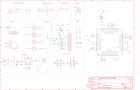

Contents
========

* [PRA3147 > Adafruit](#pra3147--adafruit)
	* [Images](#images)
	* [Tags](#tags)
  
![][im]
# PRA3147 > Adafruit

- ID: PROJ-ADAF-3147-STAN-01
- Hex ID: PRA3147
- Name: Adafruit
- Description: Adafruit

## Images
  
  

|kicadPcb3d|kicadPcb3dFront|kicadPcb3dBack|eagleImage|eagleSchemImage|
| :---: | :---: | :---: | :---: | :---: |
||||||

## Tags

- hexID: PRA3147
- oompType: PROJ
- oompSize: ADAF
- oompColor: 3147
- oompDesc: STAN
- oompIndex: 01
- oompName: Adafruit FONA SIMCOM 3G Breakout PCB
- sources: All source files from https://github.com/adafruit/Adafruit-FONA-SIMCOM-3G-Breakout-PCB (source licence details in srcLicense.md)
- linkBuyPage: http://www.adafruit.com/products/3147
- oompID: PROJ-ADAF-3147-STAN-01

[im]: kicadPcb3d_450.png
