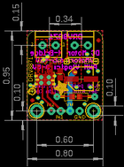
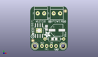
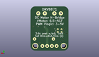
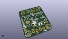

Contents
========

* [PROJ-ADAF-3190-STAN-01>Adafruit DRV8871 Breakout PCB](#proj-adaf-3190-stan-01adafruit-drv8871-breakout-pcb)
	* [Images](#images)
	* [Interactive BOM](#interactive-bom)
	* [OOMP Parts](#oomp-parts)
	* [Tags](#tags)
  
![][im]
# PROJ-ADAF-3190-STAN-01>Adafruit DRV8871 Breakout PCB

- ID: PROJ-ADAF-3190-STAN-01
- Hex ID: PRA3190
- Name: Adafruit DRV8871 Breakout PCB
- Description: 

## Images
  
  

|eagleImage|kicadPcb3dFront|kicadPcb3dBack|kicadPcb3d|
| :---: | :---: | :---: | :---: |
|||||

## Interactive BOM

- Interactive BOM page: [ibom.html](kicad/bom/ibom.html)

## OOMP Parts
  

|OOMP Parts|
| :---: |
|UNMATCHED-0805-X-NF100-01, C1, 8.762999999999998, 12.446, 270,C1, 0.1uF/50V, 0805-NO, microbuilder, (0.345, 0.49), R270|
|UNMATCHED-UNMATCHED-X-UNMATCHED-01, C2, 14.477999999999998, 11.176, 180,C2, 22uF/63V, PANASONIC_D, microbuilder, (0.57, 0.44), R180|
|<table><tr><td></td><td> JP2</td><td>[HEAD-I01-X-PI04-01 2.54 mm 4 Pin Header](https://github.com/oomlout/oomlout_OOMP_parts/tree/main/HEAD-I01-X-PI04-01/)</td><td>[H04](https://github.com/oomlout/oomlout_OOMP_parts/tree/main/HEAD-I01-X-PI04-01/)</td></tr></table>|
|<table><tr><td></td><td> R1</td><td>[RESE-0805-X-O303-01 SMD (0805) 30k Ohm Resistor](https://github.com/oomlout/oomlout_OOMP_parts/tree/main/RESE-0805-X-O303-01/)</td><td>[R85303](https://github.com/oomlout/oomlout_OOMP_parts/tree/main/RESE-0805-X-O303-01/)</td></tr></table>|
|UNMATCHED-UNMATCHED-X-UNMATCHED-01, U1, 4.699, 10.921999999999999, 0,U1, DRV8871, HSOP8, microbuilder, (0.185, 0.43), R0|
|UNMATCHED-UNMATCHED-X-UNMATCHED-01, X1, 5.842, 20.32, 180,X1, DCMOTOR, TERMBLOCK_1X2-3.5MM, microbuilder, (0.23, 0.8), R180|
|UNMATCHED-UNMATCHED-X-UNMATCHED-01, X2, 14.477999999999998, 20.32, 180,X2, POWER, TERMBLOCK_1X2-3.5MM, microbuilder, (0.57, 0.8), R180|

## Tags

- hexID: PRA3190
- oompType: PROJ
- oompSize: ADAF
- oompColor: 3190
- oompDesc: STAN
- oompIndex: 01
- oompName: Adafruit DRV8871 Breakout PCB
- sources: All source files from https://github.com/adafruit/Adafruit-DRV8871-Breakout-PCB (source licence details in srcLicense.md)
- linkBuyPage: http://www.adafruit.com/products/3190
- oompPart: UNMATCHED-0805-X-NF100-01, C1, 8.762999999999998, 12.446, 270
- oompPart: UNMATCHED-UNMATCHED-X-UNMATCHED-01, C2, 14.477999999999998, 11.176, 180
- oompPart: SKIP-UNMATCHED-X-UNMATCHED-01, FID1, 19.049999999999997, 21.59, 90
- oompPart: SKIP-UNMATCHED-X-UNMATCHED-01, FID2, 1.397, 5.460999999999999, 90
- oompPart: HEAD-I01-X-PI04-01, JP2, 10.16, 2.54, 180
- oompPart: RESE-0805-X-O303-01, R1, 13.081, 6.35, 180
- oompPart: SKIP-UNMATCHED-X-UNMATCHED-01, U$9, 2.54, 2.54, 90
- oompPart: SKIP-UNMATCHED-X-UNMATCHED-01, U$10, 17.779999999999998, 2.54, 90
- oompPart: UNMATCHED-UNMATCHED-X-UNMATCHED-01, U1, 4.699, 10.921999999999999, 0
- oompPart: UNMATCHED-UNMATCHED-X-UNMATCHED-01, X1, 5.842, 20.32, 180
- oompPart: UNMATCHED-UNMATCHED-X-UNMATCHED-01, X2, 14.477999999999998, 20.32, 180
- rawPart: C1, 0.1uF/50V, 0805-NO, microbuilder, (0.345, 0.49), R270
- rawPart: C2, 22uF/63V, PANASONIC_D, microbuilder, (0.57, 0.44), R180
- rawPart: FID1, FIDUCIAL, FIDUCIAL_1MM, microbuilder, (0.75, 0.85), R90
- rawPart: FID2, FIDUCIAL, FIDUCIAL_1MM, microbuilder, (0.055, 0.215), R90
- rawPart: JP2, 1X04_ROUND_76, microbuilder, (0.4, 0.1), R180
- rawPart: R1, 30K, 0805-THM, adafruit, (0.515, 0.25), R180
- rawPart: U$9, MOUNTINGHOLE2.5, MOUNTINGHOLE_2.5_PLATED, microbuilder, (0.1, 0.1), R90
- rawPart: U$10, MOUNTINGHOLE2.5, MOUNTINGHOLE_2.5_PLATED, microbuilder, (0.7, 0.1), R90
- rawPart: U1, DRV8871, HSOP8, microbuilder, (0.185, 0.43), R0
- rawPart: X1, DCMOTOR, TERMBLOCK_1X2-3.5MM, microbuilder, (0.23, 0.8), R180
- rawPart: X2, POWER, TERMBLOCK_1X2-3.5MM, microbuilder, (0.57, 0.8), R180
- oompID: PROJ-ADAF-3190-STAN-01

[im]: kicadPcb3d_450.png
