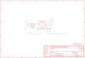

Contents
========

* [PRA3190 > Adafruit DRV8871 Breakout PCB](#pra3190--adafruit-drv8871-breakout-pcb)
	* [Schematic](#schematic)
	* [PCB](#pcb)
	* [Interactive BOM](#interactive-bom)
	* [OOMP Parts](#oomp-parts)
	* [Images](#images)
	* [Tags](#tags)
  
![][im]
# PRA3190 > Adafruit DRV8871 Breakout PCB

- ID: PROJ-ADAF-3190-STAN-01
- Hex ID: PRA3190
- Name: Adafruit 3190
- Description: Adafruit 3190
- Long Link: [http://oom.lt/PROJ-ADAF-3190-STAN-01](http://oom.lt/PROJ-ADAF-3190-STAN-01)
- Short Link: [http://oom.lt/PRA3190](http://oom.lt/PRA3190)

## Schematic
  

## PCB
  

## Interactive BOM

- Interactive BOM page: [ibom.html](https://htmlpreview.github.io/?https://github.com/oomlout/oomlout_OOMP_projects/blob/main/PROJ-ADAF-3190-STAN-01/kicad/bom/ibom.html)

## OOMP Parts
  

|OOMP ID|Name|Identifier|
| :---: | :---: | :---: |
|[CAPC-0805-X-NF100-V50](https://github.com/oomlout/oomlout_OOMP_parts/tree/main/CAPC-0805-X-NF100-V50/)|[SMD (0805) 100 nF Capacitor (Ceramic) 50v](https://github.com/oomlout/oomlout_OOMP_parts/tree/main/CAPC-0805-X-NF100-V50/)|[C1](https://github.com/oomlout/oomlout_OOMP_parts/tree/main/CAPC-0805-X-NF100-V50/)|
|CAPE-PAND-X-UNMATCHED-01||C2|
|[HEAD-I01-X-PI04-01](https://github.com/oomlout/oomlout_OOMP_parts/tree/main/HEAD-I01-X-PI04-01/)|[2.54 mm 4 Pin Header](https://github.com/oomlout/oomlout_OOMP_parts/tree/main/HEAD-I01-X-PI04-01/)|[JP2](https://github.com/oomlout/oomlout_OOMP_parts/tree/main/HEAD-I01-X-PI04-01/)|
|[RESE-0805-X-O303-01](https://github.com/oomlout/oomlout_OOMP_parts/tree/main/RESE-0805-X-O303-01/)|[SMD (0805) 30k Ohm Resistor](https://github.com/oomlout/oomlout_OOMP_parts/tree/main/RESE-0805-X-O303-01/)|[R1](https://github.com/oomlout/oomlout_OOMP_parts/tree/main/RESE-0805-X-O303-01/)|
|UNMATCHED-UNMATCHED-X-UNMATCHED-01||U1|
|[TERS-35D-L-PI02-01](https://github.com/oomlout/oomlout_OOMP_parts/tree/main/TERS-35D-L-PI02-01/)|[3.5 mm 2 Pin Blue Screw Terminal](https://github.com/oomlout/oomlout_OOMP_parts/tree/main/TERS-35D-L-PI02-01/)|[X1, X2](https://github.com/oomlout/oomlout_OOMP_parts/tree/main/TERS-35D-L-PI02-01/)|

## Images
  
  

|bominteractivefront|bominteractiveback|kicadPcb3d|kicadPcb3dFront|kicadPcb3dBack|kicadSchem|eagleImage|eagleSchemImage|pcbdraw|pcbdrawback|
| :---: | :---: | :---: | :---: | :---: | :---: | :---: | :---: | :---: | :---: |
|||||||||||

## Tags

- hexID: PRA3190
- oompType: PROJ
- oompSize: ADAF
- oompColor: 3190
- oompDesc: STAN
- oompIndex: 01
- oompName: Adafruit DRV8871 Breakout PCB
- sources: All source files from https://github.com/adafruit/Adafruit-DRV8871-Breakout-PCB (source licence details in srcLicense.md)
- linkBuyPage: http://www.adafruit.com/products/3190
- oompID: PROJ-ADAF-3190-STAN-01
- oompParts: C1,CAPC-0805-X-NF100-V50
- oompParts: C2,CAPE-PAND-X-UNMATCHED-01
- oompParts: JP2,HEAD-I01-X-PI04-01
- oompParts: R1,RESE-0805-X-O303-01
- oompParts: U1,UNMATCHED-UNMATCHED-X-UNMATCHED-01
- oompParts: X1,TERS-35D-L-PI02-01
- oompParts: X2,TERS-35D-L-PI02-01
- rawParts: C1,0.1uF/50V,CAP_CERAMIC0805-NOOUTLINE,0805-NO,Ceramic Capacitors,,
- rawParts: C2,22uF/63V,CAP_ELECTROLYTICPANASONIC_D,PANASONIC_D,Electrolytic Capacitors,,
- rawParts: FID1,FIDUCIAL,FIDUCIAL,FIDUCIAL_1MM,Fiducial Alignment Points,EXCLUDE,
- rawParts: FID2,FIDUCIAL,FIDUCIAL,FIDUCIAL_1MM,Fiducial Alignment Points,EXCLUDE,
- rawParts: JP2,,HEADER-1X476MIL,1X04_ROUND_76,PIN HEADER,,
- rawParts: R1,30K,FLIPFLOP-RES,0805-THM,Flip Flop resistor,,
- rawParts: U$9,MOUNTINGHOLE2.5,MOUNTINGHOLE2.5,MOUNTINGHOLE_2.5_PLATED,Mounting Hole,EXCLUDE,
- rawParts: U$10,MOUNTINGHOLE2.5,MOUNTINGHOLE2.5,MOUNTINGHOLE_2.5_PLATED,Mounting Hole,EXCLUDE,
- rawParts: U1,DRV8871,DRV8871,HSOP8,DRV8871 - 3.6A PWM Motor Driver,,
- rawParts: X1,DCMOTOR,TERMBLOCK_1X2,TERMBLOCK_1X2-3.5MM,3.5mm Terminal block,,
- rawParts: X2,POWER,TERMBLOCK_1X2,TERMBLOCK_1X2-3.5MM,3.5mm Terminal block,,

[im]: kicadPcb3d_450.png
