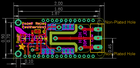
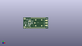
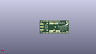
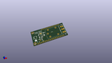

Contents
========

* [PROJ-ADAF-3191-STAN-01>Adafruit Power Relay FeatherWing PCB](#proj-adaf-3191-stan-01adafruit-power-relay-featherwing-pcb)
	* [Images](#images)
	* [Interactive BOM](#interactive-bom)
	* [OOMP Parts](#oomp-parts)
	* [Tags](#tags)
  
![][im]
# PROJ-ADAF-3191-STAN-01>Adafruit Power Relay FeatherWing PCB

- ID: PROJ-ADAF-3191-STAN-01
- Hex ID: PRA3191
- Name: Adafruit Power Relay FeatherWing PCB
- Description: 

## Images
  
  

|eagleImage|kicadPcb3dFront|kicadPcb3dBack|kicadPcb3d|
| :---: | :---: | :---: | :---: |
|||||

## Interactive BOM

- Interactive BOM page: [ibom.html](kicad/bom/ibom.html)

## OOMP Parts
  

|OOMP Parts|
| :---: |
|UNMATCHED-UNMATCHED-X-UNMATCHED-01, D1, 18.034, 11.176, 90,D1, 1N4148, SOD-323, microbuilder, (0.71, 0.44), R90|
|UNMATCHED-UNMATCHED-X-UNMATCHED-01, D2, 10.413999999999998, 14.224, 0,D2, RED, CHIPLED_0805_NOOUTLINE, microbuilder, (0.41, 0.56), R0|
|UNMATCHED-UNMATCHED-X-UNMATCHED-01, JP1, 47.370999999999995, 11.43, 90,JP1, TERMBLOCK_1X3_5.08MM, microbuilder, (1.865, 0.45), R90|
|HEAD-I01-X-PI01-01, JP2, 10.413999999999998, 4.826, 0,JP2, 1X01_ROUND, microbuilder, (0.41, 0.19), R0|
|UNMATCHED-UNMATCHED-X-UNMATCHED-01, MS2, 0.0, 0.0, 0,MS2, FEATHERWING, FEATHERWING, microbuilder, (0, 0), R0|
|UNMATCHED-UNMATCHED-X-UNMATCHED-01, Q1, 14.224, 11.937999999999999, 0,Q1, MMBT2222, SOT23-R, microbuilder, (0.56, 0.47), R0|
|RESE-0805-X-UNMATCHED-01, R1, 13.208, 5.842, 90,R1, 1K, 0805-NO, microbuilder, (0.52, 0.23), R90|
|<table><tr><td></td><td> R2</td><td>[RESE-0805-X-O103-01 SMD (0805) 10k Ohm Resistor](https://github.com/oomlout/oomlout_OOMP_parts/tree/main/RESE-0805-X-O103-01/)</td><td>[R85103](https://github.com/oomlout/oomlout_OOMP_parts/tree/main/RESE-0805-X-O103-01/)</td></tr></table>|
|RESE-0805-X-UNMATCHED-01, R3, 10.413999999999998, 9.906, 270,R3, 1K, 0805-NO, microbuilder, (0.41, 0.39), R270|
|UNMATCHED-UNMATCHED-X-UNMATCHED-01, SW1, 5.08, 11.43, 270,SW1, KMR2, BTN_KMR2_4.6X2.8, microbuilder, (0.2, 0.45), R270|
|UNMATCHED-UNMATCHED-X-UNMATCHED-01, U$1, 31.75, 11.43, 0,U$1, RELAY_G5LE, RELAY_G5LE-1, microbuilder, (1.25, 0.45), R0|

## Tags

- hexID: PRA3191
- oompType: PROJ
- oompSize: ADAF
- oompColor: 3191
- oompDesc: STAN
- oompIndex: 01
- oompName: Adafruit Power Relay FeatherWing PCB
- sources: All source files from https://github.com/adafruit/Adafruit-Power-Relay-FeatherWing-PCB (source licence details in srcLicense.md)
- linkBuyPage: http://www.adafruit.com/products/3191
- oompID: PROJ-ADAF-3191-STAN-01
- oompPart: UNMATCHED-UNMATCHED-X-UNMATCHED-01, D1, 18.034, 11.176, 90
- oompPart: UNMATCHED-UNMATCHED-X-UNMATCHED-01, D2, 10.413999999999998, 14.224, 0
- oompPart: UNMATCHED-UNMATCHED-X-UNMATCHED-01, JP1, 47.370999999999995, 11.43, 90
- oompPart: HEAD-I01-X-PI01-01, JP2, 10.413999999999998, 4.826, 0
- oompPart: UNMATCHED-UNMATCHED-X-UNMATCHED-01, MS2, 0.0, 0.0, 0
- oompPart: UNMATCHED-UNMATCHED-X-UNMATCHED-01, Q1, 14.224, 11.937999999999999, 0
- oompPart: RESE-0805-X-UNMATCHED-01, R1, 13.208, 5.842, 90
- oompPart: RESE-0805-X-O103-01, R2, 14.224, 9.143999999999998, 180
- oompPart: RESE-0805-X-UNMATCHED-01, R3, 10.413999999999998, 9.906, 270
- oompPart: SKIP-UNMATCHED-X-UNMATCHED-01, SJ1, 13.462, 15.239999999999998, 180
- oompPart: SKIP-UNMATCHED-X-UNMATCHED-01, SJ2, 16.509999999999998, 4.064, M270
- oompPart: SKIP-UNMATCHED-X-UNMATCHED-01, SJ3, 19.049999999999997, 4.064, M270
- oompPart: SKIP-UNMATCHED-X-UNMATCHED-01, SJ4, 21.59, 4.064, M270
- oompPart: SKIP-UNMATCHED-X-UNMATCHED-01, SJ7, 28.194000000000003, 4.064, M270
- oompPart: SKIP-UNMATCHED-X-UNMATCHED-01, SJ8, 30.479999999999997, 4.064, M270
- oompPart: SKIP-UNMATCHED-X-UNMATCHED-01, SJ9, 32.766, 4.064, M270
- oompPart: SKIP-UNMATCHED-X-UNMATCHED-01, SJ16, 32.766, 17.779999999999998, M270
- oompPart: SKIP-UNMATCHED-X-UNMATCHED-01, SJ17, 30.479999999999997, 17.779999999999998, M270
- oompPart: SKIP-UNMATCHED-X-UNMATCHED-01, SJ18, 22.605999999999998, 17.779999999999998, M270
- oompPart: SKIP-UNMATCHED-X-UNMATCHED-01, SJ19, 28.194000000000003, 17.779999999999998, M270
- oompPart: SKIP-UNMATCHED-X-UNMATCHED-01, SJ20, 20.066, 17.779999999999998, M270
- oompPart: UNMATCHED-UNMATCHED-X-UNMATCHED-01, SW1, 5.08, 11.43, 270
- oompPart: UNMATCHED-UNMATCHED-X-UNMATCHED-01, U$1, 31.75, 11.43, 0
- rawPart: D1, 1N4148, SOD-323, microbuilder, (0.71, 0.44), R90
- rawPart: D2, RED, CHIPLED_0805_NOOUTLINE, microbuilder, (0.41, 0.56), R0
- rawPart: JP1, TERMBLOCK_1X3_5.08MM, microbuilder, (1.865, 0.45), R90
- rawPart: JP2, 1X01_ROUND, microbuilder, (0.41, 0.19), R0
- rawPart: MS2, FEATHERWING, FEATHERWING, microbuilder, (0, 0), R0
- rawPart: Q1, MMBT2222, SOT23-R, microbuilder, (0.56, 0.47), R0
- rawPart: R1, 1K, 0805-NO, microbuilder, (0.52, 0.23), R90
- rawPart: R2, 10K, 0805-NO, microbuilder, (0.56, 0.36), R180
- rawPart: R3, 1K, 0805-NO, microbuilder, (0.41, 0.39), R270
- rawPart: SJ1, SOLDERJUMPER_CLOSEDWIRE, microbuilder, (0.53, 0.6), R180
- rawPart: SJ2, SOLDERJUMPER_ARROW_NOPASTE, microbuilder, (0.65, 0.16), MR270
- rawPart: SJ3, SOLDERJUMPER_ARROW_NOPASTE, microbuilder, (0.75, 0.16), MR270
- rawPart: SJ4, SOLDERJUMPER_ARROW_NOPASTE, microbuilder, (0.85, 0.16), MR270
- rawPart: SJ7, SOLDERJUMPER_ARROW_NOPASTE, microbuilder, (1.11, 0.16), MR270
- rawPart: SJ8, SOLDERJUMPER_ARROW_NOPASTE, microbuilder, (1.2, 0.16), MR270
- rawPart: SJ9, SOLDERJUMPER_ARROW_NOPASTE, microbuilder, (1.29, 0.16), MR270
- rawPart: SJ16, SOLDERJUMPER_ARROW_NOPASTE, microbuilder, (1.29, 0.7), MR270
- rawPart: SJ17, SOLDERJUMPER_ARROW_NOPASTE, microbuilder, (1.2, 0.7), MR270
- rawPart: SJ18, SOLDERJUMPER_ARROW_NOPASTE, microbuilder, (0.89, 0.7), MR270
- rawPart: SJ19, SOLDERJUMPER_ARROW_NOPASTE, microbuilder, (1.11, 0.7), MR270
- rawPart: SJ20, SOLDERJUMPER_ARROW_NOPASTE, microbuilder, (0.79, 0.7), MR270
- rawPart: SW1, KMR2, BTN_KMR2_4.6X2.8, microbuilder, (0.2, 0.45), R270
- rawPart: U$1, RELAY_G5LE, RELAY_G5LE-1, microbuilder, (1.25, 0.45), R0

[im]: kicadPcb3d_450.png
