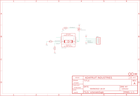

Contents
========

* [PRA3199 > Adafruit MiCS 5524 Gas Sensor Breakout PCB](#pra3199--adafruit-mics-5524-gas-sensor-breakout-pcb)
	* [Schematic](#schematic)
	* [PCB](#pcb)
	* [Interactive BOM](#interactive-bom)
	* [OOMP Parts](#oomp-parts)
	* [Images](#images)
	* [Tags](#tags)
  
![][im]
# PRA3199 > Adafruit MiCS 5524 Gas Sensor Breakout PCB

- ID: PROJ-ADAF-3199-STAN-01
- Hex ID: PRA3199
- Name: Adafruit
- Description: Adafruit
- Long Link: [http://oom.lt/PROJ-ADAF-3199-STAN-01](http://oom.lt/PROJ-ADAF-3199-STAN-01)
- Short Link: [http://oom.lt/PRA3199](http://oom.lt/PRA3199)

## Schematic
  

## PCB
  

## Interactive BOM

- Interactive BOM page: [ibom.html](https://htmlpreview.github.io/?https://github.com/oomlout/oomlout_OOMP_projects/blob/main/PROJ-ADAF-3199-STAN-01/kicad/bom/ibom.html)

## OOMP Parts
  

|OOMP Parts|
| :---: |
|[HEAD-I01-X-PI04-01  2.54 mm 4 Pin Header  JP2](https://github.com/oomlout/oomlout_OOMP_parts/tree/main/HEAD-I01-X-PI04-01/)|
|MOSP-SO23-X-UNMATCHED-01 Q1|
|RESE-0805-X-UNMATCHED-01 R1|
|[RESE-0805-X-O103-01  SMD (0805) 10k Ohm Resistor  R2, R3](https://github.com/oomlout/oomlout_OOMP_parts/tree/main/RESE-0805-X-O103-01/)|
|UNMATCHED-UNMATCHED-X-UNMATCHED-01 U1|

## Images
  
  

|bominteractivefront|bominteractiveback|kicadPcb3d|kicadPcb3dFront|kicadPcb3dBack|eagleImage|eagleSchemImage|pcbdraw|pcbdrawback|
| :---: | :---: | :---: | :---: | :---: | :---: | :---: | :---: | :---: |
||||||||||

## Tags

- hexID: PRA3199
- oompType: PROJ
- oompSize: ADAF
- oompColor: 3199
- oompDesc: STAN
- oompIndex: 01
- oompName: Adafruit MiCS 5524 Gas Sensor Breakout PCB
- sources: All source files from https://github.com/adafruit/Adafruit-MiCS-5524-Gas-Sensor-Breakout-PCB (source licence details in srcLicense.md)
- linkBuyPage: http://www.adafruit.com/products/3199
- oompID: PROJ-ADAF-3199-STAN-01
- oompParts: JP2,HEAD-I01-X-PI04-01
- oompParts: Q1,MOSP-SO23-X-UNMATCHED-01
- oompParts: R1,RESE-0805-X-UNMATCHED-01
- oompParts: R2,RESE-0805-X-O103-01
- oompParts: R3,RESE-0805-X-O103-01
- oompParts: U1,UNMATCHED-UNMATCHED-X-UNMATCHED-01
- rawParts: FID1,FIDUCIAL,FIDUCIAL,FIDUCIAL_1MM,Fiducial Alignment Points,EXCLUDE,
- rawParts: FID2,FIDUCIAL,FIDUCIAL,FIDUCIAL_1MM,Fiducial Alignment Points,EXCLUDE,
- rawParts: JP2,,HEADER-1X476MIL,1X04_ROUND_76,PIN HEADER,,
- rawParts: Q1,DMG3415U,MOSFET-PWIDE,SOT23-WIDE,P-Channel Mosfet,,
- rawParts: R1,82Ω 1%,RESISTOR0805_NOOUTLINE,0805-NO,Resistors,,
- rawParts: R2,10K,RESISTOR0805_NOOUTLINE,0805-NO,Resistors,,
- rawParts: R3,10K,RESISTOR0805_NOOUTLINE,0805-NO,Resistors,,
- rawParts: U$3,MOUNTINGHOLE2.5,MOUNTINGHOLE2.5,MOUNTINGHOLE_2.5_PLATED,Mounting Hole,EXCLUDE,
- rawParts: U$4,MOUNTINGHOLE2.5,MOUNTINGHOLE2.5,MOUNTINGHOLE_2.5_PLATED,Mounting Hole,EXCLUDE,
- rawParts: U1,MiCS-5524,MICS-5524,MICS-5524,MiCS-5524 Carbon Monoxide Gas Sensor,,

[im]: kicadPcb3d_450.png
