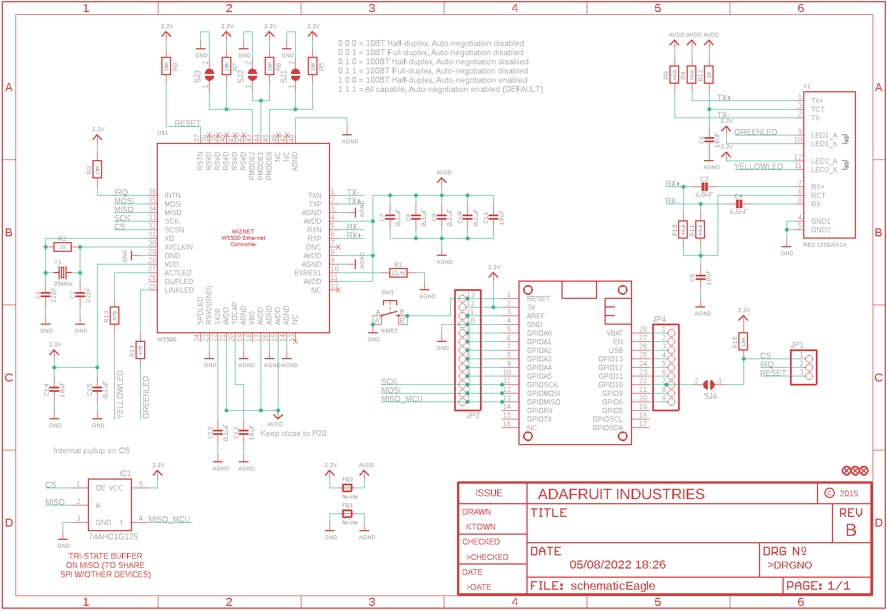
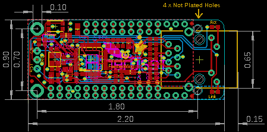
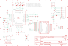

Contents
========

* [PRA3201 > Adafruit Ethernet FeatherWing PCB](#pra3201--adafruit-ethernet-featherwing-pcb)
	* [Schematic](#schematic)
	* [PCB](#pcb)
	* [Interactive BOM](#interactive-bom)
	* [OOMP Parts](#oomp-parts)
	* [Images](#images)
	* [Tags](#tags)
  
![][im]
# PRA3201 > Adafruit Ethernet FeatherWing PCB

- ID: PROJ-ADAF-3201-STAN-01
- Hex ID: PRA3201
- Name: Adafruit
- Description: Adafruit
- Long Link: [http://oom.lt/PROJ-ADAF-3201-STAN-01](http://oom.lt/PROJ-ADAF-3201-STAN-01)
- Short Link: [http://oom.lt/PRA3201](http://oom.lt/PRA3201)

## Schematic
  

## PCB
  

## Interactive BOM

- Interactive BOM page: [ibom.html](https://htmlpreview.github.io/?https://github.com/oomlout/oomlout_OOMP_projects/blob/main/PROJ-ADAF-3201-STAN-01/kicad/bom/ibom.html)

## OOMP Parts
  

|OOMP Parts|
| :---: |
|[CAPC-0603-X-PF22-V50  SMD (0603) 22 pF Capacitor (Ceramic) 50v  C1, C2](https://github.com/oomlout/oomlout_OOMP_parts/tree/main/CAPC-0603-X-PF22-V50/)|
|CAPC-0603-X-PF68D-01 C3, C4|
|[CAPC-0603-X-NF10-V50  SMD (0603) 10 nF Capacitor (Ceramic) 50v  C5, C6](https://github.com/oomlout/oomlout_OOMP_parts/tree/main/CAPC-0603-X-NF10-V50/)|
|CAPC-0603-X-UF1D-01 C7, C8, C9, C10, C13, C15|
|[CAPC-0805-X-UF10-V10  SMD (0805) 10 uF Capacitor (Ceramic) 10v  C11, C12, C14](https://github.com/oomlout/oomlout_OOMP_parts/tree/main/CAPC-0805-X-UF10-V10/)|
|FERB-0805-X-UNMATCHED-01 FB1, FB2|
|UNMATCHED-SO235-X-UNMATCHED-01 IC1|
|[HEAD-I01-X-PI03-01  2.54 mm 3 Pin Header  JP1](https://github.com/oomlout/oomlout_OOMP_parts/tree/main/HEAD-I01-X-PI03-01/)|
|HEAD-I01-X-PI13-01 JP2|
|[HEAD-I01-X-PI09-01  2.54 mm 9 Pin Header  JP4](https://github.com/oomlout/oomlout_OOMP_parts/tree/main/HEAD-I01-X-PI09-01/)|
|UNMATCHED-UNMATCHED-X-UNMATCHED-01 MS1, U$1, X1, Y1|
|RESE-0603-X-UNMATCHED-01 R1, R4, R9, R10, R11|
|[RESE-0603-X-O105-01  SMD (0603) 1M Ohm Resistor  R2](https://github.com/oomlout/oomlout_OOMP_parts/tree/main/RESE-0603-X-O105-01/)|
|[RESE-0603-X-O103-01  SMD (0603) 10k Ohm Resistor  R3, R5, R6, R7, R8, R15](https://github.com/oomlout/oomlout_OOMP_parts/tree/main/RESE-0603-X-O103-01/)|
|[RESE-0603-X-O100-01  SMD (0603) 10 Ohm Resistor  R12](https://github.com/oomlout/oomlout_OOMP_parts/tree/main/RESE-0603-X-O100-01/)|
|[RESE-0603-X-O471-01  SMD (0603) 470 Ohm Resistor  R13, R14](https://github.com/oomlout/oomlout_OOMP_parts/tree/main/RESE-0603-X-O471-01/)|
|[BUTA-4628-X-STAN-01  SMD (4628) Pushbutton (Tactile)  SW1](https://github.com/oomlout/oomlout_OOMP_parts/tree/main/BUTA-4628-X-STAN-01/)|

## Images
  
  

|kicadPcb3d|kicadPcb3dFront|kicadPcb3dBack|eagleImage|eagleSchemImage|
| :---: | :---: | :---: | :---: | :---: |
||||||

## Tags

- hexID: PRA3201
- oompType: PROJ
- oompSize: ADAF
- oompColor: 3201
- oompDesc: STAN
- oompIndex: 01
- oompName: Adafruit Ethernet FeatherWing PCB
- sources: All source files from https://github.com/adafruit/Adafruit-Ethernet-FeatherWing-PCB (source licence details in srcLicense.md)
- linkBuyPage: http://www.adafruit.com/products/3201
- oompID: PROJ-ADAF-3201-STAN-01
- oompParts: C1,CAPC-0603-X-PF22-V50
- oompParts: C2,CAPC-0603-X-PF22-V50
- oompParts: C3,CAPC-0603-X-PF68D-01
- oompParts: C4,CAPC-0603-X-PF68D-01
- oompParts: C5,CAPC-0603-X-NF10-V50
- oompParts: C6,CAPC-0603-X-NF10-V50
- oompParts: C7,CAPC-0603-X-UF1D-01
- oompParts: C8,CAPC-0603-X-UF1D-01
- oompParts: C9,CAPC-0603-X-UF1D-01
- oompParts: C10,CAPC-0603-X-UF1D-01
- oompParts: C11,CAPC-0805-X-UF10-V10
- oompParts: C12,CAPC-0805-X-UF10-V10
- oompParts: C13,CAPC-0603-X-UF1D-01
- oompParts: C14,CAPC-0805-X-UF10-V10
- oompParts: C15,CAPC-0603-X-UF1D-01
- oompParts: FB1,FERB-0805-X-UNMATCHED-01
- oompParts: FB2,FERB-0805-X-UNMATCHED-01
- oompParts: IC1,UNMATCHED-SO235-X-UNMATCHED-01
- oompParts: JP1,HEAD-I01-X-PI03-01
- oompParts: JP2,HEAD-I01-X-PI13-01
- oompParts: JP4,HEAD-I01-X-PI09-01
- oompParts: MS1,UNMATCHED-UNMATCHED-X-UNMATCHED-01
- oompParts: R1,RESE-0603-X-UNMATCHED-01
- oompParts: R2,RESE-0603-X-O105-01
- oompParts: R3,RESE-0603-X-O103-01
- oompParts: R4,RESE-0603-X-UNMATCHED-01
- oompParts: R5,RESE-0603-X-O103-01
- oompParts: R6,RESE-0603-X-O103-01
- oompParts: R7,RESE-0603-X-O103-01
- oompParts: R8,RESE-0603-X-O103-01
- oompParts: R9,RESE-0603-X-UNMATCHED-01
- oompParts: R10,RESE-0603-X-UNMATCHED-01
- oompParts: R11,RESE-0603-X-UNMATCHED-01
- oompParts: R12,RESE-0603-X-O100-01
- oompParts: R13,RESE-0603-X-O471-01
- oompParts: R14,RESE-0603-X-O471-01
- oompParts: R15,RESE-0603-X-O103-01
- oompParts: SW1,BUTA-4628-X-STAN-01
- oompParts: U$1,UNMATCHED-UNMATCHED-X-UNMATCHED-01
- oompParts: X1,UNMATCHED-UNMATCHED-X-UNMATCHED-01
- oompParts: Y1,UNMATCHED-UNMATCHED-X-UNMATCHED-01
- rawParts: C1,22pF,CAP_CERAMIC0603_NO,0603-NO,Ceramic Capacitors,,
- rawParts: C2,22pF,CAP_CERAMIC0603_NO,0603-NO,Ceramic Capacitors,,
- rawParts: C3,6.8nF,CAP_CERAMIC0603_NO,0603-NO,Ceramic Capacitors,,
- rawParts: C4,6.8nF,CAP_CERAMIC0603_NO,0603-NO,Ceramic Capacitors,,
- rawParts: C5,10nF,CAP_CERAMIC0603_NO,0603-NO,Ceramic Capacitors,,
- rawParts: C6,10nF,CAP_CERAMIC0603_NO,0603-NO,Ceramic Capacitors,,
- rawParts: C7,0.1uF,CAP_CERAMIC0603_NO,0603-NO,Ceramic Capacitors,,
- rawParts: C8,0.1uF,CAP_CERAMIC0603_NO,0603-NO,Ceramic Capacitors,,
- rawParts: C9,0.1uF,CAP_CERAMIC0603_NO,0603-NO,Ceramic Capacitors,,
- rawParts: C10,0.1uF,CAP_CERAMIC0603_NO,0603-NO,Ceramic Capacitors,,
- rawParts: C11,10uF,CAP_CERAMIC0805-NOOUTLINE,0805-NO,Ceramic Capacitors,,
- rawParts: C12,10uF,CAP_CERAMIC0805-NOOUTLINE,0805-NO,Ceramic Capacitors,,
- rawParts: C13,0.1uF,CAP_CERAMIC0603_NO,0603-NO,Ceramic Capacitors,,
- rawParts: C14,10uF,CAP_CERAMIC0805-NOOUTLINE,0805-NO,Ceramic Capacitors,,
- rawParts: C15,0.1uF,CAP_CERAMIC0603_NO,0603-NO,Ceramic Capacitors,,
- rawParts: FB1,ferrite,FERRITE-0805NO,0805-NO,Ferrite Bead,,
- rawParts: FB2,ferrite,FERRITE-0805NO,0805-NO,Ferrite Bead,,
- rawParts: FID1,FIDUCIAL,FIDUCIAL,FIDUCIAL_1MM,Fiducial Alignment Points,EXCLUDE,
- rawParts: FID2,FIDUCIAL,FIDUCIAL,FIDUCIAL_1MM,Fiducial Alignment Points,EXCLUDE,
- rawParts: FID3,FIDUCIAL,FIDUCIAL,FIDUCIAL_1MM,Fiducial Alignment Points,EXCLUDE,
- rawParts: IC1,74AHC1G125,74AHC1G125,SOT23-5L,,,
- rawParts: JP1,,HEADER-1X376MIL,1X03_ROUND_76,PIN HEADER,,
- rawParts: JP2,,HEADER-1X13,1X13_ROUND_70,,,
- rawParts: JP4,,HEADER-1X970MIL,1X09_ROUND_70,PIN HEADER,,
- rawParts: MS1,FEATHERWING_NODIM,FEATHERWING_NODIM,FEATHERWING_NODIM,,,
- rawParts: R1,12.4K,RESISTOR_0603_NOOUT,0603-NO,Resistors,,
- rawParts: R2,1M,RESISTOR_0603_NOOUT,0603-NO,Resistors,,
- rawParts: R3,10K,RESISTOR_0603_NOOUT,0603-NO,Resistors,,
- rawParts: R4,49.9,RESISTOR_0603_NOOUT,0603-NO,Resistors,,
- rawParts: R5,10K,RESISTOR_0603_NOOUT,0603-NO,Resistors,,
- rawParts: R6,10K,RESISTOR_0603_NOOUT,0603-NO,Resistors,,
- rawParts: R7,10K,RESISTOR_0603_NOOUT,0603-NO,Resistors,,
- rawParts: R8,10K,RESISTOR_0603_NOOUT,0603-NO,Resistors,,
- rawParts: R9,49.9,RESISTOR_0603_NOOUT,0603-NO,Resistors,,
- rawParts: R10,49.9,RESISTOR_0603_NOOUT,0603-NO,Resistors,,
- rawParts: R11,49.9,RESISTOR_0603_NOOUT,0603-NO,Resistors,,
- rawParts: R12,10,RESISTOR_0603_NOOUT,0603-NO,Resistors,,
- rawParts: R13,470,RESISTOR_0603_NOOUT,0603-NO,Resistors,,
- rawParts: R14,470,RESISTOR_0603_NOOUT,0603-NO,Resistors,,
- rawParts: R15,10K,RESISTOR_0603_NOOUT,0603-NO,Resistors,,
- rawParts: SJ1,,SOLDERJUMPERREFLOW_NOPASTE,SOLDERJUMPER_REFLOW_NOPASTE,SMD Solder JUMPER,,
- rawParts: SJ2,,SOLDERJUMPERREFLOW_NOPASTE,SOLDERJUMPER_REFLOW_NOPASTE,SMD Solder JUMPER,,
- rawParts: SJ3,,SOLDERJUMPERREFLOW_NOPASTE,SOLDERJUMPER_REFLOW_NOPASTE,SMD Solder JUMPER,,
- rawParts: SJ4,,SOLDERJUMPERCLOSED,SOLDERJUMPER_CLOSEDWIRE,SMD Solder JUMPER,,
- rawParts: SW1,KMR2,SWITCH_TACT_SMT4.6X2.8,BTN_KMR2_4.6X2.8,SMT Tact Switches,,
- rawParts: U$1,W5500,WIZNET_W5500,LQFP48,WIZNET W5500 Ethernet Controller,,
- rawParts: X1,RB1-125BAG1A,RJ45J0026D21BNL,RJ45_PULSEJACK,RJ45 (Ethernet) Connectors,,
- rawParts: Y1,25MHz,CRYSTAL3.2X2.5,CRYSTAL_3.2X2.5,Crystals,,

[im]: kicadPcb3d_450.png
