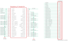

Contents
========

* [PRA3203 > Adafruit](#pra3203--adafruit)
	* [Images](#images)
	* [Tags](#tags)
  
![][im]
# PRA3203 > Adafruit

- ID: PROJ-ADAF-3203-STAN-01
- Hex ID: PRA3203
- Name: Adafruit
- Description: Adafruit

## Images
  
  

|kicadPcb3d|kicadPcb3dFront|kicadPcb3dBack|eagleImage|eagleSchemImage|
| :---: | :---: | :---: | :---: | :---: |
||||||

## Tags

- hexID: PRA3203
- oompType: PROJ
- oompSize: ADAF
- oompColor: 3203
- oompDesc: STAN
- oompIndex: 01
- oompName: Adafruit Perma Proto Bonnet PCB
- sources: All source files from https://github.com/adafruit/Adafruit-Perma-Proto-Bonnet-PCB (source licence details in srcLicense.md)
- linkBuyPage: http://www.adafruit.com/products/3203
- oompID: PROJ-ADAF-3203-STAN-01
- oompParts: CONN1,UNMATCHED-UNMATCHED-UNMATCHED-UNMATCHED-UNMATCHED
- oompParts: RPI1,UNMATCHED-UNMATCHED-UNMATCHED-UNMATCHED-UNMATCHED
- rawParts: CONN1,HEADER-1X25,HEADER-1X25,1X25_ROUND_70MIL,,,
- rawParts: RPI1,RASPBERRYPI_BPLUS_BONNETNODIM,RASPBERRYPI_BPLUS_BONNETNODIM,PI_BONNET_NODIM,,,

[im]: kicadPcb3d_450.png
