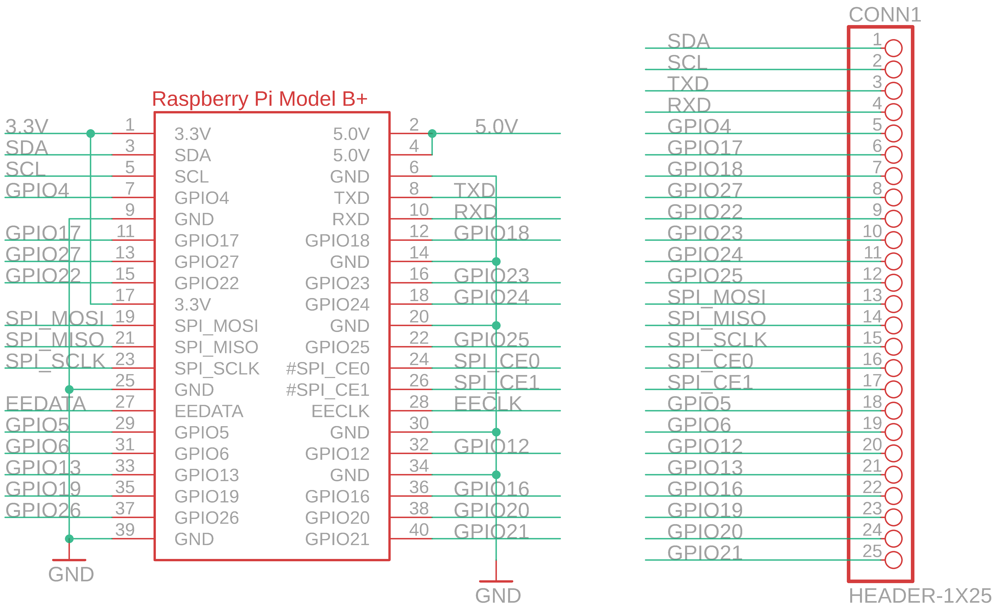

Contents
========

* [PRA3203 > Adafruit Perma Proto Bonnet PCB](#pra3203--adafruit-perma-proto-bonnet-pcb)
	* [Schematic](#schematic)
	* [PCB](#pcb)
	* [Interactive BOM](#interactive-bom)
	* [OOMP Parts](#oomp-parts)
	* [Images](#images)
	* [Tags](#tags)
  
![][im]
# PRA3203 > Adafruit Perma Proto Bonnet PCB

- ID: PROJ-ADAF-3203-STAN-01
- Hex ID: PRA3203
- Name: Adafruit
- Description: Adafruit
- Long Link: [http://oom.lt/PROJ-ADAF-3203-STAN-01](http://oom.lt/PROJ-ADAF-3203-STAN-01)
- Short Link: [http://oom.lt/PRA3203](http://oom.lt/PRA3203)

## Schematic
  

## PCB
  

## Interactive BOM

- Interactive BOM page: [ibom.html](https://htmlpreview.github.io/?https://github.com/oomlout/oomlout_OOMP_projects/blob/main/PROJ-ADAF-3203-STAN-01/kicad/bom/ibom.html)

## OOMP Parts
  

|OOMP ID|Name|Identifier|
| :---: | :---: | :---: |
|HEAD-I01-X-PI25-01||CONN1|
|UNMATCHED-UNMATCHED-X-UNMATCHED-01||RPI1|

## Images
  
  

|bominteractivefront|bominteractiveback|kicadPcb3d|kicadPcb3dFront|kicadPcb3dBack|eagleImage|eagleSchemImage|pcbdraw|pcbdrawback|
| :---: | :---: | :---: | :---: | :---: | :---: | :---: | :---: | :---: |
||||||||||

## Tags

- hexID: PRA3203
- oompType: PROJ
- oompSize: ADAF
- oompColor: 3203
- oompDesc: STAN
- oompIndex: 01
- oompName: Adafruit Perma Proto Bonnet PCB
- sources: All source files from https://github.com/adafruit/Adafruit-Perma-Proto-Bonnet-PCB (source licence details in srcLicense.md)
- linkBuyPage: http://www.adafruit.com/products/3203
- oompID: PROJ-ADAF-3203-STAN-01
- oompParts: CONN1,HEAD-I01-X-PI25-01
- oompParts: RPI1,UNMATCHED-UNMATCHED-X-UNMATCHED-01
- rawParts: CONN1,HEADER-1X25,HEADER-1X25,1X25_ROUND_70MIL,,,
- rawParts: RPI1,RASPBERRYPI_BPLUS_BONNETNODIM,RASPBERRYPI_BPLUS_BONNETNODIM,PI_BONNET_NODIM,,,

[im]: kicadPcb3d_450.png
