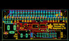
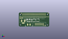
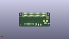
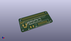

Contents
========

* [PROJ-ADAF-3211-STAN-01>Adafruit RGB Matrix Bonnet PCB](#proj-adaf-3211-stan-01adafruit-rgb-matrix-bonnet-pcb)
	* [Images](#images)
	* [Interactive BOM](#interactive-bom)
	* [OOMP Parts](#oomp-parts)
	* [Tags](#tags)
  
![][im]
# PROJ-ADAF-3211-STAN-01>Adafruit RGB Matrix Bonnet PCB

- ID: PROJ-ADAF-3211-STAN-01
- Hex ID: PRA3211
- Name: Adafruit RGB Matrix Bonnet PCB
- Description: 

## Images
  
  

|eagleImage|kicadPcb3dFront|kicadPcb3dBack|kicadPcb3d|
| :---: | :---: | :---: | :---: |
|||||

## Interactive BOM

- Interactive BOM page: [ibom.html](kicad/bom/ibom.html)

## OOMP Parts
  

|OOMP Parts|
| :---: |
|UNMATCHED-UNMATCHED-X-UNMATCHED-01, CONN1, 33.019999999999996, 21.081999999999997, 0,CONN1, HEADER-1X25, 1X25_ROUND_70MIL, microbuilder, (1.3, 0.83), R0|
|UNMATCHED-UNMATCHED-X-UNMATCHED-01, D1, 15.366999999999999, 14.097000000000001, 270,D1, MBR120, SOD-123, microbuilder, (0.605, 0.555), R270|
|UNMATCHED-UNMATCHED-X-UNMATCHED-01, D2, 19.304, 10.540999999999999, 270,D2, green, CHIPLED_0805_NOOUTLINE, microbuilder, (0.76, 0.415), R270|
|UNMATCHED-UNMATCHED-X-UNMATCHED-01, IC3, 27.304999999999996, 12.191999999999998, 180,IC3, MAX4866T, SOT23-6, adafruit, (1.075, 0.48), R180|
|<table><tr><td></td><td> JP1</td><td>[HEAD-I01-X-PI03-01 2.54 mm 3 Pin Header](https://github.com/oomlout/oomlout_OOMP_parts/tree/main/HEAD-I01-X-PI03-01/)</td><td>[H03](https://github.com/oomlout/oomlout_OOMP_parts/tree/main/HEAD-I01-X-PI03-01/)</td></tr></table>|
|UNMATCHED-UNMATCHED-X-UNMATCHED-01, JP15, 44.069, 5.08, 180,JP15, 2X08_SHROUDED, microbuilder, (1.735, 0.2), R180|
|UNMATCHED-UNMATCHED-X-UNMATCHED-01, MATRIX_PWR, 21.59, 4.3180000000000005, 180,MATRIX_PWR, PINHEAD, TERMBLOCK508, mshield, (0.85, 0.17), R180|
|UNMATCHED-UNMATCHED-X-UNMATCHED-01, Q1, 23.114, 14.858999999999998, 0,Q1, AON3414, POWERPAK-1212-8, microbuilder, (0.91, 0.585), R0|
|UNMATCHED-UNMATCHED-X-UNMATCHED-01, Q2, 18.415, 15.112999999999998, 90,Q2, AON7401, POWERDI3333, microbuilder, (0.725, 0.595), R90|
|RESE-0805-X-UNMATCHED-01, R4, 22.987, 10.540999999999999, 0,R4, 1K, 0805-NO, microbuilder, (0.905, 0.415), R0|
|RESE-0805-X-UNMATCHED-01, R13, 27.432, 15.875, 0,R13, 1K, 0805-NO, microbuilder, (1.08, 0.625), R0|
|UNMATCHED-UNMATCHED-X-UNMATCHED-01, RPI1, 0.0, 0.0, 0,RPI1, RASPBERRYPI_BPLUS_BONNET_THMSMT, PI_BONNET_THMSMT, microbuilder, (0, 0), R0|
|UNMATCHED-UNMATCHED-X-UNMATCHED-01, U3, 32.766, 13.843, 180,U3, 74AHCT245, TSSOP20, microbuilder, (1.29, 0.545), R180|
|UNMATCHED-UNMATCHED-X-UNMATCHED-01, U5, 40.386, 13.843, 180,U5, 74AHCT245, TSSOP20, microbuilder, (1.59, 0.545), R180|
|ERROR, X1 2.1mm DC, 0, 0, 0,X1, 2.1mm, DC, DCJACK_2MM_PTH, microbuilder, (-0.05, 0.49), R0|

## Tags

- hexID: PRA3211
- oompType: PROJ
- oompSize: ADAF
- oompColor: 3211
- oompDesc: STAN
- oompIndex: 01
- oompName: Adafruit RGB Matrix Bonnet PCB
- sources: All source files from https://github.com/adafruit/Adafruit-RGB-Matrix-Bonnet-PCB (source licence details in srcLicense.md)
- linkBuyPage: http://www.adafruit.com/products/3211
- oompID: PROJ-ADAF-3211-STAN-01
- oompPart: UNMATCHED-UNMATCHED-X-UNMATCHED-01, CONN1, 33.019999999999996, 21.081999999999997, 0
- oompPart: UNMATCHED-UNMATCHED-X-UNMATCHED-01, D1, 15.366999999999999, 14.097000000000001, 270
- oompPart: UNMATCHED-UNMATCHED-X-UNMATCHED-01, D2, 19.304, 10.540999999999999, 270
- oompPart: SKIP-UNMATCHED-X-UNMATCHED-01, FID1, 5.588, 28.701999999999995, 0
- oompPart: SKIP-UNMATCHED-X-UNMATCHED-01, FID2, 56.260999999999996, 2.413, 0
- oompPart: SKIP-UNMATCHED-X-UNMATCHED-01, FID3, 62.738, 29.083, 0
- oompPart: UNMATCHED-UNMATCHED-X-UNMATCHED-01, IC3, 27.304999999999996, 12.191999999999998, 180
- oompPart: HEAD-I01-X-PI03-01, JP1, 5.08, 18.541999999999998, 0
- oompPart: UNMATCHED-UNMATCHED-X-UNMATCHED-01, JP15, 44.069, 5.08, 180
- oompPart: UNMATCHED-UNMATCHED-X-UNMATCHED-01, MATRIX_PWR, 21.59, 4.3180000000000005, 180
- oompPart: UNMATCHED-UNMATCHED-X-UNMATCHED-01, Q1, 23.114, 14.858999999999998, 0
- oompPart: UNMATCHED-UNMATCHED-X-UNMATCHED-01, Q2, 18.415, 15.112999999999998, 90
- oompPart: RESE-0805-X-UNMATCHED-01, R4, 22.987, 10.540999999999999, 0
- oompPart: RESE-0805-X-UNMATCHED-01, R13, 27.432, 15.875, 0
- oompPart: UNMATCHED-UNMATCHED-X-UNMATCHED-01, RPI1, 0.0, 0.0, 0
- oompPart: SKIP-UNMATCHED-X-UNMATCHED-01, SJ1, 29.083, 5.08, M90
- oompPart: UNMATCHED-UNMATCHED-X-UNMATCHED-01, U3, 32.766, 13.843, 180
- oompPart: UNMATCHED-UNMATCHED-X-UNMATCHED-01, U5, 40.386, 13.843, 180
- oompPart: ERROR, X1 2.1mm DC, 0, 0, 0
- rawPart: CONN1, HEADER-1X25, 1X25_ROUND_70MIL, microbuilder, (1.3, 0.83), R0
- rawPart: D1, MBR120, SOD-123, microbuilder, (0.605, 0.555), R270
- rawPart: D2, green, CHIPLED_0805_NOOUTLINE, microbuilder, (0.76, 0.415), R270
- rawPart: FID1, FIDUCIAL_1MM, FIDUCIAL_1MM, microbuilder, (0.22, 1.13), R0
- rawPart: FID2, FIDUCIAL_1MM, FIDUCIAL_1MM, microbuilder, (2.215, 0.095), R0
- rawPart: FID3, FIDUCIAL_1MM, FIDUCIAL_1MM, microbuilder, (2.47, 1.145), R0
- rawPart: IC3, MAX4866T, SOT23-6, adafruit, (1.075, 0.48), R180
- rawPart: JP1, 1X03_ROUND_76, microbuilder, (0.2, 0.73), R0
- rawPart: JP15, 2X08_SHROUDED, microbuilder, (1.735, 0.2), R180
- rawPart: MATRIX_PWR, PINHEAD, TERMBLOCK508, mshield, (0.85, 0.17), R180
- rawPart: Q1, AON3414, POWERPAK-1212-8, microbuilder, (0.91, 0.585), R0
- rawPart: Q2, AON7401, POWERDI3333, microbuilder, (0.725, 0.595), R90
- rawPart: R4, 1K, 0805-NO, microbuilder, (0.905, 0.415), R0
- rawPart: R13, 1K, 0805-NO, microbuilder, (1.08, 0.625), R0
- rawPart: RPI1, RASPBERRYPI_BPLUS_BONNET_THMSMT, PI_BONNET_THMSMT, microbuilder, (0, 0), R0
- rawPart: SJ1, SOLDERJUMPER_2WAY_OPEN_NOPASTE, microbuilder, (1.145, 0.2), MR90
- rawPart: U3, 74AHCT245, TSSOP20, microbuilder, (1.29, 0.545), R180
- rawPart: U5, 74AHCT245, TSSOP20, microbuilder, (1.59, 0.545), R180
- rawPart: X1, 2.1mm, DC, DCJACK_2MM_PTH, microbuilder, (-0.05, 0.49), R0

[im]: kicadPcb3d_450.png
