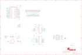

Contents
========

* [PRA3211 > Adafruit RGB Matrix Bonnet PCB](#pra3211--adafruit-rgb-matrix-bonnet-pcb)
	* [Schematic](#schematic)
	* [PCB](#pcb)
	* [Interactive BOM](#interactive-bom)
	* [OOMP Parts](#oomp-parts)
	* [Images](#images)
	* [Tags](#tags)
  
![][im]
# PRA3211 > Adafruit RGB Matrix Bonnet PCB

- ID: PROJ-ADAF-3211-STAN-01
- Hex ID: PRA3211
- Name: Adafruit
- Description: Adafruit
- Long Link: [http://oom.lt/PROJ-ADAF-3211-STAN-01](http://oom.lt/PROJ-ADAF-3211-STAN-01)
- Short Link: [http://oom.lt/PRA3211](http://oom.lt/PRA3211)

## Schematic
  

## PCB
  

## Interactive BOM

- Interactive BOM page: [ibom.html](https://htmlpreview.github.io/?https://github.com/oomlout/oomlout_OOMP_projects/blob/main/PROJ-ADAF-3211-STAN-01/kicad/bom/ibom.html)

## OOMP Parts
  

|OOMP Parts|
| :---: |
|CONN1 CONN1,HEAD-I01-X-PI25-01|
|[D1 DIOD-S123-X-KMBR120-01 SMD (SOD-123) MBR120 Diode](https://github.com/oomlout/oomlout_OOMP_parts/tree/main/DIOD-S123-X-KMBR120-01/)|
|[D2 LEDS-0805-G-STAN-01 SMD (0805) Green LED](https://github.com/oomlout/oomlout_OOMP_parts/tree/main/LEDS-0805-G-STAN-01/)|
|IC3 IC3,UNMATCHED-SO23-X-UNMATCHED-01|
|[JP1 HEAD-I01-X-PI03-01 2.54 mm 3 Pin Header](https://github.com/oomlout/oomlout_OOMP_parts/tree/main/HEAD-I01-X-PI03-01/)|
|JP15 JP15,HEAD-I01-X-UNMATCHED-01|
|MATRIX_PWR MATRIX_PWR,UNMATCHED-UNMATCHED-X-UNMATCHED-01|
|Q1 Q1,MOSN-UNMATCHED-X-UNMATCHED-01|
|Q2 Q2,MOSP-UNMATCHED-X-UNMATCHED-01|
|[R4 RESE-0805-X-O102-01 SMD (0805) 1k Ohm Resistor](https://github.com/oomlout/oomlout_OOMP_parts/tree/main/RESE-0805-X-O102-01/)|
|[R13 RESE-0805-X-O102-01 SMD (0805) 1k Ohm Resistor](https://github.com/oomlout/oomlout_OOMP_parts/tree/main/RESE-0805-X-O102-01/)|
|RPI1 RPI1,UNMATCHED-UNMATCHED-X-UNMATCHED-01|
|U3 U3,UNMATCHED-UNMATCHED-X-UNMATCHED-01|
|U5 U5,UNMATCHED-UNMATCHED-X-UNMATCHED-01|
|X1 X1,UNMATCHED-UNMATCHED-X-UNMATCHED-01|

## Images
  
  

|kicadPcb3d|kicadPcb3dFront|kicadPcb3dBack|eagleImage|eagleSchemImage|
| :---: | :---: | :---: | :---: | :---: |
||||||

## Tags

- hexID: PRA3211
- oompType: PROJ
- oompSize: ADAF
- oompColor: 3211
- oompDesc: STAN
- oompIndex: 01
- oompName: Adafruit RGB Matrix Bonnet PCB
- sources: All source files from https://github.com/adafruit/Adafruit-RGB-Matrix-Bonnet-PCB (source licence details in srcLicense.md)
- linkBuyPage: http://www.adafruit.com/products/3211
- oompID: PROJ-ADAF-3211-STAN-01
- oompParts: CONN1,HEAD-I01-X-PI25-01
- oompParts: D1,DIOD-S123-X-KMBR120-01
- oompParts: D2,LEDS-0805-G-STAN-01
- oompParts: IC3,UNMATCHED-SO23-X-UNMATCHED-01
- oompParts: JP1,HEAD-I01-X-PI03-01
- oompParts: JP15,HEAD-I01-X-UNMATCHED-01
- oompParts: MATRIX_PWR,UNMATCHED-UNMATCHED-X-UNMATCHED-01
- oompParts: Q1,MOSN-UNMATCHED-X-UNMATCHED-01
- oompParts: Q2,MOSP-UNMATCHED-X-UNMATCHED-01
- oompParts: R4,RESE-0805-X-O102-01
- oompParts: R13,RESE-0805-X-O102-01
- oompParts: RPI1,UNMATCHED-UNMATCHED-X-UNMATCHED-01
- oompParts: U3,UNMATCHED-UNMATCHED-X-UNMATCHED-01
- oompParts: U5,UNMATCHED-UNMATCHED-X-UNMATCHED-01
- oompParts: X1,UNMATCHED-UNMATCHED-X-UNMATCHED-01
- rawParts: CONN1,HEADER-1X25,HEADER-1X25,1X25_ROUND_70MIL,,,
- rawParts: D1,MBR120,DIODESOD-123,SOD-123,Diode,,
- rawParts: D2,green,LED0805_NOOUTLINE,CHIPLED_0805_NOOUTLINE,LED,,
- rawParts: FID1,FIDUCIAL_1MM,FIDUCIAL_1MM,FIDUCIAL_1MM,Fiducial Alignment Points,EXCLUDE,
- rawParts: FID2,FIDUCIAL_1MM,FIDUCIAL_1MM,FIDUCIAL_1MM,Fiducial Alignment Points,EXCLUDE,
- rawParts: FID3,FIDUCIAL_1MM,FIDUCIAL_1MM,FIDUCIAL_1MM,Fiducial Alignment Points,EXCLUDE,
- rawParts: IC3,MAX4866T,MAX486X/SOT,SOT23-6,,,
- rawParts: JP1,,HEADER-1X376MIL,1X03_ROUND_76,PIN HEADER,,
- rawParts: JP15,,HEADER-2X8_SHROUDED,2X08_SHROUDED,,,
- rawParts: MATRIX_PWR,PINHEAD,PINHEAD,TERMBLOCK508,,,
- rawParts: Q1,AON3414,MOSFET-NPOWERPAK-1212-8,POWERPAK-1212-8,N-Channel Mosfet,,
- rawParts: Q2,AON7401,MOSFET-P-POWERDI3333,POWERDI3333,P-Channel Mosfet,,
- rawParts: R4,1K,RESISTOR0805_NOOUTLINE,0805-NO,Resistors,,
- rawParts: R13,1K,RESISTOR0805_NOOUTLINE,0805-NO,Resistors,,
- rawParts: RPI1,RASPBERRYPI_BPLUS_BONNET_THMSMT,RASPBERRYPI_BPLUS_BONNET_THMSMT,PI_BONNET_THMSMT,,,
- rawParts: SJ1,,SOLDERJUMPER_2WAY,SOLDERJUMPER_2WAY_OPEN_NOPASTE,2-Way Solder Jumper,,
- rawParts: U3,74AHCT245,74LCX245,TSSOP20,74LCX245MTC - 5.0V Tolerant Bi-Directional Buffer,,
- rawParts: U5,74AHCT245,74LCX245,TSSOP20,74LCX245MTC - 5.0V Tolerant Bi-Directional Buffer,,
- rawParts: X1,2.1mm DC,DCBARRELPTH,DCJACK_2MM_PTH,DC Barrel Jack,,

[im]: kicadPcb3d_450.png
