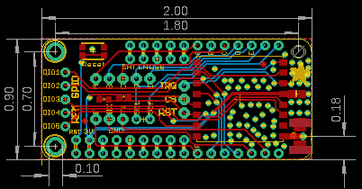
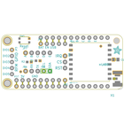
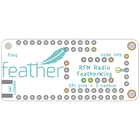
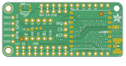
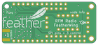

Contents
========

* [PRA3229 > Adafruit Radio FeatherWing PCB](#pra3229--adafruit-radio-featherwing-pcb)
	* [Schematic](#schematic)
	* [PCB](#pcb)
	* [Interactive BOM](#interactive-bom)
	* [OOMP Parts](#oomp-parts)
	* [Images](#images)
	* [Tags](#tags)
  
![][im]
# PRA3229 > Adafruit Radio FeatherWing PCB

- ID: PROJ-ADAF-3229-STAN-01
- Hex ID: PRA3229
- Name: Adafruit
- Description: Adafruit
- Long Link: [http://oom.lt/PROJ-ADAF-3229-STAN-01](http://oom.lt/PROJ-ADAF-3229-STAN-01)
- Short Link: [http://oom.lt/PRA3229](http://oom.lt/PRA3229)

## Schematic
  

## PCB
  

## Interactive BOM

- Interactive BOM page: [ibom.html](https://htmlpreview.github.io/?https://github.com/oomlout/oomlout_OOMP_projects/blob/main/PROJ-ADAF-3229-STAN-01/kicad/bom/ibom.html)

## OOMP Parts
  

|OOMP Parts|
| :---: |
|[CAPC-0805-X-UF10-V10  SMD (0805) 10 uF Capacitor (Ceramic) 10v  C1](https://github.com/oomlout/oomlout_OOMP_parts/tree/main/CAPC-0805-X-UF10-V10/)|
|[HEAD-I01-X-PI09-01  2.54 mm 9 Pin Header  JP1](https://github.com/oomlout/oomlout_OOMP_parts/tree/main/HEAD-I01-X-PI09-01/)|
|[HEAD-I01-X-PI05-01  2.54 mm 5 Pin Header  JP2, JP3, JP7](https://github.com/oomlout/oomlout_OOMP_parts/tree/main/HEAD-I01-X-PI05-01/)|
|[HEAD-I01-X-PI03-01  2.54 mm 3 Pin Header  JP4, JP5](https://github.com/oomlout/oomlout_OOMP_parts/tree/main/HEAD-I01-X-PI03-01/)|
|[HEAD-I01-X-PI02-01  2.54 mm 2 Pin Header  JP6](https://github.com/oomlout/oomlout_OOMP_parts/tree/main/HEAD-I01-X-PI02-01/)|
|UNMATCHED-UNMATCHED-X-UNMATCHED-01 MS1, U4|
|RESE-0603-X-O1003-01 R1, R2|
|[BUTA-4628-X-STAN-01  SMD (4628) Pushbutton (Tactile)  SW1](https://github.com/oomlout/oomlout_OOMP_parts/tree/main/BUTA-4628-X-STAN-01/)|
|CAPX-UNMATCHED-X-UNMATCHED-01 X1|

## Images
  
  

|bominteractivefront|bominteractiveback|kicadPcb3d|kicadPcb3dFront|kicadPcb3dBack|eagleImage|eagleSchemImage|pcbdraw|pcbdrawback|
| :---: | :---: | :---: | :---: | :---: | :---: | :---: | :---: | :---: |
||||||||||

## Tags

- hexID: PRA3229
- oompType: PROJ
- oompSize: ADAF
- oompColor: 3229
- oompDesc: STAN
- oompIndex: 01
- oompName: Adafruit Radio FeatherWing PCB
- sources: All source files from https://github.com/adafruit/Adafruit-Radio-FeatherWing-PCB (source licence details in srcLicense.md)
- linkBuyPage: http://www.adafruit.com/products/3229
- oompID: PROJ-ADAF-3229-STAN-01
- oompParts: C1,CAPC-0805-X-UF10-V10
- oompParts: JP1,HEAD-I01-X-PI09-01
- oompParts: JP2,HEAD-I01-X-PI05-01
- oompParts: JP3,HEAD-I01-X-PI05-01
- oompParts: JP4,HEAD-I01-X-PI03-01
- oompParts: JP5,HEAD-I01-X-PI03-01
- oompParts: JP6,HEAD-I01-X-PI02-01
- oompParts: JP7,HEAD-I01-X-PI05-01
- oompParts: MS1,UNMATCHED-UNMATCHED-X-UNMATCHED-01
- oompParts: R1,RESE-0603-X-O1003-01
- oompParts: R2,RESE-0603-X-O1003-01
- oompParts: SW1,BUTA-4628-X-STAN-01
- oompParts: U4,UNMATCHED-UNMATCHED-X-UNMATCHED-01
- oompParts: X1,CAPX-UNMATCHED-X-UNMATCHED-01
- rawParts: C1,10uF,CAP_CERAMIC0805-NOOUTLINE,0805-NO,Ceramic Capacitors,,
- rawParts: FID1,FIDUCIAL,FIDUCIAL,FIDUCIAL_1MM,Fiducial Alignment Points,EXCLUDE,
- rawParts: FID2,FIDUCIAL,FIDUCIAL,FIDUCIAL_1MM,Fiducial Alignment Points,EXCLUDE,
- rawParts: JP1,,HEADER-1X970MIL,1X09_ROUND_70,PIN HEADER,,
- rawParts: JP2,,HEADER-1X570MIL,1X05_ROUND_70,PIN HEADER,,
- rawParts: JP3,,HEADER-1X570MIL,1X05_ROUND_70,PIN HEADER,,
- rawParts: JP4,,HEADER-1X376MIL,1X03_ROUND_76,PIN HEADER,,
- rawParts: JP5,,HEADER-1X376MIL,1X03_ROUND_76,PIN HEADER,,
- rawParts: JP6,,HEADER-1X2ROUND,1X02_ROUND,PIN HEADER,,
- rawParts: JP7,,HEADER-1X576MIL,1X05_ROUND_76,PIN HEADER,,
- rawParts: MS1,FEATHERWING_NOHOLES,FEATHERWING_NOHOLES,FEATHERWING_NOHOLES,,,
- rawParts: R1,100k,RESISTOR_0603_NOOUT,0603-NO,Resistors,,
- rawParts: R2,100k,RESISTOR_0603_NOOUT,0603-NO,Resistors,,
- rawParts: SW1,,SWITCH_TACT_SMT4.6X2.8,BTN_KMR2_4.6X2.8,SMT Tact Switches,,
- rawParts: U$7,MOUNTINGHOLE2.5,MOUNTINGHOLE2.5,MOUNTINGHOLE_2.5_PLATED,Mounting Hole,EXCLUDE,
- rawParts: U$8,MOUNTINGHOLE2.5,MOUNTINGHOLE2.5,MOUNTINGHOLE_2.5_PLATED,Mounting Hole,EXCLUDE,
- rawParts: U4,RFM69/9x,RFM69HCW_SMT,RFMHCW_SMT,RFM69HCW - ISM Band RF Transceiver,,
- rawParts: X1,uFL/SMA,SMACONNECTOR_EDGE_UFL,SMA_EDGELAUNCH_UFL,SMA Connector,,

[im]: kicadPcb3d_450.png
