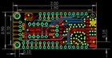
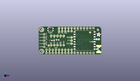
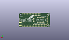
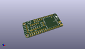

Contents
========

* [PROJ-ADAF-3229-STAN-01>Adafruit Radio FeatherWing PCB](#proj-adaf-3229-stan-01adafruit-radio-featherwing-pcb)
	* [Images](#images)
	* [Interactive BOM](#interactive-bom)
	* [OOMP Parts](#oomp-parts)
	* [Tags](#tags)
  
![][im]
# PROJ-ADAF-3229-STAN-01>Adafruit Radio FeatherWing PCB

- ID: PROJ-ADAF-3229-STAN-01
- Hex ID: PRA3229
- Name: Adafruit Radio FeatherWing PCB
- Description: 

## Images
  
  

|eagleImage|kicadPcb3dFront|kicadPcb3dBack|kicadPcb3d|
| :---: | :---: | :---: | :---: |
|||||

## Interactive BOM

- Interactive BOM page: [ibom.html](kicad/bom/ibom.html)

## OOMP Parts
  

|OOMP Parts|
| :---: |
|CAPE-0805-X-UNMATCHED-01, C1, 47.879, 12.446, 0,C1, 10uF, 0805-NO, microbuilder, (1.885, 0.49), R0|
|UNMATCHED-UNMATCHED-X-UNMATCHED-01, JP1, 16.509999999999998, 3.8099999999999996, 180,JP1, 1X09_ROUND_70, microbuilder, (0.65, 0.15), R180|
|UNMATCHED-UNMATCHED-X-UNMATCHED-01, JP2, 21.59, 19.049999999999997, 0,JP2, 1X05_ROUND_70, microbuilder, (0.85, 0.75), R0|
|UNMATCHED-UNMATCHED-X-UNMATCHED-01, JP3, 4.444999999999999, 11.43, 270,JP3, 1X05_ROUND_70, microbuilder, (0.175, 0.45), R270|
|UNMATCHED-UNMATCHED-X-UNMATCHED-01, JP4, 12.7, 7.619999999999999, 0,JP4, 1X03_ROUND_76, microbuilder, (0.5, 0.3), R0|
|UNMATCHED-UNMATCHED-X-UNMATCHED-01, JP5, 26.669999999999998, 11.43, 270,JP5, 1X03_ROUND_76, microbuilder, (1.05, 0.45), R270|
|UNMATCHED-UNMATCHED-X-UNMATCHED-01, JP6, 19.049999999999997, 7.619999999999999, 0,JP6, 1X02_ROUND, microbuilder, (0.75, 0.3), R0|
|UNMATCHED-UNMATCHED-X-UNMATCHED-01, JP7, 15.239999999999998, 15.239999999999998, 0,JP7, 1X05_ROUND_76, microbuilder, (0.6, 0.6), R0|
|UNMATCHED-UNMATCHED-X-UNMATCHED-01, MS1, 0.0, 0.0, 0,MS1, FEATHERWING_NOHOLES, FEATHERWING_NOHOLES, microbuilder, (0, 0), R0|
|<table><tr><td></td><td> R1</td><td>[RESE-0603-X-O104-01 SMD (0603) 100k Ohm Resistor](https://github.com/oomlout/oomlout_OOMP_parts/tree/main/RESE-0603-X-O104-01/)</td><td>[R6104](https://github.com/oomlout/oomlout_OOMP_parts/tree/main/RESE-0603-X-O104-01/)</td></tr></table>|
|<table><tr><td></td><td> R2</td><td>[RESE-0603-X-O104-01 SMD (0603) 100k Ohm Resistor](https://github.com/oomlout/oomlout_OOMP_parts/tree/main/RESE-0603-X-O104-01/)</td><td>[R6104](https://github.com/oomlout/oomlout_OOMP_parts/tree/main/RESE-0603-X-O104-01/)</td></tr></table>|
|UNMATCHED-UNMATCHED-X-UNMATCHED-01, SW1, 9.652, 20.447, 0,SW1, BTN_KMR2_4.6X2.8, microbuilder, (0.38, 0.805), R0|
|UNMATCHED-UNMATCHED-X-UNMATCHED-01, U4, 37.211, 11.43, 0,U4, RFM69/9x, RFMHCW_SMT, microbuilder, (1.465, 0.45), R0|
|UNMATCHED-UNMATCHED-X-UNMATCHED-01, X1, 50.673, 4.444999999999999, 180,X1, uFL/SMA, SMA_EDGELAUNCH_UFL, microbuilder, (1.995, 0.175), R180|

## Tags

- hexID: PRA3229
- oompType: PROJ
- oompSize: ADAF
- oompColor: 3229
- oompDesc: STAN
- oompIndex: 01
- oompName: Adafruit Radio FeatherWing PCB
- sources: All source files from https://github.com/adafruit/Adafruit-Radio-FeatherWing-PCB (source licence details in srcLicense.md)
- linkBuyPage: http://www.adafruit.com/products/3229
- oompPart: CAPE-0805-X-UNMATCHED-01, C1, 47.879, 12.446, 0
- oompPart: SKIP-UNMATCHED-X-UNMATCHED-01, FID1, 8.128, 7.365999999999999, 0
- oompPart: SKIP-UNMATCHED-X-UNMATCHED-01, FID2, 41.65599999999999, 18.034, 0
- oompPart: UNMATCHED-UNMATCHED-X-UNMATCHED-01, JP1, 16.509999999999998, 3.8099999999999996, 180
- oompPart: UNMATCHED-UNMATCHED-X-UNMATCHED-01, JP2, 21.59, 19.049999999999997, 0
- oompPart: UNMATCHED-UNMATCHED-X-UNMATCHED-01, JP3, 4.444999999999999, 11.43, 270
- oompPart: UNMATCHED-UNMATCHED-X-UNMATCHED-01, JP4, 12.7, 7.619999999999999, 0
- oompPart: UNMATCHED-UNMATCHED-X-UNMATCHED-01, JP5, 26.669999999999998, 11.43, 270
- oompPart: UNMATCHED-UNMATCHED-X-UNMATCHED-01, JP6, 19.049999999999997, 7.619999999999999, 0
- oompPart: UNMATCHED-UNMATCHED-X-UNMATCHED-01, JP7, 15.239999999999998, 15.239999999999998, 0
- oompPart: UNMATCHED-UNMATCHED-X-UNMATCHED-01, MS1, 0.0, 0.0, 0
- oompPart: RESE-0603-X-O104-01, R1, 15.366999999999999, 11.937999999999999, 180
- oompPart: RESE-0603-X-O104-01, R2, 11.684, 11.43, 180
- oompPart: UNMATCHED-UNMATCHED-X-UNMATCHED-01, SW1, 9.652, 20.447, 0
- oompPart: SKIP-UNMATCHED-X-UNMATCHED-01, U$7, 2.54, 2.54, 0
- oompPart: SKIP-UNMATCHED-X-UNMATCHED-01, U$8, 2.54, 20.32, 0
- oompPart: UNMATCHED-UNMATCHED-X-UNMATCHED-01, U4, 37.211, 11.43, 0
- oompPart: UNMATCHED-UNMATCHED-X-UNMATCHED-01, X1, 50.673, 4.444999999999999, 180
- rawPart: C1, 10uF, 0805-NO, microbuilder, (1.885, 0.49), R0
- rawPart: FID1, FIDUCIAL, FIDUCIAL_1MM, microbuilder, (0.32, 0.29), R0
- rawPart: FID2, FIDUCIAL, FIDUCIAL_1MM, microbuilder, (1.64, 0.71), R0
- rawPart: JP1, 1X09_ROUND_70, microbuilder, (0.65, 0.15), R180
- rawPart: JP2, 1X05_ROUND_70, microbuilder, (0.85, 0.75), R0
- rawPart: JP3, 1X05_ROUND_70, microbuilder, (0.175, 0.45), R270
- rawPart: JP4, 1X03_ROUND_76, microbuilder, (0.5, 0.3), R0
- rawPart: JP5, 1X03_ROUND_76, microbuilder, (1.05, 0.45), R270
- rawPart: JP6, 1X02_ROUND, microbuilder, (0.75, 0.3), R0
- rawPart: JP7, 1X05_ROUND_76, microbuilder, (0.6, 0.6), R0
- rawPart: MS1, FEATHERWING_NOHOLES, FEATHERWING_NOHOLES, microbuilder, (0, 0), R0
- rawPart: R1, 100k, 0603-NO, microbuilder, (0.605, 0.47), R180
- rawPart: R2, 100k, 0603-NO, microbuilder, (0.46, 0.45), R180
- rawPart: SW1, BTN_KMR2_4.6X2.8, microbuilder, (0.38, 0.805), R0
- rawPart: U$7, MOUNTINGHOLE2.5, MOUNTINGHOLE_2.5_PLATED, microbuilder, (0.1, 0.1), R0
- rawPart: U$8, MOUNTINGHOLE2.5, MOUNTINGHOLE_2.5_PLATED, microbuilder, (0.1, 0.8), R0
- rawPart: U4, RFM69/9x, RFMHCW_SMT, microbuilder, (1.465, 0.45), R0
- rawPart: X1, uFL/SMA, SMA_EDGELAUNCH_UFL, microbuilder, (1.995, 0.175), R180

[im]: kicadPcb3d_450.png
