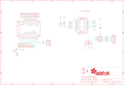

Contents
========

* [PRA3229 > Adafruit](#pra3229--adafruit)
	* [Images](#images)
	* [Tags](#tags)
  
![][im]
# PRA3229 > Adafruit

- ID: PROJ-ADAF-3229-STAN-01
- Hex ID: PRA3229
- Name: Adafruit
- Description: Adafruit

## Images
  
  

|kicadPcb3d|kicadPcb3dFront|kicadPcb3dBack|eagleImage|eagleSchemImage|
| :---: | :---: | :---: | :---: | :---: |
||||||

## Tags

- hexID: PRA3229
- oompType: PROJ
- oompSize: ADAF
- oompColor: 3229
- oompDesc: STAN
- oompIndex: 01
- oompName: Adafruit Radio FeatherWing PCB
- sources: All source files from https://github.com/adafruit/Adafruit-Radio-FeatherWing-PCB (source licence details in srcLicense.md)
- linkBuyPage: http://www.adafruit.com/products/3229
- oompID: PROJ-ADAF-3229-STAN-01
- oompParts: C1,UNMATCHED-UNMATCHED-UNMATCHED-UNMATCHED-UNMATCHED
- oompParts: JP1,UNMATCHED-UNMATCHED-UNMATCHED-UNMATCHED-UNMATCHED
- oompParts: JP2,UNMATCHED-UNMATCHED-UNMATCHED-UNMATCHED-UNMATCHED
- oompParts: JP3,UNMATCHED-UNMATCHED-UNMATCHED-UNMATCHED-UNMATCHED
- oompParts: JP4,UNMATCHED-UNMATCHED-UNMATCHED-UNMATCHED-UNMATCHED
- oompParts: JP5,UNMATCHED-UNMATCHED-UNMATCHED-UNMATCHED-UNMATCHED
- oompParts: JP6,UNMATCHED-UNMATCHED-UNMATCHED-UNMATCHED-UNMATCHED
- oompParts: JP7,UNMATCHED-UNMATCHED-UNMATCHED-UNMATCHED-UNMATCHED
- oompParts: MS1,UNMATCHED-UNMATCHED-UNMATCHED-UNMATCHED-UNMATCHED
- oompParts: R1,UNMATCHED-UNMATCHED-UNMATCHED-UNMATCHED-UNMATCHED
- oompParts: R2,UNMATCHED-UNMATCHED-UNMATCHED-UNMATCHED-UNMATCHED
- oompParts: SW1,UNMATCHED-UNMATCHED-UNMATCHED-UNMATCHED-UNMATCHED
- oompParts: U4,UNMATCHED-UNMATCHED-UNMATCHED-UNMATCHED-UNMATCHED
- oompParts: X1,UNMATCHED-UNMATCHED-UNMATCHED-UNMATCHED-UNMATCHED
- rawParts: C1,10uF,CAP_CERAMIC0805-NOOUTLINE,0805-NO,Ceramic Capacitors,,
- rawParts: FID1,FIDUCIAL,FIDUCIAL,FIDUCIAL_1MM,Fiducial Alignment Points,EXCLUDE,
- rawParts: FID2,FIDUCIAL,FIDUCIAL,FIDUCIAL_1MM,Fiducial Alignment Points,EXCLUDE,
- rawParts: JP1,,HEADER-1X970MIL,1X09_ROUND_70,PIN HEADER,,
- rawParts: JP2,,HEADER-1X570MIL,1X05_ROUND_70,PIN HEADER,,
- rawParts: JP3,,HEADER-1X570MIL,1X05_ROUND_70,PIN HEADER,,
- rawParts: JP4,,HEADER-1X376MIL,1X03_ROUND_76,PIN HEADER,,
- rawParts: JP5,,HEADER-1X376MIL,1X03_ROUND_76,PIN HEADER,,
- rawParts: JP6,,HEADER-1X2ROUND,1X02_ROUND,PIN HEADER,,
- rawParts: JP7,,HEADER-1X576MIL,1X05_ROUND_76,PIN HEADER,,
- rawParts: MS1,FEATHERWING_NOHOLES,FEATHERWING_NOHOLES,FEATHERWING_NOHOLES,,,
- rawParts: R1,100k,RESISTOR_0603_NOOUT,0603-NO,Resistors,,
- rawParts: R2,100k,RESISTOR_0603_NOOUT,0603-NO,Resistors,,
- rawParts: SW1,,SWITCH_TACT_SMT4.6X2.8,BTN_KMR2_4.6X2.8,SMT Tact Switches,,
- rawParts: U$7,MOUNTINGHOLE2.5,MOUNTINGHOLE2.5,MOUNTINGHOLE_2.5_PLATED,Mounting Hole,EXCLUDE,
- rawParts: U$8,MOUNTINGHOLE2.5,MOUNTINGHOLE2.5,MOUNTINGHOLE_2.5_PLATED,Mounting Hole,EXCLUDE,
- rawParts: U4,RFM69/9x,RFM69HCW_SMT,RFMHCW_SMT,RFM69HCW - ISM Band RF Transceiver,,
- rawParts: X1,uFL/SMA,SMACONNECTOR_EDGE_UFL,SMA_EDGELAUNCH_UFL,SMA Connector,,

[im]: kicadPcb3d_450.png
