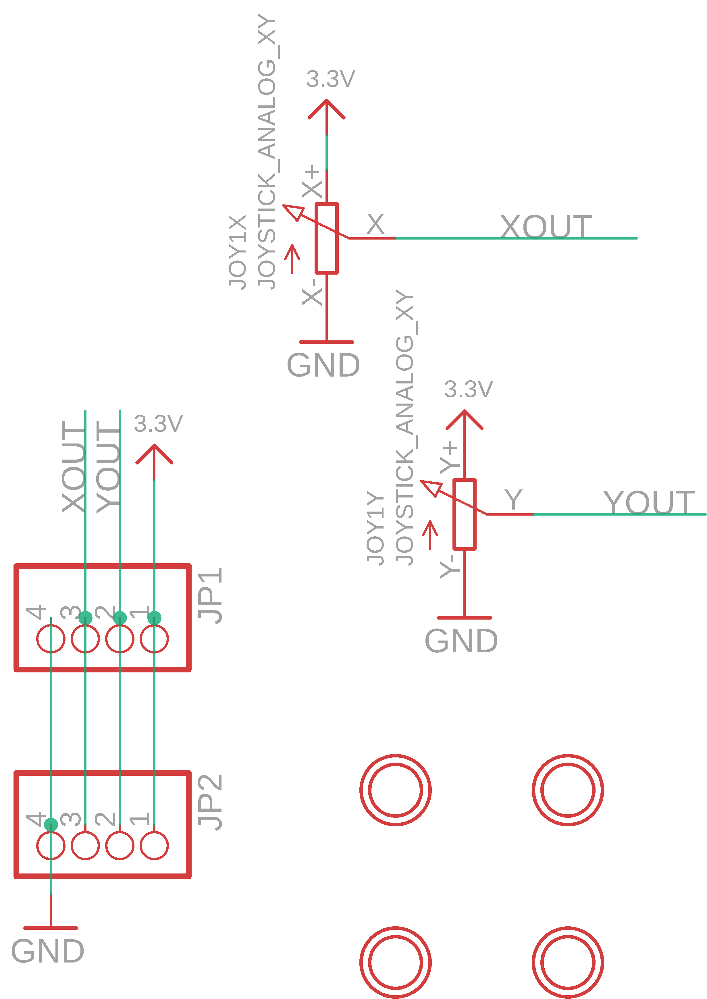

Contents
========

* [PRA3246 > Adafruit Mini Analog Thumbstick Breakout PCB](#pra3246--adafruit-mini-analog-thumbstick-breakout-pcb)
	* [Schematic](#schematic)
	* [PCB](#pcb)
	* [Interactive BOM](#interactive-bom)
	* [OOMP Parts](#oomp-parts)
	* [Images](#images)
	* [Tags](#tags)
  
![][im]
# PRA3246 > Adafruit Mini Analog Thumbstick Breakout PCB

- ID: PROJ-ADAF-3246-STAN-01
- Hex ID: PRA3246
- Name: Adafruit
- Description: Adafruit
- Long Link: [http://oom.lt/PROJ-ADAF-3246-STAN-01](http://oom.lt/PROJ-ADAF-3246-STAN-01)
- Short Link: [http://oom.lt/PRA3246](http://oom.lt/PRA3246)

## Schematic
  

## PCB
  

## Interactive BOM

- Interactive BOM page: [ibom.html](https://htmlpreview.github.io/?https://github.com/oomlout/oomlout_OOMP_projects/blob/main/PROJ-ADAF-3246-STAN-01/kicad/bom/ibom.html)

## OOMP Parts
  

|OOMP ID|Name|Identifier|
| :---: | :---: | :---: |
|UNMATCHED-UNMATCHED-X-UNMATCHED-01||JOY1|
|[HEAD-I01-X-PI04-01](https://github.com/oomlout/oomlout_OOMP_parts/tree/main/HEAD-I01-X-PI04-01/)|[2.54 mm 4 Pin Header](https://github.com/oomlout/oomlout_OOMP_parts/tree/main/HEAD-I01-X-PI04-01/)|[JP1, JP2](https://github.com/oomlout/oomlout_OOMP_parts/tree/main/HEAD-I01-X-PI04-01/)|

## Images
  
  

|bominteractivefront|bominteractiveback|kicadPcb3d|kicadPcb3dFront|kicadPcb3dBack|kicadSchem|eagleImage|eagleSchemImage|pcbdraw|pcbdrawback|
| :---: | :---: | :---: | :---: | :---: | :---: | :---: | :---: | :---: | :---: |
|||||||||||

## Tags

- hexID: PRA3246
- oompType: PROJ
- oompSize: ADAF
- oompColor: 3246
- oompDesc: STAN
- oompIndex: 01
- oompName: Adafruit Mini Analog Thumbstick Breakout PCB
- sources: All source files from https://github.com/adafruit/Adafruit-Mini-Analog-Thumbstick-Breakout-PCB (source licence details in srcLicense.md)
- linkBuyPage: http://www.adafruit.com/products/3246
- oompID: PROJ-ADAF-3246-STAN-01
- oompParts: JOY1,UNMATCHED-UNMATCHED-X-UNMATCHED-01
- oompParts: JP1,HEAD-I01-X-PI04-01
- oompParts: JP2,HEAD-I01-X-PI04-01
- rawParts: JOY1,JOYSTICK_ANALOG_XY,JOYSTICK_ANALOG_XY,JOYSTICK_ANALOG_MINITHM,,,
- rawParts: JP1,,HEADER-1X476MIL,1X04_ROUND_76,PIN HEADER,,
- rawParts: JP2,,HEADER-1X476MIL,1X04_ROUND_76,PIN HEADER,,
- rawParts: U$1,MOUNTINGHOLE2.0,MOUNTINGHOLE2.0,MOUNTINGHOLE_2.0_PLATED,Mounting Hole,EXCLUDE,
- rawParts: U$4,MOUNTINGHOLE2.0,MOUNTINGHOLE2.0,MOUNTINGHOLE_2.0_PLATED,Mounting Hole,EXCLUDE,
- rawParts: U$5,MOUNTINGHOLE2.0,MOUNTINGHOLE2.0,MOUNTINGHOLE_2.0_PLATED,Mounting Hole,EXCLUDE,
- rawParts: U$6,MOUNTINGHOLE2.0,MOUNTINGHOLE2.0,MOUNTINGHOLE_2.0_PLATED,Mounting Hole,EXCLUDE,

[im]: kicadPcb3d_450.png
