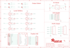

Contents
========

* [PRA3249 > Adafruit NeoPXL8 PCBs](#pra3249--adafruit-neopxl8-pcbs)
	* [Schematic](#schematic)
	* [PCB](#pcb)
	* [Interactive BOM](#interactive-bom)
	* [OOMP Parts](#oomp-parts)
	* [Images](#images)
	* [Tags](#tags)
  
![][im]
# PRA3249 > Adafruit NeoPXL8 PCBs

- ID: PROJ-ADAF-3249-STAN-01
- Hex ID: PRA3249
- Name: Adafruit
- Description: Adafruit
- Long Link: [http://oom.lt/PROJ-ADAF-3249-STAN-01](http://oom.lt/PROJ-ADAF-3249-STAN-01)
- Short Link: [http://oom.lt/PRA3249](http://oom.lt/PRA3249)

## Schematic
  

## PCB
  

## Interactive BOM

- Interactive BOM page: [ibom.html](https://htmlpreview.github.io/?https://github.com/oomlout/oomlout_OOMP_projects/blob/main/PROJ-ADAF-3249-STAN-01/kicad/bom/ibom.html)

## OOMP Parts
  

|OOMP Parts|
| :---: |
|C1 C1,CAPC-0603-X-UF1-01|
|C2 C2,CAPC-0603-X-UF1-01|
|C3 C3,CAPC-0603-X-UF1-01|
|CN1 CN1,UNMATCHED-UNMATCHED-X-UNMATCHED-01|
|CN2 CN2,UNMATCHED-UNMATCHED-X-UNMATCHED-01|
|IC1 IC1,UNMATCHED-UNMATCHED-X-UNMATCHED-01|
|IC2 IC2,UNMATCHED-UNMATCHED-X-UNMATCHED-01|
|IC3 IC3,UNMATCHED-SO23-X-UNMATCHED-01|
|JP1 JP1,HEAD-I01-X-PI01-01|
|JP2 JP2,HEAD-I01-X-PI01-01|
|JP3 JP3,HEAD-I01-X-PI01-01|
|JP5 JP5,HEAD-I01-X-PI01-01|
|JP6 JP6,HEAD-I01-X-PI01-01|
|JP7 JP7,HEAD-I01-X-PI01-01|
|JP8 JP8,HEAD-I01-X-PI01-01|
|[JP9 HEAD-I01-X-PI09-01 2.54 mm 9 Pin Header](https://github.com/oomlout/oomlout_OOMP_parts/tree/main/HEAD-I01-X-PI09-01/)|
|JP10 JP10,HEAD-I01-X-PI01-01|
|JP11 JP11,HEAD-I01-X-PI01-01|
|[JP12 HEAD-I01-X-PI10-01 2.54 mm 10 Pin Header](https://github.com/oomlout/oomlout_OOMP_parts/tree/main/HEAD-I01-X-PI10-01/)|
|MS1 MS1,UNMATCHED-UNMATCHED-X-UNMATCHED-01|
|NEO_OUT NEO_OUT,HEAD-I01-X-UNMATCHED-01|
|R1 R1,RESA-06038-X-O101X4-01|
|R2 R2,RESA-06038-X-O101X4-01|

## Images
  
  

|kicadPcb3d|kicadPcb3dFront|kicadPcb3dBack|eagleImage|eagleSchemImage|
| :---: | :---: | :---: | :---: | :---: |
||||||

## Tags

- hexID: PRA3249
- oompType: PROJ
- oompSize: ADAF
- oompColor: 3249
- oompDesc: STAN
- oompIndex: 01
- oompName: Adafruit NeoPXL8 PCBs
- sources: All source files from https://github.com/adafruit/Adafruit-NeoPXL8-PCBs (source licence details in srcLicense.md)
- linkBuyPage: http://www.adafruit.com/products/3249
- oompID: PROJ-ADAF-3249-STAN-01
- oompParts: C1,CAPC-0603-X-UF1-01
- oompParts: C2,CAPC-0603-X-UF1-01
- oompParts: C3,CAPC-0603-X-UF1-01
- oompParts: CN1,UNMATCHED-UNMATCHED-X-UNMATCHED-01
- oompParts: CN2,UNMATCHED-UNMATCHED-X-UNMATCHED-01
- oompParts: IC1,UNMATCHED-UNMATCHED-X-UNMATCHED-01
- oompParts: IC2,UNMATCHED-UNMATCHED-X-UNMATCHED-01
- oompParts: IC3,UNMATCHED-SO23-X-UNMATCHED-01
- oompParts: JP1,HEAD-I01-X-PI01-01
- oompParts: JP2,HEAD-I01-X-PI01-01
- oompParts: JP3,HEAD-I01-X-PI01-01
- oompParts: JP5,HEAD-I01-X-PI01-01
- oompParts: JP6,HEAD-I01-X-PI01-01
- oompParts: JP7,HEAD-I01-X-PI01-01
- oompParts: JP8,HEAD-I01-X-PI01-01
- oompParts: JP9,HEAD-I01-X-PI09-01
- oompParts: JP10,HEAD-I01-X-PI01-01
- oompParts: JP11,HEAD-I01-X-PI01-01
- oompParts: JP12,HEAD-I01-X-PI10-01
- oompParts: MS1,UNMATCHED-UNMATCHED-X-UNMATCHED-01
- oompParts: NEO_OUT,HEAD-I01-X-UNMATCHED-01
- oompParts: R1,RESA-06038-X-O101X4-01
- oompParts: R2,RESA-06038-X-O101X4-01
- rawParts: C1,1uF,CAP_CERAMIC0603_NO,0603-NO,Ceramic Capacitors,,,
- rawParts: C2,1uF,CAP_CERAMIC0603_NO,0603-NO,Ceramic Capacitors,,,
- rawParts: C3,1uF,CAP_CERAMIC0603_NO,0603-NO,Ceramic Capacitors,,,
- rawParts: CN1,RJ45_V_UNSH,RJ45_V_UNSH,RJ45_VERTICAL_UNSHIELDED,,,,
- rawParts: CN2,RJ45_V_UNSH,RJ45_V_UNSH,RJ45_VERTICAL_UNSHIELDED,,,,
- rawParts: FID1,FIDUCIAL_1MM,FIDUCIAL_1MM,FIDUCIAL_1MM,Fiducial Alignment Points,EXCLUDE,,
- rawParts: FID2,FIDUCIAL_1MM,FIDUCIAL_1MM,FIDUCIAL_1MM,Fiducial Alignment Points,EXCLUDE,,
- rawParts: IC1,74VHCT125,74ABT125PW,TSSOP14,Quad bus BUFFER, 3-state,,0,
- rawParts: IC2,74VHCT125,74ABT125PW,TSSOP14,Quad bus BUFFER, 3-state,,0,
- rawParts: IC3,AP3602,AP3602,SOT23-6,,,,
- rawParts: JP1,,HEADER-1X1ROUND,1X01_ROUND,PIN HEADER,,,
- rawParts: JP2,,HEADER-1X1ROUND,1X01_ROUND,PIN HEADER,,,
- rawParts: JP3,,HEADER-1X1ROUND,1X01_ROUND,PIN HEADER,,,
- rawParts: JP5,,HEADER-1X1ROUND,1X01_ROUND,PIN HEADER,,,
- rawParts: JP6,,HEADER-1X1ROUND,1X01_ROUND,PIN HEADER,,,
- rawParts: JP7,,HEADER-1X1ROUND,1X01_ROUND,PIN HEADER,,,
- rawParts: JP8,,HEADER-1X1ROUND,1X01_ROUND,PIN HEADER,,,
- rawParts: JP9,,HEADER-1X970MIL,1X09_ROUND_70,PIN HEADER,,,
- rawParts: JP10,,HEADER-1X1ROUND,1X01_ROUND,PIN HEADER,,,
- rawParts: JP11,,HEADER-1X1ROUND,1X01_ROUND,PIN HEADER,,,
- rawParts: JP12,,HEADER-1X10ROUND,1X10_ROUND,PIN HEADER,,,
- rawParts: MS1,FEATHERWING,FEATHERWING,FEATHERWING,,,,
- rawParts: NEO_OUT,,HEADER-2X8,2X08,,,,
- rawParts: R1,100,RESISTOR_4PACK,RESPACK_4X0603,Resistor Packs (4 resistors),,,
- rawParts: R2,100,RESISTOR_4PACK,RESPACK_4X0603,Resistor Packs (4 resistors),,,
- rawParts: SJ1,,SOLDERJUMPER_2WAY,SOLDERJUMPER_2WAY_OPEN_NOPASTE,2-Way Solder Jumper,,,
- rawParts: SJ2,,SOLDERJUMPER_2WAY,SOLDERJUMPER_2WAY_OPEN_NOPASTE,2-Way Solder Jumper,,,
- rawParts: SJ4,,SOLDERJUMPER_2WAY,SOLDERJUMPER_2WAY_OPEN_NOPASTE,2-Way Solder Jumper,,,
- rawParts: SJ5,,SOLDERJUMPER_2WAY,SOLDERJUMPER_2WAY_OPEN_NOPASTE,2-Way Solder Jumper,,,

[im]: kicadPcb3d_450.png
