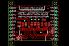
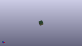

Contents
========

* [PROJ-ADAF-326-STAN-01>Adafruit 128x64 Monochrome OLED PCB](#proj-adaf-326-stan-01adafruit-128x64-monochrome-oled-pcb)
	* [Images](#images)
	* [Tags](#tags)
  
![][im]
# PROJ-ADAF-326-STAN-01>Adafruit 128x64 Monochrome OLED PCB

- ID: PROJ-ADAF-326-STAN-01
- Hex ID: PRA326
- Name: Adafruit 128x64 Monochrome OLED PCB
- Description: 

## Images
  
  

|eagleImage|kicadPcb3dFront|kicadPcb3dBack|kicadPcb3d|
| :---: | :---: | :---: | :---: |
|||||

## Tags

- hexID: PRA326
- oompType: PROJ
- oompSize: ADAF
- oompColor: 326
- oompDesc: STAN
- oompIndex: 01
- oompName: Adafruit 128x64 Monochrome OLED PCB
- sources: All source files from https://github.com/adafruit/Adafruit-128x64-Monochrome-OLED-PCB (source licence details in srcLicense.md)
- linkBuyPage: http://www.adafruit.com/products/326
- oompPart: UNMATCHED-UNMATCHED-X-UNMATCHED-01, B1, 1.27, 12.7, 270
- oompPart: CAPC-0805-X-UNMATCHED-01, C1, 28.955999999999996, 12.191999999999998, 90
- oompPart: CAPC-0805-X-UNMATCHED-01, C2, 26.669999999999998, 12.191999999999998, 90
- oompPart: CAPC-0805-X-UNMATCHED-01, C3, 10.540999999999999, 12.065, 90
- oompPart: CAPC-0805-X-UNMATCHED-01, C4, 24.13, 12.065, 270
- oompPart: CAPC-0805-X-NF100-V50, C5, 25.4, 15.493999999999998, 0
- oompPart: CAPC-0805-X-UNMATCHED-01, C6, 7.619999999999999, 13.334999999999999, 180
- oompPart: CAPC-0805-X-NF100-V50, C7, 7.619999999999999, 10.795, 180
- oompPart: UNMATCHED-UNMATCHED-X-UNMATCHED-01, P0\, 34.29, 12.7, 90
- oompPart: RESE-0805-X-O103-01, R1, 21.462999999999997, 12.446, 270
- oompPart: RESE-0805-X-O103-01, R2, 19.049999999999997, 12.446, 270
- oompPart: RESE-0805-X-O103-01, R3, 16.509999999999998, 12.446, 270
- oompPart: RESE-0805-X-UNMATCHED-01, R4, 12.572999999999999, 12.065, 270
- oompPart: SKIP-UNMATCHED-X-UNMATCHED-01, U$1, 17.779999999999998, 8.254999999999999, 180
- oompPart: SKIP-UNMATCHED-X-UNMATCHED-01, U$3, 28.320999999999998, 23.622, 0
- oompPart: SKIP-UNMATCHED-X-UNMATCHED-01, U$4, 5.968999999999999, 6.223, 0
- rawPart: 

[im]: kicadPcb3d_450.png
