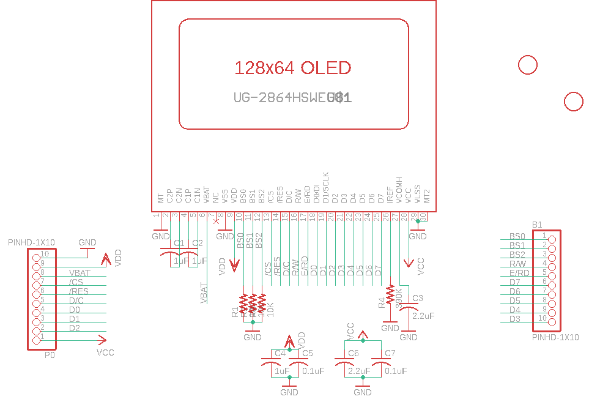
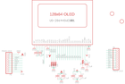

Contents
========

* [PRA326 > Adafruit](#pra326--adafruit)
	* [Schematic](#schematic)
	* [OOMP Parts](#oomp-parts)
	* [Images](#images)
	* [Tags](#tags)
  
![][im]
# PRA326 > Adafruit

- ID: PROJ-ADAF-326-STAN-01
- Hex ID: PRA326
- Name: Adafruit
- Description: Adafruit
- Long Link: [http://oom.lt/PROJ-ADAF-326-STAN-01](http://oom.lt/PROJ-ADAF-326-STAN-01)
- Short Link: [http://oom.lt/PRA326](http://oom.lt/PRA326)

## Schematic
  

## OOMP Parts
  

|OOMP Parts|
| :---: |
|B1,UNMATCHED-UNMATCHED-UNMATCHED-UNMATCHED-UNMATCHED,B1,PINHD-1X10,PINHD-1X10,1X10-BIG,Pin header 1x10 0.1 spacing,,|
|C1,UNMATCHED-UNMATCHED-UNMATCHED-UNMATCHED-UNMATCHED,C1,1uF,C-USC0805K,C0805K,CAPACITOR, American symbol,,|
|C2,UNMATCHED-UNMATCHED-UNMATCHED-UNMATCHED-UNMATCHED,C2,1uF,C-USC0805K,C0805K,CAPACITOR, American symbol,,|
|C3,UNMATCHED-UNMATCHED-UNMATCHED-UNMATCHED-UNMATCHED,C3,2.2uF,C-USC0805K,C0805K,CAPACITOR, American symbol,,|
|C4,UNMATCHED-UNMATCHED-UNMATCHED-UNMATCHED-UNMATCHED,C4,1uF,C-USC0805K,C0805K,CAPACITOR, American symbol,,|
|C5,UNMATCHED-UNMATCHED-UNMATCHED-UNMATCHED-UNMATCHED,C5,0.1uF,C-USC0805K,C0805K,CAPACITOR, American symbol,,|
|C6,UNMATCHED-UNMATCHED-UNMATCHED-UNMATCHED-UNMATCHED,C6,2.2uF,C-USC0805K,C0805K,CAPACITOR, American symbol,,|
|C7,UNMATCHED-UNMATCHED-UNMATCHED-UNMATCHED-UNMATCHED,C7,0.1uF,C-USC0805K,C0805K,CAPACITOR, American symbol,,|
|P0\,UNMATCHED-UNMATCHED-UNMATCHED-UNMATCHED-UNMATCHED,P0\,PINHD-1X10,PINHD-1X10,1X10-BIG,Pin header 1x10 0.1 spacing,,|
|R1,UNMATCHED-UNMATCHED-UNMATCHED-UNMATCHED-UNMATCHED,R1,10K,R-US_R0805,R0805,RESISTOR, American symbol,,|
|R2,UNMATCHED-UNMATCHED-UNMATCHED-UNMATCHED-UNMATCHED,R2,10K,R-US_R0805,R0805,RESISTOR, American symbol,,|
|R3,UNMATCHED-UNMATCHED-UNMATCHED-UNMATCHED-UNMATCHED,R3,10K,R-US_R0805,R0805,RESISTOR, American symbol,,|
|R4,UNMATCHED-UNMATCHED-UNMATCHED-UNMATCHED-UNMATCHED,R4,390K,R-US_R0805,R0805,RESISTOR, American symbol,,|
|U$1,UNMATCHED-UNMATCHED-UNMATCHED-UNMATCHED-UNMATCHED,U$1,UG-2864HSWEG01,UG-2864HSWEG01,1X30-0.7MM,UG-2864HSWEG01 OLED display,,|

## Images
  
  

|kicadPcb3d|kicadPcb3dFront|kicadPcb3dBack|eagleImage|eagleSchemImage|
| :---: | :---: | :---: | :---: | :---: |
||||||

## Tags

- hexID: PRA326
- oompType: PROJ
- oompSize: ADAF
- oompColor: 326
- oompDesc: STAN
- oompIndex: 01
- oompName: Adafruit 128x64 Monochrome OLED PCB
- sources: All source files from https://github.com/adafruit/Adafruit-128x64-Monochrome-OLED-PCB (source licence details in srcLicense.md)
- linkBuyPage: http://www.adafruit.com/products/326
- oompID: PROJ-ADAF-326-STAN-01
- oompParts: B1,UNMATCHED-UNMATCHED-UNMATCHED-UNMATCHED-UNMATCHED
- oompParts: C1,UNMATCHED-UNMATCHED-UNMATCHED-UNMATCHED-UNMATCHED
- oompParts: C2,UNMATCHED-UNMATCHED-UNMATCHED-UNMATCHED-UNMATCHED
- oompParts: C3,UNMATCHED-UNMATCHED-UNMATCHED-UNMATCHED-UNMATCHED
- oompParts: C4,UNMATCHED-UNMATCHED-UNMATCHED-UNMATCHED-UNMATCHED
- oompParts: C5,UNMATCHED-UNMATCHED-UNMATCHED-UNMATCHED-UNMATCHED
- oompParts: C6,UNMATCHED-UNMATCHED-UNMATCHED-UNMATCHED-UNMATCHED
- oompParts: C7,UNMATCHED-UNMATCHED-UNMATCHED-UNMATCHED-UNMATCHED
- oompParts: P0\,UNMATCHED-UNMATCHED-UNMATCHED-UNMATCHED-UNMATCHED
- oompParts: R1,UNMATCHED-UNMATCHED-UNMATCHED-UNMATCHED-UNMATCHED
- oompParts: R2,UNMATCHED-UNMATCHED-UNMATCHED-UNMATCHED-UNMATCHED
- oompParts: R3,UNMATCHED-UNMATCHED-UNMATCHED-UNMATCHED-UNMATCHED
- oompParts: R4,UNMATCHED-UNMATCHED-UNMATCHED-UNMATCHED-UNMATCHED
- oompParts: U$1,UNMATCHED-UNMATCHED-UNMATCHED-UNMATCHED-UNMATCHED
- rawParts: B1,PINHD-1X10,PINHD-1X10,1X10-BIG,Pin header 1x10 0.1 spacing,,
- rawParts: C1,1uF,C-USC0805K,C0805K,CAPACITOR, American symbol,,
- rawParts: C2,1uF,C-USC0805K,C0805K,CAPACITOR, American symbol,,
- rawParts: C3,2.2uF,C-USC0805K,C0805K,CAPACITOR, American symbol,,
- rawParts: C4,1uF,C-USC0805K,C0805K,CAPACITOR, American symbol,,
- rawParts: C5,0.1uF,C-USC0805K,C0805K,CAPACITOR, American symbol,,
- rawParts: C6,2.2uF,C-USC0805K,C0805K,CAPACITOR, American symbol,,
- rawParts: C7,0.1uF,C-USC0805K,C0805K,CAPACITOR, American symbol,,
- rawParts: P0\,PINHD-1X10,PINHD-1X10,1X10-BIG,Pin header 1x10 0.1 spacing,,
- rawParts: R1,10K,R-US_R0805,R0805,RESISTOR, American symbol,,
- rawParts: R2,10K,R-US_R0805,R0805,RESISTOR, American symbol,,
- rawParts: R3,10K,R-US_R0805,R0805,RESISTOR, American symbol,,
- rawParts: R4,390K,R-US_R0805,R0805,RESISTOR, American symbol,,
- rawParts: U$1,UG-2864HSWEG01,UG-2864HSWEG01,1X30-0.7MM,UG-2864HSWEG01 OLED display,,
- rawParts: U$3,FIDUCIAL,FIDUCIAL,FIDUCIAL_1MM,For use by pick and place machines to calibrate the vision/machine, 1mm,,
- rawParts: U$4,FIDUCIAL,FIDUCIAL,FIDUCIAL_1MM,For use by pick and place machines to calibrate the vision/machine, 1mm,,

[im]: kicadPcb3d_450.png
