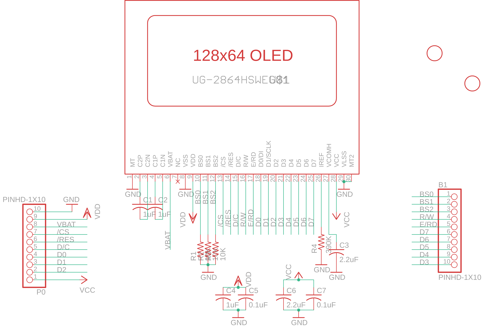
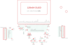

Contents
========

* [PRA326 > Adafruit 128x64 Monochrome OLED PCB](#pra326--adafruit-128x64-monochrome-oled-pcb)
	* [Schematic](#schematic)
	* [PCB](#pcb)
	* [OOMP Parts](#oomp-parts)
	* [Images](#images)
	* [Tags](#tags)
  
![][im]
# PRA326 > Adafruit 128x64 Monochrome OLED PCB

- ID: PROJ-ADAF-326-STAN-01
- Hex ID: PRA326
- Name: Adafruit
- Description: Adafruit
- Long Link: [http://oom.lt/PROJ-ADAF-326-STAN-01](http://oom.lt/PROJ-ADAF-326-STAN-01)
- Short Link: [http://oom.lt/PRA326](http://oom.lt/PRA326)

## Schematic
  

## PCB
  

## OOMP Parts
  

|OOMP ID|Name|Identifier|
| :---: | :---: | :---: |
|[HEAD-I01-X-PI10-01](https://github.com/oomlout/oomlout_OOMP_parts/tree/main/HEAD-I01-X-PI10-01/)|[2.54 mm 10 Pin Header](https://github.com/oomlout/oomlout_OOMP_parts/tree/main/HEAD-I01-X-PI10-01/)|[B1, P0\](https://github.com/oomlout/oomlout_OOMP_parts/tree/main/HEAD-I01-X-PI10-01/)|
|[CAPC-0805-X-UF1-V25](https://github.com/oomlout/oomlout_OOMP_parts/tree/main/CAPC-0805-X-UF1-V25/)|[SMD (0805) 1 uF Capacitor (Ceramic) 25v](https://github.com/oomlout/oomlout_OOMP_parts/tree/main/CAPC-0805-X-UF1-V25/)|[C1, C2, C4](https://github.com/oomlout/oomlout_OOMP_parts/tree/main/CAPC-0805-X-UF1-V25/)|
|[CAPC-0805-X-UF22D-V25](https://github.com/oomlout/oomlout_OOMP_parts/tree/main/CAPC-0805-X-UF22D-V25/)|[SMD (0805) 2.2 uF Capacitor (Ceramic) 25v](https://github.com/oomlout/oomlout_OOMP_parts/tree/main/CAPC-0805-X-UF22D-V25/)|[C3, C6](https://github.com/oomlout/oomlout_OOMP_parts/tree/main/CAPC-0805-X-UF22D-V25/)|
|[CAPC-0805-X-NF100-V50](https://github.com/oomlout/oomlout_OOMP_parts/tree/main/CAPC-0805-X-NF100-V50/)|[SMD (0805) 100 nF Capacitor (Ceramic) 50v](https://github.com/oomlout/oomlout_OOMP_parts/tree/main/CAPC-0805-X-NF100-V50/)|[C5, C7](https://github.com/oomlout/oomlout_OOMP_parts/tree/main/CAPC-0805-X-NF100-V50/)|
|[RESE-0805-X-O103-01](https://github.com/oomlout/oomlout_OOMP_parts/tree/main/RESE-0805-X-O103-01/)|[SMD (0805) 10k Ohm Resistor](https://github.com/oomlout/oomlout_OOMP_parts/tree/main/RESE-0805-X-O103-01/)|[R1, R2, R3](https://github.com/oomlout/oomlout_OOMP_parts/tree/main/RESE-0805-X-O103-01/)|
|RESE-0805-X-O3903-01||R4|
|UNMATCHED-UNMATCHED-X-UNMATCHED-01||U$1|

## Images
  
  

|kicadPcb3d|kicadPcb3dFront|kicadPcb3dBack|eagleImage|eagleSchemImage|
| :---: | :---: | :---: | :---: | :---: |
||||||

## Tags

- hexID: PRA326
- oompType: PROJ
- oompSize: ADAF
- oompColor: 326
- oompDesc: STAN
- oompIndex: 01
- oompName: Adafruit 128x64 Monochrome OLED PCB
- sources: All source files from https://github.com/adafruit/Adafruit-128x64-Monochrome-OLED-PCB (source licence details in srcLicense.md)
- linkBuyPage: http://www.adafruit.com/products/326
- oompID: PROJ-ADAF-326-STAN-01
- oompParts: B1,HEAD-I01-X-PI10-01
- oompParts: C1,CAPC-0805-X-UF1-V25
- oompParts: C2,CAPC-0805-X-UF1-V25
- oompParts: C3,CAPC-0805-X-UF22D-V25
- oompParts: C4,CAPC-0805-X-UF1-V25
- oompParts: C5,CAPC-0805-X-NF100-V50
- oompParts: C6,CAPC-0805-X-UF22D-V25
- oompParts: C7,CAPC-0805-X-NF100-V50
- oompParts: P0\,HEAD-I01-X-PI10-01
- oompParts: R1,RESE-0805-X-O103-01
- oompParts: R2,RESE-0805-X-O103-01
- oompParts: R3,RESE-0805-X-O103-01
- oompParts: R4,RESE-0805-X-O3903-01
- oompParts: U$1,UNMATCHED-UNMATCHED-X-UNMATCHED-01
- rawParts: B1,PINHD-1X10,PINHD-1X10,1X10-BIG,Pin header 1x10 0.1 spacing,,
- rawParts: C1,1uF,C-USC0805K,C0805K,CAPACITOR, American symbol,,
- rawParts: C2,1uF,C-USC0805K,C0805K,CAPACITOR, American symbol,,
- rawParts: C3,2.2uF,C-USC0805K,C0805K,CAPACITOR, American symbol,,
- rawParts: C4,1uF,C-USC0805K,C0805K,CAPACITOR, American symbol,,
- rawParts: C5,0.1uF,C-USC0805K,C0805K,CAPACITOR, American symbol,,
- rawParts: C6,2.2uF,C-USC0805K,C0805K,CAPACITOR, American symbol,,
- rawParts: C7,0.1uF,C-USC0805K,C0805K,CAPACITOR, American symbol,,
- rawParts: P0\,PINHD-1X10,PINHD-1X10,1X10-BIG,Pin header 1x10 0.1 spacing,,
- rawParts: R1,10K,R-US_R0805,R0805,RESISTOR, American symbol,,
- rawParts: R2,10K,R-US_R0805,R0805,RESISTOR, American symbol,,
- rawParts: R3,10K,R-US_R0805,R0805,RESISTOR, American symbol,,
- rawParts: R4,390K,R-US_R0805,R0805,RESISTOR, American symbol,,
- rawParts: U$1,UG-2864HSWEG01,UG-2864HSWEG01,1X30-0.7MM,UG-2864HSWEG01 OLED display,,
- rawParts: U$3,FIDUCIAL,FIDUCIAL,FIDUCIAL_1MM,For use by pick and place machines to calibrate the vision/machine, 1mm,,
- rawParts: U$4,FIDUCIAL,FIDUCIAL,FIDUCIAL_1MM,For use by pick and place machines to calibrate the vision/machine, 1mm,,

[im]: kicadPcb3d_450.png
