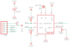

Contents
========

* [PRA3296 > Adafruit](#pra3296--adafruit)
	* [Schematic](#schematic)
	* [Interactive BOM](#interactive-bom)
	* [OOMP Parts](#oomp-parts)
	* [Images](#images)
	* [Tags](#tags)
  
![][im]
# PRA3296 > Adafruit

- ID: PROJ-ADAF-3296-STAN-01
- Hex ID: PRA3296
- Name: Adafruit
- Description: Adafruit
- Long Link: [http://oom.lt/PROJ-ADAF-3296-STAN-01](http://oom.lt/PROJ-ADAF-3296-STAN-01)
- Short Link: [http://oom.lt/PRA3296](http://oom.lt/PRA3296)

## Schematic
  

## Interactive BOM

- Interactive BOM page: [ibom.html](https://htmlpreview.github.io/?https://github.com/oomlout/oomlout_OOMP_projects/blob/main/PROJ-ADAF-3296-STAN-01/kicad/bom/ibom.html)

## OOMP Parts
  

|OOMP Parts|
| :---: |
|BAT,UNMATCHED-UNMATCHED-UNMATCHED-UNMATCHED-UNMATCHED,BAT,CR1220,CR1220THM,CR1220-THM,CR1216/CR1220/CR1225 12mm 3V lithium coin cell,,|
|C1,UNMATCHED-UNMATCHED-UNMATCHED-UNMATCHED-UNMATCHED,C1,0.1uF,C-US025-025X050,C025-025X050,CAPACITOR, American symbol,,|
|IC3,UNMATCHED-UNMATCHED-UNMATCHED-UNMATCHED-UNMATCHED,IC3,DS1307,DS1307,DIL08,DS1307,,|
|JP2,UNMATCHED-UNMATCHED-UNMATCHED-UNMATCHED-UNMATCHED,JP2,,PINHD-1X5,1X05,PIN HEADER,,|
|Q1,UNMATCHED-UNMATCHED-UNMATCHED-UNMATCHED-UNMATCHED,Q1,32.768,CRYTALTC38H,TC38H,CRYSTAL,,|
|R1,UNMATCHED-UNMATCHED-UNMATCHED-UNMATCHED-UNMATCHED,R1,2.2k,R-US_0207/10,0207/10,RESISTOR, American symbol,,|
|R2,UNMATCHED-UNMATCHED-UNMATCHED-UNMATCHED-UNMATCHED,R2,2.2K,R-US_0207/10,0207/10,RESISTOR, American symbol,,|

## Images
  
  

|kicadPcb3d|kicadPcb3dFront|kicadPcb3dBack|eagleImage|eagleSchemImage|
| :---: | :---: | :---: | :---: | :---: |
||||||

## Tags

- hexID: PRA3296
- oompType: PROJ
- oompSize: ADAF
- oompColor: 3296
- oompDesc: STAN
- oompIndex: 01
- oompName: DS1307 breakout board
- sources: All source files from https://github.com/adafruit/DS1307-breakout-board (source licence details in srcLicense.md)
- linkBuyPage: http://www.adafruit.com/products/3296
- oompID: PROJ-ADAF-3296-STAN-01
- oompParts: BAT,UNMATCHED-UNMATCHED-UNMATCHED-UNMATCHED-UNMATCHED
- oompParts: C1,UNMATCHED-UNMATCHED-UNMATCHED-UNMATCHED-UNMATCHED
- oompParts: IC3,UNMATCHED-UNMATCHED-UNMATCHED-UNMATCHED-UNMATCHED
- oompParts: JP2,UNMATCHED-UNMATCHED-UNMATCHED-UNMATCHED-UNMATCHED
- oompParts: Q1,UNMATCHED-UNMATCHED-UNMATCHED-UNMATCHED-UNMATCHED
- oompParts: R1,UNMATCHED-UNMATCHED-UNMATCHED-UNMATCHED-UNMATCHED
- oompParts: R2,UNMATCHED-UNMATCHED-UNMATCHED-UNMATCHED-UNMATCHED
- rawParts: BAT,CR1220,CR1220THM,CR1220-THM,CR1216/CR1220/CR1225 12mm 3V lithium coin cell,,
- rawParts: C1,0.1uF,C-US025-025X050,C025-025X050,CAPACITOR, American symbol,,
- rawParts: IC3,DS1307,DS1307,DIL08,DS1307,,
- rawParts: JP2,,PINHD-1X5,1X05,PIN HEADER,,
- rawParts: Q1,32.768,CRYTALTC38H,TC38H,CRYSTAL,,
- rawParts: R1,2.2k,R-US_0207/10,0207/10,RESISTOR, American symbol,,
- rawParts: R2,2.2K,R-US_0207/10,0207/10,RESISTOR, American symbol,,

[im]: kicadPcb3d_450.png
