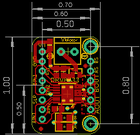
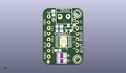
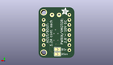
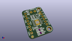

Contents
========

* [PROJ-ADAF-3297-STAN-01>Adafruit DRV8833 Motor Driver Breakout PCB](#proj-adaf-3297-stan-01adafruit-drv8833-motor-driver-breakout-pcb)
	* [Images](#images)
	* [Interactive BOM](#interactive-bom)
	* [OOMP Parts](#oomp-parts)
	* [Tags](#tags)
  
![][im]
# PROJ-ADAF-3297-STAN-01>Adafruit DRV8833 Motor Driver Breakout PCB

- ID: PROJ-ADAF-3297-STAN-01
- Hex ID: PRA3297
- Name: Adafruit DRV8833 Motor Driver Breakout PCB
- Description: 

## Images
  
  

|eagleImage|kicadPcb3dFront|kicadPcb3dBack|kicadPcb3d|
| :---: | :---: | :---: | :---: |
|||||

## Interactive BOM

- Interactive BOM page: [ibom.html](kicad/bom/ibom.html)

## OOMP Parts
  

|OOMP Parts|
| :---: |
|ERROR, C1 10uF/16V 0805-NO, 0, 0, 0,C1, 10uF/16V, 0805-NO, microbuilder, (0.095, 0.865), R90|
|<table><tr><td></td><td> C2</td><td>[CAPC-0805-X-UF10-V25 SMD (0805) 10 uF Capacitor (Ceramic) 25v](https://github.com/oomlout/oomlout_OOMP_parts/tree/main/CAPC-0805-X-UF10-V25/)</td><td>[C85U010](https://github.com/oomlout/oomlout_OOMP_parts/tree/main/CAPC-0805-X-UF10-V25/)</td></tr></table>|
|<table><tr><td></td><td> C3</td><td>[CAPC-0805-X-NF100-V50 SMD (0805) 100 nF Capacitor (Ceramic) 50v](https://github.com/oomlout/oomlout_OOMP_parts/tree/main/CAPC-0805-X-NF100-V50/)</td><td>[C85N100](https://github.com/oomlout/oomlout_OOMP_parts/tree/main/CAPC-0805-X-NF100-V50/)</td></tr></table>|
|ERROR, C4 10uF/16V 0805-NO, 0, 0, 0,C4, 10uF/16V, 0805-NO, microbuilder, (0.235, 0.59), R270|
|UNMATCHED-UNMATCHED-X-UNMATCHED-01, J1, 7.112, 20.32, 180,J1, VMOTORIN, TERMBLOCK_1X2-3.5MM, microbuilder, (0.28, 0.8), R180|
|UNMATCHED-UNMATCHED-X-UNMATCHED-01, JP2, 12.953999999999999, 6.35, 270,JP2, 1X02_ROUND, microbuilder, (0.51, 0.25), R270|
|UNMATCHED-UNMATCHED-X-UNMATCHED-01, JP3, 12.953999999999999, 11.43, 270,JP3, 1X02_ROUND, microbuilder, (0.51, 0.45), R270|
|UNMATCHED-UNMATCHED-X-UNMATCHED-01, JP4, 12.953999999999999, 16.509999999999998, 90,JP4, 1X02_ROUND, microbuilder, (0.51, 0.65), R90|
|UNMATCHED-UNMATCHED-X-UNMATCHED-01, JP5, 0.254, 11.43, 270,JP5, 1X08_ROUND_70, microbuilder, (0.01, 0.45), R270|
|UNMATCHED-UNMATCHED-X-UNMATCHED-01, Q1, 9.143999999999998, 15.112999999999998, 0,Q1, DMG3415U, SOT23-WIDE, microbuilder, (0.36, 0.595), R0|
|RESE-UNMATCHED-X-UNMATCHED-01, R1, 6.095999999999999, 2.921, 0,R1, 0.2?, _1206, microbuilder, (0.24, 0.115), R0|
|RESE-UNMATCHED-X-UNMATCHED-01, R2, 6.095999999999999, 0.508, 0,R2, 0.2?, _1206, microbuilder, (0.24, 0.02), R0|
|UNMATCHED-UNMATCHED-X-UNMATCHED-01, SJ1, 6.095999999999999, 0.508, M0,SJ1, ISENSEA, SOLDERJUMPER_ARROW_NOPASTE, microbuilder, (0.24, 0.02), MR0|
|UNMATCHED-UNMATCHED-X-UNMATCHED-01, SJ2, 6.095999999999999, 2.921, M0,SJ2, ISENSEB, SOLDERJUMPER_ARROW_NOPASTE, microbuilder, (0.24, 0.115), MR0|
|UNMATCHED-UNMATCHED-X-UNMATCHED-01, U1, 6.858, 9.143999999999998, 90,U1, DRV8833PWPR, HTSSOP16, microbuilder, (0.27, 0.36), R90|

## Tags

- hexID: PRA3297
- oompType: PROJ
- oompSize: ADAF
- oompColor: 3297
- oompDesc: STAN
- oompIndex: 01
- oompName: Adafruit DRV8833 Motor Driver Breakout PCB
- sources: All source files from https://github.com/adafruit/Adafruit-DRV8833-Motor-Driver-Breakout-PCB (source licence details in srcLicense.md)
- linkBuyPage: http://www.adafruit.com/products/3297
- oompPart: ERROR, C1 10uF/16V 0805-NO, 0, 0, 0
- oompPart: CAPC-0805-X-UF10-V25, C2, 4.444999999999999, 5.206999999999999, 0
- oompPart: CAPC-0805-X-NF100-V50, C3, 4.064, 14.985999999999999, 270
- oompPart: ERROR, C4 10uF/16V 0805-NO, 0, 0, 0
- oompPart: SKIP-UNMATCHED-X-UNMATCHED-01, FID1, 11.557, 16.509999999999998, 0
- oompPart: SKIP-UNMATCHED-X-UNMATCHED-01, FID2, 0.0, 0.0, 0
- oompPart: UNMATCHED-UNMATCHED-X-UNMATCHED-01, J1, 7.112, 20.32, 180
- oompPart: UNMATCHED-UNMATCHED-X-UNMATCHED-01, JP2, 12.953999999999999, 6.35, 270
- oompPart: UNMATCHED-UNMATCHED-X-UNMATCHED-01, JP3, 12.953999999999999, 11.43, 270
- oompPart: UNMATCHED-UNMATCHED-X-UNMATCHED-01, JP4, 12.953999999999999, 16.509999999999998, 90
- oompPart: UNMATCHED-UNMATCHED-X-UNMATCHED-01, JP5, 0.254, 11.43, 270
- oompPart: UNMATCHED-UNMATCHED-X-UNMATCHED-01, Q1, 9.143999999999998, 15.112999999999998, 0
- oompPart: RESE-UNMATCHED-X-UNMATCHED-01, R1, 6.095999999999999, 2.921, 0
- oompPart: RESE-UNMATCHED-X-UNMATCHED-01, R2, 6.095999999999999, 0.508, 0
- oompPart: UNMATCHED-UNMATCHED-X-UNMATCHED-01, SJ1, 6.095999999999999, 0.508, M0
- oompPart: UNMATCHED-UNMATCHED-X-UNMATCHED-01, SJ2, 6.095999999999999, 2.921, M0
- oompPart: SKIP-UNMATCHED-X-UNMATCHED-01, U$13, 12.953999999999999, 21.59, 0
- oompPart: SKIP-UNMATCHED-X-UNMATCHED-01, U$14, 12.953999999999999, 1.27, 0
- oompPart: UNMATCHED-UNMATCHED-X-UNMATCHED-01, U1, 6.858, 9.143999999999998, 90
- rawPart: C1, 10uF/16V, 0805-NO, microbuilder, (0.095, 0.865), R90
- rawPart: C2, 10uF, 0805-NO, microbuilder, (0.175, 0.205), R0
- rawPart: C3, 0.1uF, 0805-NO, microbuilder, (0.16, 0.59), R270
- rawPart: C4, 10uF/16V, 0805-NO, microbuilder, (0.235, 0.59), R270
- rawPart: FID1, FIDUCIAL, FIDUCIAL_1MM, microbuilder, (0.455, 0.65), R0
- rawPart: FID2, FIDUCIAL, FIDUCIAL_1MM, microbuilder, (0, 0), R0
- rawPart: J1, VMOTORIN, TERMBLOCK_1X2-3.5MM, microbuilder, (0.28, 0.8), R180
- rawPart: JP2, 1X02_ROUND, microbuilder, (0.51, 0.25), R270
- rawPart: JP3, 1X02_ROUND, microbuilder, (0.51, 0.45), R270
- rawPart: JP4, 1X02_ROUND, microbuilder, (0.51, 0.65), R90
- rawPart: JP5, 1X08_ROUND_70, microbuilder, (0.01, 0.45), R270
- rawPart: Q1, DMG3415U, SOT23-WIDE, microbuilder, (0.36, 0.595), R0
- rawPart: R1, 0.2?, _1206, microbuilder, (0.24, 0.115), R0
- rawPart: R2, 0.2?, _1206, microbuilder, (0.24, 0.02), R0
- rawPart: SJ1, ISENSEA, SOLDERJUMPER_ARROW_NOPASTE, microbuilder, (0.24, 0.02), MR0
- rawPart: SJ2, ISENSEB, SOLDERJUMPER_ARROW_NOPASTE, microbuilder, (0.24, 0.115), MR0
- rawPart: U$13, MOUNTINGHOLE2.5, MOUNTINGHOLE_2.5_PLATED, microbuilder, (0.51, 0.85), R0
- rawPart: U$14, MOUNTINGHOLE2.5, MOUNTINGHOLE_2.5_PLATED, microbuilder, (0.51, 0.05), R0
- rawPart: U1, DRV8833PWPR, HTSSOP16, microbuilder, (0.27, 0.36), R90

[im]: kicadPcb3d_450.png
