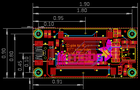
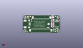
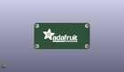
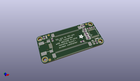

Contents
========

* [PROJ-ADAF-3305-STAN-01>Adafruit 50pin to 40pin TFT with AR1100 Adapter PCB](#proj-adaf-3305-stan-01adafruit-50pin-to-40pin-tft-with-ar1100-adapter-pcb)
	* [Images](#images)
	* [Interactive BOM](#interactive-bom)
	* [OOMP Parts](#oomp-parts)
	* [Tags](#tags)
  
![][im]
# PROJ-ADAF-3305-STAN-01>Adafruit 50pin to 40pin TFT with AR1100 Adapter PCB

- ID: PROJ-ADAF-3305-STAN-01
- Hex ID: PRA3305
- Name: Adafruit 50pin to 40pin TFT with AR1100 Adapter PCB
- Description: 

## Images
  
  

|eagleImage|kicadPcb3dFront|kicadPcb3dBack|kicadPcb3d|
| :---: | :---: | :---: | :---: |
|||||

## Interactive BOM

- Interactive BOM page: [ibom.html](kicad/bom/ibom.html)

## OOMP Parts
  

|OOMP Parts|
| :---: |
|CAPE-0805-X-UNMATCHED-01, C1, 11.3800001, 16.200000111999998, 270,C1, 10uF, _0805MP, microbuilder, (0.4480315, 0.63779528), R270|
|CAPE-0805-X-NF100-01, C2, 32.471000081999996, 7.005999957999999, 0,C2, 0.1uF, _0805MP, microbuilder, (1.27838583, 0.27582677), R0|
|CAPE-0805-X-UNMATCHED-01, C3, 42.463999908, 16.657999957999998, 180,C3, 10uF, _0805MP, microbuilder, (1.67181102, 0.65582677), R180|
|CAPE-0805-X-NF10-01, C4, 39.878, 20.700999999999997, 90,C4, 0.01uF, _0805MP, microbuilder, (1.57, 0.815), R90|
|UNMATCHED-0805-X-UNMATCHED-01, C5, 38.227, 13.208, 180,C5, dnp, _0805MP, microbuilder, (1.505, 0.52), R180|
|CAPE-0805-X-NF10-01, C6, 38.73499999999999, 17.525999999999996, 180,C6, 0.01uF, _0805MP, microbuilder, (1.525, 0.69), R180|
|UNMATCHED-0805-X-UNMATCHED-01, C7, 38.227, 9.779, 180,C7, dnp, _0805MP, microbuilder, (1.505, 0.385), R180|
|UNMATCHED-0805-X-UNMATCHED-01, FB1, 38.227, 8.128, 180,FB1, Ferrite, _0805, microbuilder, (1.505, 0.32), R180|
|UNMATCHED-0805-X-UNMATCHED-01, FB2, 38.227, 11.557, 180,FB2, Ferrite, _0805, microbuilder, (1.505, 0.455), R180|
|UNMATCHED-0805-X-UNMATCHED-01, FB3, 38.227, 15.493999999999998, 180,FB3, Ferrite, _0805, microbuilder, (1.505, 0.61), R180|
|UNMATCHED-0805-X-UNMATCHED-01, FB4, 38.099999999999994, 20.700999999999997, 90,FB4, Ferrite, _0805, microbuilder, (1.5, 0.815), R90|
|UNMATCHED-UNMATCHED-X-UNMATCHED-01, IC1, 44.068000002, 11.19599996, 0,IC1, AR1100_SSOP, TSSOP20-5.3MMBODY, microbuilder, (1.73496063, 0.4407874), R0|
|UNMATCHED-UNMATCHED-X-UNMATCHED-01, J1, 24.1799999, 20.700000002, 0,J1, XF2-40-RARBT, 4-1734839-0, adafruit, (0.9519685, 0.81496063), R0|
|UNMATCHED-UNMATCHED-X-UNMATCHED-01, J2, 23.180000122, 2.350000126, 180,J2, XF2-50-REV, 5-1734839-0-REV, adafruit, (0.91259843, 0.09251969), R180|
|UNMATCHED-UNMATCHED-X-UNMATCHED-01, LED1, 7.6799998800000004, 20.292000056, 0,LED1, Green, CHIPLED_0805_NOOUTLINE, microbuilder, (0.3023622, 0.79889764), R0|
|UNMATCHED-UNMATCHED-X-UNMATCHED-01, LED2, 43.969999943999994, 5.454000014, 90,LED2, red, CHIPLED_0805_NOOUTLINE, microbuilder, (1.73110236, 0.21472441), R90|
|<table><tr><td></td><td> R1</td><td>[RESE-0805-X-O203-01 SMD (0805) 20k Ohm Resistor](https://github.com/oomlout/oomlout_OOMP_parts/tree/main/RESE-0805-X-O203-01/)</td><td>[R85203](https://github.com/oomlout/oomlout_OOMP_parts/tree/main/RESE-0805-X-O203-01/)</td></tr></table>|
|RESE-0805-X-UNMATCHED-01, R2, 42.381000074, 2.858000126, 90,R2, 1K, _0805MP, microbuilder, (1.66854331, 0.11251969), R90|
|RESE-0805-X-UNMATCHED-01, R3, 5.8519999799999995, 20.304000031999998, 90,R3, 1K, _0805MP, microbuilder, (0.2303937, 0.79937008), R90|
|UNMATCHED-UNMATCHED-X-UNMATCHED-01, X1, 4.780000092, 11.500000113999999, 270,X1, USB-MINIB_LARGER, microbuilder, (0.18818898, 0.45275591), R270|
|UNMATCHED-UNMATCHED-X-UNMATCHED-01, Y1, 40.091000082, 3.512000088, 270,Y1, 12MHz, RESONATOR-SMD, SparkFun, (1.57838583, 0.13826772), R270|

## Tags

- hexID: PRA3305
- oompType: PROJ
- oompSize: ADAF
- oompColor: 3305
- oompDesc: STAN
- oompIndex: 01
- oompName: Adafruit 50pin to 40pin TFT with AR1100 Adapter PCB
- sources: All source files from https://github.com/adafruit/Adafruit-50pin-to-40pin-TFT-with-AR1100-Adapter-PCB (source licence details in srcLicense.md)
- linkBuyPage: http://www.adafruit.com/products/3305
- oompPart: CAPE-0805-X-UNMATCHED-01, C1, 11.3800001, 16.200000111999998, 270
- oompPart: CAPE-0805-X-NF100-01, C2, 32.471000081999996, 7.005999957999999, 0
- oompPart: CAPE-0805-X-UNMATCHED-01, C3, 42.463999908, 16.657999957999998, 180
- oompPart: CAPE-0805-X-NF10-01, C4, 39.878, 20.700999999999997, 90
- oompPart: UNMATCHED-0805-X-UNMATCHED-01, C5, 38.227, 13.208, 180
- oompPart: CAPE-0805-X-NF10-01, C6, 38.73499999999999, 17.525999999999996, 180
- oompPart: UNMATCHED-0805-X-UNMATCHED-01, C7, 38.227, 9.779, 180
- oompPart: UNMATCHED-0805-X-UNMATCHED-01, FB1, 38.227, 8.128, 180
- oompPart: UNMATCHED-0805-X-UNMATCHED-01, FB2, 38.227, 11.557, 180
- oompPart: UNMATCHED-0805-X-UNMATCHED-01, FB3, 38.227, 15.493999999999998, 180
- oompPart: UNMATCHED-0805-X-UNMATCHED-01, FB4, 38.099999999999994, 20.700999999999997, 90
- oompPart: SKIP-UNMATCHED-X-UNMATCHED-01, FID1, 5.588, 1.1429999999999998, 90
- oompPart: SKIP-UNMATCHED-X-UNMATCHED-01, FID2, 42.418, 21.462999999999997, 90
- oompPart: SKIP-UNMATCHED-X-UNMATCHED-01, FID3, 9.779, 21.336, 90
- oompPart: UNMATCHED-UNMATCHED-X-UNMATCHED-01, IC1, 44.068000002, 11.19599996, 0
- oompPart: UNMATCHED-UNMATCHED-X-UNMATCHED-01, J1, 24.1799999, 20.700000002, 0
- oompPart: UNMATCHED-UNMATCHED-X-UNMATCHED-01, J2, 23.180000122, 2.350000126, 180
- oompPart: UNMATCHED-UNMATCHED-X-UNMATCHED-01, LED1, 7.6799998800000004, 20.292000056, 0
- oompPart: UNMATCHED-UNMATCHED-X-UNMATCHED-01, LED2, 43.969999943999994, 5.454000014, 90
- oompPart: RESE-0805-X-O203-01, R1, 46.165000125999995, 16.532999953999997, 180
- oompPart: RESE-0805-X-UNMATCHED-01, R2, 42.381000074, 2.858000126, 90
- oompPart: RESE-0805-X-UNMATCHED-01, R3, 5.8519999799999995, 20.304000031999998, 90
- oompPart: SKIP-UNMATCHED-X-UNMATCHED-01, U$11, 45.72, 2.54, 90
- oompPart: SKIP-UNMATCHED-X-UNMATCHED-01, U$14, 45.72, 20.32, 90
- oompPart: SKIP-UNMATCHED-X-UNMATCHED-01, U$15, 2.54, 20.32, 90
- oompPart: SKIP-UNMATCHED-X-UNMATCHED-01, U$16, 2.54, 2.54, 90
- oompPart: UNMATCHED-UNMATCHED-X-UNMATCHED-01, X1, 4.780000092, 11.500000113999999, 270
- oompPart: UNMATCHED-UNMATCHED-X-UNMATCHED-01, Y1, 40.091000082, 3.512000088, 270
- rawPart: C1, 10uF, _0805MP, microbuilder, (0.4480315, 0.63779528), R270
- rawPart: C2, 0.1uF, _0805MP, microbuilder, (1.27838583, 0.27582677), R0
- rawPart: C3, 10uF, _0805MP, microbuilder, (1.67181102, 0.65582677), R180
- rawPart: C4, 0.01uF, _0805MP, microbuilder, (1.57, 0.815), R90
- rawPart: C5, dnp, _0805MP, microbuilder, (1.505, 0.52), R180
- rawPart: C6, 0.01uF, _0805MP, microbuilder, (1.525, 0.69), R180
- rawPart: C7, dnp, _0805MP, microbuilder, (1.505, 0.385), R180
- rawPart: FB1, Ferrite, _0805, microbuilder, (1.505, 0.32), R180
- rawPart: FB2, Ferrite, _0805, microbuilder, (1.505, 0.455), R180
- rawPart: FB3, Ferrite, _0805, microbuilder, (1.505, 0.61), R180
- rawPart: FB4, Ferrite, _0805, microbuilder, (1.5, 0.815), R90
- rawPart: FID1, FIDUCIAL, FIDUCIAL_1MM, microbuilder, (0.22, 0.045), R90
- rawPart: FID2, FIDUCIAL, FIDUCIAL_1MM, microbuilder, (1.67, 0.845), R90
- rawPart: FID3, FIDUCIAL, FIDUCIAL_1MM, microbuilder, (0.385, 0.84), R90
- rawPart: IC1, AR1100_SSOP, TSSOP20-5.3MMBODY, microbuilder, (1.73496063, 0.4407874), R0
- rawPart: J1, XF2-40-RARBT, 4-1734839-0, adafruit, (0.9519685, 0.81496063), R0
- rawPart: J2, XF2-50-REV, 5-1734839-0-REV, adafruit, (0.91259843, 0.09251969), R180
- rawPart: LED1, Green, CHIPLED_0805_NOOUTLINE, microbuilder, (0.3023622, 0.79889764), R0
- rawPart: LED2, red, CHIPLED_0805_NOOUTLINE, microbuilder, (1.73110236, 0.21472441), R90
- rawPart: R1, 20K, _0805MP, microbuilder, (1.81751969, 0.65090551), R180
- rawPart: R2, 1K, _0805MP, microbuilder, (1.66854331, 0.11251969), R90
- rawPart: R3, 1K, _0805MP, microbuilder, (0.2303937, 0.79937008), R90
- rawPart: U$11, MOUNTINGHOLE2.5, MOUNTINGHOLE_2.5_PLATED, microbuilder, (1.8, 0.1), R90
- rawPart: U$14, MOUNTINGHOLE2.5, MOUNTINGHOLE_2.5_PLATED, microbuilder, (1.8, 0.8), R90
- rawPart: U$15, MOUNTINGHOLE2.5, MOUNTINGHOLE_2.5_PLATED, microbuilder, (0.1, 0.8), R90
- rawPart: U$16, MOUNTINGHOLE2.5, MOUNTINGHOLE_2.5_PLATED, microbuilder, (0.1, 0.1), R90
- rawPart: X1, USB-MINIB_LARGER, microbuilder, (0.18818898, 0.45275591), R270
- rawPart: Y1, 12MHz, RESONATOR-SMD, SparkFun, (1.57838583, 0.13826772), R270

[im]: kicadPcb3d_450.png
