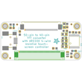
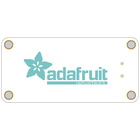
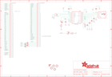
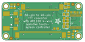
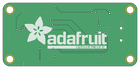

Contents
========

* [PRA3305 > Adafruit 50pin to 40pin TFT with AR1100 Adapter PCB](#pra3305--adafruit-50pin-to-40pin-tft-with-ar1100-adapter-pcb)
	* [Schematic](#schematic)
	* [PCB](#pcb)
	* [Interactive BOM](#interactive-bom)
	* [OOMP Parts](#oomp-parts)
	* [Images](#images)
	* [Tags](#tags)
  
![][im]
# PRA3305 > Adafruit 50pin to 40pin TFT with AR1100 Adapter PCB

- ID: PROJ-ADAF-3305-STAN-01
- Hex ID: PRA3305
- Name: Adafruit
- Description: Adafruit
- Long Link: [http://oom.lt/PROJ-ADAF-3305-STAN-01](http://oom.lt/PROJ-ADAF-3305-STAN-01)
- Short Link: [http://oom.lt/PRA3305](http://oom.lt/PRA3305)

## Schematic
  

## PCB
  

## Interactive BOM

- Interactive BOM page: [ibom.html](https://htmlpreview.github.io/?https://github.com/oomlout/oomlout_OOMP_projects/blob/main/PROJ-ADAF-3305-STAN-01/kicad/bom/ibom.html)

## OOMP Parts
  

|OOMP Parts|
| :---: |
|[CAPC-0805-X-UF10-V10  SMD (0805) 10 uF Capacitor (Ceramic) 10v  C1, C3](https://github.com/oomlout/oomlout_OOMP_parts/tree/main/CAPC-0805-X-UF10-V10/)|
|[CAPC-0805-X-NF100-V50  SMD (0805) 100 nF Capacitor (Ceramic) 50v  C2, C5, C7](https://github.com/oomlout/oomlout_OOMP_parts/tree/main/CAPC-0805-X-NF100-V50/)|
|CAPC-0805-X-UNMATCHED-01 C4, C6|
|FERB-0805-X-UNMATCHED-01 FB1, FB2, FB3, FB4|
|UNMATCHED-UNMATCHED-X-UNMATCHED-01 IC1, J1, J2, X1, Y1|
|[LEDS-0805-G-STAN-01  SMD (0805) Green LED  LED1](https://github.com/oomlout/oomlout_OOMP_parts/tree/main/LEDS-0805-G-STAN-01/)|
|[LEDS-0805-R-STAN-01  SMD (0805) Red LED  LED2](https://github.com/oomlout/oomlout_OOMP_parts/tree/main/LEDS-0805-R-STAN-01/)|
|[RESE-0805-X-O203-01  SMD (0805) 20k Ohm Resistor  R1](https://github.com/oomlout/oomlout_OOMP_parts/tree/main/RESE-0805-X-O203-01/)|
|[RESE-0805-X-O102-01  SMD (0805) 1k Ohm Resistor  R2, R3](https://github.com/oomlout/oomlout_OOMP_parts/tree/main/RESE-0805-X-O102-01/)|

## Images
  
  

|bominteractivefront|bominteractiveback|kicadPcb3d|kicadPcb3dFront|kicadPcb3dBack|eagleImage|eagleSchemImage|pcbdraw|pcbdrawback|
| :---: | :---: | :---: | :---: | :---: | :---: | :---: | :---: | :---: |
||||||||||

## Tags

- hexID: PRA3305
- oompType: PROJ
- oompSize: ADAF
- oompColor: 3305
- oompDesc: STAN
- oompIndex: 01
- oompName: Adafruit 50pin to 40pin TFT with AR1100 Adapter PCB
- sources: All source files from https://github.com/adafruit/Adafruit-50pin-to-40pin-TFT-with-AR1100-Adapter-PCB (source licence details in srcLicense.md)
- linkBuyPage: http://www.adafruit.com/products/3305
- oompID: PROJ-ADAF-3305-STAN-01
- oompParts: C1,CAPC-0805-X-UF10-V10
- oompParts: C2,CAPC-0805-X-NF100-V50
- oompParts: C3,CAPC-0805-X-UF10-V10
- oompParts: C4,CAPC-0805-X-UNMATCHED-01
- oompParts: C5,CAPC-0805-X-NF100-V50
- oompParts: C6,CAPC-0805-X-UNMATCHED-01
- oompParts: C7,CAPC-0805-X-NF100-V50
- oompParts: FB1,FERB-0805-X-UNMATCHED-01
- oompParts: FB2,FERB-0805-X-UNMATCHED-01
- oompParts: FB3,FERB-0805-X-UNMATCHED-01
- oompParts: FB4,FERB-0805-X-UNMATCHED-01
- oompParts: IC1,UNMATCHED-UNMATCHED-X-UNMATCHED-01
- oompParts: J1,UNMATCHED-UNMATCHED-X-UNMATCHED-01
- oompParts: J2,UNMATCHED-UNMATCHED-X-UNMATCHED-01
- oompParts: LED1,LEDS-0805-G-STAN-01
- oompParts: LED2,LEDS-0805-R-STAN-01
- oompParts: R1,RESE-0805-X-O203-01
- oompParts: R2,RESE-0805-X-O102-01
- oompParts: R3,RESE-0805-X-O102-01
- oompParts: X1,UNMATCHED-UNMATCHED-X-UNMATCHED-01
- oompParts: Y1,UNMATCHED-UNMATCHED-X-UNMATCHED-01
- rawParts: C1,10uF,CAP_CERAMIC_0805MP,_0805MP,Ceramic Capacitors,,
- rawParts: C2,0.1uF,CAP_CERAMIC_0805MP,_0805MP,Ceramic Capacitors,,
- rawParts: C3,10uF,CAP_CERAMIC_0805MP,_0805MP,Ceramic Capacitors,,
- rawParts: C4,0.01uF,CAP_CERAMIC_0805MP,_0805MP,Ceramic Capacitors,,
- rawParts: C5,dnp,CAP_CERAMIC_0805MP,_0805MP,Ceramic Capacitors,,
- rawParts: C6,0.01uF,CAP_CERAMIC_0805MP,_0805MP,Ceramic Capacitors,,
- rawParts: C7,dnp,CAP_CERAMIC_0805MP,_0805MP,Ceramic Capacitors,,
- rawParts: FB1,Ferrite,FERRITE_0805,_0805,Ferrite Bead,,
- rawParts: FB2,Ferrite,FERRITE_0805,_0805,Ferrite Bead,,
- rawParts: FB3,Ferrite,FERRITE_0805,_0805,Ferrite Bead,,
- rawParts: FB4,Ferrite,FERRITE_0805,_0805,Ferrite Bead,,
- rawParts: FID1,FIDUCIAL,FIDUCIAL,FIDUCIAL_1MM,Fiducial Alignment Points,EXCLUDE,
- rawParts: FID2,FIDUCIAL,FIDUCIAL,FIDUCIAL_1MM,Fiducial Alignment Points,EXCLUDE,
- rawParts: FID3,FIDUCIAL,FIDUCIAL,FIDUCIAL_1MM,Fiducial Alignment Points,EXCLUDE,
- rawParts: IC1,AR1100_SSOP,AR1100_SSOP,TSSOP20-5.3MMBODY,,,
- rawParts: J1,XF2-40-RARBT,XF2-40-RARBT,4-1734839-0,OMRON FPC Connector,,
- rawParts: J2,XF2-50-REV,XF2-50-REV,5-1734839-0-REV,,,
- rawParts: LED1,Green,LED0805_NOOUTLINE,CHIPLED_0805_NOOUTLINE,LED,,
- rawParts: LED2,red,LED0805_NOOUTLINE,CHIPLED_0805_NOOUTLINE,LED,,
- rawParts: R1,20K,RESISTOR_0805MP,_0805MP,Resistors,,
- rawParts: R2,1K,RESISTOR_0805MP,_0805MP,Resistors,,
- rawParts: R3,1K,RESISTOR_0805MP,_0805MP,Resistors,,
- rawParts: U$11,MOUNTINGHOLE2.5,MOUNTINGHOLE2.5,MOUNTINGHOLE_2.5_PLATED,Mounting Hole,EXCLUDE,
- rawParts: U$14,MOUNTINGHOLE2.5,MOUNTINGHOLE2.5,MOUNTINGHOLE_2.5_PLATED,Mounting Hole,EXCLUDE,
- rawParts: U$15,MOUNTINGHOLE2.5,MOUNTINGHOLE2.5,MOUNTINGHOLE_2.5_PLATED,Mounting Hole,EXCLUDE,
- rawParts: U$16,MOUNTINGHOLE2.5,MOUNTINGHOLE2.5,MOUNTINGHOLE_2.5_PLATED,Mounting Hole,EXCLUDE,
- rawParts: X1,,USBMINIBLARGE,USB-MINIB_LARGER,USB Connectors,,
- rawParts: Y1,12MHz,RESONATORSMD,RESONATOR-SMD,Resonator,,

[im]: kicadPcb3d_450.png
