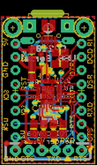
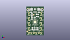
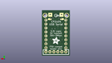
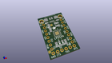

Contents
========

* [PROJ-ADAF-3309-STAN-01>Adafruit CP2104 Friend PCB](#proj-adaf-3309-stan-01adafruit-cp2104-friend-pcb)
	* [Images](#images)
	* [Interactive BOM](#interactive-bom)
	* [Tags](#tags)
  
![][im]
# PROJ-ADAF-3309-STAN-01>Adafruit CP2104 Friend PCB

- ID: PROJ-ADAF-3309-STAN-01
- Hex ID: PRA3309
- Name: Adafruit CP2104 Friend PCB
- Description: 

## Images
  
  

|eagleImage|kicadPcb3dFront|kicadPcb3dBack|kicadPcb3d|
| :---: | :---: | :---: | :---: |
|||||

## Interactive BOM

- Interactive BOM page: [ibom.html](kicad/bom/ibom.html)

## Tags

- hexID: PRA3309
- oompType: PROJ
- oompSize: ADAF
- oompColor: 3309
- oompDesc: STAN
- oompIndex: 01
- oompName: Adafruit CP2104 Friend PCB
- sources: All source files from https://github.com/adafruit/Adafruit-CP2104-Friend-PCB (source licence details in srcLicense.md)
- linkBuyPage: http://www.adafruit.com/products/3309
- oompPart: CAPC-0805-X-UF10-V25, C1, 11.176, 19.049999999999997, 180
- oompPart: CAPC-0805-X-UF10-V25, C2, 11.176, 21.209, 0
- oompPart: CAPC-0805-X-UF10-V25, C3, 5.715, 17.399, 270
- oompPart: CAPC-0805-X-NF100-V50, C4, 5.715, 20.827999999999996, 270
- oompPart: UNMATCHED-UNMATCHED-X-UNMATCHED-01, D1, 9.906, 6.604, 0
- oompPart: UNMATCHED-UNMATCHED-X-UNMATCHED-01, D2, 8.001, 6.604, 0
- oompPart: SKIP-UNMATCHED-X-UNMATCHED-01, FID1, 0.889, 3.937, 0
- oompPart: SKIP-UNMATCHED-X-UNMATCHED-01, FID2, 7.492999999999999, 20.827999999999996, 0
- oompPart: UNMATCHED-UNMATCHED-X-UNMATCHED-01, JP1, 8.889999999999999, 2.54, 0
- oompPart: UNMATCHED-UNMATCHED-X-UNMATCHED-01, JP2, 15.239999999999998, 13.97, 90
- oompPart: UNMATCHED-UNMATCHED-X-UNMATCHED-01, JP4, 2.54, 13.97, 270
- oompPart: RESE-0805-X-O102-01, R1, 11.684, 6.604, 90
- oompPart: RESE-0805-X-O102-01, R2, 6.095999999999999, 6.604, 90
- oompPart: SKIP-UNMATCHED-X-UNMATCHED-01, U$18, 15.748, 25.907999999999998, 0
- oompPart: SKIP-UNMATCHED-X-UNMATCHED-01, U$19, 2.032, 25.907999999999998, 0
- oompPart: UNMATCHED-UNMATCHED-X-UNMATCHED-01, U1, 8.889999999999999, 13.716, 270
- oompPart: UNMATCHED-UNMATCHED-X-UNMATCHED-01, X1, 8.889999999999999, 24.383999999999997, 180
- rawPart: 

[im]: kicadPcb3d_450.png
