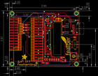
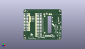
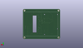
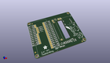

Contents
========

* [PROJ-ADAF-3315-STAN-01>Adafruit 2.4 TFT FeatherWing PCB](#proj-adaf-3315-stan-01adafruit-24-tft-featherwing-pcb)
	* [Images](#images)
	* [Interactive BOM](#interactive-bom)
	* [OOMP Parts](#oomp-parts)
	* [Tags](#tags)
  
![][im]
# PROJ-ADAF-3315-STAN-01>Adafruit 2.4 TFT FeatherWing PCB

- ID: PROJ-ADAF-3315-STAN-01
- Hex ID: PRA3315
- Name: Adafruit 2.4 TFT FeatherWing PCB
- Description: 

## Images
  
  

|eagleImage|kicadPcb3dFront|kicadPcb3dBack|kicadPcb3d|
| :---: | :---: | :---: | :---: |
|||||

## Interactive BOM

- Interactive BOM page: [ibom.html](kicad/bom/ibom.html)

## OOMP Parts
  

|OOMP Parts|
| :---: |
|CAPE-0805-X-NF100-01, C1, 51.943, 5.842, 270,C1, 0.1uF, 0805-NO, microbuilder, (2.045, 0.23), R270|
|CAPE-0805-X-UNMATCHED-01, C3, 60.706, 27.686, 0,C3, 10uF, 0805-NO, microbuilder, (2.39, 1.09), R0|
|CAPE-0805-X-NF100-01, C4, 37.592, 6.604, 90,C4, 0.1uF, 0805-NO, microbuilder, (1.48, 0.26), R90|
|CAPE-0805-X-UNMATCHED-01, C6, 31.369, 3.6829999999999994, 180,C6, 10uF, 0805-NO, microbuilder, (1.235, 0.145), R180|
|UNMATCHED-UNMATCHED-X-UNMATCHED-01, IC5, 48.641, 5.715, 90,IC5, APX803, SOT23, adafruit, (1.915, 0.225), R90|
|UNMATCHED-UNMATCHED-X-UNMATCHED-01, MS2, 27.051, 0.0, 90,MS2, FEATHERWING_SMTDUAL, FEATHERWING_SMT2, microbuilder, (1.065, 0), R90|
|UNMATCHED-UNMATCHED-X-UNMATCHED-01, Q4, 34.29, 6.858, 0,Q4, BSS138, SOT23-WIDE, microbuilder, (1.35, 0.27), R0|
|RESE-0805-X-UNMATCHED-01, R1, 39.624, 6.604, 90,R1, 10, 0805-NO, microbuilder, (1.56, 0.26), R90|
|RESE-0805-X-UNMATCHED-01, R2, 41.65599999999999, 6.604, 90,R2, 10, 0805-NO, microbuilder, (1.64, 0.26), R90|
|RESE-0805-X-UNMATCHED-01, R3, 43.687999999999995, 6.604, 90,R3, 10, 0805-NO, microbuilder, (1.72, 0.26), R90|
|RESE-0805-X-UNMATCHED-01, R4, 45.72, 6.604, 90,R4, 10, 0805-NO, microbuilder, (1.8, 0.26), R90|
|RESE-0805-X-O104-01, R5, 15.493999999999998, 34.29, 0,R5, 100K, 0805-NO, microbuilder, (0.61, 1.35), R0|
|RESE-0805-X-O104-01, R6, 15.493999999999998, 39.37, 0,R6, 100K, 0805-NO, microbuilder, (0.61, 1.55), R0|
|<table><tr><td></td><td> R7</td><td>[RESE-0805-X-O103-01 SMD (0805) 10k Ohm Resistor](https://github.com/oomlout/oomlout_OOMP_parts/tree/main/RESE-0805-X-O103-01/)</td><td>[R85103](https://github.com/oomlout/oomlout_OOMP_parts/tree/main/RESE-0805-X-O103-01/)</td></tr></table>|
|RESE-0805-X-O104-01, R8, 15.493999999999998, 36.83, 0,R8, 100K, 0805-NO, microbuilder, (0.61, 1.45), R0|
|RESE-0805-X-UNMATCHED-01, R12, 34.925, 3.429, 180,R12, 3.9K, 0805-NO, microbuilder, (1.375, 0.135), R180|
|UNMATCHED-UNMATCHED-X-UNMATCHED-01, SJ1, 11.176, 34.29, 0,SJ1, SOLDERJUMPER_CLOSEDWIRE, microbuilder, (0.44, 1.35), R0|
|UNMATCHED-UNMATCHED-X-UNMATCHED-01, SJ2, 11.176, 36.83, 0,SJ2, SOLDERJUMPER_CLOSEDWIRE, microbuilder, (0.44, 1.45), R0|
|UNMATCHED-UNMATCHED-X-UNMATCHED-01, SJ3, 11.176, 39.37, 0,SJ3, SOLDERJUMPER_CLOSEDWIRE, microbuilder, (0.44, 1.55), R0|
|UNMATCHED-UNMATCHED-X-UNMATCHED-01, SJ4, 11.176, 31.75, 0,SJ4, SOLDERJUMPER_CLOSEDWIRE, microbuilder, (0.44, 1.25), R0|
|UNMATCHED-UNMATCHED-X-UNMATCHED-01, SW1, 59.81699999999999, 9.779, 270,SW1, EVQQ2, EVQ-Q2_SMALLER, microbuilder, (2.355, 0.385), R270|
|ERROR, SW2 Slide Switch, 0, 0, 0,SW2, Slide, Switch, EG1390, microbuilder, (2.39, 0.82), R90|
|UNMATCHED-UNMATCHED-X-UNMATCHED-01, TP1, 35.306, 43.687999999999995, 0,TP1, TESTPOINT_PAD_2MM, microbuilder, (1.39, 1.72), R0|
|UNMATCHED-UNMATCHED-X-UNMATCHED-01, TP2, 44.196, 43.687999999999995, 0,TP2, TESTPOINT_PAD_2MM, microbuilder, (1.74, 1.72), R0|
|UNMATCHED-UNMATCHED-X-UNMATCHED-01, TP3, 47.244, 43.687999999999995, 0,TP3, TESTPOINT_PAD_2MM, microbuilder, (1.86, 1.72), R0|
|UNMATCHED-UNMATCHED-X-UNMATCHED-01, TP4, 21.59, 6.35, 0,TP4, TESTPOINT_PAD_2MM, microbuilder, (0.85, 0.25), R0|
|UNMATCHED-UNMATCHED-X-UNMATCHED-01, TP5, 21.59, 8.889999999999999, 0,TP5, TESTPOINT_PAD_2MM, microbuilder, (0.85, 0.35), R0|
|UNMATCHED-UNMATCHED-X-UNMATCHED-01, TP6, 21.59, 11.43, 0,TP6, TESTPOINT_PAD_2MM, microbuilder, (0.85, 0.45), R0|
|UNMATCHED-UNMATCHED-X-UNMATCHED-01, TP7, 21.59, 13.97, 180,TP7, TESTPOINT_PAD_2MM, microbuilder, (0.85, 0.55), R180|
|UNMATCHED-UNMATCHED-X-UNMATCHED-01, TP8, 21.59, 16.509999999999998, 180,TP8, TESTPOINT_PAD_2MM, microbuilder, (0.85, 0.65), R180|
|UNMATCHED-UNMATCHED-X-UNMATCHED-01, TP9, 21.59, 19.049999999999997, 180,TP9, TESTPOINT_PAD_2MM, microbuilder, (0.85, 0.75), R180|
|UNMATCHED-UNMATCHED-X-UNMATCHED-01, TP10, 9.652, 19.049999999999997, 180,TP10, TESTPOINT_PAD_2MM, microbuilder, (0.38, 0.75), R180|
|UNMATCHED-UNMATCHED-X-UNMATCHED-01, TP11, 21.59, 21.59, 180,TP11, TESTPOINT_PAD_2MM, microbuilder, (0.85, 0.85), R180|
|UNMATCHED-UNMATCHED-X-UNMATCHED-01, TP12, 21.59, 24.13, 180,TP12, TESTPOINT_PAD_2MM, microbuilder, (0.85, 0.95), R180|
|UNMATCHED-UNMATCHED-X-UNMATCHED-01, TP13, 21.59, 26.669999999999998, 180,TP13, TESTPOINT_PAD_2MM, microbuilder, (0.85, 1.05), R180|
|UNMATCHED-UNMATCHED-X-UNMATCHED-01, TP14, 21.59, 29.209999999999997, 180,TP14, TESTPOINT_PAD_2MM, microbuilder, (0.85, 1.15), R180|
|UNMATCHED-UNMATCHED-X-UNMATCHED-01, TP15, 21.59, 31.75, 180,TP15, TESTPOINT_PAD_2MM, microbuilder, (0.85, 1.25), R180|
|UNMATCHED-UNMATCHED-X-UNMATCHED-01, TP16, 21.59, 34.29, 180,TP16, TESTPOINT_PAD_2MM, microbuilder, (0.85, 1.35), R180|
|UNMATCHED-UNMATCHED-X-UNMATCHED-01, TP17, 21.59, 36.83, 180,TP17, TESTPOINT_PAD_2MM, microbuilder, (0.85, 1.45), R180|
|UNMATCHED-UNMATCHED-X-UNMATCHED-01, TP18, 21.59, 39.37, 180,TP18, TESTPOINT_PAD_2MM, microbuilder, (0.85, 1.55), R180|
|UNMATCHED-UNMATCHED-X-UNMATCHED-01, TP19, 21.59, 41.91, 180,TP19, TESTPOINT_PAD_2MM, microbuilder, (0.85, 1.65), R180|
|UNMATCHED-UNMATCHED-X-UNMATCHED-01, TP20, 21.59, 44.449999999999996, 180,TP20, TESTPOINT_PAD_2MM, microbuilder, (0.85, 1.75), R180|
|UNMATCHED-UNMATCHED-X-UNMATCHED-01, TP21, 9.652, 16.509999999999998, 180,TP21, TESTPOINT_PAD_2MM, microbuilder, (0.38, 0.65), R180|
|UNMATCHED-UNMATCHED-X-UNMATCHED-01, TP22, 9.652, 21.59, 180,TP22, TESTPOINT_PAD_2MM, microbuilder, (0.38, 0.85), R180|
|UNMATCHED-UNMATCHED-X-UNMATCHED-01, TP23, 9.652, 24.13, 180,TP23, TESTPOINT_PAD_2MM, microbuilder, (0.38, 0.95), R180|
|UNMATCHED-UNMATCHED-X-UNMATCHED-01, TP24, 9.652, 26.669999999999998, 180,TP24, TESTPOINT_PAD_2MM, microbuilder, (0.38, 1.05), R180|
|UNMATCHED-UNMATCHED-X-UNMATCHED-01, TP25, 9.652, 29.209999999999997, 180,TP25, TESTPOINT_PAD_2MM, microbuilder, (0.38, 1.15), R180|
|UNMATCHED-UNMATCHED-X-UNMATCHED-01, TP26, 9.652, 41.91, 180,TP26, TESTPOINT_PAD_2MM, microbuilder, (0.38, 1.65), R180|
|UNMATCHED-UNMATCHED-X-UNMATCHED-01, TP27, 9.652, 44.449999999999996, 180,TP27, TESTPOINT_PAD_2MM, microbuilder, (0.38, 1.75), R180|
|UNMATCHED-UNMATCHED-X-UNMATCHED-01, U2, 39.49699999999999, 44.958, 180,U2, STMPE811, QFN16_3MM, microbuilder, (1.555, 1.77), R180|
|ERROR, X1 MicroSD Holder, 0, 0, 0,X1, MicroSD, Holder, MICROSD, microbuilder, (1.925, 1.18), R90|

## Tags

- hexID: PRA3315
- oompType: PROJ
- oompSize: ADAF
- oompColor: 3315
- oompDesc: STAN
- oompIndex: 01
- oompName: Adafruit 2.4 TFT FeatherWing PCB
- sources: All source files from https://github.com/adafruit/Adafruit-2.4-TFT-FeatherWing-PCB (source licence details in srcLicense.md)
- linkBuyPage: http://www.adafruit.com/products/3315
- oompPart: CAPE-0805-X-NF100-01, C1, 51.943, 5.842, 270
- oompPart: CAPE-0805-X-UNMATCHED-01, C3, 60.706, 27.686, 0
- oompPart: CAPE-0805-X-NF100-01, C4, 37.592, 6.604, 90
- oompPart: CAPE-0805-X-UNMATCHED-01, C6, 31.369, 3.6829999999999994, 180
- oompPart: SKIP-UNMATCHED-X-UNMATCHED-01, FID1, 6.604, 48.513999999999996, 0
- oompPart: SKIP-UNMATCHED-X-UNMATCHED-01, FID2, 58.674, 1.27, 0
- oompPart: SKIP-UNMATCHED-X-UNMATCHED-01, FID3, 1.778, 7.112, 0
- oompPart: UNMATCHED-UNMATCHED-X-UNMATCHED-01, IC5, 48.641, 5.715, 90
- oompPart: UNMATCHED-UNMATCHED-X-UNMATCHED-01, MS2, 27.051, 0.0, 90
- oompPart: UNMATCHED-UNMATCHED-X-UNMATCHED-01, Q4, 34.29, 6.858, 0
- oompPart: RESE-0805-X-UNMATCHED-01, R1, 39.624, 6.604, 90
- oompPart: RESE-0805-X-UNMATCHED-01, R2, 41.65599999999999, 6.604, 90
- oompPart: RESE-0805-X-UNMATCHED-01, R3, 43.687999999999995, 6.604, 90
- oompPart: RESE-0805-X-UNMATCHED-01, R4, 45.72, 6.604, 90
- oompPart: RESE-0805-X-O104-01, R5, 15.493999999999998, 34.29, 0
- oompPart: RESE-0805-X-O104-01, R6, 15.493999999999998, 39.37, 0
- oompPart: RESE-0805-X-O103-01, R7, 48.513999999999996, 8.254999999999999, 180
- oompPart: RESE-0805-X-O104-01, R8, 15.493999999999998, 36.83, 0
- oompPart: RESE-0805-X-UNMATCHED-01, R12, 34.925, 3.429, 180
- oompPart: UNMATCHED-UNMATCHED-X-UNMATCHED-01, SJ1, 11.176, 34.29, 0
- oompPart: UNMATCHED-UNMATCHED-X-UNMATCHED-01, SJ2, 11.176, 36.83, 0
- oompPart: UNMATCHED-UNMATCHED-X-UNMATCHED-01, SJ3, 11.176, 39.37, 0
- oompPart: UNMATCHED-UNMATCHED-X-UNMATCHED-01, SJ4, 11.176, 31.75, 0
- oompPart: UNMATCHED-UNMATCHED-X-UNMATCHED-01, SW1, 59.81699999999999, 9.779, 270
- oompPart: ERROR, SW2 Slide Switch, 0, 0, 0
- oompPart: UNMATCHED-UNMATCHED-X-UNMATCHED-01, TP1, 35.306, 43.687999999999995, 0
- oompPart: UNMATCHED-UNMATCHED-X-UNMATCHED-01, TP2, 44.196, 43.687999999999995, 0
- oompPart: UNMATCHED-UNMATCHED-X-UNMATCHED-01, TP3, 47.244, 43.687999999999995, 0
- oompPart: UNMATCHED-UNMATCHED-X-UNMATCHED-01, TP4, 21.59, 6.35, 0
- oompPart: UNMATCHED-UNMATCHED-X-UNMATCHED-01, TP5, 21.59, 8.889999999999999, 0
- oompPart: UNMATCHED-UNMATCHED-X-UNMATCHED-01, TP6, 21.59, 11.43, 0
- oompPart: UNMATCHED-UNMATCHED-X-UNMATCHED-01, TP7, 21.59, 13.97, 180
- oompPart: UNMATCHED-UNMATCHED-X-UNMATCHED-01, TP8, 21.59, 16.509999999999998, 180
- oompPart: UNMATCHED-UNMATCHED-X-UNMATCHED-01, TP9, 21.59, 19.049999999999997, 180
- oompPart: UNMATCHED-UNMATCHED-X-UNMATCHED-01, TP10, 9.652, 19.049999999999997, 180
- oompPart: UNMATCHED-UNMATCHED-X-UNMATCHED-01, TP11, 21.59, 21.59, 180
- oompPart: UNMATCHED-UNMATCHED-X-UNMATCHED-01, TP12, 21.59, 24.13, 180
- oompPart: UNMATCHED-UNMATCHED-X-UNMATCHED-01, TP13, 21.59, 26.669999999999998, 180
- oompPart: UNMATCHED-UNMATCHED-X-UNMATCHED-01, TP14, 21.59, 29.209999999999997, 180
- oompPart: UNMATCHED-UNMATCHED-X-UNMATCHED-01, TP15, 21.59, 31.75, 180
- oompPart: UNMATCHED-UNMATCHED-X-UNMATCHED-01, TP16, 21.59, 34.29, 180
- oompPart: UNMATCHED-UNMATCHED-X-UNMATCHED-01, TP17, 21.59, 36.83, 180
- oompPart: UNMATCHED-UNMATCHED-X-UNMATCHED-01, TP18, 21.59, 39.37, 180
- oompPart: UNMATCHED-UNMATCHED-X-UNMATCHED-01, TP19, 21.59, 41.91, 180
- oompPart: UNMATCHED-UNMATCHED-X-UNMATCHED-01, TP20, 21.59, 44.449999999999996, 180
- oompPart: UNMATCHED-UNMATCHED-X-UNMATCHED-01, TP21, 9.652, 16.509999999999998, 180
- oompPart: UNMATCHED-UNMATCHED-X-UNMATCHED-01, TP22, 9.652, 21.59, 180
- oompPart: UNMATCHED-UNMATCHED-X-UNMATCHED-01, TP23, 9.652, 24.13, 180
- oompPart: UNMATCHED-UNMATCHED-X-UNMATCHED-01, TP24, 9.652, 26.669999999999998, 180
- oompPart: UNMATCHED-UNMATCHED-X-UNMATCHED-01, TP25, 9.652, 29.209999999999997, 180
- oompPart: UNMATCHED-UNMATCHED-X-UNMATCHED-01, TP26, 9.652, 41.91, 180
- oompPart: UNMATCHED-UNMATCHED-X-UNMATCHED-01, TP27, 9.652, 44.449999999999996, 180
- oompPart: SKIP-UNMATCHED-X-UNMATCHED-01, U$9, 2.54, 2.54, 0
- oompPart: SKIP-UNMATCHED-X-UNMATCHED-01, U$10, 61.722, 26.288999999999998, M270
- oompPart: SKIP-UNMATCHED-X-UNMATCHED-01, U$11, 2.54, 50.038, 0
- oompPart: SKIP-UNMATCHED-X-UNMATCHED-01, U$15, 62.230000000000004, 2.54, 0
- oompPart: SKIP-UNMATCHED-X-UNMATCHED-01, U$17, 62.230000000000004, 50.038, 0
- oompPart: UNMATCHED-UNMATCHED-X-UNMATCHED-01, U2, 39.49699999999999, 44.958, 180
- oompPart: ERROR, X1 MicroSD Holder, 0, 0, 0
- rawPart: C1, 0.1uF, 0805-NO, microbuilder, (2.045, 0.23), R270
- rawPart: C3, 10uF, 0805-NO, microbuilder, (2.39, 1.09), R0
- rawPart: C4, 0.1uF, 0805-NO, microbuilder, (1.48, 0.26), R90
- rawPart: C6, 10uF, 0805-NO, microbuilder, (1.235, 0.145), R180
- rawPart: FID1, FIDUCIAL, FIDUCIAL_1MM, microbuilder, (0.26, 1.91), R0
- rawPart: FID2, FIDUCIAL, FIDUCIAL_1MM, microbuilder, (2.31, 0.05), R0
- rawPart: FID3, FIDUCIAL, FIDUCIAL_1MM, microbuilder, (0.07, 0.28), R0
- rawPart: IC5, APX803, SOT23, adafruit, (1.915, 0.225), R90
- rawPart: MS2, FEATHERWING_SMTDUAL, FEATHERWING_SMT2, microbuilder, (1.065, 0), R90
- rawPart: Q4, BSS138, SOT23-WIDE, microbuilder, (1.35, 0.27), R0
- rawPart: R1, 10, 0805-NO, microbuilder, (1.56, 0.26), R90
- rawPart: R2, 10, 0805-NO, microbuilder, (1.64, 0.26), R90
- rawPart: R3, 10, 0805-NO, microbuilder, (1.72, 0.26), R90
- rawPart: R4, 10, 0805-NO, microbuilder, (1.8, 0.26), R90
- rawPart: R5, 100K, 0805-NO, microbuilder, (0.61, 1.35), R0
- rawPart: R6, 100K, 0805-NO, microbuilder, (0.61, 1.55), R0
- rawPart: R7, 10K, 0805-NO, microbuilder, (1.91, 0.325), R180
- rawPart: R8, 100K, 0805-NO, microbuilder, (0.61, 1.45), R0
- rawPart: R12, 3.9K, 0805-NO, microbuilder, (1.375, 0.135), R180
- rawPart: SJ1, SOLDERJUMPER_CLOSEDWIRE, microbuilder, (0.44, 1.35), R0
- rawPart: SJ2, SOLDERJUMPER_CLOSEDWIRE, microbuilder, (0.44, 1.45), R0
- rawPart: SJ3, SOLDERJUMPER_CLOSEDWIRE, microbuilder, (0.44, 1.55), R0
- rawPart: SJ4, SOLDERJUMPER_CLOSEDWIRE, microbuilder, (0.44, 1.25), R0
- rawPart: SW1, EVQQ2, EVQ-Q2_SMALLER, microbuilder, (2.355, 0.385), R270
- rawPart: SW2, Slide, Switch, EG1390, microbuilder, (2.39, 0.82), R90
- rawPart: TP1, TESTPOINT_PAD_2MM, microbuilder, (1.39, 1.72), R0
- rawPart: TP2, TESTPOINT_PAD_2MM, microbuilder, (1.74, 1.72), R0
- rawPart: TP3, TESTPOINT_PAD_2MM, microbuilder, (1.86, 1.72), R0
- rawPart: TP4, TESTPOINT_PAD_2MM, microbuilder, (0.85, 0.25), R0
- rawPart: TP5, TESTPOINT_PAD_2MM, microbuilder, (0.85, 0.35), R0
- rawPart: TP6, TESTPOINT_PAD_2MM, microbuilder, (0.85, 0.45), R0
- rawPart: TP7, TESTPOINT_PAD_2MM, microbuilder, (0.85, 0.55), R180
- rawPart: TP8, TESTPOINT_PAD_2MM, microbuilder, (0.85, 0.65), R180
- rawPart: TP9, TESTPOINT_PAD_2MM, microbuilder, (0.85, 0.75), R180
- rawPart: TP10, TESTPOINT_PAD_2MM, microbuilder, (0.38, 0.75), R180
- rawPart: TP11, TESTPOINT_PAD_2MM, microbuilder, (0.85, 0.85), R180
- rawPart: TP12, TESTPOINT_PAD_2MM, microbuilder, (0.85, 0.95), R180
- rawPart: TP13, TESTPOINT_PAD_2MM, microbuilder, (0.85, 1.05), R180
- rawPart: TP14, TESTPOINT_PAD_2MM, microbuilder, (0.85, 1.15), R180
- rawPart: TP15, TESTPOINT_PAD_2MM, microbuilder, (0.85, 1.25), R180
- rawPart: TP16, TESTPOINT_PAD_2MM, microbuilder, (0.85, 1.35), R180
- rawPart: TP17, TESTPOINT_PAD_2MM, microbuilder, (0.85, 1.45), R180
- rawPart: TP18, TESTPOINT_PAD_2MM, microbuilder, (0.85, 1.55), R180
- rawPart: TP19, TESTPOINT_PAD_2MM, microbuilder, (0.85, 1.65), R180
- rawPart: TP20, TESTPOINT_PAD_2MM, microbuilder, (0.85, 1.75), R180
- rawPart: TP21, TESTPOINT_PAD_2MM, microbuilder, (0.38, 0.65), R180
- rawPart: TP22, TESTPOINT_PAD_2MM, microbuilder, (0.38, 0.85), R180
- rawPart: TP23, TESTPOINT_PAD_2MM, microbuilder, (0.38, 0.95), R180
- rawPart: TP24, TESTPOINT_PAD_2MM, microbuilder, (0.38, 1.05), R180
- rawPart: TP25, TESTPOINT_PAD_2MM, microbuilder, (0.38, 1.15), R180
- rawPart: TP26, TESTPOINT_PAD_2MM, microbuilder, (0.38, 1.65), R180
- rawPart: TP27, TESTPOINT_PAD_2MM, microbuilder, (0.38, 1.75), R180
- rawPart: U$9, MOUNTINGHOLE2.5, MOUNTINGHOLE_2.5_PLATED, microbuilder, (0.1, 0.1), R0
- rawPart: U$10, DISP_LCD_240X320_50PIN-2.4IN, TFT_2.4IN_240X320_50PIN, microbuilder, (2.43, 1.035), MR270
- rawPart: U$11, MOUNTINGHOLE2.5, MOUNTINGHOLE_2.5_PLATED, microbuilder, (0.1, 1.97), R0
- rawPart: U$15, MOUNTINGHOLE2.5, MOUNTINGHOLE_2.5_PLATED, microbuilder, (2.45, 0.1), R0
- rawPart: U$17, MOUNTINGHOLE2.5, MOUNTINGHOLE_2.5_PLATED, microbuilder, (2.45, 1.97), R0
- rawPart: U2, STMPE811, QFN16_3MM, microbuilder, (1.555, 1.77), R180
- rawPart: X1, MicroSD, Holder, MICROSD, microbuilder, (1.925, 1.18), R90

[im]: kicadPcb3d_450.png
