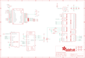

Contents
========

* [PRA3315 > Adafruit 2.4 TFT FeatherWing PCB](#pra3315--adafruit-24-tft-featherwing-pcb)
	* [Schematic](#schematic)
	* [PCB](#pcb)
	* [Interactive BOM](#interactive-bom)
	* [OOMP Parts](#oomp-parts)
	* [Images](#images)
	* [Tags](#tags)
  
![][im]
# PRA3315 > Adafruit 2.4 TFT FeatherWing PCB

- ID: PROJ-ADAF-3315-STAN-01
- Hex ID: PRA3315
- Name: Adafruit
- Description: Adafruit
- Long Link: [http://oom.lt/PROJ-ADAF-3315-STAN-01](http://oom.lt/PROJ-ADAF-3315-STAN-01)
- Short Link: [http://oom.lt/PRA3315](http://oom.lt/PRA3315)

## Schematic
  

## PCB
  

## Interactive BOM

- Interactive BOM page: [ibom.html](https://htmlpreview.github.io/?https://github.com/oomlout/oomlout_OOMP_projects/blob/main/PROJ-ADAF-3315-STAN-01/kicad/bom/ibom.html)

## OOMP Parts
  

|OOMP Parts|
| :---: |
|C1 C1,CAPC-0805-X-UF1D-01|
|[C3 CAPC-0805-X-UF10-V10 SMD (0805) 10 uF Capacitor (Ceramic) 10v](https://github.com/oomlout/oomlout_OOMP_parts/tree/main/CAPC-0805-X-UF10-V10/)|
|C4 C4,CAPC-0805-X-UF1D-01|
|[C6 CAPC-0805-X-UF10-V10 SMD (0805) 10 uF Capacitor (Ceramic) 10v](https://github.com/oomlout/oomlout_OOMP_parts/tree/main/CAPC-0805-X-UF10-V10/)|
|IC5 IC5,UNMATCHED-SO23-X-UNMATCHED-01|
|MS2 MS2,UNMATCHED-UNMATCHED-X-UNMATCHED-01|
|[Q4 MOSN-SO23-X-KBSS138-01 SMD (SOT-23) BSS138 N-Ch. MOSFET](https://github.com/oomlout/oomlout_OOMP_parts/tree/main/MOSN-SO23-X-KBSS138-01/)|
|R1 R1,RESE-0805-X-O100-01|
|R2 R2,RESE-0805-X-O100-01|
|R3 R3,RESE-0805-X-O100-01|
|R4 R4,RESE-0805-X-O100-01|
|R5 R5,RESE-0805-X-O1003-01|
|R6 R6,RESE-0805-X-O1003-01|
|[R7 RESE-0805-X-O103-01 SMD (0805) 10k Ohm Resistor](https://github.com/oomlout/oomlout_OOMP_parts/tree/main/RESE-0805-X-O103-01/)|
|R8 R8,RESE-0805-X-O1003-01|
|R12 R12,RESE-0805-X-O392-01|
|SW1 SW1,UNMATCHED-UNMATCHED-X-UNMATCHED-01|
|SW2 SW2,UNMATCHED-UNMATCHED-X-UNMATCHED-01|
|TP1 TP1,UNMATCHED-UNMATCHED-X-UNMATCHED-01|
|TP2 TP2,UNMATCHED-UNMATCHED-X-UNMATCHED-01|
|TP3 TP3,UNMATCHED-UNMATCHED-X-UNMATCHED-01|
|TP4 TP4,UNMATCHED-UNMATCHED-X-UNMATCHED-01|
|TP5 TP5,UNMATCHED-UNMATCHED-X-UNMATCHED-01|
|TP6 TP6,UNMATCHED-UNMATCHED-X-UNMATCHED-01|
|TP7 TP7,UNMATCHED-UNMATCHED-X-UNMATCHED-01|
|TP8 TP8,UNMATCHED-UNMATCHED-X-UNMATCHED-01|
|TP9 TP9,UNMATCHED-UNMATCHED-X-UNMATCHED-01|
|TP10 TP10,UNMATCHED-UNMATCHED-X-UNMATCHED-01|
|TP11 TP11,UNMATCHED-UNMATCHED-X-UNMATCHED-01|
|TP12 TP12,UNMATCHED-UNMATCHED-X-UNMATCHED-01|
|TP13 TP13,UNMATCHED-UNMATCHED-X-UNMATCHED-01|
|TP14 TP14,UNMATCHED-UNMATCHED-X-UNMATCHED-01|
|TP15 TP15,UNMATCHED-UNMATCHED-X-UNMATCHED-01|
|TP16 TP16,UNMATCHED-UNMATCHED-X-UNMATCHED-01|
|TP17 TP17,UNMATCHED-UNMATCHED-X-UNMATCHED-01|
|TP18 TP18,UNMATCHED-UNMATCHED-X-UNMATCHED-01|
|TP19 TP19,UNMATCHED-UNMATCHED-X-UNMATCHED-01|
|TP20 TP20,UNMATCHED-UNMATCHED-X-UNMATCHED-01|
|TP21 TP21,UNMATCHED-UNMATCHED-X-UNMATCHED-01|
|TP22 TP22,UNMATCHED-UNMATCHED-X-UNMATCHED-01|
|TP23 TP23,UNMATCHED-UNMATCHED-X-UNMATCHED-01|
|TP24 TP24,UNMATCHED-UNMATCHED-X-UNMATCHED-01|
|TP25 TP25,UNMATCHED-UNMATCHED-X-UNMATCHED-01|
|TP26 TP26,UNMATCHED-UNMATCHED-X-UNMATCHED-01|
|TP27 TP27,UNMATCHED-UNMATCHED-X-UNMATCHED-01|
|U$10 U$10,UNMATCHED-UNMATCHED-X-UNMATCHED-01|
|U2 U2,UNMATCHED-UNMATCHED-X-UNMATCHED-01|
|X1 X1,UNMATCHED-UNMATCHED-X-UNMATCHED-01|

## Images
  
  

|kicadPcb3d|kicadPcb3dFront|kicadPcb3dBack|eagleImage|eagleSchemImage|
| :---: | :---: | :---: | :---: | :---: |
||||||

## Tags

- hexID: PRA3315
- oompType: PROJ
- oompSize: ADAF
- oompColor: 3315
- oompDesc: STAN
- oompIndex: 01
- oompName: Adafruit 2.4 TFT FeatherWing PCB
- sources: All source files from https://github.com/adafruit/Adafruit-2.4-TFT-FeatherWing-PCB (source licence details in srcLicense.md)
- linkBuyPage: http://www.adafruit.com/products/3315
- oompID: PROJ-ADAF-3315-STAN-01
- oompParts: C1,CAPC-0805-X-UF1D-01
- oompParts: C3,CAPC-0805-X-UF10-V10
- oompParts: C4,CAPC-0805-X-UF1D-01
- oompParts: C6,CAPC-0805-X-UF10-V10
- oompParts: IC5,UNMATCHED-SO23-X-UNMATCHED-01
- oompParts: MS2,UNMATCHED-UNMATCHED-X-UNMATCHED-01
- oompParts: Q4,MOSN-SO23-X-KBSS138-01
- oompParts: R1,RESE-0805-X-O100-01
- oompParts: R2,RESE-0805-X-O100-01
- oompParts: R3,RESE-0805-X-O100-01
- oompParts: R4,RESE-0805-X-O100-01
- oompParts: R5,RESE-0805-X-O1003-01
- oompParts: R6,RESE-0805-X-O1003-01
- oompParts: R7,RESE-0805-X-O103-01
- oompParts: R8,RESE-0805-X-O1003-01
- oompParts: R12,RESE-0805-X-O392-01
- oompParts: SW1,UNMATCHED-UNMATCHED-X-UNMATCHED-01
- oompParts: SW2,UNMATCHED-UNMATCHED-X-UNMATCHED-01
- oompParts: TP1,UNMATCHED-UNMATCHED-X-UNMATCHED-01
- oompParts: TP2,UNMATCHED-UNMATCHED-X-UNMATCHED-01
- oompParts: TP3,UNMATCHED-UNMATCHED-X-UNMATCHED-01
- oompParts: TP4,UNMATCHED-UNMATCHED-X-UNMATCHED-01
- oompParts: TP5,UNMATCHED-UNMATCHED-X-UNMATCHED-01
- oompParts: TP6,UNMATCHED-UNMATCHED-X-UNMATCHED-01
- oompParts: TP7,UNMATCHED-UNMATCHED-X-UNMATCHED-01
- oompParts: TP8,UNMATCHED-UNMATCHED-X-UNMATCHED-01
- oompParts: TP9,UNMATCHED-UNMATCHED-X-UNMATCHED-01
- oompParts: TP10,UNMATCHED-UNMATCHED-X-UNMATCHED-01
- oompParts: TP11,UNMATCHED-UNMATCHED-X-UNMATCHED-01
- oompParts: TP12,UNMATCHED-UNMATCHED-X-UNMATCHED-01
- oompParts: TP13,UNMATCHED-UNMATCHED-X-UNMATCHED-01
- oompParts: TP14,UNMATCHED-UNMATCHED-X-UNMATCHED-01
- oompParts: TP15,UNMATCHED-UNMATCHED-X-UNMATCHED-01
- oompParts: TP16,UNMATCHED-UNMATCHED-X-UNMATCHED-01
- oompParts: TP17,UNMATCHED-UNMATCHED-X-UNMATCHED-01
- oompParts: TP18,UNMATCHED-UNMATCHED-X-UNMATCHED-01
- oompParts: TP19,UNMATCHED-UNMATCHED-X-UNMATCHED-01
- oompParts: TP20,UNMATCHED-UNMATCHED-X-UNMATCHED-01
- oompParts: TP21,UNMATCHED-UNMATCHED-X-UNMATCHED-01
- oompParts: TP22,UNMATCHED-UNMATCHED-X-UNMATCHED-01
- oompParts: TP23,UNMATCHED-UNMATCHED-X-UNMATCHED-01
- oompParts: TP24,UNMATCHED-UNMATCHED-X-UNMATCHED-01
- oompParts: TP25,UNMATCHED-UNMATCHED-X-UNMATCHED-01
- oompParts: TP26,UNMATCHED-UNMATCHED-X-UNMATCHED-01
- oompParts: TP27,UNMATCHED-UNMATCHED-X-UNMATCHED-01
- oompParts: U$10,UNMATCHED-UNMATCHED-X-UNMATCHED-01
- oompParts: U2,UNMATCHED-UNMATCHED-X-UNMATCHED-01
- oompParts: X1,UNMATCHED-UNMATCHED-X-UNMATCHED-01
- rawParts: C1,0.1uF,CAP_CERAMIC0805-NOOUTLINE,0805-NO,Ceramic Capacitors,,
- rawParts: C3,10uF,CAP_CERAMIC0805-NOOUTLINE,0805-NO,Ceramic Capacitors,,
- rawParts: C4,0.1uF,CAP_CERAMIC0805-NOOUTLINE,0805-NO,Ceramic Capacitors,,
- rawParts: C6,10uF,CAP_CERAMIC0805-NOOUTLINE,0805-NO,Ceramic Capacitors,,
- rawParts: FID1,FIDUCIAL,FIDUCIAL,FIDUCIAL_1MM,Fiducial Alignment Points,EXCLUDE,
- rawParts: FID2,FIDUCIAL,FIDUCIAL,FIDUCIAL_1MM,Fiducial Alignment Points,EXCLUDE,
- rawParts: FID3,FIDUCIAL,FIDUCIAL,FIDUCIAL_1MM,Fiducial Alignment Points,EXCLUDE,
- rawParts: IC5,APX803,AXP083-SAG,SOT23,,,
- rawParts: MS2,FEATHERWING_SMTDUAL,FEATHERWING_SMTDUAL,FEATHERWING_SMT2,,,
- rawParts: Q4,BSS138,MOSFET-NWIDE,SOT23-WIDE,N-Channel Mosfet,,
- rawParts: R1,10,RESISTOR0805_NOOUTLINE,0805-NO,Resistors,,
- rawParts: R2,10,RESISTOR0805_NOOUTLINE,0805-NO,Resistors,,
- rawParts: R3,10,RESISTOR0805_NOOUTLINE,0805-NO,Resistors,,
- rawParts: R4,10,RESISTOR0805_NOOUTLINE,0805-NO,Resistors,,
- rawParts: R5,100K,RESISTOR0805_NOOUTLINE,0805-NO,Resistors,,
- rawParts: R6,100K,RESISTOR0805_NOOUTLINE,0805-NO,Resistors,,
- rawParts: R7,10K,RESISTOR0805_NOOUTLINE,0805-NO,Resistors,,
- rawParts: R8,100K,RESISTOR0805_NOOUTLINE,0805-NO,Resistors,,
- rawParts: R12,3.9K,RESISTOR0805_NOOUTLINE,0805-NO,Resistors,,
- rawParts: SJ1,,SOLDERJUMPER_CLOSED,SOLDERJUMPER_CLOSEDWIRE,Solder Jumper - Closed,,
- rawParts: SJ2,,SOLDERJUMPER_CLOSED,SOLDERJUMPER_CLOSEDWIRE,Solder Jumper - Closed,,
- rawParts: SJ3,,SOLDERJUMPER_CLOSED,SOLDERJUMPER_CLOSEDWIRE,Solder Jumper - Closed,,
- rawParts: SJ4,,SOLDERJUMPER_CLOSED,SOLDERJUMPER_CLOSEDWIRE,Solder Jumper - Closed,,
- rawParts: SW1,EVQQ2,SWITCH_TACT_SMT_EVQQ2_SMALL,EVQ-Q2_SMALLER,SMT Tact Switches,,
- rawParts: SW2,Slide Switch,SWITCH_DPDTEG1390,EG1390,Switch - DPDT,,
- rawParts: TP1,,TESTPOINTPAD2MM,TESTPOINT_PAD_2MM,Test Point,,
- rawParts: TP2,,TESTPOINTPAD2MM,TESTPOINT_PAD_2MM,Test Point,,
- rawParts: TP3,,TESTPOINTPAD2MM,TESTPOINT_PAD_2MM,Test Point,,
- rawParts: TP4,,TESTPOINTPAD2MM,TESTPOINT_PAD_2MM,Test Point,,
- rawParts: TP5,,TESTPOINTPAD2MM,TESTPOINT_PAD_2MM,Test Point,,
- rawParts: TP6,,TESTPOINTPAD2MM,TESTPOINT_PAD_2MM,Test Point,,
- rawParts: TP7,,TESTPOINTPAD2MM,TESTPOINT_PAD_2MM,Test Point,,
- rawParts: TP8,,TESTPOINTPAD2MM,TESTPOINT_PAD_2MM,Test Point,,
- rawParts: TP9,,TESTPOINTPAD2MM,TESTPOINT_PAD_2MM,Test Point,,
- rawParts: TP10,,TESTPOINTPAD2MM,TESTPOINT_PAD_2MM,Test Point,,
- rawParts: TP11,,TESTPOINTPAD2MM,TESTPOINT_PAD_2MM,Test Point,,
- rawParts: TP12,,TESTPOINTPAD2MM,TESTPOINT_PAD_2MM,Test Point,,
- rawParts: TP13,,TESTPOINTPAD2MM,TESTPOINT_PAD_2MM,Test Point,,
- rawParts: TP14,,TESTPOINTPAD2MM,TESTPOINT_PAD_2MM,Test Point,,
- rawParts: TP15,,TESTPOINTPAD2MM,TESTPOINT_PAD_2MM,Test Point,,
- rawParts: TP16,,TESTPOINTPAD2MM,TESTPOINT_PAD_2MM,Test Point,,
- rawParts: TP17,,TESTPOINTPAD2MM,TESTPOINT_PAD_2MM,Test Point,,
- rawParts: TP18,,TESTPOINTPAD2MM,TESTPOINT_PAD_2MM,Test Point,,
- rawParts: TP19,,TESTPOINTPAD2MM,TESTPOINT_PAD_2MM,Test Point,,
- rawParts: TP20,,TESTPOINTPAD2MM,TESTPOINT_PAD_2MM,Test Point,,
- rawParts: TP21,,TESTPOINTPAD2MM,TESTPOINT_PAD_2MM,Test Point,,
- rawParts: TP22,,TESTPOINTPAD2MM,TESTPOINT_PAD_2MM,Test Point,,
- rawParts: TP23,,TESTPOINTPAD2MM,TESTPOINT_PAD_2MM,Test Point,,
- rawParts: TP24,,TESTPOINTPAD2MM,TESTPOINT_PAD_2MM,Test Point,,
- rawParts: TP25,,TESTPOINTPAD2MM,TESTPOINT_PAD_2MM,Test Point,,
- rawParts: TP26,,TESTPOINTPAD2MM,TESTPOINT_PAD_2MM,Test Point,,
- rawParts: TP27,,TESTPOINTPAD2MM,TESTPOINT_PAD_2MM,Test Point,,
- rawParts: U$9,MOUNTINGHOLE2.5,MOUNTINGHOLE2.5,MOUNTINGHOLE_2.5_PLATED,Mounting Hole,EXCLUDE,
- rawParts: U$10,DISP_LCD_240X320_50PIN-2.4IN,DISP_LCD_240X320_50PIN-2.4IN,TFT_2.4IN_240X320_50PIN,,,
- rawParts: U$11,MOUNTINGHOLE2.5,MOUNTINGHOLE2.5,MOUNTINGHOLE_2.5_PLATED,Mounting Hole,EXCLUDE,
- rawParts: U$15,MOUNTINGHOLE2.5,MOUNTINGHOLE2.5,MOUNTINGHOLE_2.5_PLATED,Mounting Hole,EXCLUDE,
- rawParts: U$17,MOUNTINGHOLE2.5,MOUNTINGHOLE2.5,MOUNTINGHOLE_2.5_PLATED,Mounting Hole,EXCLUDE,
- rawParts: U2,STMPE811,STMPE610,QFN16_3MM,STMPE610 - 12-Bit Touch Screen Controller,,
- rawParts: X1,MicroSD Holder,MICROSD,MICROSD,MicroSD/Transflash Card Holder with SPI pinout,,

[im]: kicadPcb3d_450.png
