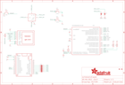

Contents
========

* [PRA3321 > Adafruit Mini TFT with Joystick Featherwing PCB](#pra3321--adafruit-mini-tft-with-joystick-featherwing-pcb)
	* [Schematic](#schematic)
	* [PCB](#pcb)
	* [Interactive BOM](#interactive-bom)
	* [OOMP Parts](#oomp-parts)
	* [Images](#images)
	* [Tags](#tags)
  
![][im]
# PRA3321 > Adafruit Mini TFT with Joystick Featherwing PCB

- ID: PROJ-ADAF-3321-STAN-01
- Hex ID: PRA3321
- Name: Adafruit
- Description: Adafruit
- Long Link: [http://oom.lt/PROJ-ADAF-3321-STAN-01](http://oom.lt/PROJ-ADAF-3321-STAN-01)
- Short Link: [http://oom.lt/PRA3321](http://oom.lt/PRA3321)

## Schematic
  

## PCB
  

## Interactive BOM

- Interactive BOM page: [ibom.html](https://htmlpreview.github.io/?https://github.com/oomlout/oomlout_OOMP_projects/blob/main/PROJ-ADAF-3321-STAN-01/kicad/bom/ibom.html)

## OOMP Parts
  

|OOMP Parts|
| :---: |
|UNMATCHED-UNMATCHED-X-UNMATCHED-01 IC2, MS1, SW4, U$2|
|[RESE-0603-X-O100-01  SMD (0603) 10 Ohm Resistor  R1](https://github.com/oomlout/oomlout_OOMP_parts/tree/main/RESE-0603-X-O100-01/)|
|[RESE-0603-X-O103-01  SMD (0603) 10k Ohm Resistor  R5, R6](https://github.com/oomlout/oomlout_OOMP_parts/tree/main/RESE-0603-X-O103-01/)|
|[RESE-0603-X-O102-01  SMD (0603) 1k Ohm Resistor  R7](https://github.com/oomlout/oomlout_OOMP_parts/tree/main/RESE-0603-X-O102-01/)|
|[BUTA-4628-X-STAN-01  SMD (4628) Pushbutton (Tactile)  SW1](https://github.com/oomlout/oomlout_OOMP_parts/tree/main/BUTA-4628-X-STAN-01/)|
|[BUTA-6060-X-STAN-01  SMD (6060) Pushbutton (Tactile)  SW2, SW3](https://github.com/oomlout/oomlout_OOMP_parts/tree/main/BUTA-6060-X-STAN-01/)|

## Images
  
  

|kicadPcb3d|kicadPcb3dFront|kicadPcb3dBack|eagleImage|eagleSchemImage|
| :---: | :---: | :---: | :---: | :---: |
||||||

## Tags

- hexID: PRA3321
- oompType: PROJ
- oompSize: ADAF
- oompColor: 3321
- oompDesc: STAN
- oompIndex: 01
- oompName: Adafruit Mini TFT with Joystick Featherwing PCB
- sources: All source files from https://github.com/adafruit/Adafruit-Mini-TFT-with-Joystick-Featherwing-PCB (source licence details in srcLicense.md)
- linkBuyPage: http://www.adafruit.com/products/3321
- oompID: PROJ-ADAF-3321-STAN-01
- oompParts: IC2,UNMATCHED-UNMATCHED-X-UNMATCHED-01
- oompParts: MS1,UNMATCHED-UNMATCHED-X-UNMATCHED-01
- oompParts: R1,RESE-0603-X-O100-01
- oompParts: R5,RESE-0603-X-O103-01
- oompParts: R6,RESE-0603-X-O103-01
- oompParts: R7,RESE-0603-X-O102-01
- oompParts: SW1,BUTA-4628-X-STAN-01
- oompParts: SW2,BUTA-6060-X-STAN-01
- oompParts: SW3,BUTA-6060-X-STAN-01
- oompParts: SW4,UNMATCHED-UNMATCHED-X-UNMATCHED-01
- oompParts: U$2,UNMATCHED-UNMATCHED-X-UNMATCHED-01
- rawParts: FID1,FIDUCIAL_1MM,FIDUCIAL_1MM,FIDUCIAL_1MM,Fiducial Alignment Points,EXCLUDE,
- rawParts: FID2,FIDUCIAL_1MM,FIDUCIAL_1MM,FIDUCIAL_1MM,Fiducial Alignment Points,EXCLUDE,
- rawParts: IC2,ATSAMD09D14A-MU,ATSAMD09D14A-MU,QFN24_4MM,,,
- rawParts: MS1,FEATHERWING,FEATHERWING,FEATHERWING,,,
- rawParts: R1,10,RESISTOR_0603_NOOUT,0603-NO,Resistors,,
- rawParts: R5,10K,RESISTOR_0603_NOOUT,0603-NO,Resistors,,
- rawParts: R6,10k,RESISTOR_0603_NOOUT,0603-NO,Resistors,,
- rawParts: R7,1k,RESISTOR_0603_NOOUT,0603-NO,Resistors,,
- rawParts: SJ1,,SOLDERJUMPER_CLOSED,SOLDERJUMPER_CLOSEDWIRE,Solder Jumper - Closed,,
- rawParts: SJ2,,SOLDERJUMPER_CLOSED,SOLDERJUMPER_CLOSEDWIRE,Solder Jumper - Closed,,
- rawParts: SJ3,,SOLDERJUMPER,SOLDERJUMPER_ARROW_NOPASTE,SMD Solder JUMPER,EXCLUDE,
- rawParts: SJ4,,SOLDERJUMPER,SOLDERJUMPER_ARROW_NOPASTE,SMD Solder JUMPER,EXCLUDE,
- rawParts: SJ5,,SOLDERJUMPER,SOLDERJUMPER_ARROW_NOPASTE,SMD Solder JUMPER,EXCLUDE,
- rawParts: SJ6,,SOLDERJUMPER,SOLDERJUMPER_ARROW_NOPASTE,SMD Solder JUMPER,EXCLUDE,
- rawParts: SJ8,,SOLDERJUMPER,SOLDERJUMPER_ARROW_NOPASTE,SMD Solder JUMPER,EXCLUDE,
- rawParts: SJ9,,SOLDERJUMPER,SOLDERJUMPER_ARROW_NOPASTE,SMD Solder JUMPER,EXCLUDE,
- rawParts: SW1,KMR2,SWITCH_TACT_SMT4.6X2.8,BTN_KMR2_4.6X2.8,SMT Tact Switches,,
- rawParts: SW2,EVQQ,SWITCH_TACT_SMT_EVQQ2_SMALL,EVQ-Q2_SMALLER,SMT Tact Switches,,
- rawParts: SW3,EVQQ,SWITCH_TACT_SMT_EVQQ2_SMALL,EVQ-Q2_SMALLER,SMT Tact Switches,,
- rawParts: SW4,NAVSWITCHSKQUABAUE010,NAVSWITCHSKQUABAUE010,SKQUBAE010,,,
- rawParts: TP1,,TESTPOINTROUND2MM,TESTPOINT_ROUND_2MM,Test Point,,
- rawParts: TP2,,TESTPOINTROUND2MM,TESTPOINT_ROUND_2MM,Test Point,,
- rawParts: U$2,DISP_LCD_0.9IN_160X80,DISP_LCD_0.9IN_160X80,TFT_0.96IN_160X80,,,

[im]: kicadPcb3d_450.png
