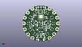
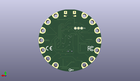
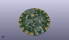

Contents
========

* [PROJ-ADAF-3333-STAN-01>Adafruit Circuit Playground Express PCB](#proj-adaf-3333-stan-01adafruit-circuit-playground-express-pcb)
	* [Images](#images)
	* [Interactive BOM](#interactive-bom)
	* [OOMP Parts](#oomp-parts)
	* [Tags](#tags)
  
![][im]
# PROJ-ADAF-3333-STAN-01>Adafruit Circuit Playground Express PCB

- ID: PROJ-ADAF-3333-STAN-01
- Hex ID: PRA3333
- Name: Adafruit Circuit Playground Express PCB
- Description: 

## Images
  
  

|eagleImage|kicadPcb3dFront|kicadPcb3dBack|kicadPcb3d|
| :---: | :---: | :---: | :---: |
|||||

## Interactive BOM

- Interactive BOM page: [ibom.html](kicad/bom/ibom.html)

## OOMP Parts
  

|OOMP Parts|
| :---: |
|UNMATCHED-UNMATCHED-X-UNMATCHED-01, 3.3VTAP, -22.6695, 0.0, 90,3.3VTAP, SEWTAP-ALLIGATOR, SEWALLI, microbuilder, (-0.8925, 0), R90|
|UNMATCHED-UNMATCHED-X-UNMATCHED-01, 3V3TAP2, 11.302999999999999, 19.685, 330,3V3TAP2, SEWTAP-ALLIGATOR, SEWALLI, microbuilder, (0.445, 0.775), R330|
|UNMATCHED-UNMATCHED-X-UNMATCHED-01, BATT, 0.0, -21.59, 180,BATT, 3-6VDC, JSTPH2, microbuilder, (0, -0.85), R180|
|CAPE-0603-X-UNMATCHED-01, C1, 7.492999999999999, -5.588, 180,C1, 1uF, 0603-NO, microbuilder, (0.295, -0.22), R180|
|CAPE-0603-X-UNMATCHED-01, C2, -6.095999999999999, 17.970499999999998, 0,C2, 1uF, 0603-NO, microbuilder, (-0.24, 0.7075), R0|
|CAPE-0603-X-UNMATCHED-01, C3, 5.5245, 9.080499999999999, 0,C3, 1uF, 0603-NO, microbuilder, (0.2175, 0.3575), R0|
|CAPE-0805-X-UNMATCHED-01, C4, 3.429, -14.2875, 180,C4, 10uF, 0805-NO, microbuilder, (0.135, -0.5625), R180|
|CAPE-0603-X-UNMATCHED-01, C5, -0.0635, -14.731999999999998, 0,C5, 1uF, 0603-NO, microbuilder, (-0.0025, -0.58), R0|
|CAPE-0603-X-UNMATCHED-01, C6, 10.6045, -6.858, 0,C6, 1uF, 0603-NO, microbuilder, (0.4175, -0.27), R0|
|CAPE-0805-X-UNMATCHED-01, C8, 3.429, -16.128999999999998, 180,C8, 10uF, 0805-NO, microbuilder, (0.135, -0.635), R180|
|CAPE-0603-X-NF100-01, C9, -11.302999999999999, 6.0325, 90,C9, 0.1uF, 0603-NO, microbuilder, (-0.445, 0.2375), R90|
|CAPE-0603-X-UNMATCHED-01, C10, -7.424984388, 12.069512564, 180,C10, 1uF, 0603-NO, microbuilder, (-0.29232222, 0.47517766), R180|
|ERROR, CN1 MicroB USB, 0, 0, 0,CN1, MicroB, USB, 4UCONN_20329_V2, microbuilder, (0, 0.82), R180|
|UNMATCHED-UNMATCHED-X-UNMATCHED-01, D1, 4.699, 16.383, 90,D1, MBR120, SOD-123, microbuilder, (0.185, 0.645), R90|
|UNMATCHED-UNMATCHED-X-UNMATCHED-01, D2, 5.1435, -21.462999999999997, 90,D2, MBR120, SOD-123, microbuilder, (0.2025, -0.845), R90|
|ERROR, D3 PIN IR, 0, 0, 0,D3, PIN, IR, CHIPLED_1206_NOOUTLINE, microbuilder, (0.18, 0.01), R180|
|ERROR, D5 IR TX, 0, 0, 0,D5, IR, TX, CHIPLED_1206_NOOUTLINE, microbuilder, (-0.18, 0.01), R180|
|UNMATCHED-UNMATCHED-X-UNMATCHED-01, D6, 21.336, -7.746999999999999, 250,D6, SEWTAP-ALLIGATOR, SEWALLI, microbuilder, (0.84, -0.305), R250|
|ERROR, F1 6V+ 500mA, 0, 0, 0,F1, 6V+, 500mA, R1206, adafruit, (-0.2175, -0.85), R90|
|UNMATCHED-UNMATCHED-X-UNMATCHED-01, GND3TAP, -11.3665, 19.621499999999997, 30,GND3TAP, SEWTAP-ALLIGATOR, SEWALLI, microbuilder, (-0.4475, 0.7725), R30|
|UNMATCHED-UNMATCHED-X-UNMATCHED-01, GNDTAP, 22.6695, 0.0, 270,GNDTAP, SEWTAP-ALLIGATOR, SEWALLI, microbuilder, (0.8925, 0), R270|
|UNMATCHED-UNMATCHED-X-UNMATCHED-01, GNDTAP2, -11.302999999999999, -19.685, 150,GNDTAP2, SEWTAP-ALLIGATOR, SEWALLI, microbuilder, (-0.445, -0.775), R150|
|UNMATCHED-UNMATCHED-X-UNMATCHED-01, IC1, 11.557, -4.381499999999999, 90,IC1, MIC_PDM, SPK0415HM4H, microbuilder, (0.455, -0.1725), R90|
|UNMATCHED-UNMATCHED-X-UNMATCHED-01, IC2, -13.97, -4.3180000000000005, 270,IC2, PAM8301, SOT23-6, microbuilder, (-0.55, -0.17), R270|
|UNMATCHED-UNMATCHED-X-UNMATCHED-01, IC4, 0.0, -1.397, 180,IC4, LIS3DH, LGA16_3X3MM, microbuilder, (0, -0.055), R180|
|UNMATCHED-UNMATCHED-X-UNMATCHED-01, IO9, 21.336, 7.746999999999999, 290,IO9, SEWTAP-ALLIGATOR, SEWALLI, microbuilder, (0.84, 0.305), R290|
|UNMATCHED-UNMATCHED-X-UNMATCHED-01, IO10, 17.399, 14.604999999999999, 310,IO10, SEWTAP-ALLIGATOR, SEWALLI, microbuilder, (0.685, 0.575), R310|
|UNMATCHED-UNMATCHED-X-UNMATCHED-01, IO12, 17.399, -14.604999999999999, 230,IO12, SEWTAP-ALLIGATOR, SEWALLI, microbuilder, (0.685, -0.575), R230|
|UNMATCHED-UNMATCHED-X-UNMATCHED-01, L, 6.223, 22.098, 0,L, RED, CHIPLED_0805_NOOUTLINE, microbuilder, (0.245, 0.87), R0|
|UNMATCHED-UNMATCHED-X-UNMATCHED-01, LED1, 15.112999999999998, -8.128, 60,LED1, WS2812B3535, LED3535, microbuilder, (0.595, -0.32), R60|
|UNMATCHED-UNMATCHED-X-UNMATCHED-01, LED2, 8.636000000000001, -14.858999999999998, 30,LED2, WS2812B3535, LED3535, microbuilder, (0.34, -0.585), R30|
|UNMATCHED-UNMATCHED-X-UNMATCHED-01, LED3, 17.145, -0.254, 90,LED3, WS2812B3535, LED3535, microbuilder, (0.675, -0.01), R90|
|UNMATCHED-UNMATCHED-X-UNMATCHED-01, LED4, 14.985999999999999, 8.254999999999999, 120,LED4, WS2812B3535, LED3535, microbuilder, (0.59, 0.325), R120|
|UNMATCHED-UNMATCHED-X-UNMATCHED-01, LED5, 8.509, 14.858999999999998, 150,LED5, WS2812B3535, LED3535, microbuilder, (0.335, 0.585), R150|
|UNMATCHED-UNMATCHED-X-UNMATCHED-01, LED6, -8.762999999999998, 14.985999999999999, 210,LED6, WS2812B3535, LED3535, microbuilder, (-0.345, 0.59), R210|
|UNMATCHED-UNMATCHED-X-UNMATCHED-01, LED7, -14.858999999999998, 8.509, 240,LED7, WS2812B3535, LED3535, microbuilder, (-0.585, 0.335), R240|
|UNMATCHED-UNMATCHED-X-UNMATCHED-01, LED8, -17.145, 0.0, 270,LED8, WS2812B3535, LED3535, microbuilder, (-0.675, 0), R270|
|UNMATCHED-UNMATCHED-X-UNMATCHED-01, LED9, -14.858999999999998, -8.889999999999999, 300,LED9, WS2812B3535, LED3535, microbuilder, (-0.585, -0.35), R300|
|UNMATCHED-UNMATCHED-X-UNMATCHED-01, LED10, -8.128, -15.112999999999998, 330,LED10, WS2812B3535, LED3535, microbuilder, (-0.32, -0.595), R330|
|UNMATCHED-UNMATCHED-X-UNMATCHED-01, PWR, -6.35, 21.843999999999998, 0,PWR, GREEN, CHIPLED_0805_NOOUTLINE, microbuilder, (-0.25, 0.86), R0|
|UNMATCHED-UNMATCHED-X-UNMATCHED-01, Q1, 5.460999999999999, -9.080499999999999, 90,Q1, mmbt2222, SOT23-R, microbuilder, (0.215, -0.3575), R90|
|<table><tr><td></td><td> R1</td><td>[RESE-0603-X-O473-01 SMD (0603) 47k Ohm Resistor](https://github.com/oomlout/oomlout_OOMP_parts/tree/main/RESE-0603-X-O473-01/)</td><td>[R6473](https://github.com/oomlout/oomlout_OOMP_parts/tree/main/RESE-0603-X-O473-01/)</td></tr></table>|
|<table><tr><td></td><td> R2</td><td>[RESE-0603-X-O103-01 SMD (0603) 10k Ohm Resistor](https://github.com/oomlout/oomlout_OOMP_parts/tree/main/RESE-0603-X-O103-01/)</td><td>[R6103](https://github.com/oomlout/oomlout_OOMP_parts/tree/main/RESE-0603-X-O103-01/)</td></tr></table>|
|RESE-0603-X-UNMATCHED-01, R3, -7.112, 19.304, 180,R3, 1K, 0603-NO, microbuilder, (-0.28, 0.76), R180|
|<table><tr><td></td><td> R4</td><td>[RESE-0603-X-O103-01 SMD (0603) 10k Ohm Resistor](https://github.com/oomlout/oomlout_OOMP_parts/tree/main/RESE-0603-X-O103-01/)</td><td>[R6103](https://github.com/oomlout/oomlout_OOMP_parts/tree/main/RESE-0603-X-O103-01/)</td></tr></table>|
|RESE-0603-X-UNMATCHED-01, R5, 7.112, 19.621499999999997, 180,R5, 1K, 0603-NO, microbuilder, (0.28, 0.7725), R180|
|<table><tr><td></td><td> R6</td><td>[RESE-0603-X-O103-01 SMD (0603) 10k Ohm Resistor](https://github.com/oomlout/oomlout_OOMP_parts/tree/main/RESE-0603-X-O103-01/)</td><td>[R6103](https://github.com/oomlout/oomlout_OOMP_parts/tree/main/RESE-0603-X-O103-01/)</td></tr></table>|
|<table><tr><td></td><td> R7</td><td>[RESE-0603-X-O103-01 SMD (0603) 10k Ohm Resistor](https://github.com/oomlout/oomlout_OOMP_parts/tree/main/RESE-0603-X-O103-01/)</td><td>[R6103](https://github.com/oomlout/oomlout_OOMP_parts/tree/main/RESE-0603-X-O103-01/)</td></tr></table>|
|RESE-0603-X-UNMATCHED-01, R8, 7.492999999999999, -6.858, 180,R8, 100, 0603-NO, microbuilder, (0.295, -0.27), R180|
|RESE-0603-X-UNMATCHED-01, R9, 7.810499999999999, -9.017, 270,R9, 100, 0603-NO, microbuilder, (0.3075, -0.355), R270|
|<table><tr><td></td><td> R10</td><td>[RESE-0603-X-O103-01 SMD (0603) 10k Ohm Resistor](https://github.com/oomlout/oomlout_OOMP_parts/tree/main/RESE-0603-X-O103-01/)</td><td>[R6103](https://github.com/oomlout/oomlout_OOMP_parts/tree/main/RESE-0603-X-O103-01/)</td></tr></table>|
|UNMATCHED-UNMATCHED-X-UNMATCHED-01, RESET, 0.0, 2.2859999999999996, 180,RESET, KMR2, BTN_KMR2_4.6X2.8, microbuilder, (0, 0.09), R180|
|UNMATCHED-UNMATCHED-X-UNMATCHED-01, RX, -21.2725, -8.001, 110,RX, SEWTAP-ALLIGATOR, SEWALLI, microbuilder, (-0.8375, -0.315), R110|
|UNMATCHED-UNMATCHED-X-UNMATCHED-01, SCL, -17.399, 14.5415, 50,SCL, SEWTAP-ALLIGATOR, SEWALLI, microbuilder, (-0.685, 0.5725), R50|
|UNMATCHED-UNMATCHED-X-UNMATCHED-01, SDA, -21.336, 7.746999999999999, 70,SDA, SEWTAP-ALLIGATOR, SEWALLI, microbuilder, (-0.84, 0.305), R70|
|ERROR, SP1 7.5mm SPK, 0, 0, 0,SP1, 7.5mm, SPK, BUZZER_SMT_7.5MM, microbuilder, (-0.3125, -0.24), R0|
|UNMATCHED-UNMATCHED-X-UNMATCHED-01, SW1, -9.906, 1.016, 180,SW1, EVQQ, EVQ-Q2_SMALLER, microbuilder, (-0.39, 0.04), R180|
|UNMATCHED-UNMATCHED-X-UNMATCHED-01, SW2, 9.906, 1.016, 180,SW2, EVQQ, EVQ-Q2_SMALLER, microbuilder, (0.39, 0.04), R180|
|UNMATCHED-UNMATCHED-X-UNMATCHED-01, SWITCH, 0.0, -9.017, 0,SWITCH, EG1390, EG1390, adafruit, (0, -0.355), R0|
|UNMATCHED-0402-X-UNMATCHED-01, THM1, 8.001, 8.6995, 90,THM1, THERM, _0402, microbuilder, (0.315, 0.3425), R90|
|UNMATCHED-UNMATCHED-X-UNMATCHED-01, TP1, -4.3180000000000005, 9.906, M0,TP1, TESTPOINT_ROUND_1.5MM, microbuilder, (-0.17, 0.39), MR0|
|UNMATCHED-UNMATCHED-X-UNMATCHED-01, TP5, -9.398, 9.906, M0,TP5, TESTPOINT_ROUND_1.5MM, microbuilder, (-0.37, 0.39), MR0|
|UNMATCHED-UNMATCHED-X-UNMATCHED-01, TP6, -6.858, 9.906, M0,TP6, TESTPOINT_ROUND_1.5MM, microbuilder, (-0.27, 0.39), MR0|
|UNMATCHED-UNMATCHED-X-UNMATCHED-01, TX, -17.145, -14.858999999999998, 130,TX, SEWTAP-ALLIGATOR, SEWALLI, microbuilder, (-0.675, -0.585), R130|
|UNMATCHED-UNMATCHED-X-UNMATCHED-01, U1, 7.429499999999999, -3.8099999999999996, 90,U1, VSOP383, VSOP383, microbuilder, (0.2925, -0.15), R90|
|UNMATCHED-UNMATCHED-X-UNMATCHED-01, U2, -10.4775, 8.509, 0,U2, ALS-PT19-315C, ALS-PT19-315C, microbuilder, (-0.4125, 0.335), R0|
|UNMATCHED-UNMATCHED-X-UNMATCHED-01, U3, -3.6829999999999994, -14.985999999999999, 0,U3, AP2112K-3.3, SOT23-5, microbuilder, (-0.145, -0.59), R0|
|ERROR, U4 SPI FLASH, 0, 0, 0,U4, SPI, FLASH, SOIC8_150MIL, microbuilder, (-0.0275, 0.6375), R270|
|UNMATCHED-UNMATCHED-X-UNMATCHED-01, VCC2, 11.302999999999999, -19.685, 210,VCC2, SEWTAP-ALLIGATOR, SEWALLI, microbuilder, (0.445, -0.775), R210|

## Tags

- hexID: PRA3333
- oompType: PROJ
- oompSize: ADAF
- oompColor: 3333
- oompDesc: STAN
- oompIndex: 01
- oompName: Adafruit Circuit Playground Express PCB
- sources: All source files from https://github.com/adafruit/Adafruit-Circuit-Playground-Express-PCB (source licence details in srcLicense.md)
- linkBuyPage: http://www.adafruit.com/products/3333
- oompPart: UNMATCHED-UNMATCHED-X-UNMATCHED-01, 3.3VTAP, -22.6695, 0.0, 90
- oompPart: UNMATCHED-UNMATCHED-X-UNMATCHED-01, 3V3TAP2, 11.302999999999999, 19.685, 330
- oompPart: UNMATCHED-UNMATCHED-X-UNMATCHED-01, BATT, 0.0, -21.59, 180
- oompPart: CAPE-0603-X-UNMATCHED-01, C1, 7.492999999999999, -5.588, 180
- oompPart: CAPE-0603-X-UNMATCHED-01, C2, -6.095999999999999, 17.970499999999998, 0
- oompPart: CAPE-0603-X-UNMATCHED-01, C3, 5.5245, 9.080499999999999, 0
- oompPart: CAPE-0805-X-UNMATCHED-01, C4, 3.429, -14.2875, 180
- oompPart: CAPE-0603-X-UNMATCHED-01, C5, -0.0635, -14.731999999999998, 0
- oompPart: CAPE-0603-X-UNMATCHED-01, C6, 10.6045, -6.858, 0
- oompPart: CAPE-0805-X-UNMATCHED-01, C8, 3.429, -16.128999999999998, 180
- oompPart: CAPE-0603-X-NF100-01, C9, -11.302999999999999, 6.0325, 90
- oompPart: CAPE-0603-X-UNMATCHED-01, C10, -7.424984388, 12.069512564, 180
- oompPart: ERROR, CN1 MicroB USB, 0, 0, 0
- oompPart: UNMATCHED-UNMATCHED-X-UNMATCHED-01, D1, 4.699, 16.383, 90
- oompPart: UNMATCHED-UNMATCHED-X-UNMATCHED-01, D2, 5.1435, -21.462999999999997, 90
- oompPart: ERROR, D3 PIN IR, 0, 0, 0
- oompPart: ERROR, D5 IR TX, 0, 0, 0
- oompPart: UNMATCHED-UNMATCHED-X-UNMATCHED-01, D6, 21.336, -7.746999999999999, 250
- oompPart: ERROR, F1 6V+ 500mA, 0, 0, 0
- oompPart: UNMATCHED-UNMATCHED-X-UNMATCHED-01, GND3TAP, -11.3665, 19.621499999999997, 30
- oompPart: UNMATCHED-UNMATCHED-X-UNMATCHED-01, GNDTAP, 22.6695, 0.0, 270
- oompPart: UNMATCHED-UNMATCHED-X-UNMATCHED-01, GNDTAP2, -11.302999999999999, -19.685, 150
- oompPart: UNMATCHED-UNMATCHED-X-UNMATCHED-01, IC1, 11.557, -4.381499999999999, 90
- oompPart: UNMATCHED-UNMATCHED-X-UNMATCHED-01, IC2, -13.97, -4.3180000000000005, 270
- oompPart: UNMATCHED-UNMATCHED-X-UNMATCHED-01, IC4, 0.0, -1.397, 180
- oompPart: UNMATCHED-UNMATCHED-X-UNMATCHED-01, IO9, 21.336, 7.746999999999999, 290
- oompPart: UNMATCHED-UNMATCHED-X-UNMATCHED-01, IO10, 17.399, 14.604999999999999, 310
- oompPart: UNMATCHED-UNMATCHED-X-UNMATCHED-01, IO12, 17.399, -14.604999999999999, 230
- oompPart: UNMATCHED-UNMATCHED-X-UNMATCHED-01, L, 6.223, 22.098, 0
- oompPart: UNMATCHED-UNMATCHED-X-UNMATCHED-01, LED1, 15.112999999999998, -8.128, 60
- oompPart: UNMATCHED-UNMATCHED-X-UNMATCHED-01, LED2, 8.636000000000001, -14.858999999999998, 30
- oompPart: UNMATCHED-UNMATCHED-X-UNMATCHED-01, LED3, 17.145, -0.254, 90
- oompPart: UNMATCHED-UNMATCHED-X-UNMATCHED-01, LED4, 14.985999999999999, 8.254999999999999, 120
- oompPart: UNMATCHED-UNMATCHED-X-UNMATCHED-01, LED5, 8.509, 14.858999999999998, 150
- oompPart: UNMATCHED-UNMATCHED-X-UNMATCHED-01, LED6, -8.762999999999998, 14.985999999999999, 210
- oompPart: UNMATCHED-UNMATCHED-X-UNMATCHED-01, LED7, -14.858999999999998, 8.509, 240
- oompPart: UNMATCHED-UNMATCHED-X-UNMATCHED-01, LED8, -17.145, 0.0, 270
- oompPart: UNMATCHED-UNMATCHED-X-UNMATCHED-01, LED9, -14.858999999999998, -8.889999999999999, 300
- oompPart: UNMATCHED-UNMATCHED-X-UNMATCHED-01, LED10, -8.128, -15.112999999999998, 330
- oompPart: UNMATCHED-UNMATCHED-X-UNMATCHED-01, PWR, -6.35, 21.843999999999998, 0
- oompPart: UNMATCHED-UNMATCHED-X-UNMATCHED-01, Q1, 5.460999999999999, -9.080499999999999, 90
- oompPart: RESE-0603-X-O473-01, R1, -12.572999999999999, 6.0325, 270
- oompPart: RESE-0603-X-O103-01, R2, 2.54, -0.889, 90
- oompPart: RESE-0603-X-UNMATCHED-01, R3, -7.112, 19.304, 180
- oompPart: RESE-0603-X-O103-01, R4, -9.8425, 10.795, 270
- oompPart: RESE-0603-X-UNMATCHED-01, R5, 7.112, 19.621499999999997, 180
- oompPart: RESE-0603-X-O103-01, R6, 3.2384999999999997, -3.8734999999999995, 0
- oompPart: RESE-0603-X-O103-01, R7, 8.128, 6.7945, 180
- oompPart: RESE-0603-X-UNMATCHED-01, R8, 7.492999999999999, -6.858, 180
- oompPart: RESE-0603-X-UNMATCHED-01, R9, 7.810499999999999, -9.017, 270
- oompPart: RESE-0603-X-O103-01, R10, -7.6834999999999996, 10.795, 180
- oompPart: UNMATCHED-UNMATCHED-X-UNMATCHED-01, RESET, 0.0, 2.2859999999999996, 180
- oompPart: UNMATCHED-UNMATCHED-X-UNMATCHED-01, RX, -21.2725, -8.001, 110
- oompPart: UNMATCHED-UNMATCHED-X-UNMATCHED-01, SCL, -17.399, 14.5415, 50
- oompPart: UNMATCHED-UNMATCHED-X-UNMATCHED-01, SDA, -21.336, 7.746999999999999, 70
- oompPart: ERROR, SP1 7.5mm SPK, 0, 0, 0
- oompPart: UNMATCHED-UNMATCHED-X-UNMATCHED-01, SW1, -9.906, 1.016, 180
- oompPart: UNMATCHED-UNMATCHED-X-UNMATCHED-01, SW2, 9.906, 1.016, 180
- oompPart: UNMATCHED-UNMATCHED-X-UNMATCHED-01, SWITCH, 0.0, -9.017, 0
- oompPart: UNMATCHED-0402-X-UNMATCHED-01, THM1, 8.001, 8.6995, 90
- oompPart: UNMATCHED-UNMATCHED-X-UNMATCHED-01, TP1, -4.3180000000000005, 9.906, M0
- oompPart: UNMATCHED-UNMATCHED-X-UNMATCHED-01, TP5, -9.398, 9.906, M0
- oompPart: UNMATCHED-UNMATCHED-X-UNMATCHED-01, TP6, -6.858, 9.906, M0
- oompPart: UNMATCHED-UNMATCHED-X-UNMATCHED-01, TX, -17.145, -14.858999999999998, 130
- oompPart: SKIP-UNMATCHED-X-UNMATCHED-01, U$2, 15.366999999999999, 18.287999999999997, 0
- oompPart: SKIP-UNMATCHED-X-UNMATCHED-01, U$3, -15.493999999999998, -18.668999999999997, 0
- oompPart: SKIP-UNMATCHED-X-UNMATCHED-01, U$5, 0.0, 9.4615, 0
- oompPart: SKIP-UNMATCHED-X-UNMATCHED-01, U$6, 15.493999999999998, -18.668999999999997, 0
- oompPart: UNMATCHED-UNMATCHED-X-UNMATCHED-01, U1, 7.429499999999999, -3.8099999999999996, 90
- oompPart: UNMATCHED-UNMATCHED-X-UNMATCHED-01, U2, -10.4775, 8.509, 0
- oompPart: UNMATCHED-UNMATCHED-X-UNMATCHED-01, U3, -3.6829999999999994, -14.985999999999999, 0
- oompPart: ERROR, U4 SPI FLASH, 0, 0, 0
- oompPart: UNMATCHED-UNMATCHED-X-UNMATCHED-01, VCC2, 11.302999999999999, -19.685, 210
- rawPart: 3.3VTAP, SEWTAP-ALLIGATOR, SEWALLI, microbuilder, (-0.8925, 0), R90
- rawPart: 3V3TAP2, SEWTAP-ALLIGATOR, SEWALLI, microbuilder, (0.445, 0.775), R330
- rawPart: BATT, 3-6VDC, JSTPH2, microbuilder, (0, -0.85), R180
- rawPart: C1, 1uF, 0603-NO, microbuilder, (0.295, -0.22), R180
- rawPart: C2, 1uF, 0603-NO, microbuilder, (-0.24, 0.7075), R0
- rawPart: C3, 1uF, 0603-NO, microbuilder, (0.2175, 0.3575), R0
- rawPart: C4, 10uF, 0805-NO, microbuilder, (0.135, -0.5625), R180
- rawPart: C5, 1uF, 0603-NO, microbuilder, (-0.0025, -0.58), R0
- rawPart: C6, 1uF, 0603-NO, microbuilder, (0.4175, -0.27), R0
- rawPart: C8, 10uF, 0805-NO, microbuilder, (0.135, -0.635), R180
- rawPart: C9, 0.1uF, 0603-NO, microbuilder, (-0.445, 0.2375), R90
- rawPart: C10, 1uF, 0603-NO, microbuilder, (-0.29232222, 0.47517766), R180
- rawPart: CN1, MicroB, USB, 4UCONN_20329_V2, microbuilder, (0, 0.82), R180
- rawPart: D1, MBR120, SOD-123, microbuilder, (0.185, 0.645), R90
- rawPart: D2, MBR120, SOD-123, microbuilder, (0.2025, -0.845), R90
- rawPart: D3, PIN, IR, CHIPLED_1206_NOOUTLINE, microbuilder, (0.18, 0.01), R180
- rawPart: D5, IR, TX, CHIPLED_1206_NOOUTLINE, microbuilder, (-0.18, 0.01), R180
- rawPart: D6, SEWTAP-ALLIGATOR, SEWALLI, microbuilder, (0.84, -0.305), R250
- rawPart: F1, 6V+, 500mA, R1206, adafruit, (-0.2175, -0.85), R90
- rawPart: GND3TAP, SEWTAP-ALLIGATOR, SEWALLI, microbuilder, (-0.4475, 0.7725), R30
- rawPart: GNDTAP, SEWTAP-ALLIGATOR, SEWALLI, microbuilder, (0.8925, 0), R270
- rawPart: GNDTAP2, SEWTAP-ALLIGATOR, SEWALLI, microbuilder, (-0.445, -0.775), R150
- rawPart: IC1, MIC_PDM, SPK0415HM4H, microbuilder, (0.455, -0.1725), R90
- rawPart: IC2, PAM8301, SOT23-6, microbuilder, (-0.55, -0.17), R270
- rawPart: IC4, LIS3DH, LGA16_3X3MM, microbuilder, (0, -0.055), R180
- rawPart: IO9, SEWTAP-ALLIGATOR, SEWALLI, microbuilder, (0.84, 0.305), R290
- rawPart: IO10, SEWTAP-ALLIGATOR, SEWALLI, microbuilder, (0.685, 0.575), R310
- rawPart: IO12, SEWTAP-ALLIGATOR, SEWALLI, microbuilder, (0.685, -0.575), R230
- rawPart: L, RED, CHIPLED_0805_NOOUTLINE, microbuilder, (0.245, 0.87), R0
- rawPart: LED1, WS2812B3535, LED3535, microbuilder, (0.595, -0.32), R60
- rawPart: LED2, WS2812B3535, LED3535, microbuilder, (0.34, -0.585), R30
- rawPart: LED3, WS2812B3535, LED3535, microbuilder, (0.675, -0.01), R90
- rawPart: LED4, WS2812B3535, LED3535, microbuilder, (0.59, 0.325), R120
- rawPart: LED5, WS2812B3535, LED3535, microbuilder, (0.335, 0.585), R150
- rawPart: LED6, WS2812B3535, LED3535, microbuilder, (-0.345, 0.59), R210
- rawPart: LED7, WS2812B3535, LED3535, microbuilder, (-0.585, 0.335), R240
- rawPart: LED8, WS2812B3535, LED3535, microbuilder, (-0.675, 0), R270
- rawPart: LED9, WS2812B3535, LED3535, microbuilder, (-0.585, -0.35), R300
- rawPart: LED10, WS2812B3535, LED3535, microbuilder, (-0.32, -0.595), R330
- rawPart: PWR, GREEN, CHIPLED_0805_NOOUTLINE, microbuilder, (-0.25, 0.86), R0
- rawPart: Q1, mmbt2222, SOT23-R, microbuilder, (0.215, -0.3575), R90
- rawPart: R1, 47K, 0603-NO, microbuilder, (-0.495, 0.2375), R270
- rawPart: R2, 10k, 0603-NO, microbuilder, (0.1, -0.035), R90
- rawPart: R3, 1K, 0603-NO, microbuilder, (-0.28, 0.76), R180
- rawPart: R4, 10K, 0603-NO, microbuilder, (-0.3875, 0.425), R270
- rawPart: R5, 1K, 0603-NO, microbuilder, (0.28, 0.7725), R180
- rawPart: R6, 10k, 0603-NO, microbuilder, (0.1275, -0.1525), R0
- rawPart: R7, 10K, 0603-NO, microbuilder, (0.32, 0.2675), R180
- rawPart: R8, 100, 0603-NO, microbuilder, (0.295, -0.27), R180
- rawPart: R9, 100, 0603-NO, microbuilder, (0.3075, -0.355), R270
- rawPart: R10, 10K, 0603-NO, microbuilder, (-0.3025, 0.425), R180
- rawPart: RESET, KMR2, BTN_KMR2_4.6X2.8, microbuilder, (0, 0.09), R180
- rawPart: RX, SEWTAP-ALLIGATOR, SEWALLI, microbuilder, (-0.8375, -0.315), R110
- rawPart: SCL, SEWTAP-ALLIGATOR, SEWALLI, microbuilder, (-0.685, 0.5725), R50
- rawPart: SDA, SEWTAP-ALLIGATOR, SEWALLI, microbuilder, (-0.84, 0.305), R70
- rawPart: SP1, 7.5mm, SPK, BUZZER_SMT_7.5MM, microbuilder, (-0.3125, -0.24), R0
- rawPart: SW1, EVQQ, EVQ-Q2_SMALLER, microbuilder, (-0.39, 0.04), R180
- rawPart: SW2, EVQQ, EVQ-Q2_SMALLER, microbuilder, (0.39, 0.04), R180
- rawPart: SWITCH, EG1390, EG1390, adafruit, (0, -0.355), R0
- rawPart: THM1, THERM, _0402, microbuilder, (0.315, 0.3425), R90
- rawPart: TP1, TESTPOINT_ROUND_1.5MM, microbuilder, (-0.17, 0.39), MR0
- rawPart: TP5, TESTPOINT_ROUND_1.5MM, microbuilder, (-0.37, 0.39), MR0
- rawPart: TP6, TESTPOINT_ROUND_1.5MM, microbuilder, (-0.27, 0.39), MR0
- rawPart: TX, SEWTAP-ALLIGATOR, SEWALLI, microbuilder, (-0.675, -0.585), R130
- rawPart: U$2, FIDUCIAL_1MM, FIDUCIAL_1MM, microbuilder, (0.605, 0.72), R0
- rawPart: U$3, FIDUCIAL_1MM, FIDUCIAL_1MM, microbuilder, (-0.61, -0.735), R0
- rawPart: U$5, ATSAMD21G18MU, TQFN48_7MM, microbuilder, (0, 0.3725), R0
- rawPart: U$6, FIDUCIAL_1MM, FIDUCIAL_1MM, microbuilder, (0.61, -0.735), R0
- rawPart: U1, VSOP383, VSOP383, microbuilder, (0.2925, -0.15), R90
- rawPart: U2, ALS-PT19-315C, ALS-PT19-315C, microbuilder, (-0.4125, 0.335), R0
- rawPart: U3, AP2112K-3.3, SOT23-5, microbuilder, (-0.145, -0.59), R0
- rawPart: U4, SPI, FLASH, SOIC8_150MIL, microbuilder, (-0.0275, 0.6375), R270
- rawPart: VCC2, SEWTAP-ALLIGATOR, SEWALLI, microbuilder, (0.445, -0.775), R210

[im]: kicadPcb3d_450.png
