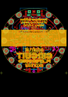

Contents
========

* [PROJ-ADAF-3333-STAN-01>Adafruit Circuit Playground Express PCB](#proj-adaf-3333-stan-01adafruit-circuit-playground-express-pcb)
	* [Images](#images)
	* [Interactive BOM](#interactive-bom)
	* [Tags](#tags)
  
![][im]
# PROJ-ADAF-3333-STAN-01>Adafruit Circuit Playground Express PCB

- ID: PROJ-ADAF-3333-STAN-01
- Hex ID: PRA3333
- Name: Adafruit Circuit Playground Express PCB
- Description: 

## Images
  
  

|eagleImage|kicadPcb3dFront|kicadPcb3dBack|kicadPcb3d|
| :---: | :---: | :---: | :---: |
|||||

## Interactive BOM

- Interactive BOM page: [ibom.html](kicad/bom/ibom.html)

## Tags

- hexID: PRA3333
- oompType: PROJ
- oompSize: ADAF
- oompColor: 3333
- oompDesc: STAN
- oompIndex: 01
- oompName: Adafruit Circuit Playground Express PCB
- sources: All source files from https://github.com/adafruit/Adafruit-Circuit-Playground-Express-PCB (source licence details in srcLicense.md)
- linkBuyPage: http://www.adafruit.com/products/3333
- oompPart: UNMATCHED-UNMATCHED-X-UNMATCHED-01, 3.3VTAP, -22.6695, 0.0, 90
- oompPart: UNMATCHED-UNMATCHED-X-UNMATCHED-01, 3V3TAP2, 11.302999999999999, 19.685, 330
- oompPart: UNMATCHED-UNMATCHED-X-UNMATCHED-01, BATT, 0.0, -21.59, 180
- oompPart: CAPC-0603-X-UNMATCHED-01, C1, 7.492999999999999, -5.588, 180
- oompPart: CAPC-0603-X-UNMATCHED-01, C2, -6.095999999999999, 17.970499999999998, 0
- oompPart: CAPC-0603-X-UNMATCHED-01, C3, 5.5245, 9.080499999999999, 0
- oompPart: CAPC-0805-X-UF10-V25, C4, 3.429, -14.2875, 180
- oompPart: CAPC-0603-X-UNMATCHED-01, C5, -0.0635, -14.731999999999998, 0
- oompPart: CAPC-0603-X-UNMATCHED-01, C6, 10.6045, -6.858, 0
- oompPart: CAPC-0805-X-UF10-V25, C8, 3.429, -16.128999999999998, 180
- oompPart: CAPC-0603-X-NF100-V50, C9, -11.302999999999999, 6.0325, 90
- oompPart: CAPC-0603-X-UNMATCHED-01, C10, -7.424984388, 12.069512564, 180
- oompPart: ERROR, CN1 MicroB USB, 0, 0, 0
- oompPart: UNMATCHED-UNMATCHED-X-UNMATCHED-01, D1, 4.699, 16.383, 90
- oompPart: UNMATCHED-UNMATCHED-X-UNMATCHED-01, D2, 5.1435, -21.462999999999997, 90
- oompPart: ERROR, D3 PIN IR, 0, 0, 0
- oompPart: ERROR, D5 IR TX, 0, 0, 0
- oompPart: UNMATCHED-UNMATCHED-X-UNMATCHED-01, D6, 21.336, -7.746999999999999, 250
- oompPart: ERROR, F1 6V+ 500mA, 0, 0, 0
- oompPart: UNMATCHED-UNMATCHED-X-UNMATCHED-01, GND3TAP, -11.3665, 19.621499999999997, 30
- oompPart: UNMATCHED-UNMATCHED-X-UNMATCHED-01, GNDTAP, 22.6695, 0.0, 270
- oompPart: UNMATCHED-UNMATCHED-X-UNMATCHED-01, GNDTAP2, -11.302999999999999, -19.685, 150
- oompPart: UNMATCHED-UNMATCHED-X-UNMATCHED-01, IC1, 11.557, -4.381499999999999, 90
- oompPart: UNMATCHED-UNMATCHED-X-UNMATCHED-01, IC2, -13.97, -4.3180000000000005, 270
- oompPart: UNMATCHED-UNMATCHED-X-UNMATCHED-01, IC4, 0.0, -1.397, 180
- oompPart: UNMATCHED-UNMATCHED-X-UNMATCHED-01, IO9, 21.336, 7.746999999999999, 290
- oompPart: UNMATCHED-UNMATCHED-X-UNMATCHED-01, IO10, 17.399, 14.604999999999999, 310
- oompPart: UNMATCHED-UNMATCHED-X-UNMATCHED-01, IO12, 17.399, -14.604999999999999, 230
- oompPart: UNMATCHED-UNMATCHED-X-UNMATCHED-01, L, 6.223, 22.098, 0
- oompPart: UNMATCHED-UNMATCHED-X-UNMATCHED-01, LED1, 15.112999999999998, -8.128, 60
- oompPart: UNMATCHED-UNMATCHED-X-UNMATCHED-01, LED2, 8.636000000000001, -14.858999999999998, 30
- oompPart: UNMATCHED-UNMATCHED-X-UNMATCHED-01, LED3, 17.145, -0.254, 90
- oompPart: UNMATCHED-UNMATCHED-X-UNMATCHED-01, LED4, 14.985999999999999, 8.254999999999999, 120
- oompPart: UNMATCHED-UNMATCHED-X-UNMATCHED-01, LED5, 8.509, 14.858999999999998, 150
- oompPart: UNMATCHED-UNMATCHED-X-UNMATCHED-01, LED6, -8.762999999999998, 14.985999999999999, 210
- oompPart: UNMATCHED-UNMATCHED-X-UNMATCHED-01, LED7, -14.858999999999998, 8.509, 240
- oompPart: UNMATCHED-UNMATCHED-X-UNMATCHED-01, LED8, -17.145, 0.0, 270
- oompPart: UNMATCHED-UNMATCHED-X-UNMATCHED-01, LED9, -14.858999999999998, -8.889999999999999, 300
- oompPart: UNMATCHED-UNMATCHED-X-UNMATCHED-01, LED10, -8.128, -15.112999999999998, 330
- oompPart: UNMATCHED-UNMATCHED-X-UNMATCHED-01, PWR, -6.35, 21.843999999999998, 0
- oompPart: UNMATCHED-UNMATCHED-X-UNMATCHED-01, Q1, 5.460999999999999, -9.080499999999999, 90
- oompPart: RESE-0603-X-UNMATCHED-01, R1, -12.572999999999999, 6.0325, 270
- oompPart: RESE-0603-X-UNMATCHED-01, R2, 2.54, -0.889, 90
- oompPart: RESE-0603-X-O102-01, R3, -7.112, 19.304, 180
- oompPart: RESE-0603-X-O103-01, R4, -9.8425, 10.795, 270
- oompPart: RESE-0603-X-O102-01, R5, 7.112, 19.621499999999997, 180
- oompPart: RESE-0603-X-UNMATCHED-01, R6, 3.2384999999999997, -3.8734999999999995, 0
- oompPart: RESE-0603-X-O103-01, R7, 8.128, 6.7945, 180
- oompPart: RESE-0603-X-UNMATCHED-01, R8, 7.492999999999999, -6.858, 180
- oompPart: RESE-0603-X-UNMATCHED-01, R9, 7.810499999999999, -9.017, 270
- oompPart: RESE-0603-X-O103-01, R10, -7.6834999999999996, 10.795, 180
- oompPart: UNMATCHED-UNMATCHED-X-UNMATCHED-01, RESET, 0.0, 2.2859999999999996, 180
- oompPart: UNMATCHED-UNMATCHED-X-UNMATCHED-01, RX, -21.2725, -8.001, 110
- oompPart: UNMATCHED-UNMATCHED-X-UNMATCHED-01, SCL, -17.399, 14.5415, 50
- oompPart: UNMATCHED-UNMATCHED-X-UNMATCHED-01, SDA, -21.336, 7.746999999999999, 70
- oompPart: ERROR, SP1 7.5mm SPK, 0, 0, 0
- oompPart: UNMATCHED-UNMATCHED-X-UNMATCHED-01, SW1, -9.906, 1.016, 180
- oompPart: UNMATCHED-UNMATCHED-X-UNMATCHED-01, SW2, 9.906, 1.016, 180
- oompPart: UNMATCHED-UNMATCHED-X-UNMATCHED-01, SWITCH, 0.0, -9.017, 0
- oompPart: UNMATCHED-UNMATCHED-X-UNMATCHED-01, THM1, 8.001, 8.6995, 90
- oompPart: UNMATCHED-UNMATCHED-X-UNMATCHED-01, TP1, -4.3180000000000005, 9.906, M0
- oompPart: UNMATCHED-UNMATCHED-X-UNMATCHED-01, TP5, -9.398, 9.906, M0
- oompPart: UNMATCHED-UNMATCHED-X-UNMATCHED-01, TP6, -6.858, 9.906, M0
- oompPart: UNMATCHED-UNMATCHED-X-UNMATCHED-01, TX, -17.145, -14.858999999999998, 130
- oompPart: SKIP-UNMATCHED-X-UNMATCHED-01, U$2, 15.366999999999999, 18.287999999999997, 0
- oompPart: SKIP-UNMATCHED-X-UNMATCHED-01, U$3, -15.493999999999998, -18.668999999999997, 0
- oompPart: SKIP-UNMATCHED-X-UNMATCHED-01, U$5, 0.0, 9.4615, 0
- oompPart: SKIP-UNMATCHED-X-UNMATCHED-01, U$6, 15.493999999999998, -18.668999999999997, 0
- oompPart: UNMATCHED-UNMATCHED-X-UNMATCHED-01, U1, 7.429499999999999, -3.8099999999999996, 90
- oompPart: UNMATCHED-UNMATCHED-X-UNMATCHED-01, U2, -10.4775, 8.509, 0
- oompPart: UNMATCHED-UNMATCHED-X-UNMATCHED-01, U3, -3.6829999999999994, -14.985999999999999, 0
- oompPart: ERROR, U4 SPI FLASH, 0, 0, 0
- oompPart: UNMATCHED-UNMATCHED-X-UNMATCHED-01, VCC2, 11.302999999999999, -19.685, 210
- rawPart: 

[im]: kicadPcb3d_450.png
