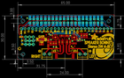
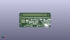
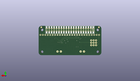
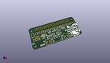

Contents
========

* [PROJ-ADAF-3346-STAN-01>Adafruit Stereo Speaker Bonnet PCB](#proj-adaf-3346-stan-01adafruit-stereo-speaker-bonnet-pcb)
	* [Images](#images)
	* [Interactive BOM](#interactive-bom)
	* [OOMP Parts](#oomp-parts)
	* [Tags](#tags)
  
![][im]
# PROJ-ADAF-3346-STAN-01>Adafruit Stereo Speaker Bonnet PCB

- ID: PROJ-ADAF-3346-STAN-01
- Hex ID: PRA3346
- Name: Adafruit Stereo Speaker Bonnet PCB
- Description: 

## Images
  
  

|eagleImage|kicadPcb3dFront|kicadPcb3dBack|kicadPcb3d|
| :---: | :---: | :---: | :---: |
|||||

## Interactive BOM

- Interactive BOM page: [ibom.html](kicad/bom/ibom.html)

## OOMP Parts
  

|OOMP Parts|
| :---: |
|CAPE-0805-X-UNMATCHED-01, C1, 44.830999999999996, 16.509999999999998, 270,C1, 10uF, 0805-NO, microbuilder, (1.765, 0.65), R270|
|CAPE-0805-X-NF100-01, C2, 43.053, 16.509999999999998, 270,C2, 0.1uF, 0805-NO, microbuilder, (1.695, 0.65), R270|
|CAPE-0805-X-NF100-01, C3, 24.13, 11.049, 270,C3, 0.1uF, 0805-NO, microbuilder, (0.95, 0.435), R270|
|UNMATCHED-0805-X-UNMATCHED-01, C4, 29.717999999999996, 16.256, 180,C4, DNP, 0805-NO, microbuilder, (1.17, 0.64), R180|
|UNMATCHED-0805-X-UNMATCHED-01, C5, 20.574, 9.143999999999998, 90,C5, DNP, 0805-NO, microbuilder, (0.81, 0.36), R90|
|CAPE-0805-X-UNMATCHED-01, C6, 25.907999999999998, 11.049, 270,C6, 10uF, 0805-NO, microbuilder, (1.02, 0.435), R270|
|UNMATCHED-0805-X-UNMATCHED-01, C7, 33.274, 16.256, 0,C7, DNP, 0805-NO, microbuilder, (1.31, 0.64), R0|
|UNMATCHED-0805-X-UNMATCHED-01, C8, 38.099999999999994, 11.049, 0,C8, DNP, 0805-NO, microbuilder, (1.5, 0.435), R0|
|CAPE-0805-X-UNMATCHED-01, C9, 46.608999999999995, 16.509999999999998, 270,C9, 10uF, 0805-NO, microbuilder, (1.835, 0.65), R270|
|CAPE-0805-X-UNMATCHED-01, C10, 22.352, 11.049, 270,C10, 10uF, 0805-NO, microbuilder, (0.88, 0.435), R270|
|UNMATCHED-UNMATCHED-X-UNMATCHED-01, CONN1, 32.766, 21.209, 0,CONN1, HEADER-1X25, 1X25_ROUND_70MIL, microbuilder, (1.29, 0.835), R0|
|UNMATCHED-0805-X-UNMATCHED-01, FB1, 28.066999999999997, 11.937999999999999, 270,FB1, Ferrite, 0805-NO, microbuilder, (1.105, 0.47), R270|
|UNMATCHED-0805-X-UNMATCHED-01, FB2, 30.099, 11.937999999999999, 270,FB2, Ferrite, 0805-NO, microbuilder, (1.185, 0.47), R270|
|UNMATCHED-0805-X-UNMATCHED-01, FB3, 35.433, 11.937999999999999, 270,FB3, Ferrite, 0805-NO, microbuilder, (1.395, 0.47), R270|
|UNMATCHED-0805-X-UNMATCHED-01, FB4, 33.400999999999996, 11.937999999999999, 270,FB4, Ferrite, 0805-NO, microbuilder, (1.315, 0.47), R270|
|UNMATCHED-UNMATCHED-X-UNMATCHED-01, JP2, 8.001, 12.953999999999999, 180,JP2, 1X03_ROUND_76, microbuilder, (0.315, 0.51), R180|
|UNMATCHED-UNMATCHED-X-UNMATCHED-01, JP4, 8.001, 10.413999999999998, 0,JP4, 1X03_ROUND_76, microbuilder, (0.315, 0.41), R0|
|UNMATCHED-UNMATCHED-X-UNMATCHED-01, JP5, 8.001, 15.493999999999998, 0,JP5, 1X03_ROUND_76, microbuilder, (0.315, 0.61), R0|
|UNMATCHED-UNMATCHED-X-UNMATCHED-01, LEFT, 38.099999999999994, 15.239999999999998, 180,LEFT, MAX98357A, QFN16_3MM, microbuilder, (1.5, 0.6), R180|
|RESE-0805-X-O394-01, R1, 20.574, 12.953999999999999, 270,R1, 390K, 0805-NO, microbuilder, (0.81, 0.51), R270|
|RESE-0805-X-O104-01, R2, 16.002, 10.287, 180,R2, 100K, 0805-NO, microbuilder, (0.63, 0.405), R180|
|UNMATCHED-UNMATCHED-X-UNMATCHED-01, RIGHT, 25.4, 15.239999999999998, 0,RIGHT, MAX98357A, QFN16_3MM, microbuilder, (1, 0.6), R0|
|UNMATCHED-UNMATCHED-X-UNMATCHED-01, RPI1, 0.0, 0.0, 0,RPI1, RASPBERRYPI_BPLUS_BONNET_THMSMT, PI_BONNET_THMSMT, microbuilder, (0, 0), R0|
|UNMATCHED-UNMATCHED-X-UNMATCHED-01, SJ1, 16.002, 13.716, 0,SJ1, SOLDERJUMPER_2WAY_OPEN_NOPASTE, microbuilder, (0.63, 0.54), R0|
|UNMATCHED-UNMATCHED-X-UNMATCHED-01, X1, 19.685, 3.8099999999999996, 0,X1, 3.5mm, TERMBLOCK_1X2-3.5MM, microbuilder, (0.775, 0.15), R0|
|UNMATCHED-UNMATCHED-X-UNMATCHED-01, X2, 43.687999999999995, 3.8099999999999996, 0,X2, 3.5mm, TERMBLOCK_1X2-3.5MM, microbuilder, (1.72, 0.15), R0|
|ERROR, X3 4 JST-PH, 0, 0, 0,X3, 4, JST-PH, JSTPH4, microbuilder, (1.25, 0.145), R180|

## Tags

- hexID: PRA3346
- oompType: PROJ
- oompSize: ADAF
- oompColor: 3346
- oompDesc: STAN
- oompIndex: 01
- oompName: Adafruit Stereo Speaker Bonnet PCB
- sources: All source files from https://github.com/adafruit/Adafruit-Stereo-Speaker-Bonnet-PCB (source licence details in srcLicense.md)
- linkBuyPage: http://www.adafruit.com/products/3346
- oompPart: CAPE-0805-X-UNMATCHED-01, C1, 44.830999999999996, 16.509999999999998, 270
- oompPart: CAPE-0805-X-NF100-01, C2, 43.053, 16.509999999999998, 270
- oompPart: CAPE-0805-X-NF100-01, C3, 24.13, 11.049, 270
- oompPart: UNMATCHED-0805-X-UNMATCHED-01, C4, 29.717999999999996, 16.256, 180
- oompPart: UNMATCHED-0805-X-UNMATCHED-01, C5, 20.574, 9.143999999999998, 90
- oompPart: CAPE-0805-X-UNMATCHED-01, C6, 25.907999999999998, 11.049, 270
- oompPart: UNMATCHED-0805-X-UNMATCHED-01, C7, 33.274, 16.256, 0
- oompPart: UNMATCHED-0805-X-UNMATCHED-01, C8, 38.099999999999994, 11.049, 0
- oompPart: CAPE-0805-X-UNMATCHED-01, C9, 46.608999999999995, 16.509999999999998, 270
- oompPart: CAPE-0805-X-UNMATCHED-01, C10, 22.352, 11.049, 270
- oompPart: UNMATCHED-UNMATCHED-X-UNMATCHED-01, CONN1, 32.766, 21.209, 0
- oompPart: UNMATCHED-0805-X-UNMATCHED-01, FB1, 28.066999999999997, 11.937999999999999, 270
- oompPart: UNMATCHED-0805-X-UNMATCHED-01, FB2, 30.099, 11.937999999999999, 270
- oompPart: UNMATCHED-0805-X-UNMATCHED-01, FB3, 35.433, 11.937999999999999, 270
- oompPart: UNMATCHED-0805-X-UNMATCHED-01, FB4, 33.400999999999996, 11.937999999999999, 270
- oompPart: SKIP-UNMATCHED-X-UNMATCHED-01, FID1, 19.367499999999996, 16.9545, 0
- oompPart: SKIP-UNMATCHED-X-UNMATCHED-01, FID2, 38.354, 9.143999999999998, 0
- oompPart: UNMATCHED-UNMATCHED-X-UNMATCHED-01, JP2, 8.001, 12.953999999999999, 180
- oompPart: UNMATCHED-UNMATCHED-X-UNMATCHED-01, JP4, 8.001, 10.413999999999998, 0
- oompPart: UNMATCHED-UNMATCHED-X-UNMATCHED-01, JP5, 8.001, 15.493999999999998, 0
- oompPart: UNMATCHED-UNMATCHED-X-UNMATCHED-01, LEFT, 38.099999999999994, 15.239999999999998, 180
- oompPart: RESE-0805-X-O394-01, R1, 20.574, 12.953999999999999, 270
- oompPart: RESE-0805-X-O104-01, R2, 16.002, 10.287, 180
- oompPart: UNMATCHED-UNMATCHED-X-UNMATCHED-01, RIGHT, 25.4, 15.239999999999998, 0
- oompPart: UNMATCHED-UNMATCHED-X-UNMATCHED-01, RPI1, 0.0, 0.0, 0
- oompPart: UNMATCHED-UNMATCHED-X-UNMATCHED-01, SJ1, 16.002, 13.716, 0
- oompPart: UNMATCHED-UNMATCHED-X-UNMATCHED-01, X1, 19.685, 3.8099999999999996, 0
- oompPart: UNMATCHED-UNMATCHED-X-UNMATCHED-01, X2, 43.687999999999995, 3.8099999999999996, 0
- oompPart: ERROR, X3 4 JST-PH, 0, 0, 0
- rawPart: C1, 10uF, 0805-NO, microbuilder, (1.765, 0.65), R270
- rawPart: C2, 0.1uF, 0805-NO, microbuilder, (1.695, 0.65), R270
- rawPart: C3, 0.1uF, 0805-NO, microbuilder, (0.95, 0.435), R270
- rawPart: C4, DNP, 0805-NO, microbuilder, (1.17, 0.64), R180
- rawPart: C5, DNP, 0805-NO, microbuilder, (0.81, 0.36), R90
- rawPart: C6, 10uF, 0805-NO, microbuilder, (1.02, 0.435), R270
- rawPart: C7, DNP, 0805-NO, microbuilder, (1.31, 0.64), R0
- rawPart: C8, DNP, 0805-NO, microbuilder, (1.5, 0.435), R0
- rawPart: C9, 10uF, 0805-NO, microbuilder, (1.835, 0.65), R270
- rawPart: C10, 10uF, 0805-NO, microbuilder, (0.88, 0.435), R270
- rawPart: CONN1, HEADER-1X25, 1X25_ROUND_70MIL, microbuilder, (1.29, 0.835), R0
- rawPart: FB1, Ferrite, 0805-NO, microbuilder, (1.105, 0.47), R270
- rawPart: FB2, Ferrite, 0805-NO, microbuilder, (1.185, 0.47), R270
- rawPart: FB3, Ferrite, 0805-NO, microbuilder, (1.395, 0.47), R270
- rawPart: FB4, Ferrite, 0805-NO, microbuilder, (1.315, 0.47), R270
- rawPart: FID1, FIDUCIAL_1MM, FIDUCIAL_1MM, microbuilder, (0.7625, 0.6675), R0
- rawPart: FID2, FIDUCIAL_1MM, FIDUCIAL_1MM, microbuilder, (1.51, 0.36), R0
- rawPart: JP2, 1X03_ROUND_76, microbuilder, (0.315, 0.51), R180
- rawPart: JP4, 1X03_ROUND_76, microbuilder, (0.315, 0.41), R0
- rawPart: JP5, 1X03_ROUND_76, microbuilder, (0.315, 0.61), R0
- rawPart: LEFT, MAX98357A, QFN16_3MM, microbuilder, (1.5, 0.6), R180
- rawPart: R1, 390K, 0805-NO, microbuilder, (0.81, 0.51), R270
- rawPart: R2, 100K, 0805-NO, microbuilder, (0.63, 0.405), R180
- rawPart: RIGHT, MAX98357A, QFN16_3MM, microbuilder, (1, 0.6), R0
- rawPart: RPI1, RASPBERRYPI_BPLUS_BONNET_THMSMT, PI_BONNET_THMSMT, microbuilder, (0, 0), R0
- rawPart: SJ1, SOLDERJUMPER_2WAY_OPEN_NOPASTE, microbuilder, (0.63, 0.54), R0
- rawPart: X1, 3.5mm, TERMBLOCK_1X2-3.5MM, microbuilder, (0.775, 0.15), R0
- rawPart: X2, 3.5mm, TERMBLOCK_1X2-3.5MM, microbuilder, (1.72, 0.15), R0
- rawPart: X3, 4, JST-PH, JSTPH4, microbuilder, (1.25, 0.145), R180

[im]: kicadPcb3d_450.png
