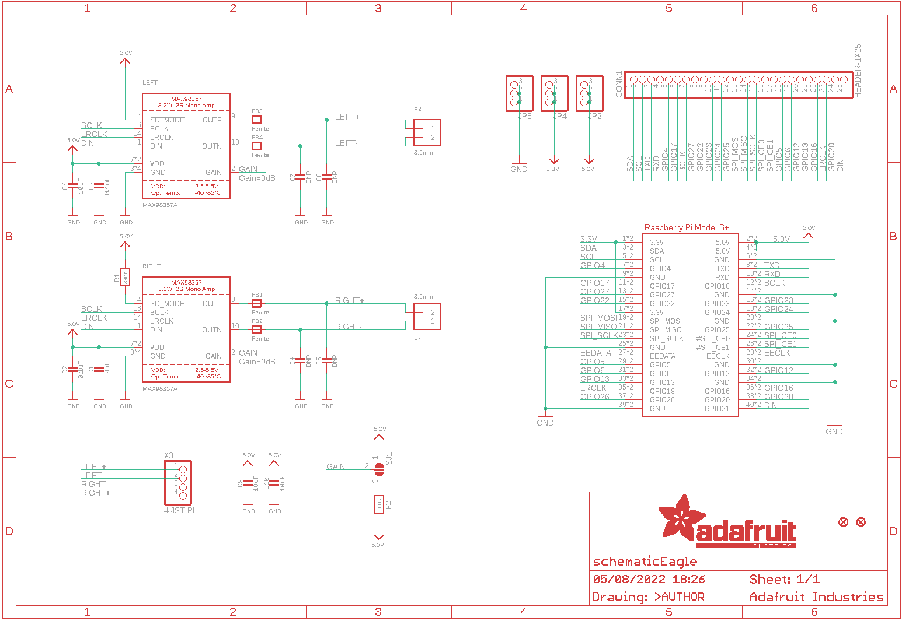
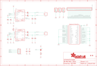

Contents
========

* [PRA3346 > Adafruit](#pra3346--adafruit)
	* [Schematic](#schematic)
	* [Interactive BOM](#interactive-bom)
	* [OOMP Parts](#oomp-parts)
	* [Images](#images)
	* [Tags](#tags)
  
![][im]
# PRA3346 > Adafruit

- ID: PROJ-ADAF-3346-STAN-01
- Hex ID: PRA3346
- Name: Adafruit
- Description: Adafruit
- Long Link: [http://oom.lt/PROJ-ADAF-3346-STAN-01](http://oom.lt/PROJ-ADAF-3346-STAN-01)
- Short Link: [http://oom.lt/PRA3346](http://oom.lt/PRA3346)

## Schematic
  

## Interactive BOM

- Interactive BOM page: [ibom.html](https://htmlpreview.github.io/?https://github.com/oomlout/oomlout_OOMP_projects/blob/main/PROJ-ADAF-3346-STAN-01/kicad/bom/ibom.html)

## OOMP Parts
  

|OOMP Parts|
| :---: |
|C1,CAPC-0805-X-UF10-V10,C1,10uF,CAP_CERAMIC0805-NOOUTLINE,0805-NO,Ceramic Capacitors,,|
|C2,CAPC-0805-X-NF100-V50,C2,0.1uF,CAP_CERAMIC0805-NOOUTLINE,0805-NO,Ceramic Capacitors,,|
|C3,CAPC-0805-X-NF100-V50,C3,0.1uF,CAP_CERAMIC0805-NOOUTLINE,0805-NO,Ceramic Capacitors,,|
|C6,CAPC-0805-X-UF10-V10,C4,DNP,CAP_CERAMIC0805-NOOUTLINE,0805-NO,Ceramic Capacitors,,|
|C9,CAPC-0805-X-UF10-V10,C5,DNP,CAP_CERAMIC0805-NOOUTLINE,0805-NO,Ceramic Capacitors,,|
|C10,CAPC-0805-X-UF10-V10,C6,10uF,CAP_CERAMIC0805-NOOUTLINE,0805-NO,Ceramic Capacitors,,|
|CONN1,HEAD-I01-X-PI25-01,C7,DNP,CAP_CERAMIC0805-NOOUTLINE,0805-NO,Ceramic Capacitors,,|
|FB1,UNMATCHED-0805-X-UNMATCHED-01,C8,DNP,CAP_CERAMIC0805-NOOUTLINE,0805-NO,Ceramic Capacitors,,|
|FB2,UNMATCHED-0805-X-UNMATCHED-01,C9,10uF,CAP_CERAMIC0805-NOOUTLINE,0805-NO,Ceramic Capacitors,,|
|FB3,UNMATCHED-0805-X-UNMATCHED-01,C10,10uF,CAP_CERAMIC0805-NOOUTLINE,0805-NO,Ceramic Capacitors,,|
|FB4,UNMATCHED-0805-X-UNMATCHED-01,CONN1,HEADER-1X25,HEADER-1X25,1X25_ROUND_70MIL,,,|
|JP2,HEAD-I01-X-PI03-01,FB1,Ferrite,FERRITE-0805NO,0805-NO,Ferrite Bead,,|
|JP4,HEAD-I01-X-PI03-01,FB2,Ferrite,FERRITE-0805NO,0805-NO,Ferrite Bead,,|
|JP5,HEAD-I01-X-PI03-01,FB3,Ferrite,FERRITE-0805NO,0805-NO,Ferrite Bead,,|
|LEFT,UNMATCHED-UNMATCHED-X-UNMATCHED-01,FB4,Ferrite,FERRITE-0805NO,0805-NO,Ferrite Bead,,|
|R1,RESE-0805-X-O3903-01,FID1,FIDUCIAL_1MM,FIDUCIAL_1MM,FIDUCIAL_1MM,Fiducial Alignment Points,EXCLUDE,|
|R2,RESE-0805-X-O1003-01,FID2,FIDUCIAL_1MM,FIDUCIAL_1MM,FIDUCIAL_1MM,Fiducial Alignment Points,EXCLUDE,|
|RIGHT,UNMATCHED-UNMATCHED-X-UNMATCHED-01,JP2,,HEADER-1X376MIL,1X03_ROUND_76,PIN HEADER,,|
|RPI1,UNMATCHED-UNMATCHED-X-UNMATCHED-01,JP4,,HEADER-1X376MIL,1X03_ROUND_76,PIN HEADER,,|
|X1,UNMATCHED-UNMATCHED-X-UNMATCHED-01,JP5,,HEADER-1X376MIL,1X03_ROUND_76,PIN HEADER,,|
|X2,UNMATCHED-UNMATCHED-X-UNMATCHED-01,LEFT,MAX98357A,AUDIOAMP_MAX98357,QFN16_3MM,MAX98357 - 3.2W I2S Mono Audio Amp,,|
|X3,UNMATCHED-UNMATCHED-X-UNMATCHED-01,R1,390K,RESISTOR0805_NOOUTLINE,0805-NO,Resistors,,|

## Images
  
  

|kicadPcb3d|kicadPcb3dFront|kicadPcb3dBack|eagleImage|eagleSchemImage|
| :---: | :---: | :---: | :---: | :---: |
||||||

## Tags

- hexID: PRA3346
- oompType: PROJ
- oompSize: ADAF
- oompColor: 3346
- oompDesc: STAN
- oompIndex: 01
- oompName: Adafruit Stereo Speaker Bonnet PCB
- sources: All source files from https://github.com/adafruit/Adafruit-Stereo-Speaker-Bonnet-PCB (source licence details in srcLicense.md)
- linkBuyPage: http://www.adafruit.com/products/3346
- oompID: PROJ-ADAF-3346-STAN-01
- oompParts: C1,CAPC-0805-X-UF10-V10
- oompParts: C2,CAPC-0805-X-NF100-V50
- oompParts: C3,CAPC-0805-X-NF100-V50
- oompParts: C6,CAPC-0805-X-UF10-V10
- oompParts: C9,CAPC-0805-X-UF10-V10
- oompParts: C10,CAPC-0805-X-UF10-V10
- oompParts: CONN1,HEAD-I01-X-PI25-01
- oompParts: FB1,UNMATCHED-0805-X-UNMATCHED-01
- oompParts: FB2,UNMATCHED-0805-X-UNMATCHED-01
- oompParts: FB3,UNMATCHED-0805-X-UNMATCHED-01
- oompParts: FB4,UNMATCHED-0805-X-UNMATCHED-01
- oompParts: JP2,HEAD-I01-X-PI03-01
- oompParts: JP4,HEAD-I01-X-PI03-01
- oompParts: JP5,HEAD-I01-X-PI03-01
- oompParts: LEFT,UNMATCHED-UNMATCHED-X-UNMATCHED-01
- oompParts: R1,RESE-0805-X-O3903-01
- oompParts: R2,RESE-0805-X-O1003-01
- oompParts: RIGHT,UNMATCHED-UNMATCHED-X-UNMATCHED-01
- oompParts: RPI1,UNMATCHED-UNMATCHED-X-UNMATCHED-01
- oompParts: X1,UNMATCHED-UNMATCHED-X-UNMATCHED-01
- oompParts: X2,UNMATCHED-UNMATCHED-X-UNMATCHED-01
- oompParts: X3,UNMATCHED-UNMATCHED-X-UNMATCHED-01
- rawParts: C1,10uF,CAP_CERAMIC0805-NOOUTLINE,0805-NO,Ceramic Capacitors,,
- rawParts: C2,0.1uF,CAP_CERAMIC0805-NOOUTLINE,0805-NO,Ceramic Capacitors,,
- rawParts: C3,0.1uF,CAP_CERAMIC0805-NOOUTLINE,0805-NO,Ceramic Capacitors,,
- rawParts: C4,DNP,CAP_CERAMIC0805-NOOUTLINE,0805-NO,Ceramic Capacitors,,
- rawParts: C5,DNP,CAP_CERAMIC0805-NOOUTLINE,0805-NO,Ceramic Capacitors,,
- rawParts: C6,10uF,CAP_CERAMIC0805-NOOUTLINE,0805-NO,Ceramic Capacitors,,
- rawParts: C7,DNP,CAP_CERAMIC0805-NOOUTLINE,0805-NO,Ceramic Capacitors,,
- rawParts: C8,DNP,CAP_CERAMIC0805-NOOUTLINE,0805-NO,Ceramic Capacitors,,
- rawParts: C9,10uF,CAP_CERAMIC0805-NOOUTLINE,0805-NO,Ceramic Capacitors,,
- rawParts: C10,10uF,CAP_CERAMIC0805-NOOUTLINE,0805-NO,Ceramic Capacitors,,
- rawParts: CONN1,HEADER-1X25,HEADER-1X25,1X25_ROUND_70MIL,,,
- rawParts: FB1,Ferrite,FERRITE-0805NO,0805-NO,Ferrite Bead,,
- rawParts: FB2,Ferrite,FERRITE-0805NO,0805-NO,Ferrite Bead,,
- rawParts: FB3,Ferrite,FERRITE-0805NO,0805-NO,Ferrite Bead,,
- rawParts: FB4,Ferrite,FERRITE-0805NO,0805-NO,Ferrite Bead,,
- rawParts: FID1,FIDUCIAL_1MM,FIDUCIAL_1MM,FIDUCIAL_1MM,Fiducial Alignment Points,EXCLUDE,
- rawParts: FID2,FIDUCIAL_1MM,FIDUCIAL_1MM,FIDUCIAL_1MM,Fiducial Alignment Points,EXCLUDE,
- rawParts: JP2,,HEADER-1X376MIL,1X03_ROUND_76,PIN HEADER,,
- rawParts: JP4,,HEADER-1X376MIL,1X03_ROUND_76,PIN HEADER,,
- rawParts: JP5,,HEADER-1X376MIL,1X03_ROUND_76,PIN HEADER,,
- rawParts: LEFT,MAX98357A,AUDIOAMP_MAX98357,QFN16_3MM,MAX98357 - 3.2W I2S Mono Audio Amp,,
- rawParts: R1,390K,RESISTOR0805_NOOUTLINE,0805-NO,Resistors,,
- rawParts: R2,100K,RESISTOR0805_NOOUTLINE,0805-NO,Resistors,,
- rawParts: RIGHT,MAX98357A,AUDIOAMP_MAX98357,QFN16_3MM,MAX98357 - 3.2W I2S Mono Audio Amp,,
- rawParts: RPI1,RASPBERRYPI_BPLUS_BONNET_THMSMT,RASPBERRYPI_BPLUS_BONNET_THMSMT,PI_BONNET_THMSMT,,,
- rawParts: SJ1,,SOLDERJUMPER_2WAY,SOLDERJUMPER_2WAY_OPEN_NOPASTE,2-Way Solder Jumper,,
- rawParts: X1,3.5mm,TERMBLOCK_1X2,TERMBLOCK_1X2-3.5MM,3.5mm Terminal block,,
- rawParts: X2,3.5mm,TERMBLOCK_1X2,TERMBLOCK_1X2-3.5MM,3.5mm Terminal block,,
- rawParts: X3,4 JST-PH,CON_JST_PH_4PIN,JSTPH4,JST 4-Pin Right-Angle Connector,,

[im]: kicadPcb3d_450.png
