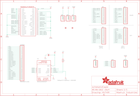

Contents
========

* [PRA3356 > Adafruit Animated Eyes Bonnet PCB](#pra3356--adafruit-animated-eyes-bonnet-pcb)
	* [Schematic](#schematic)
	* [PCB](#pcb)
	* [Interactive BOM](#interactive-bom)
	* [OOMP Parts](#oomp-parts)
	* [Images](#images)
	* [Tags](#tags)
  
![][im]
# PRA3356 > Adafruit Animated Eyes Bonnet PCB

- ID: PROJ-ADAF-3356-STAN-01
- Hex ID: PRA3356
- Name: Adafruit
- Description: Adafruit
- Long Link: [http://oom.lt/PROJ-ADAF-3356-STAN-01](http://oom.lt/PROJ-ADAF-3356-STAN-01)
- Short Link: [http://oom.lt/PRA3356](http://oom.lt/PRA3356)

## Schematic
  

## PCB
  

## Interactive BOM

- Interactive BOM page: [ibom.html](https://htmlpreview.github.io/?https://github.com/oomlout/oomlout_OOMP_projects/blob/main/PROJ-ADAF-3356-STAN-01/kicad/bom/ibom.html)

## OOMP Parts
  

|OOMP Parts|
| :---: |
|[CAPC-0805-X-UF10-V10  SMD (0805) 10 uF Capacitor (Ceramic) 10v  C1](https://github.com/oomlout/oomlout_OOMP_parts/tree/main/CAPC-0805-X-UF10-V10/)|
|HEAD-I01-X-PI25-01 CONN1|
|HEAD-I01-X-PI11-01 JP1, JP2, JP3, JP4|
|[HEAD-I01-X-PI03-01  2.54 mm 3 Pin Header  JP5, JP6, JP7](https://github.com/oomlout/oomlout_OOMP_parts/tree/main/HEAD-I01-X-PI03-01/)|
|[HEAD-I01-X-PI04-01  2.54 mm 4 Pin Header  JP8, JP9, JP10](https://github.com/oomlout/oomlout_OOMP_parts/tree/main/HEAD-I01-X-PI04-01/)|
|[RESE-0805-X-O103-01  SMD (0805) 10k Ohm Resistor  R4](https://github.com/oomlout/oomlout_OOMP_parts/tree/main/RESE-0805-X-O103-01/)|
|UNMATCHED-UNMATCHED-X-UNMATCHED-01 RPI1, U1|

## Images
  
  

|kicadPcb3d|kicadPcb3dFront|kicadPcb3dBack|eagleImage|eagleSchemImage|
| :---: | :---: | :---: | :---: | :---: |
||||||

## Tags

- hexID: PRA3356
- oompType: PROJ
- oompSize: ADAF
- oompColor: 3356
- oompDesc: STAN
- oompIndex: 01
- oompName: Adafruit Animated Eyes Bonnet PCB
- sources: All source files from https://github.com/adafruit/Adafruit-Animated-Eyes-Bonnet-PCB (source licence details in srcLicense.md)
- linkBuyPage: http://www.adafruit.com/products/3356
- oompID: PROJ-ADAF-3356-STAN-01
- oompParts: C1,CAPC-0805-X-UF10-V10
- oompParts: CONN1,HEAD-I01-X-PI25-01
- oompParts: JP1,HEAD-I01-X-PI11-01
- oompParts: JP2,HEAD-I01-X-PI11-01
- oompParts: JP3,HEAD-I01-X-PI11-01
- oompParts: JP4,HEAD-I01-X-PI11-01
- oompParts: JP5,HEAD-I01-X-PI03-01
- oompParts: JP6,HEAD-I01-X-PI03-01
- oompParts: JP7,HEAD-I01-X-PI03-01
- oompParts: JP8,HEAD-I01-X-PI04-01
- oompParts: JP9,HEAD-I01-X-PI04-01
- oompParts: JP10,HEAD-I01-X-PI04-01
- oompParts: R4,RESE-0805-X-O103-01
- oompParts: RPI1,UNMATCHED-UNMATCHED-X-UNMATCHED-01
- oompParts: U1,UNMATCHED-UNMATCHED-X-UNMATCHED-01
- rawParts: C1,10µF,CAP_CERAMIC0805-NOOUTLINE,0805-NO,Ceramic Capacitors,,
- rawParts: CONN1,HEADER-1X25,HEADER-1X25,1X25_ROUND_70MIL,,,
- rawParts: FID1,FIDUCIAL,FIDUCIAL,FIDUCIAL_1MM,Fiducial Alignment Points,EXCLUDE,
- rawParts: FID2,FIDUCIAL,FIDUCIAL,FIDUCIAL_1MM,Fiducial Alignment Points,EXCLUDE,
- rawParts: JP1,,HEADER-1X11,1X11_ROUND,,,
- rawParts: JP2,,HEADER-1X11,1X11_ROUND,,,
- rawParts: JP3,,HEADER-1X11,1X11_ROUND,,,
- rawParts: JP4,,HEADER-1X11,1X11_ROUND,,,
- rawParts: JP5,,HEADER-1X376MIL,1X03_ROUND_76,PIN HEADER,,
- rawParts: JP6,,HEADER-1X376MIL,1X03_ROUND_76,PIN HEADER,,
- rawParts: JP7,,HEADER-1X376MIL,1X03_ROUND_76,PIN HEADER,,
- rawParts: JP8,,HEADER-1X4ROUND,1X04_ROUND,PIN HEADER,,
- rawParts: JP9,,HEADER-1X4ROUND,1X04_ROUND,PIN HEADER,,
- rawParts: JP10,,HEADER-1X4ROUND,1X04_ROUND,PIN HEADER,,
- rawParts: R4,10K,RESISTOR0805_NOOUTLINE,0805-NO,Resistors,,
- rawParts: RPI1,RASPBERRYPI_BPLUS_PHAT,RASPBERRYPI_BPLUS_PHAT,PI_BONNET,,,
- rawParts: U1,ADS1015IDGST,ADC_ADS1015,MSOP10,ADS1015 - 12-bit 4-Channel I2C ADC with Internal PGA,,

[im]: kicadPcb3d_450.png
