Contents
========

* [PRA3357 > Adafruit Music Maker FeatherWing PCB](#pra3357--adafruit-music-maker-featherwing-pcb)
	* [Schematic](#schematic)
	* [PCB](#pcb)
	* [Interactive BOM](#interactive-bom)
	* [OOMP Parts](#oomp-parts)
	* [Images](#images)
	* [Tags](#tags)
  
![][im]
# PRA3357 > Adafruit Music Maker FeatherWing PCB

- ID: PROJ-ADAF-3357-STAN-01
- Hex ID: PRA3357
- Name: Adafruit
- Description: Adafruit
- Long Link: [http://oom.lt/PROJ-ADAF-3357-STAN-01](http://oom.lt/PROJ-ADAF-3357-STAN-01)
- Short Link: [http://oom.lt/PRA3357](http://oom.lt/PRA3357)

## Schematic
  
[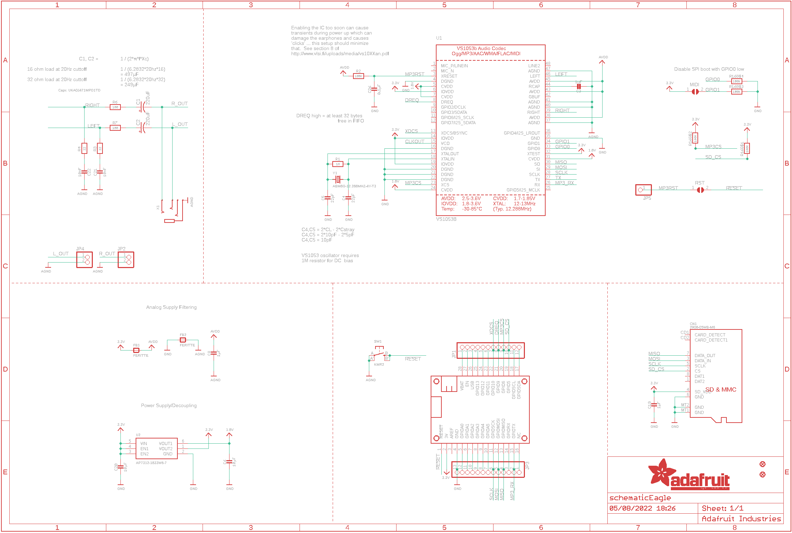](eagleSchemImage.png)
## PCB
  
[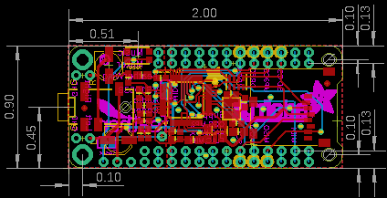](eagleImage.png)
## Interactive BOM

- Interactive BOM page: [ibom.html](https://htmlpreview.github.io/?https://github.com/oomlout/oomlout_OOMP_projects/blob/main/PROJ-ADAF-3357-STAN-01/kicad/bom/ibom.html)

## OOMP Parts
  

|OOMP ID|Name|Identifier|
| :---: | :---: | :---: |
|CAPE-PANC-X-UF220-01||C1, C2|
|[CAPC-0603-X-UF1-V25](https://github.com/oomlout/oomlout_OOMP_parts/tree/main/CAPC-0603-X-UF1-V25/)|[SMD (0603) 1 uF Capacitor (Ceramic) 25v](https://github.com/oomlout/oomlout_OOMP_parts/tree/main/CAPC-0603-X-UF1-V25/)|[C3](https://github.com/oomlout/oomlout_OOMP_parts/tree/main/CAPC-0603-X-UF1-V25/)|
|[CAPC-0603-X-PF22-V50](https://github.com/oomlout/oomlout_OOMP_parts/tree/main/CAPC-0603-X-PF22-V50/)|[SMD (0603) 22 pF Capacitor (Ceramic) 50v](https://github.com/oomlout/oomlout_OOMP_parts/tree/main/CAPC-0603-X-PF22-V50/)|[C4, C5](https://github.com/oomlout/oomlout_OOMP_parts/tree/main/CAPC-0603-X-PF22-V50/)|
|CAPC-0805-X-UNMATCHED-01||C6, C20|
|CAPC-0603-X-UNMATCHED-01||C8, C19, C26|
|[CAPC-0603-X-NF10-V50](https://github.com/oomlout/oomlout_OOMP_parts/tree/main/CAPC-0603-X-NF10-V50/)|[SMD (0603) 10 nF Capacitor (Ceramic) 50v](https://github.com/oomlout/oomlout_OOMP_parts/tree/main/CAPC-0603-X-NF10-V50/)|[C21, C22](https://github.com/oomlout/oomlout_OOMP_parts/tree/main/CAPC-0603-X-NF10-V50/)|
|UNMATCHED-UNMATCHED-X-UNMATCHED-01||CN1, MS1, U1, X1, Y1|
|FERB-0805-X-UNMATCHED-01||FB1, FB2|
|[HEAD-I01-X-PI12-01](https://github.com/oomlout/oomlout_OOMP_parts/tree/main/HEAD-I01-X-PI12-01/)|[2.54 mm 12 Pin Header](https://github.com/oomlout/oomlout_OOMP_parts/tree/main/HEAD-I01-X-PI12-01/)|[JP1](https://github.com/oomlout/oomlout_OOMP_parts/tree/main/HEAD-I01-X-PI12-01/)|
|[HEAD-I01-X-PI02-01](https://github.com/oomlout/oomlout_OOMP_parts/tree/main/HEAD-I01-X-PI02-01/)|[2.54 mm 2 Pin Header](https://github.com/oomlout/oomlout_OOMP_parts/tree/main/HEAD-I01-X-PI02-01/)|[JP2, JP4](https://github.com/oomlout/oomlout_OOMP_parts/tree/main/HEAD-I01-X-PI02-01/)|
|HEAD-I01-X-PI13-01||JP3|
|HEAD-I01-X-PI01-01||JP5|
|[RESE-0603-X-O105-01](https://github.com/oomlout/oomlout_OOMP_parts/tree/main/RESE-0603-X-O105-01/)|[SMD (0603) 1M Ohm Resistor](https://github.com/oomlout/oomlout_OOMP_parts/tree/main/RESE-0603-X-O105-01/)|[R1](https://github.com/oomlout/oomlout_OOMP_parts/tree/main/RESE-0603-X-O105-01/)|
|RESE-0603-X-O1003-01||R2|
|[RESE-0603-X-O220-01](https://github.com/oomlout/oomlout_OOMP_parts/tree/main/RESE-0603-X-O220-01/)|[SMD (0603) 22 Ohm Resistor](https://github.com/oomlout/oomlout_OOMP_parts/tree/main/RESE-0603-X-O220-01/)|[R3, R4](https://github.com/oomlout/oomlout_OOMP_parts/tree/main/RESE-0603-X-O220-01/)|
|[RESE-0603-X-O101-01](https://github.com/oomlout/oomlout_OOMP_parts/tree/main/RESE-0603-X-O101-01/)|[SMD (0603) 100 Ohm Resistor](https://github.com/oomlout/oomlout_OOMP_parts/tree/main/RESE-0603-X-O101-01/)|[R6, R7](https://github.com/oomlout/oomlout_OOMP_parts/tree/main/RESE-0603-X-O101-01/)|
|RESA-06038-X-O1003X4-01||R16|
|[BUTA-4628-X-STAN-01](https://github.com/oomlout/oomlout_OOMP_parts/tree/main/BUTA-4628-X-STAN-01/)|[SMD (4628) Pushbutton (Tactile)](https://github.com/oomlout/oomlout_OOMP_parts/tree/main/BUTA-4628-X-STAN-01/)|[SW1](https://github.com/oomlout/oomlout_OOMP_parts/tree/main/BUTA-4628-X-STAN-01/)|
|UNMATCHED-SO23-X-UNMATCHED-01||U2|

## Images
  
  

|bominteractivefront|bominteractiveback|kicadPcb3d|kicadPcb3dFront|kicadPcb3dBack|kicadSchem|eagleImage|eagleSchemImage|pcbdraw|pcbdrawback|
| :---: | :---: | :---: | :---: | :---: | :---: | :---: | :---: | :---: | :---: |
|[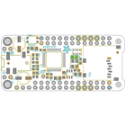](bomFront.png)|[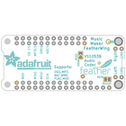](bomBack.png)|[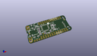](kicadPcb3d.png)|[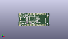](kicadPcb3dFront.png)|[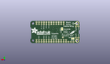](kicadPcb3dBack.png)|[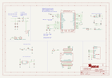](kicadSchem.png)||[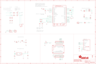](eagleSchemImage.png)|[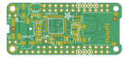](pcbdraw.png)|[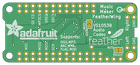](pcbdrawBack.png)|

## Tags

- hexID: PRA3357
- oompType: PROJ
- oompSize: ADAF
- oompColor: 3357
- oompDesc: STAN
- oompIndex: 01
- oompName: Adafruit Music Maker FeatherWing PCB
- sources: All source files from https://github.com/adafruit/Adafruit-Music-Maker-FeatherWing-PCB (source licence details in srcLicense.md)
- linkBuyPage: http://www.adafruit.com/products/3357
- oompID: PROJ-ADAF-3357-STAN-01
- oompParts: C1,CAPE-PANC-X-UF220-01
- oompParts: C2,CAPE-PANC-X-UF220-01
- oompParts: C3,CAPC-0603-X-UF1-V25
- oompParts: C4,CAPC-0603-X-PF22-V50
- oompParts: C5,CAPC-0603-X-PF22-V50
- oompParts: C6,CAPC-0805-X-UNMATCHED-01
- oompParts: C8,CAPC-0603-X-UNMATCHED-01
- oompParts: C19,CAPC-0603-X-UNMATCHED-01
- oompParts: C20,CAPC-0805-X-UNMATCHED-01
- oompParts: C21,CAPC-0603-X-NF10-V50
- oompParts: C22,CAPC-0603-X-NF10-V50
- oompParts: C26,CAPC-0603-X-UNMATCHED-01
- oompParts: CN1,UNMATCHED-UNMATCHED-X-UNMATCHED-01
- oompParts: FB1,FERB-0805-X-UNMATCHED-01
- oompParts: FB2,FERB-0805-X-UNMATCHED-01
- oompParts: JP1,HEAD-I01-X-PI12-01
- oompParts: JP2,HEAD-I01-X-PI02-01
- oompParts: JP3,HEAD-I01-X-PI13-01
- oompParts: JP4,HEAD-I01-X-PI02-01
- oompParts: JP5,HEAD-I01-X-PI01-01
- oompParts: MS1,UNMATCHED-UNMATCHED-X-UNMATCHED-01
- oompParts: R1,RESE-0603-X-O105-01
- oompParts: R2,RESE-0603-X-O1003-01
- oompParts: R3,RESE-0603-X-O220-01
- oompParts: R4,RESE-0603-X-O220-01
- oompParts: R6,RESE-0603-X-O101-01
- oompParts: R7,RESE-0603-X-O101-01
- oompParts: R16,RESA-06038-X-O1003X4-01
- oompParts: SW1,BUTA-4628-X-STAN-01
- oompParts: U1,UNMATCHED-UNMATCHED-X-UNMATCHED-01
- oompParts: U2,UNMATCHED-SO23-X-UNMATCHED-01
- oompParts: X1,UNMATCHED-UNMATCHED-X-UNMATCHED-01
- oompParts: Y1,UNMATCHED-UNMATCHED-X-UNMATCHED-01
- rawParts: C1,220uF,CPOL-USC,PANASONIC_C,POLARIZED CAPACITOR, American symbol,,
- rawParts: C2,220uF,CPOL-USC,PANASONIC_C,POLARIZED CAPACITOR, American symbol,,
- rawParts: C3,1uF,CAP_CERAMIC0603_NO,0603-NO,Ceramic Capacitors,,
- rawParts: C4,22pF,CAP_CERAMIC0603_NO,0603-NO,Ceramic Capacitors,,
- rawParts: C5,22pF,CAP_CERAMIC0603_NO,0603-NO,Ceramic Capacitors,,
- rawParts: C6,10µF,CAP_CERAMIC_0805MP,_0805MP,Ceramic Capacitors,,
- rawParts: C8,1µF,CAP_CERAMIC0603_NO,0603-NO,Ceramic Capacitors,,
- rawParts: C19,1µF,CAP_CERAMIC0603_NO,0603-NO,Ceramic Capacitors,,
- rawParts: C20,10µF,CAP_CERAMIC0805-NOOUTLINE,0805-NO,Ceramic Capacitors,,
- rawParts: C21,10nF,CAP_CERAMIC0603_NO,0603-NO,Ceramic Capacitors,,
- rawParts: C22,10nF,CAP_CERAMIC0603_NO,0603-NO,Ceramic Capacitors,,
- rawParts: C26,0.1µF,CAP_CERAMIC0603_NO,0603-NO,Ceramic Capacitors,,
- rawParts: CN1,2908-05WB-M6,MICROSD,MICROSD,MicroSD/Transflash Card Holder with SPI pinout,,
- rawParts: FB1,FERITTE,FERRITE-0805NO,0805-NO,Ferrite Bead,,
- rawParts: FB2,FERITTE,FERRITE-0805NO,0805-NO,Ferrite Bead,,
- rawParts: FID1,FIDUCIAL,FIDUCIAL,FIDUCIAL_1MM,Fiducial Alignment Points,EXCLUDE,
- rawParts: FID2,FIDUCIAL,FIDUCIAL,FIDUCIAL_1MM,Fiducial Alignment Points,EXCLUDE,
- rawParts: JP1,,HEADER-1X12,1X12_ROUND,,,
- rawParts: JP2,,HEADER-1X2ROUND,1X02_ROUND,PIN HEADER,,
- rawParts: JP3,,HEADER-1X13,1X13_ROUND_70,,,
- rawParts: JP4,,HEADER-1X2ROUND,1X02_ROUND,PIN HEADER,,
- rawParts: JP5,,HEADER-1X1ROUND,1X01_ROUND,PIN HEADER,,
- rawParts: MIDI,,SOLDERJUMPER,SOLDERJUMPER_ARROW_NOPASTE,SMD Solder JUMPER,EXCLUDE,
- rawParts: MS1,FEATHERWING_NODIM,FEATHERWING_NODIM,FEATHERWING_NODIM,,,
- rawParts: R1,1M,RESISTOR_0603_NOOUT,0603-NO,Resistors,,
- rawParts: R2,100K,RESISTOR_0603_NOOUT,0603-NO,Resistors,,
- rawParts: R3,22,RESISTOR_0603_NOOUT,0603-NO,Resistors,,
- rawParts: R4,22,RESISTOR_0603_NOOUT,0603-NO,Resistors,,
- rawParts: R6,100,RESISTOR_0603_NOOUT,0603-NO,Resistors,,
- rawParts: R7,100,RESISTOR_0603_NOOUT,0603-NO,Resistors,,
- rawParts: R16,100K,RESISTOR_4PACK,RESPACK_4X0603,Resistor Packs (4 resistors),,
- rawParts: RST,,SOLDERJUMPERCLOSED,SOLDERJUMPER_CLOSEDWIRE,SMD Solder JUMPER,,
- rawParts: SW1,KMR2,SWITCH_TACT_SMT4.6X2.8,BTN_KMR2_4.6X2.8,SMT Tact Switches,,
- rawParts: U1,VS1053B,VS1053B,LQFP48,VS1053b Audio Codec - Ogg Vorbis/MP3/AAC/WMA/FLAC/MIDI,,
- rawParts: U2,AP7312-1833W6-7,VREG_SOT23-6_DUALAP7312,SOT23-6,Dual Output SOT23-6 Linear Regulators,,
- rawParts: X1,,AUDIO_3.5MMJACK_4POL,4UCONN_18510,Footprint courtesy Morten Hjerde (Riftlabs.com),,
- rawParts: Y1,ABM8G-12.288MHZ-4Y-T3,CRYSTAL3.2X2.5,CRYSTAL_3.2X2.5,Crystals,,

[im]: kicadPcb3d_450.png
