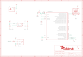

Contents
========

* [PRA3364 > Adafruit pIRKey PCB](#pra3364--adafruit-pirkey-pcb)
	* [Schematic](#schematic)
	* [PCB](#pcb)
	* [Interactive BOM](#interactive-bom)
	* [OOMP Parts](#oomp-parts)
	* [Images](#images)
	* [Tags](#tags)
  
![][im]
# PRA3364 > Adafruit pIRKey PCB

- ID: PROJ-ADAF-3364-STAN-01
- Hex ID: PRA3364
- Name: Adafruit
- Description: Adafruit
- Long Link: [http://oom.lt/PROJ-ADAF-3364-STAN-01](http://oom.lt/PROJ-ADAF-3364-STAN-01)
- Short Link: [http://oom.lt/PRA3364](http://oom.lt/PRA3364)

## Schematic
  

## PCB
  

## Interactive BOM

- Interactive BOM page: [ibom.html](https://htmlpreview.github.io/?https://github.com/oomlout/oomlout_OOMP_projects/blob/main/PROJ-ADAF-3364-STAN-01/kicad/bom/ibom.html)

## OOMP Parts
  

|OOMP Parts|
| :---: |
|[CAPC-0805-X-UF10-V10  SMD (0805) 10 uF Capacitor (Ceramic) 10v  C3, C8](https://github.com/oomlout/oomlout_OOMP_parts/tree/main/CAPC-0805-X-UF10-V10/)|
|[CAPC-0603-X-UF1-V25  SMD (0603) 1 uF Capacitor (Ceramic) 25v  C4, C5](https://github.com/oomlout/oomlout_OOMP_parts/tree/main/CAPC-0603-X-UF1-V25/)|
|UNMATCHED-UNMATCHED-X-UNMATCHED-01 CN1, IC2, IC3, RST, SWC, SWD|
|[LEDS-2020-RGB-K102-01  SMD (2020) Smart Controller (APA102) RGB LED  LED2](https://github.com/oomlout/oomlout_OOMP_parts/tree/main/LEDS-2020-RGB-K102-01/)|
|[BUTA-4628-X-STAN-01  SMD (4628) Pushbutton (Tactile)  Q2](https://github.com/oomlout/oomlout_OOMP_parts/tree/main/BUTA-4628-X-STAN-01/)|
|[RESE-0603-X-O222-01  SMD (0603) 2.2k Ohm Resistor  R4](https://github.com/oomlout/oomlout_OOMP_parts/tree/main/RESE-0603-X-O222-01/)|
|VREG-SO235-X-KAP2112K-V33D U1|

## Images
  
  

|kicadPcb3d|kicadPcb3dFront|kicadPcb3dBack|eagleImage|eagleSchemImage|
| :---: | :---: | :---: | :---: | :---: |
||||||

## Tags

- hexID: PRA3364
- oompType: PROJ
- oompSize: ADAF
- oompColor: 3364
- oompDesc: STAN
- oompIndex: 01
- oompName: Adafruit pIRKey PCB
- sources: All source files from https://github.com/adafruit/Adafruit-pIRKey-PCB (source licence details in srcLicense.md)
- linkBuyPage: http://www.adafruit.com/products/3364
- oompID: PROJ-ADAF-3364-STAN-01
- oompParts: C3,CAPC-0805-X-UF10-V10
- oompParts: C4,CAPC-0603-X-UF1-V25
- oompParts: C5,CAPC-0603-X-UF1-V25
- oompParts: C8,CAPC-0805-X-UF10-V10
- oompParts: CN1,UNMATCHED-UNMATCHED-X-UNMATCHED-01
- oompParts: IC2,UNMATCHED-UNMATCHED-X-UNMATCHED-01
- oompParts: IC3,UNMATCHED-UNMATCHED-X-UNMATCHED-01
- oompParts: LED2,LEDS-2020-RGB-K102-01
- oompParts: Q2,BUTA-4628-X-STAN-01
- oompParts: R4,RESE-0603-X-O222-01
- oompParts: RST,UNMATCHED-UNMATCHED-X-UNMATCHED-01
- oompParts: SWC,UNMATCHED-UNMATCHED-X-UNMATCHED-01
- oompParts: SWD,UNMATCHED-UNMATCHED-X-UNMATCHED-01
- oompParts: U1,VREG-SO235-X-KAP2112K-V33D
- rawParts: C3,10uF,CAP_CERAMIC0805-NOOUTLINE,0805-NO,Ceramic Capacitors,,,
- rawParts: C4,1uF,CAP_CERAMIC0603_NO,0603-NO,Ceramic Capacitors,,,
- rawParts: C5,1uF,CAP_CERAMIC0603_NO,0603-NO,Ceramic Capacitors,,,
- rawParts: C8,10uF,CAP_CERAMIC0805-NOOUTLINE,0805-NO,Ceramic Capacitors,,,
- rawParts: CN1,,USB_TYPEAPCB,USBA_PCB,USB - Type A Connectors,,,
- rawParts: FID1,FIDUCIAL_1MM,FIDUCIAL_1MM,FIDUCIAL_1MM,Fiducial Alignment Points,EXCLUDE,,
- rawParts: FID2,FIDUCIAL_1MM,FIDUCIAL_1MM,FIDUCIAL_1MM,Fiducial Alignment Points,EXCLUDE,,
- rawParts: IC2,TSOP75XYY,TSOP75XYY,TSOP75XYY,Vishay TSOP75XYY, where X is 2 (normal), or 4 (high noise environments, and YY is the demodulation frequency (36, 38, 40 KHz).,,,
- rawParts: IC3,ATSAMD21E,ATSAMD21E,QFN32_5MM,,,,
- rawParts: LED2,AP102-2020,APA1022020,APA102_2020,APA102/DotStar Pixels,,,
- rawParts: Q2,reset,SWITCH_TACT_SMT4.6X2.8,BTN_KMR2_4.6X2.8,SMT Tact Switches,,,
- rawParts: R4,2.2K,RESISTOR_0603_NOOUT,0603-NO,Resistors,,,
- rawParts: RST,TPTP16R,TPTP16R,TP16R,Test pad,,,
- rawParts: SWC,TPTP15R,TPTP15R,TP15R,Test pad,,,
- rawParts: SWD,TPTP16R,TPTP16R,TP16R,Test pad,,,
- rawParts: U1,AP2112K-3.3,VREG_SOT23-5,SOT23-5,SOT23-5 Fixed Voltage Regulators,,,

[im]: kicadPcb3d_450.png
