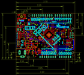
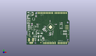
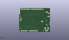
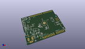

Contents
========

* [PROJ-ADAF-3382-STAN-01>Adafruit Metro M4 Express PCB](#proj-adaf-3382-stan-01adafruit-metro-m4-express-pcb)
	* [Images](#images)
	* [Interactive BOM](#interactive-bom)
	* [OOMP Parts](#oomp-parts)
	* [Tags](#tags)
  
![][im]
# PROJ-ADAF-3382-STAN-01>Adafruit Metro M4 Express PCB

- ID: PROJ-ADAF-3382-STAN-01
- Hex ID: PRA3382
- Name: Adafruit Metro M4 Express PCB
- Description: 

## Images
  
  

|eagleImage|kicadPcb3dFront|kicadPcb3dBack|kicadPcb3d|
| :---: | :---: | :---: | :---: |
|||||

## Interactive BOM

- Interactive BOM page: [ibom.html](kicad/bom/ibom.html)

## OOMP Parts
  

|OOMP Parts|
| :---: |
|UNMATCHED-UNMATCHED-X-UNMATCHED-01, AD, 57.15, 2.54, 0,AD, 20609, 1X06_OVALWAVE, microbuilder, (2.25, 0.1), R0|
|CAPC-0805-X-UNMATCHED-01, C1, 26.775209339999996, 25.273, 225,C1, 10uF, 0805-NO, microbuilder, (1.0541421, 0.995), R225|
|<table><tr><td></td><td> C2</td><td>[CAPC-0805-X-NF100-V50 SMD (0805) 100 nF Capacitor (Ceramic) 50v](https://github.com/oomlout/oomlout_OOMP_parts/tree/main/CAPC-0805-X-NF100-V50/)</td><td>[C85N100](https://github.com/oomlout/oomlout_OOMP_parts/tree/main/CAPC-0805-X-NF100-V50/)</td></tr></table>|
|CAPC-0805-X-UNMATCHED-01, C3, 26.542999999999996, 10.033, 0,C3, 10uF, 0805-NO, microbuilder, (1.045, 0.395), R0|
|CAPC-0603-X-UNMATCHED-01, C4, 41.783, 17.145, 270,C4, .1u, 0603-NO, microbuilder, (1.645, 0.675), R270|
|CAPE-0603-X-UNMATCHED-01, C5, 36.83, 18.160999999999998, 270,C5, 22pF, 0603-NO, microbuilder, (1.45, 0.715), R270|
|CAPC-0603-X-UNMATCHED-01, C6, 27.915565708, 7.328799921999999, 90,C6, .1u, 0603-NO, microbuilder, (1.09903802, 0.28853543), R90|
|CAPE-0603-X-UNMATCHED-01, C7, 37.719, 15.112999999999998, 180,C7, 22pF, 0603-NO, microbuilder, (1.485, 0.595), R180|
|CAPC-0603-X-UNMATCHED-01, C8, 27.552618757999998, 22.410987436, 135,C8, .1u, 0603-NO, microbuilder, (1.08474877, 0.88232234), R135|
|CAPC-0603-X-UNMATCHED-01, C9, 29.374196775999998, 26.781590581999996, 135,C9, 1uF, 0603-NO, microbuilder, (1.15646444, 1.05439333), R135|
|CAPC-0603-X-UNMATCHED-01, C10, 29.938412563999997, 29.045806272, 315,C10, .1u, 0603-NO, microbuilder, (1.17867766, 1.14353568), R315|
|CAPC-0603-X-UNMATCHED-01, C11, 31.660196776, 21.119196776, 45,C11, .1u, 0603-NO, microbuilder, (1.24646444, 0.83146444), R45|
|<table><tr><td></td><td> C12</td><td>[CAPC-0603-X-NF100-V50 SMD (0603) 100 nF Capacitor (Ceramic) 50v](https://github.com/oomlout/oomlout_OOMP_parts/tree/main/CAPC-0603-X-NF100-V50/)</td><td>[C6N100](https://github.com/oomlout/oomlout_OOMP_parts/tree/main/CAPC-0603-X-NF100-V50/)</td></tr></table>|
|<table><tr><td></td><td> C13</td><td>[CAPC-0603-X-NF100-V50 SMD (0603) 100 nF Capacitor (Ceramic) 50v](https://github.com/oomlout/oomlout_OOMP_parts/tree/main/CAPC-0603-X-NF100-V50/)</td><td>[C6N100](https://github.com/oomlout/oomlout_OOMP_parts/tree/main/CAPC-0603-X-NF100-V50/)</td></tr></table>|
|CAPC-0603-X-UNMATCHED-01, C14, 42.281968776, 20.499603146, 90,C14, .1u, 0603-NO, microbuilder, (1.66464444, 0.80707099), R90|
|CAPC-0603-X-UNMATCHED-01, C15, 37.539393806, 37.719, 270,C15, .1u, 0603-NO, microbuilder, (1.47792889, 1.485), R270|
|CAPC-0603-X-UNMATCHED-01, C16, 47.1424, 32.486599999999996, 180,C16, .1u, 0603-NO, microbuilder, (1.856, 1.279), R180|
|<table><tr><td></td><td> C17</td><td>[CAPC-0603-X-NF100-V50 SMD (0603) 100 nF Capacitor (Ceramic) 50v](https://github.com/oomlout/oomlout_OOMP_parts/tree/main/CAPC-0603-X-NF100-V50/)</td><td>[C6N100](https://github.com/oomlout/oomlout_OOMP_parts/tree/main/CAPC-0603-X-NF100-V50/)</td></tr></table>|
|UNMATCHED-UNMATCHED-X-UNMATCHED-01, D1, 13.7414, 13.3858, 180,D1, MBR120, SOD-123, microbuilder, (0.541, 0.527), R180|
|UNMATCHED-UNMATCHED-X-UNMATCHED-01, F2, 8.762999999999998, 32.385, 270,F2, 500mA, R1206, adafruit, (0.345, 1.275), R270|
|UNMATCHED-0805-X-UNMATCHED-01, FB2, 1.778, 44.830999999999996, 270,FB2, FERRITE, 0805-NO, microbuilder, (0.07, 1.765), R270|
|UNMATCHED-UNMATCHED-X-UNMATCHED-01, IC3, 13.030199999999999, 29.0322, 90,IC3, 74LVC1G125D, SOT23-5, 74xx-little-de, (0.513, 1.143), R90|
|ERROR, ICSP 3x2 M, 0, 0, 0,ICSP, 3x2, M, 2X03_ROUND_70MIL, microbuilder, (2.545, 1.1), R270|
|UNMATCHED-UNMATCHED-X-UNMATCHED-01, IOH, 30.225999999999996, 50.8, 0,IOH, 20611, 1X10_OVALWAVE, microbuilder, (1.19, 2), R0|
|UNMATCHED-UNMATCHED-X-UNMATCHED-01, IOL, 54.60999999999999, 50.8, 0,IOL, 20610, 1X08_OVALWAVE, microbuilder, (2.15, 2), R0|
|HEAD-I01-X-PI01-01, JP1, 5.460999999999999, 13.716, 0,JP1, 1X01_ROUND, microbuilder, (0.215, 0.54), R0|
|LEDS-UNMATCHED-X-UNMATCHED-01, L, 3.6829999999999994, 31.623, 90,L, RED, CHIPLED_0805_NOOUTLINE, microbuilder, (0.145, 1.245), R90|
|UNMATCHED-UNMATCHED-X-UNMATCHED-01, L1, 29.389603146, 23.801603146, 315,L1, 10uH, INDUCTOR_1007, microbuilder, (1.15707099, 0.93707099), R315|
|UNMATCHED-UNMATCHED-X-UNMATCHED-01, LED1, 11.302999999999999, 41.148, 180,LED1, WS2812B3535, LED3535, microbuilder, (0.445, 1.62), R180|
|UNMATCHED-UNMATCHED-X-UNMATCHED-01, ON, 3.556, 24.637999999999998, 270,ON, GREEN, CHIPLED_0805_NOOUTLINE, microbuilder, (0.14, 0.97), R270|
|UNMATCHED-UNMATCHED-X-UNMATCHED-01, PC1, 19.0754, 10.287, 90,PC1, 47uF/25V, PANASONIC_D, microbuilder, (0.751, 0.405), R90|
|UNMATCHED-UNMATCHED-X-UNMATCHED-01, PC2, 21.59, 18.2626, 180,PC2, 47uF+/6.3V+, PANASONIC_D, microbuilder, (0.85, 0.719), R180|
|UNMATCHED-UNMATCHED-X-UNMATCHED-01, POWER, 36.83, 2.54, 0,POWER, 20610, 1X08_OVALWAVE, microbuilder, (1.45, 0.1), R0|
|RESE-UNMATCHED-X-O104-01, R1, 17.779999999999998, 29.717999999999996, 90,R1, 100K, RESPACK_4X0603, microbuilder, (0.7, 1.17), R90|
|RESE-UNMATCHED-X-UNMATCHED-01, R2, 7.238999999999999, 27.304999999999996, 270,R2, 1K, RESPACK_4X0603, microbuilder, (0.285, 1.075), R270|
|<table><tr><td></td><td> R3</td><td>[RESE-0603-X-O103-01 SMD (0603) 10k Ohm Resistor](https://github.com/oomlout/oomlout_OOMP_parts/tree/main/RESE-0603-X-O103-01/)</td><td>[R6103](https://github.com/oomlout/oomlout_OOMP_parts/tree/main/RESE-0603-X-O103-01/)</td></tr></table>|
|RESE-0603-X-UNMATCHED-01, R4, 64.13499999999999, 13.589, 270,R4, 1K, 0603-NO, microbuilder, (2.525, 0.535), R270|
|<table><tr><td></td><td> R5</td><td>[RESE-0603-X-O103-01 SMD (0603) 10k Ohm Resistor](https://github.com/oomlout/oomlout_OOMP_parts/tree/main/RESE-0603-X-O103-01/)</td><td>[R6103](https://github.com/oomlout/oomlout_OOMP_parts/tree/main/RESE-0603-X-O103-01/)</td></tr></table>|
|<table><tr><td></td><td> R7</td><td>[RESE-0603-X-O103-01 SMD (0603) 10k Ohm Resistor](https://github.com/oomlout/oomlout_OOMP_parts/tree/main/RESE-0603-X-O103-01/)</td><td>[R6103](https://github.com/oomlout/oomlout_OOMP_parts/tree/main/RESE-0603-X-O103-01/)</td></tr></table>|
|<table><tr><td></td><td> R11</td><td>[RESE-0603-X-O331-01 SMD (0603) 330 Ohm Resistor](https://github.com/oomlout/oomlout_OOMP_parts/tree/main/RESE-0603-X-O331-01/)</td><td>[R6331](https://github.com/oomlout/oomlout_OOMP_parts/tree/main/RESE-0603-X-O331-01/)</td></tr></table>|
|ERROR, RESET EVQQ 6mm, 0, 0, 0,RESET, EVQQ, 6mm, EVQ-Q2, microbuilder, (0.25, 1.945), R180|
|UNMATCHED-UNMATCHED-X-UNMATCHED-01, RXLED, 3.556, 29.463999999999995, 270,RXLED, YELLOW, CHIPLED_0805_NOOUTLINE, microbuilder, (0.14, 1.16), R270|
|UNMATCHED-UNMATCHED-X-UNMATCHED-01, SW1, 2.921, 18.796, 270,SW1, SPDT_SMT_SSSS811101, microbuilder, (0.115, 0.74), R270|
|UNMATCHED-UNMATCHED-X-UNMATCHED-01, T2, 13.462, 10.287, 180,T2, DMP3098L-7, SOT-23, zetex, (0.53, 0.405), R180|
|UNMATCHED-UNMATCHED-X-UNMATCHED-01, TR1, 12.7, 24.307799999999997, 90,TR1, DMP3098L-7, SOT-23, Transistors, (0.5, 0.957), R90|
|UNMATCHED-UNMATCHED-X-UNMATCHED-01, TXLED, 3.556, 26.924, 270,TXLED, YELLOW, CHIPLED_0805_NOOUTLINE, microbuilder, (0.14, 1.06), R270|
|UNMATCHED-UNMATCHED-X-UNMATCHED-01, U$1, 38.301396854, 28.097812486, 135,U$1, ATSAMD51J, PQFN64-1, microbuilder, (1.50792901, 1.10621309), R135|
|UNMATCHED-UNMATCHED-X-UNMATCHED-01, U1, 12.877799999999999, 18.440399999999997, 90,U1, NCP1117ST50T3G, SOT223-R, microbuilder, (0.507, 0.726), R90|
|UNMATCHED-UNMATCHED-X-UNMATCHED-01, U2, 24.764999999999997, 7.365999999999999, 270,U2, AP2112K-3.3, SOT23-DBV, SmartPrj, (0.975, 0.29), R270|
|ERROR, U3 SPI Flash, 0, 0, 0,U3, SPI, Flash, SOIC8_208MIL, microbuilder, (2.175, 1.16), R180|
|ERROR, X2 2x5 0.05, 0, 0, 0,X2, 2x5, 0.05, SWD, 2X05_1.27MM_BOX_POSTS, microbuilder, (2.415, 0.76), R180|
|UNMATCHED-UNMATCHED-X-UNMATCHED-01, X3, 4.3180000000000005, 38.099999999999994, 270,X3, 20329, 4UCONN_20329_V2, microbuilder, (0.17, 1.5), R270|
|UNMATCHED-UNMATCHED-X-UNMATCHED-01, X4, 38.73499999999999, 17.779999999999998, 90,X4, 32.768, XTAL3215, adafruit2, (1.525, 0.7), R90|
|UNMATCHED-UNMATCHED-X-UNMATCHED-01, X5, -3.302, 7.746999999999999, 0,X5, 2.1mm, DCJACK_2MM_PTH, microbuilder, (-0.13, 0.305), R0|

## Tags

- hexID: PRA3382
- oompType: PROJ
- oompSize: ADAF
- oompColor: 3382
- oompDesc: STAN
- oompIndex: 01
- oompName: Adafruit Metro M4 Express PCB
- sources: All source files from https://github.com/adafruit/Adafruit-Metro-M4-Express-PCB (source licence details in srcLicense.md)
- linkBuyPage: http://www.adafruit.com/products/3382
- oompPart: UNMATCHED-UNMATCHED-X-UNMATCHED-01, AD, 57.15, 2.54, 0
- oompPart: CAPC-0805-X-UNMATCHED-01, C1, 26.775209339999996, 25.273, 225
- oompPart: CAPC-0805-X-NF100-V50, C2, 22.987, 13.843, 180
- oompPart: CAPC-0805-X-UNMATCHED-01, C3, 26.542999999999996, 10.033, 0
- oompPart: CAPC-0603-X-UNMATCHED-01, C4, 41.783, 17.145, 270
- oompPart: CAPE-0603-X-UNMATCHED-01, C5, 36.83, 18.160999999999998, 270
- oompPart: CAPC-0603-X-UNMATCHED-01, C6, 27.915565708, 7.328799921999999, 90
- oompPart: CAPE-0603-X-UNMATCHED-01, C7, 37.719, 15.112999999999998, 180
- oompPart: CAPC-0603-X-UNMATCHED-01, C8, 27.552618757999998, 22.410987436, 135
- oompPart: CAPC-0603-X-UNMATCHED-01, C9, 29.374196775999998, 26.781590581999996, 135
- oompPart: CAPC-0603-X-UNMATCHED-01, C10, 29.938412563999997, 29.045806272, 315
- oompPart: CAPC-0603-X-UNMATCHED-01, C11, 31.660196776, 21.119196776, 45
- oompPart: CAPC-0603-X-NF100-V50, C12, 16.891, 23.114, 0
- oompPart: CAPC-0603-X-NF100-V50, C13, 26.542999999999996, 11.811, 180
- oompPart: CAPC-0603-X-UNMATCHED-01, C14, 42.281968776, 20.499603146, 90
- oompPart: CAPC-0603-X-UNMATCHED-01, C15, 37.539393806, 37.719, 270
- oompPart: CAPC-0603-X-UNMATCHED-01, C16, 47.1424, 32.486599999999996, 180
- oompPart: CAPC-0603-X-NF100-V50, C17, 14.350999999999997, 45.4914, 90
- oompPart: UNMATCHED-UNMATCHED-X-UNMATCHED-01, D1, 13.7414, 13.3858, 180
- oompPart: UNMATCHED-UNMATCHED-X-UNMATCHED-01, F2, 8.762999999999998, 32.385, 270
- oompPart: UNMATCHED-0805-X-UNMATCHED-01, FB2, 1.778, 44.830999999999996, 270
- oompPart: SKIP-UNMATCHED-X-UNMATCHED-01, FD1, 10.921999999999999, 49.275999999999996, 0
- oompPart: SKIP-UNMATCHED-X-UNMATCHED-01, FD2, 66.159000016, 4.549000046, 0
- oompPart: SKIP-UNMATCHED-X-UNMATCHED-01, FD3, 22.906999906, 3.2830000379999995, 0
- oompPart: SKIP-UNMATCHED-X-UNMATCHED-01, GROUND1, 7.112, 44.704, M180
- oompPart: UNMATCHED-UNMATCHED-X-UNMATCHED-01, IC3, 13.030199999999999, 29.0322, 90
- oompPart: ERROR, ICSP 3x2 M, 0, 0, 0
- oompPart: UNMATCHED-UNMATCHED-X-UNMATCHED-01, IOH, 30.225999999999996, 50.8, 0
- oompPart: UNMATCHED-UNMATCHED-X-UNMATCHED-01, IOL, 54.60999999999999, 50.8, 0
- oompPart: HEAD-I01-X-PI01-01, JP1, 5.460999999999999, 13.716, 0
- oompPart: LEDS-UNMATCHED-X-UNMATCHED-01, L, 3.6829999999999994, 31.623, 90
- oompPart: UNMATCHED-UNMATCHED-X-UNMATCHED-01, L1, 29.389603146, 23.801603146, 315
- oompPart: UNMATCHED-UNMATCHED-X-UNMATCHED-01, LED1, 11.302999999999999, 41.148, 180
- oompPart: UNMATCHED-UNMATCHED-X-UNMATCHED-01, ON, 3.556, 24.637999999999998, 270
- oompPart: UNMATCHED-UNMATCHED-X-UNMATCHED-01, PC1, 19.0754, 10.287, 90
- oompPart: UNMATCHED-UNMATCHED-X-UNMATCHED-01, PC2, 21.59, 18.2626, 180
- oompPart: UNMATCHED-UNMATCHED-X-UNMATCHED-01, POWER, 36.83, 2.54, 0
- oompPart: RESE-UNMATCHED-X-O104-01, R1, 17.779999999999998, 29.717999999999996, 90
- oompPart: RESE-UNMATCHED-X-UNMATCHED-01, R2, 7.238999999999999, 27.304999999999996, 270
- oompPart: RESE-0603-X-O103-01, R3, 16.017403068, 45.481406369999995, 90
- oompPart: RESE-0603-X-UNMATCHED-01, R4, 64.13499999999999, 13.589, 270
- oompPart: RESE-0603-X-O103-01, R5, 56.13399999999999, 35.178999999999995, 180
- oompPart: RESE-0603-X-O103-01, R7, 14.097000000000001, 6.858, 90
- oompPart: RESE-0603-X-O331-01, R11, 17.3228, 32.791399999999996, 0
- oompPart: ERROR, RESET EVQQ 6mm, 0, 0, 0
- oompPart: UNMATCHED-UNMATCHED-X-UNMATCHED-01, RXLED, 3.556, 29.463999999999995, 270
- oompPart: SKIP-UNMATCHED-X-UNMATCHED-01, SJ1, 17.272000000000002, 23.368, M180
- oompPart: UNMATCHED-UNMATCHED-X-UNMATCHED-01, SW1, 2.921, 18.796, 270
- oompPart: UNMATCHED-UNMATCHED-X-UNMATCHED-01, T2, 13.462, 10.287, 180
- oompPart: UNMATCHED-UNMATCHED-X-UNMATCHED-01, TR1, 12.7, 24.307799999999997, 90
- oompPart: UNMATCHED-UNMATCHED-X-UNMATCHED-01, TXLED, 3.556, 26.924, 270
- oompPart: UNMATCHED-UNMATCHED-X-UNMATCHED-01, U$1, 38.301396854, 28.097812486, 135
- oompPart: UNMATCHED-UNMATCHED-X-UNMATCHED-01, U1, 12.877799999999999, 18.440399999999997, 90
- oompPart: UNMATCHED-UNMATCHED-X-UNMATCHED-01, U2, 24.764999999999997, 7.365999999999999, 270
- oompPart: ERROR, U3 SPI Flash, 0, 0, 0
- oompPart: ERROR, X2 2x5 0.05, 0, 0, 0
- oompPart: UNMATCHED-UNMATCHED-X-UNMATCHED-01, X3, 4.3180000000000005, 38.099999999999994, 270
- oompPart: UNMATCHED-UNMATCHED-X-UNMATCHED-01, X4, 38.73499999999999, 17.779999999999998, 90
- oompPart: UNMATCHED-UNMATCHED-X-UNMATCHED-01, X5, -3.302, 7.746999999999999, 0
- rawPart: AD, 20609, 1X06_OVALWAVE, microbuilder, (2.25, 0.1), R0
- rawPart: C1, 10uF, 0805-NO, microbuilder, (1.0541421, 0.995), R225
- rawPart: C2, 0.1uF, 0805-NO, microbuilder, (0.905, 0.545), R180
- rawPart: C3, 10uF, 0805-NO, microbuilder, (1.045, 0.395), R0
- rawPart: C4, .1u, 0603-NO, microbuilder, (1.645, 0.675), R270
- rawPart: C5, 22pF, 0603-NO, microbuilder, (1.45, 0.715), R270
- rawPart: C6, .1u, 0603-NO, microbuilder, (1.09903802, 0.28853543), R90
- rawPart: C7, 22pF, 0603-NO, microbuilder, (1.485, 0.595), R180
- rawPart: C8, .1u, 0603-NO, microbuilder, (1.08474877, 0.88232234), R135
- rawPart: C9, 1uF, 0603-NO, microbuilder, (1.15646444, 1.05439333), R135
- rawPart: C10, .1u, 0603-NO, microbuilder, (1.17867766, 1.14353568), R315
- rawPart: C11, .1u, 0603-NO, microbuilder, (1.24646444, 0.83146444), R45
- rawPart: C12, 0.1uF, 0603-NO, microbuilder, (0.665, 0.91), R0
- rawPart: C13, 0.1uF, 0603-NO, microbuilder, (1.045, 0.465), R180
- rawPart: C14, .1u, 0603-NO, microbuilder, (1.66464444, 0.80707099), R90
- rawPart: C15, .1u, 0603-NO, microbuilder, (1.47792889, 1.485), R270
- rawPart: C16, .1u, 0603-NO, microbuilder, (1.856, 1.279), R180
- rawPart: C17, 0.1uF, 0603-NO, microbuilder, (0.565, 1.791), R90
- rawPart: D1, MBR120, SOD-123, microbuilder, (0.541, 0.527), R180
- rawPart: F2, 500mA, R1206, adafruit, (0.345, 1.275), R270
- rawPart: FB2, FERRITE, 0805-NO, microbuilder, (0.07, 1.765), R270
- rawPart: FD1, FIDUCIAL_1MM, FIDUCIAL_1MM, microbuilder, (0.43, 1.94), R0
- rawPart: FD2, FIDUCIAL_1MM, FIDUCIAL_1MM, microbuilder, (2.60468504, 0.17909449), R0
- rawPart: FD3, FIDUCIAL_1MM, FIDUCIAL_1MM, microbuilder, (0.90185039, 0.12925197), R0
- rawPart: GROUND1, SOLDERJUMPER_CLOSEDWIRE, microbuilder, (0.28, 1.76), MR180
- rawPart: IC3, 74LVC1G125D, SOT23-5, 74xx-little-de, (0.513, 1.143), R90
- rawPart: ICSP, 3x2, M, 2X03_ROUND_70MIL, microbuilder, (2.545, 1.1), R270
- rawPart: IOH, 20611, 1X10_OVALWAVE, microbuilder, (1.19, 2), R0
- rawPart: IOL, 20610, 1X08_OVALWAVE, microbuilder, (2.15, 2), R0
- rawPart: JP1, 1X01_ROUND, microbuilder, (0.215, 0.54), R0
- rawPart: L, RED, CHIPLED_0805_NOOUTLINE, microbuilder, (0.145, 1.245), R90
- rawPart: L1, 10uH, INDUCTOR_1007, microbuilder, (1.15707099, 0.93707099), R315
- rawPart: LED1, WS2812B3535, LED3535, microbuilder, (0.445, 1.62), R180
- rawPart: ON, GREEN, CHIPLED_0805_NOOUTLINE, microbuilder, (0.14, 0.97), R270
- rawPart: PC1, 47uF/25V, PANASONIC_D, microbuilder, (0.751, 0.405), R90
- rawPart: PC2, 47uF+/6.3V+, PANASONIC_D, microbuilder, (0.85, 0.719), R180
- rawPart: POWER, 20610, 1X08_OVALWAVE, microbuilder, (1.45, 0.1), R0
- rawPart: R1, 100K, RESPACK_4X0603, microbuilder, (0.7, 1.17), R90
- rawPart: R2, 1K, RESPACK_4X0603, microbuilder, (0.285, 1.075), R270
- rawPart: R3, 10K, 0603-NO, microbuilder, (0.63060642, 1.79060655), R90
- rawPart: R4, 1K, 0603-NO, microbuilder, (2.525, 0.535), R270
- rawPart: R5, 10K, 0603-NO, microbuilder, (2.21, 1.385), R180
- rawPart: R7, 10K, 0603-NO, microbuilder, (0.555, 0.27), R90
- rawPart: R11, 330R, 0603-NO, microbuilder, (0.682, 1.291), R0
- rawPart: RESET, EVQQ, 6mm, EVQ-Q2, microbuilder, (0.25, 1.945), R180
- rawPart: RXLED, YELLOW, CHIPLED_0805_NOOUTLINE, microbuilder, (0.14, 1.16), R270
- rawPart: SJ1, AREF_3V, SOLDERJUMPER_CLOSEDWIRE, microbuilder, (0.68, 0.92), MR180
- rawPart: SW1, SPDT_SMT_SSSS811101, microbuilder, (0.115, 0.74), R270
- rawPart: T2, DMP3098L-7, SOT-23, zetex, (0.53, 0.405), R180
- rawPart: TR1, DMP3098L-7, SOT-23, Transistors, (0.5, 0.957), R90
- rawPart: TXLED, YELLOW, CHIPLED_0805_NOOUTLINE, microbuilder, (0.14, 1.06), R270
- rawPart: U$1, ATSAMD51J, PQFN64-1, microbuilder, (1.50792901, 1.10621309), R135
- rawPart: U1, NCP1117ST50T3G, SOT223-R, microbuilder, (0.507, 0.726), R90
- rawPart: U2, AP2112K-3.3, SOT23-DBV, SmartPrj, (0.975, 0.29), R270
- rawPart: U3, SPI, Flash, SOIC8_208MIL, microbuilder, (2.175, 1.16), R180
- rawPart: X2, 2x5, 0.05, SWD, 2X05_1.27MM_BOX_POSTS, microbuilder, (2.415, 0.76), R180
- rawPart: X3, 20329, 4UCONN_20329_V2, microbuilder, (0.17, 1.5), R270
- rawPart: X4, 32.768, XTAL3215, adafruit2, (1.525, 0.7), R90
- rawPart: X5, 2.1mm, DCJACK_2MM_PTH, microbuilder, (-0.13, 0.305), R0
- oompID: PROJ-ADAF-3382-STAN-01

[im]: kicadPcb3d_450.png
