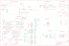

Contents
========

* [PRA3382 > Adafruit](#pra3382--adafruit)
	* [Images](#images)
	* [Tags](#tags)
  
![][im]
# PRA3382 > Adafruit

- ID: PROJ-ADAF-3382-STAN-01
- Hex ID: PRA3382
- Name: Adafruit
- Description: Adafruit

## Images
  
  

|kicadPcb3d|kicadPcb3dFront|kicadPcb3dBack|eagleImage|eagleSchemImage|
| :---: | :---: | :---: | :---: | :---: |
||||||

## Tags

- hexID: PRA3382
- oompType: PROJ
- oompSize: ADAF
- oompColor: 3382
- oompDesc: STAN
- oompIndex: 01
- oompName: Adafruit Metro M4 Express PCB
- sources: All source files from https://github.com/adafruit/Adafruit-Metro-M4-Express-PCB (source licence details in srcLicense.md)
- linkBuyPage: http://www.adafruit.com/products/3382
- oompID: PROJ-ADAF-3382-STAN-01
- oompParts: AD,UNMATCHED-UNMATCHED-UNMATCHED-UNMATCHED-UNMATCHED
- oompParts: C1,UNMATCHED-UNMATCHED-UNMATCHED-UNMATCHED-UNMATCHED
- oompParts: C2,UNMATCHED-UNMATCHED-UNMATCHED-UNMATCHED-UNMATCHED
- oompParts: C3,UNMATCHED-UNMATCHED-UNMATCHED-UNMATCHED-UNMATCHED
- oompParts: C4,UNMATCHED-UNMATCHED-UNMATCHED-UNMATCHED-UNMATCHED
- oompParts: C5,UNMATCHED-UNMATCHED-UNMATCHED-UNMATCHED-UNMATCHED
- oompParts: C6,UNMATCHED-UNMATCHED-UNMATCHED-UNMATCHED-UNMATCHED
- oompParts: C7,UNMATCHED-UNMATCHED-UNMATCHED-UNMATCHED-UNMATCHED
- oompParts: C8,UNMATCHED-UNMATCHED-UNMATCHED-UNMATCHED-UNMATCHED
- oompParts: C9,UNMATCHED-UNMATCHED-UNMATCHED-UNMATCHED-UNMATCHED
- oompParts: C10,UNMATCHED-UNMATCHED-UNMATCHED-UNMATCHED-UNMATCHED
- oompParts: C11,UNMATCHED-UNMATCHED-UNMATCHED-UNMATCHED-UNMATCHED
- oompParts: C12,UNMATCHED-UNMATCHED-UNMATCHED-UNMATCHED-UNMATCHED
- oompParts: C13,UNMATCHED-UNMATCHED-UNMATCHED-UNMATCHED-UNMATCHED
- oompParts: C14,UNMATCHED-UNMATCHED-UNMATCHED-UNMATCHED-UNMATCHED
- oompParts: C15,UNMATCHED-UNMATCHED-UNMATCHED-UNMATCHED-UNMATCHED
- oompParts: C16,UNMATCHED-UNMATCHED-UNMATCHED-UNMATCHED-UNMATCHED
- oompParts: C17,UNMATCHED-UNMATCHED-UNMATCHED-UNMATCHED-UNMATCHED
- oompParts: D1,UNMATCHED-UNMATCHED-UNMATCHED-UNMATCHED-UNMATCHED
- oompParts: F2,UNMATCHED-UNMATCHED-UNMATCHED-UNMATCHED-UNMATCHED
- oompParts: FB2,UNMATCHED-UNMATCHED-UNMATCHED-UNMATCHED-UNMATCHED
- oompParts: GROUND1,UNMATCHED-UNMATCHED-UNMATCHED-UNMATCHED-UNMATCHED
- oompParts: IC3,UNMATCHED-UNMATCHED-UNMATCHED-UNMATCHED-UNMATCHED
- oompParts: ICSP,UNMATCHED-UNMATCHED-UNMATCHED-UNMATCHED-UNMATCHED
- oompParts: IOH,UNMATCHED-UNMATCHED-UNMATCHED-UNMATCHED-UNMATCHED
- oompParts: IOL,UNMATCHED-UNMATCHED-UNMATCHED-UNMATCHED-UNMATCHED
- oompParts: JP1,UNMATCHED-UNMATCHED-UNMATCHED-UNMATCHED-UNMATCHED
- oompParts: L,UNMATCHED-UNMATCHED-UNMATCHED-UNMATCHED-UNMATCHED
- oompParts: L1,UNMATCHED-UNMATCHED-UNMATCHED-UNMATCHED-UNMATCHED
- oompParts: LED1,UNMATCHED-UNMATCHED-UNMATCHED-UNMATCHED-UNMATCHED
- oompParts: ON,UNMATCHED-UNMATCHED-UNMATCHED-UNMATCHED-UNMATCHED
- oompParts: PC1,UNMATCHED-UNMATCHED-UNMATCHED-UNMATCHED-UNMATCHED
- oompParts: PC2,UNMATCHED-UNMATCHED-UNMATCHED-UNMATCHED-UNMATCHED
- oompParts: POWER,UNMATCHED-UNMATCHED-UNMATCHED-UNMATCHED-UNMATCHED
- oompParts: R1,UNMATCHED-UNMATCHED-UNMATCHED-UNMATCHED-UNMATCHED
- oompParts: R2,UNMATCHED-UNMATCHED-UNMATCHED-UNMATCHED-UNMATCHED
- oompParts: R3,UNMATCHED-UNMATCHED-UNMATCHED-UNMATCHED-UNMATCHED
- oompParts: R4,UNMATCHED-UNMATCHED-UNMATCHED-UNMATCHED-UNMATCHED
- oompParts: R5,UNMATCHED-UNMATCHED-UNMATCHED-UNMATCHED-UNMATCHED
- oompParts: R7,UNMATCHED-UNMATCHED-UNMATCHED-UNMATCHED-UNMATCHED
- oompParts: R11,UNMATCHED-UNMATCHED-UNMATCHED-UNMATCHED-UNMATCHED
- oompParts: RESET,UNMATCHED-UNMATCHED-UNMATCHED-UNMATCHED-UNMATCHED
- oompParts: RXLED,UNMATCHED-UNMATCHED-UNMATCHED-UNMATCHED-UNMATCHED
- oompParts: SJ1,UNMATCHED-UNMATCHED-UNMATCHED-UNMATCHED-UNMATCHED
- oompParts: SW1,UNMATCHED-UNMATCHED-UNMATCHED-UNMATCHED-UNMATCHED
- oompParts: T2,UNMATCHED-UNMATCHED-UNMATCHED-UNMATCHED-UNMATCHED
- oompParts: TR1,UNMATCHED-UNMATCHED-UNMATCHED-UNMATCHED-UNMATCHED
- oompParts: TXLED,UNMATCHED-UNMATCHED-UNMATCHED-UNMATCHED-UNMATCHED
- oompParts: U$1,UNMATCHED-UNMATCHED-UNMATCHED-UNMATCHED-UNMATCHED
- oompParts: U1,UNMATCHED-UNMATCHED-UNMATCHED-UNMATCHED-UNMATCHED
- oompParts: U2,UNMATCHED-UNMATCHED-UNMATCHED-UNMATCHED-UNMATCHED
- oompParts: U3,UNMATCHED-UNMATCHED-UNMATCHED-UNMATCHED-UNMATCHED
- oompParts: X2,UNMATCHED-UNMATCHED-UNMATCHED-UNMATCHED-UNMATCHED
- oompParts: X3,UNMATCHED-UNMATCHED-UNMATCHED-UNMATCHED-UNMATCHED
- oompParts: X4,UNMATCHED-UNMATCHED-UNMATCHED-UNMATCHED-UNMATCHED
- oompParts: X5,UNMATCHED-UNMATCHED-UNMATCHED-UNMATCHED-UNMATCHED
- rawParts: AD,20609,HEADER-1X6OVALWAVE,1X06_OVALWAVE,PIN HEADER,,,,,,,,,,,,,
- rawParts: C1,10uF,CAP_CERAMIC0805-NOOUTLINE,0805-NO,Ceramic Capacitors,,,,,,,,,,,,,
- rawParts: C2,0.1uF,CAP_CERAMIC0805-NOOUTLINE,0805-NO,Ceramic Capacitors,,,,,,,,,,,,,
- rawParts: C3,10uF,CAP_CERAMIC0805-NOOUTLINE,0805-NO,Ceramic Capacitors,,,,,,,,,,,,,
- rawParts: C4,.1u,CAP_CERAMIC0603_NO,0603-NO,Ceramic Capacitors,,,,,,,,,,,,,
- rawParts: C5,22pF,CAP_CERAMIC0603_NO,0603-NO,Ceramic Capacitors,,,,,,,,,,,,,
- rawParts: C6,.1u,CAP_CERAMIC0603_NO,0603-NO,Ceramic Capacitors,,,,,,,,,,,,,
- rawParts: C7,22pF,CAP_CERAMIC0603_NO,0603-NO,Ceramic Capacitors,,,,,,,,,,,,,
- rawParts: C8,.1u,CAP_CERAMIC0603_NO,0603-NO,Ceramic Capacitors,,,,,,,,,,,,,
- rawParts: C9,1uF,CAP_CERAMIC0603_NO,0603-NO,Ceramic Capacitors,,,,,,,,,,,,,
- rawParts: C10,.1u,CAP_CERAMIC0603_NO,0603-NO,Ceramic Capacitors,,,,,,,,,,,,,
- rawParts: C11,.1u,CAP_CERAMIC0603_NO,0603-NO,Ceramic Capacitors,,,,,,,,,,,,,
- rawParts: C12,0.1uF,CAP_CERAMIC0603_NO,0603-NO,Ceramic Capacitors,,,,,,,,,,,,,
- rawParts: C13,0.1uF,CAP_CERAMIC0603_NO,0603-NO,Ceramic Capacitors,,,,,,,,,,,,,
- rawParts: C14,.1u,CAP_CERAMIC0603_NO,0603-NO,Ceramic Capacitors,,,,,,,,,,,,,
- rawParts: C15,.1u,CAP_CERAMIC0603_NO,0603-NO,Ceramic Capacitors,,,,,,,,,,,,,
- rawParts: C16,.1u,CAP_CERAMIC0603_NO,0603-NO,Ceramic Capacitors,,,,,,,,,,,,,
- rawParts: C17,0.1uF,CAP_CERAMIC0603_NO,0603-NO,Ceramic Capacitors,,,,,,,,,,,,,
- rawParts: D1,MBR120,DIODE-SCHOTTKYSOD-123,SOD-123,,,,,,,,,,,,,,
- rawParts: F2,500mA,PTCFUSE-1206,R1206,PTC fuses, resettable thermistors,,,,,,,,,,,,,
- rawParts: FB2,FERRITE,FERRITE-0805NO,0805-NO,Ferrite Bead,,,,,,,,,,,,,
- rawParts: FD1,FIDUCIAL_1MM,FIDUCIAL_1MM,FIDUCIAL_1MM,Fiducial Alignment Points,EXCLUDE,,,,,,,,,,,,
- rawParts: FD2,FIDUCIAL_1MM,FIDUCIAL_1MM,FIDUCIAL_1MM,Fiducial Alignment Points,EXCLUDE,,,,,,,,,,,,
- rawParts: FD3,FIDUCIAL_1MM,FIDUCIAL_1MM,FIDUCIAL_1MM,Fiducial Alignment Points,EXCLUDE,,,,,,,,,,,,
- rawParts: GROUND1,,SOLDERJUMPERCLOSED,SOLDERJUMPER_CLOSEDWIRE,SMD Solder JUMPER,,,,,,,,,,,,,
- rawParts: IC3,74LVC1G125D,74AHC1G125DBV,SOT23-5,Single Bus Buffer Gate with 3-State Output,,,,,,,,,,,,,
- rawParts: ICSP,3x2 M,HEADER-2X3,2X03_ROUND_70MIL,PIN HEADER,,,,,,,,,,,,,
- rawParts: IOH,20611,HEADER-1X10OVALWAVE,1X10_OVALWAVE,PIN HEADER,,,,,,,,,,,,,
- rawParts: IOL,20610,HEADER-1X8OVALWAVE,1X08_OVALWAVE,PIN HEADER,,,,,,,,,,,,,
- rawParts: JP1,,HEADER-1X1ROUND,1X01_ROUND,PIN HEADER,,,,,,,,,,,,,
- rawParts: L,RED,LED0805_NOOUTLINE,CHIPLED_0805_NOOUTLINE,LED,,,,,,,,,,,,,
- rawParts: L1,10uH,INDUCTOR,INDUCTOR_1007,Inductors,,,,,,,,,,,,,
- rawParts: LED1,WS2812B3535,WS2812B3535,LED3535,,,,,,,,,,,,,,
- rawParts: ON,GREEN,LED0805_NOOUTLINE,CHIPLED_0805_NOOUTLINE,LED,,,,,,,,,,,,,
- rawParts: PC1,47uF/25V,CAP_ELECTROLYTICPANASONIC_D,PANASONIC_D,Electrolytic Capacitors,,,,,,,,,,,,,
- rawParts: PC2,47uF+/6.3V+,CAP_ELECTROLYTICPANASONIC_D,PANASONIC_D,Electrolytic Capacitors,,,,,,,,,,,,,
- rawParts: POWER,20610,HEADER-1X8OVALWAVE,1X08_OVALWAVE,PIN HEADER,,,,,,,,,,,,,
- rawParts: R1,100K,RESISTOR_4PACK,RESPACK_4X0603,Resistor Packs (4 resistors),,,,,,,,,,,,,
- rawParts: R2,1K,RESISTOR_4PACK,RESPACK_4X0603,Resistor Packs (4 resistors),,,,,,,,,,,,,
- rawParts: R3,10K,RESISTOR_0603_NOOUT,0603-NO,Resistors,,,,,,,,,,,,,
- rawParts: R4,1K,RESISTOR_0603_NOOUT,0603-NO,Resistors,,,,,,,,,,,,,
- rawParts: R5,10K,RESISTOR_0603_NOOUT,0603-NO,Resistors,,,,,,,,,,,,,
- rawParts: R7,10K,RESISTOR_0603_NOOUT,0603-NO,Resistors,,,,,,,,,,,,,
- rawParts: R11,330R,RESISTOR_0603_NOOUT,0603-NO,Resistors,,,,,,,,,,,,,
- rawParts: RESET,EVQQ 6mm,SWITCH_TACT_SMT,EVQ-Q2,SMT Tact Switches,,,,,,,,,,,,,
- rawParts: RXLED,YELLOW,LED0805_NOOUTLINE,CHIPLED_0805_NOOUTLINE,LED,,,,,,,,,,,,,
- rawParts: SJ1,AREF_3V,SOLDERJUMPERCLOSED,SOLDERJUMPER_CLOSEDWIRE,SMD Solder JUMPER,,,,,,,,,,,,,
- rawParts: SW1,,SWITCH_SPDT,SPDT_SMT_SSSS811101,Switch - SPDT,,,,,,,,,,,,,
- rawParts: T2,DMP3098L-7,PMOSSOT23,SOT-23,MOS FET,,,,,,unknown,unknown,,,,,,
- rawParts: TR1,DMP3098L-7,0297_PMV48XP,SOT-23,20 V, 3.5 A P-channel Trench MOSFET - PMV48XP,,SOT23,,_____,,,,PMV48XP,_____,_____,Transistor,PMV48XP,
- rawParts: TXLED,YELLOW,LED0805_NOOUTLINE,CHIPLED_0805_NOOUTLINE,LED,,,,,,,,,,,,,
- rawParts: U$1,ATSAMD51J,ATSAMD51J,PQFN64-1,ATSAMD51J cortex m4 microcontroller,,,,,,,,,,,,,
- rawParts: U1,NCP1117ST50T3G,LM1117SOT223-REFLOW,SOT223-R,LM1117 Voltage Regulator,,,,,,,,,,,,,
- rawParts: U2,AP2112K-3.3,LP2985-XXDBVR33,SOT23-DBV,ULTRALOW-POWER 50-mA LOW-DROPOUT LINEAR REGULATORS,,,,,,,,,,,,,
- rawParts: U3,SPI Flash,SPIFLASH_SOIC8208MIL,SOIC8_208MIL,SOIC8 SPI Flash,,,,,,,,,,,,,
- rawParts: X2,2x5 0.05 SWD,JTAG-CORTEXBOXPOSTS,2X05_1.27MM_BOX_POSTS,Serial Wire (SW-DP) Connector,,,,,,,,,,,,,
- rawParts: X3,20329,USB_W_SHIELD_V2,4UCONN_20329_V2,,,,,,,,,,,,,,
- rawParts: X4,32.768,XTAL-3.2X1.5,XTAL3215,Low cost SMT crystals, no capacitors included,,,,,,,,,,,,,
- rawParts: X5,2.1mm,DCBARRELPTH,DCJACK_2MM_PTH,DC Barrel Jack,,,,,,,,,,,,,

[im]: kicadPcb3d_450.png
