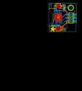
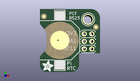
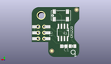
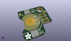

Contents
========

* [PROJ-ADAF-3386-STAN-01>Adafruit PiRTC RTC for Raspberry Pi PCB](#proj-adaf-3386-stan-01adafruit-pirtc-rtc-for-raspberry-pi-pcb)
	* [Images](#images)
	* [Interactive BOM](#interactive-bom)
	* [OOMP Parts](#oomp-parts)
	* [Tags](#tags)
  
![][im]
# PROJ-ADAF-3386-STAN-01>Adafruit PiRTC RTC for Raspberry Pi PCB

- ID: PROJ-ADAF-3386-STAN-01
- Hex ID: PRA3386
- Name: Adafruit PiRTC RTC for Raspberry Pi PCB
- Description: 

## Images
  
  

|eagleImage|kicadPcb3dFront|kicadPcb3dBack|kicadPcb3d|
| :---: | :---: | :---: | :---: |
|||||

## Interactive BOM

- Interactive BOM page: [ibom.html](kicad/bom/ibom.html)

## OOMP Parts
  

|OOMP Parts|
| :---: |
|UNMATCHED-UNMATCHED-X-UNMATCHED-01, B1, 6.6802, 10.8204, 90,B1, CR1220, CR1220, microbuilder, (0.263, 0.426), R90|
|CAPE-0805-X-UNMATCHED-01, C1, 6.5278, 4.6735999999999995, M180,C1, 10uF, 0805-NO, microbuilder, (0.257, 0.184), MR180|
|UNMATCHED-UNMATCHED-X-UNMATCHED-01, IC1, 6.9342, 10.5664, M180,IC1, RTC_PCF8523T, SOIC8_150MIL, microbuilder, (0.273, 0.416), MR180|
|UNMATCHED-UNMATCHED-X-UNMATCHED-01, Q1, 7.823199999999999, 17.8054, M180,Q1, 32.768, CRYSTAL_8X3.8, microbuilder, (0.308, 0.701), MR180|
|RESE-0805-X-UNMATCHED-01, R1, 2.921, 4.699, M180,R1, 1K, 0805-NO, microbuilder, (0.115, 0.185), MR180|
|UNMATCHED-UNMATCHED-X-UNMATCHED-01, RPI1, 16.0782, 10.4394, 0,RPI1, RASPBERRYPI_2X3, RASPBERRYPI_2X3_THMSMT, microbuilder, (0.633, 0.411), R0|

## Tags

- hexID: PRA3386
- oompType: PROJ
- oompSize: ADAF
- oompColor: 3386
- oompDesc: STAN
- oompIndex: 01
- oompName: Adafruit PiRTC RTC for Raspberry Pi PCB
- sources: All source files from https://github.com/adafruit/Adafruit-PiRTC-RTC-for-Raspberry-Pi-PCB (source licence details in srcLicense.md)
- linkBuyPage: http://www.adafruit.com/products/3386
- oompPart: UNMATCHED-UNMATCHED-X-UNMATCHED-01, B1, 6.6802, 10.8204, 90
- oompPart: CAPE-0805-X-UNMATCHED-01, C1, 6.5278, 4.6735999999999995, M180
- oompPart: SKIP-UNMATCHED-X-UNMATCHED-01, FID1, 1.3716, 18.846799999999998, 180
- oompPart: SKIP-UNMATCHED-X-UNMATCHED-01, FID2, 18.694399999999998, 15.265399999999998, 180
- oompPart: SKIP-UNMATCHED-X-UNMATCHED-01, FID3, 11.6332, 2.6923999999999997, M0
- oompPart: SKIP-UNMATCHED-X-UNMATCHED-01, FID4, 1.2192, 20.2184, M0
- oompPart: UNMATCHED-UNMATCHED-X-UNMATCHED-01, IC1, 6.9342, 10.5664, M180
- oompPart: UNMATCHED-UNMATCHED-X-UNMATCHED-01, Q1, 7.823199999999999, 17.8054, M180
- oompPart: RESE-0805-X-UNMATCHED-01, R1, 2.921, 4.699, M180
- oompPart: UNMATCHED-UNMATCHED-X-UNMATCHED-01, RPI1, 16.0782, 10.4394, 0
- oompPart: SKIP-UNMATCHED-X-UNMATCHED-01, U$4, 16.0782, 17.856199999999998, 180
- rawPart: B1, CR1220, CR1220, microbuilder, (0.263, 0.426), R90
- rawPart: C1, 10uF, 0805-NO, microbuilder, (0.257, 0.184), MR180
- rawPart: FID1, FIDUCIAL_1MM, FIDUCIAL_1MM, microbuilder, (0.054, 0.742), R180
- rawPart: FID2, FIDUCIAL_1MM, FIDUCIAL_1MM, microbuilder, (0.736, 0.601), R180
- rawPart: FID3, FIDUCIAL_1MM, FIDUCIAL_1MM, microbuilder, (0.458, 0.106), MR0
- rawPart: FID4, FIDUCIAL_1MM, FIDUCIAL_1MM, microbuilder, (0.048, 0.796), MR0
- rawPart: IC1, RTC_PCF8523T, SOIC8_150MIL, microbuilder, (0.273, 0.416), MR180
- rawPart: Q1, 32.768, CRYSTAL_8X3.8, microbuilder, (0.308, 0.701), MR180
- rawPart: R1, 1K, 0805-NO, microbuilder, (0.115, 0.185), MR180
- rawPart: RPI1, RASPBERRYPI_2X3, RASPBERRYPI_2X3_THMSMT, microbuilder, (0.633, 0.411), R0
- rawPart: U$4, MOUNTINGHOLE3.0THIN, MOUNTINGHOLE_3.0_PLATEDTHIN, microbuilder, (0.633, 0.703), R180

[im]: kicadPcb3d_450.png
