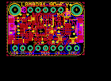
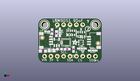
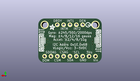
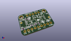

Contents
========

* [PROJ-ADAF-3387-STAN-01>Adafruit LSM9DS1 Breakout PCB](#proj-adaf-3387-stan-01adafruit-lsm9ds1-breakout-pcb)
	* [Images](#images)
	* [Interactive BOM](#interactive-bom)
	* [OOMP Parts](#oomp-parts)
	* [Tags](#tags)
  
![][im]
# PROJ-ADAF-3387-STAN-01>Adafruit LSM9DS1 Breakout PCB

- ID: PROJ-ADAF-3387-STAN-01
- Hex ID: PRA3387
- Name: Adafruit LSM9DS1 Breakout PCB
- Description: 

## Images
  
  

|eagleImage|kicadPcb3dFront|kicadPcb3dBack|kicadPcb3d|
| :---: | :---: | :---: | :---: |
|||||

## Interactive BOM

- Interactive BOM page: [ibom.html](kicad/bom/ibom.html)

## OOMP Parts
  

|OOMP Parts|
| :---: |
|<table><tr><td></td><td> C1</td><td>[CAPC-0603-X-NF100-V50 SMD (0603) 100 nF Capacitor (Ceramic) 50v](https://github.com/oomlout/oomlout_OOMP_parts/tree/main/CAPC-0603-X-NF100-V50/)</td><td>[C6N100](https://github.com/oomlout/oomlout_OOMP_parts/tree/main/CAPC-0603-X-NF100-V50/)</td></tr></table>|
|CAPC-UNMATCHED-X-UF10-V25, C2, 1.9049999999999998, 4.6354999999999995, 180,C2, 10uF, _0805MP, microbuilder, (0.075, 0.1825), R180|
|<table><tr><td></td><td> C3</td><td>[CAPC-0805-X-UF10-V25 SMD (0805) 10 uF Capacitor (Ceramic) 25v](https://github.com/oomlout/oomlout_OOMP_parts/tree/main/CAPC-0805-X-UF10-V25/)</td><td>[C85U010](https://github.com/oomlout/oomlout_OOMP_parts/tree/main/CAPC-0805-X-UF10-V25/)</td></tr></table>|
|CAPC-0603-X-UNMATCHED-01, C4, 14.097000000000001, 5.334, 270,C4, 0.22uF, 0603-NO, microbuilder, (0.555, 0.21), R270|
|CAPC-0603-X-NF10-01, C5, 8.509, 5.3975, 180,C5, 0.01uF, 0603-NO, microbuilder, (0.335, 0.2125), R180|
|UNMATCHED-UNMATCHED-X-UNMATCHED-01, CONN3, 22.796499999999998, 8.889999999999999, 90,CONN3, STEMMA_I2C_QT, JST_SH4, microbuilder, (0.8975, 0.35), R90|
|UNMATCHED-UNMATCHED-X-UNMATCHED-01, CONN4, 2.6034999999999995, 8.889999999999999, 270,CONN4, STEMMA_I2C_QT, JST_SH4, microbuilder, (0.1025, 0.35), R270|
|UNMATCHED-UNMATCHED-X-UNMATCHED-01, D1, 3.556, 12.572999999999999, 90,D1, GREEN, CHIPLED_0603_NOOUTLINE, microbuilder, (0.14, 0.495), R90|
|UNMATCHED-UNMATCHED-X-UNMATCHED-01, D2, 21.7805, 4.826, 0,D2, 1N4148, SOD-323, microbuilder, (0.8575, 0.19), R0|
|UNMATCHED-UNMATCHED-X-UNMATCHED-01, D3, 17.4625, 5.6514999999999995, 180,D3, 1N4148, SOD-323, microbuilder, (0.6875, 0.2225), R180|
|UNMATCHED-UNMATCHED-X-UNMATCHED-01, D4, 8.636000000000001, 12.191999999999998, 270,D4, 1N4148, SOD-323, microbuilder, (0.34, 0.48), R270|
|UNMATCHED-UNMATCHED-X-UNMATCHED-01, IC1, 11.176, 8.128, 180,IC1, LSM9DS1, LGA24_3.5X3.1MM, microbuilder, (0.44, 0.32), R180|
|UNMATCHED-UNMATCHED-X-UNMATCHED-01, JP2, 12.7, 15.239999999999998, 0,JP2, 1X05_ROUND_70, microbuilder, (0.5, 0.6), R0|
|UNMATCHED-UNMATCHED-X-UNMATCHED-01, JP4, 12.7, 2.54, 180,JP4, PowerIO, 1X09_ROUND_70, microbuilder, (0.5, 0.1), R180|
|UNMATCHED-UNMATCHED-X-UNMATCHED-01, Q2, 17.0815, 8.001, 90,Q2, BSS138, SOT363, microbuilder, (0.6725, 0.315), R90|
|<table><tr><td></td><td> R1</td><td>[RESE-0603-X-O103-01 SMD (0603) 10k Ohm Resistor](https://github.com/oomlout/oomlout_OOMP_parts/tree/main/RESE-0603-X-O103-01/)</td><td>[R6103](https://github.com/oomlout/oomlout_OOMP_parts/tree/main/RESE-0603-X-O103-01/)</td></tr></table>|
|RESE-UNMATCHED-X-UNMATCHED-01, R2, 13.208, 12.001499999999998, 0,R2, 10k, RESPACK_4X0603, microbuilder, (0.52, 0.4725), R0|
|RESE-UNMATCHED-X-O103-01, R3, 17.208499999999997, 11.43, 180,R3, 10K, RESPACK_4X0603, microbuilder, (0.6775, 0.45), R180|
|<table><tr><td></td><td> R5</td><td>[RESE-0603-X-O103-01 SMD (0603) 10k Ohm Resistor](https://github.com/oomlout/oomlout_OOMP_parts/tree/main/RESE-0603-X-O103-01/)</td><td>[R6103](https://github.com/oomlout/oomlout_OOMP_parts/tree/main/RESE-0603-X-O103-01/)</td></tr></table>|
|UNMATCHED-UNMATCHED-X-UNMATCHED-01, U2, 7.365999999999999, 8.128, 0,U2, AP2112K-3.3, SOT23-5, microbuilder, (0.29, 0.32), R0|

## Tags

- hexID: PRA3387
- oompType: PROJ
- oompSize: ADAF
- oompColor: 3387
- oompDesc: STAN
- oompIndex: 01
- oompName: Adafruit LSM9DS1 Breakout PCB
- sources: All source files from https://github.com/adafruit/Adafruit-LSM9DS1-Breakout-PCB (source licence details in srcLicense.md)
- linkBuyPage: http://www.adafruit.com/products/3387
- oompPart: CAPC-0603-X-NF100-V50, C1, 11.557, 5.3975, 0
- oompPart: CAPC-UNMATCHED-X-UF10-V25, C2, 1.9049999999999998, 4.6354999999999995, 180
- oompPart: CAPC-0805-X-UF10-V25, C3, 5.334, 4.826, 0
- oompPart: CAPC-0603-X-UNMATCHED-01, C4, 14.097000000000001, 5.334, 270
- oompPart: CAPC-0603-X-NF10-01, C5, 8.509, 5.3975, 180
- oompPart: UNMATCHED-UNMATCHED-X-UNMATCHED-01, CONN3, 22.796499999999998, 8.889999999999999, 90
- oompPart: UNMATCHED-UNMATCHED-X-UNMATCHED-01, CONN4, 2.6034999999999995, 8.889999999999999, 270
- oompPart: UNMATCHED-UNMATCHED-X-UNMATCHED-01, D1, 3.556, 12.572999999999999, 90
- oompPart: UNMATCHED-UNMATCHED-X-UNMATCHED-01, D2, 21.7805, 4.826, 0
- oompPart: UNMATCHED-UNMATCHED-X-UNMATCHED-01, D3, 17.4625, 5.6514999999999995, 180
- oompPart: UNMATCHED-UNMATCHED-X-UNMATCHED-01, D4, 8.636000000000001, 12.191999999999998, 270
- oompPart: SKIP-UNMATCHED-X-UNMATCHED-01, FID3, 1.5875, 10.033, 0
- oompPart: SKIP-UNMATCHED-X-UNMATCHED-01, FID4, 23.9395, 7.746999999999999, 0
- oompPart: UNMATCHED-UNMATCHED-X-UNMATCHED-01, IC1, 11.176, 8.128, 180
- oompPart: UNMATCHED-UNMATCHED-X-UNMATCHED-01, JP2, 12.7, 15.239999999999998, 0
- oompPart: UNMATCHED-UNMATCHED-X-UNMATCHED-01, JP4, 12.7, 2.54, 180
- oompPart: UNMATCHED-UNMATCHED-X-UNMATCHED-01, Q2, 17.0815, 8.001, 90
- oompPart: RESE-0603-X-O103-01, R1, 5.5245, 12.446, 270
- oompPart: RESE-UNMATCHED-X-UNMATCHED-01, R2, 13.208, 12.001499999999998, 0
- oompPart: RESE-UNMATCHED-X-O103-01, R3, 17.208499999999997, 11.43, 180
- oompPart: RESE-0603-X-O103-01, R5, 7.238999999999999, 11.684, 90
- oompPart: SKIP-UNMATCHED-X-UNMATCHED-01, U$1, 2.54, 15.239999999999998, 0
- oompPart: SKIP-UNMATCHED-X-UNMATCHED-01, U$17, 22.86, 15.239999999999998, 0
- oompPart: UNMATCHED-UNMATCHED-X-UNMATCHED-01, U2, 7.365999999999999, 8.128, 0
- rawPart: C1, 0.1uF, 0603-NO, microbuilder, (0.455, 0.2125), R0
- rawPart: C2, 10uF, _0805MP, microbuilder, (0.075, 0.1825), R180
- rawPart: C3, 10uF, 0805-NO, microbuilder, (0.21, 0.19), R0
- rawPart: C4, 0.22uF, 0603-NO, microbuilder, (0.555, 0.21), R270
- rawPart: C5, 0.01uF, 0603-NO, microbuilder, (0.335, 0.2125), R180
- rawPart: CONN3, STEMMA_I2C_QT, JST_SH4, microbuilder, (0.8975, 0.35), R90
- rawPart: CONN4, STEMMA_I2C_QT, JST_SH4, microbuilder, (0.1025, 0.35), R270
- rawPart: D1, GREEN, CHIPLED_0603_NOOUTLINE, microbuilder, (0.14, 0.495), R90
- rawPart: D2, 1N4148, SOD-323, microbuilder, (0.8575, 0.19), R0
- rawPart: D3, 1N4148, SOD-323, microbuilder, (0.6875, 0.2225), R180
- rawPart: D4, 1N4148, SOD-323, microbuilder, (0.34, 0.48), R270
- rawPart: FID3, FIDUCIAL_1MM, FIDUCIAL_1MM, microbuilder, (0.0625, 0.395), R0
- rawPart: FID4, FIDUCIAL_1MM, FIDUCIAL_1MM, microbuilder, (0.9425, 0.305), R0
- rawPart: IC1, LSM9DS1, LGA24_3.5X3.1MM, microbuilder, (0.44, 0.32), R180
- rawPart: JP2, 1X05_ROUND_70, microbuilder, (0.5, 0.6), R0
- rawPart: JP4, PowerIO, 1X09_ROUND_70, microbuilder, (0.5, 0.1), R180
- rawPart: Q2, BSS138, SOT363, microbuilder, (0.6725, 0.315), R90
- rawPart: R1, 10K, 0603-NO, microbuilder, (0.2175, 0.49), R270
- rawPart: R2, 10k, RESPACK_4X0603, microbuilder, (0.52, 0.4725), R0
- rawPart: R3, 10K, RESPACK_4X0603, microbuilder, (0.6775, 0.45), R180
- rawPart: R5, 10K, 0603-NO, microbuilder, (0.285, 0.46), R90
- rawPart: U$1, MOUNTINGHOLE2.5, MOUNTINGHOLE_2.5_PLATED, microbuilder, (0.1, 0.6), R0
- rawPart: U$17, MOUNTINGHOLE2.5, MOUNTINGHOLE_2.5_PLATED, microbuilder, (0.9, 0.6), R0
- rawPart: U2, AP2112K-3.3, SOT23-5, microbuilder, (0.29, 0.32), R0

[im]: kicadPcb3d_450.png
