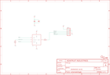

Contents
========

* [PRA3421 > Adafruit I2S Microphone Breakout PCB](#pra3421--adafruit-i2s-microphone-breakout-pcb)
	* [Schematic](#schematic)
	* [PCB](#pcb)
	* [Interactive BOM](#interactive-bom)
	* [OOMP Parts](#oomp-parts)
	* [Images](#images)
	* [Tags](#tags)
  
![][im]
# PRA3421 > Adafruit I2S Microphone Breakout PCB

- ID: PROJ-ADAF-3421-STAN-01
- Hex ID: PRA3421
- Name: Adafruit
- Description: Adafruit
- Long Link: [http://oom.lt/PROJ-ADAF-3421-STAN-01](http://oom.lt/PROJ-ADAF-3421-STAN-01)
- Short Link: [http://oom.lt/PRA3421](http://oom.lt/PRA3421)

## Schematic
  

## PCB
  

## Interactive BOM

- Interactive BOM page: [ibom.html](https://htmlpreview.github.io/?https://github.com/oomlout/oomlout_OOMP_projects/blob/main/PROJ-ADAF-3421-STAN-01/kicad/bom/ibom.html)

## OOMP Parts
  

|OOMP ID|Name|Identifier|
| :---: | :---: | :---: |
|CAPC-0805-X-PF220-01||C2|
|[CAPC-0805-X-UF1-V25](https://github.com/oomlout/oomlout_OOMP_parts/tree/main/CAPC-0805-X-UF1-V25/)|[SMD (0805) 1 uF Capacitor (Ceramic) 25v](https://github.com/oomlout/oomlout_OOMP_parts/tree/main/CAPC-0805-X-UF1-V25/)|[C4](https://github.com/oomlout/oomlout_OOMP_parts/tree/main/CAPC-0805-X-UF1-V25/)|
|UNMATCHED-UNMATCHED-X-UNMATCHED-01||IC1|
|[HEAD-I01-X-PI06-01](https://github.com/oomlout/oomlout_OOMP_parts/tree/main/HEAD-I01-X-PI06-01/)|[2.54 mm 6 Pin Header](https://github.com/oomlout/oomlout_OOMP_parts/tree/main/HEAD-I01-X-PI06-01/)|[JP2](https://github.com/oomlout/oomlout_OOMP_parts/tree/main/HEAD-I01-X-PI06-01/)|
|[RESE-0603-X-O680-01](https://github.com/oomlout/oomlout_OOMP_parts/tree/main/RESE-0603-X-O680-01/)|[SMD (0603) 68 Ohm Resistor](https://github.com/oomlout/oomlout_OOMP_parts/tree/main/RESE-0603-X-O680-01/)|[R1](https://github.com/oomlout/oomlout_OOMP_parts/tree/main/RESE-0603-X-O680-01/)|
|[RESE-0603-X-O103-01](https://github.com/oomlout/oomlout_OOMP_parts/tree/main/RESE-0603-X-O103-01/)|[SMD (0603) 10k Ohm Resistor](https://github.com/oomlout/oomlout_OOMP_parts/tree/main/RESE-0603-X-O103-01/)|[R2](https://github.com/oomlout/oomlout_OOMP_parts/tree/main/RESE-0603-X-O103-01/)|

## Images
  
  

|bominteractivefront|bominteractiveback|kicadPcb3d|kicadPcb3dFront|kicadPcb3dBack|kicadSchem|eagleImage|eagleSchemImage|pcbdraw|pcbdrawback|
| :---: | :---: | :---: | :---: | :---: | :---: | :---: | :---: | :---: | :---: |
|||||||||||

## Tags

- hexID: PRA3421
- oompType: PROJ
- oompSize: ADAF
- oompColor: 3421
- oompDesc: STAN
- oompIndex: 01
- oompName: Adafruit I2S Microphone Breakout PCB
- sources: All source files from https://github.com/adafruit/Adafruit-I2S-Microphone-Breakout-PCB (source licence details in srcLicense.md)
- linkBuyPage: http://www.adafruit.com/products/3421
- oompID: PROJ-ADAF-3421-STAN-01
- oompParts: C2,CAPC-0805-X-PF220-01
- oompParts: C4,CAPC-0805-X-UF1-V25
- oompParts: IC1,UNMATCHED-UNMATCHED-X-UNMATCHED-01
- oompParts: JP2,HEAD-I01-X-PI06-01
- oompParts: R1,RESE-0603-X-O680-01
- oompParts: R2,RESE-0603-X-O103-01
- rawParts: C2,220pF,CAP_CERAMIC0805-NOOUTLINE,0805-NO,Ceramic Capacitors,,
- rawParts: C4,1uF,CAP_CERAMIC0805-NOOUTLINE,0805-NO,Ceramic Capacitors,,
- rawParts: FID1,FIDUCIAL_1MM,FIDUCIAL_1MM,FIDUCIAL_1MM,Fiducial Alignment Points,EXCLUDE,
- rawParts: FID2,FIDUCIAL_1MM,FIDUCIAL_1MM,FIDUCIAL_1MM,Fiducial Alignment Points,EXCLUDE,
- rawParts: IC1,MIC_I2S_SPH0645,MIC_I2S_SPH0645,SPH0645LM4H,,,
- rawParts: JP2,,HEADER-1X6ROUND,1X06_ROUND,PIN HEADER,,
- rawParts: R1,68,RESISTOR_0603_NOOUT,0603-NO,Resistors,,
- rawParts: R2,10k,RESISTOR_0603_NOOUT,0603-NO,Resistors,,
- rawParts: U$6,MOUNTINGHOLE2.5,MOUNTINGHOLE2.5,MOUNTINGHOLE_2.5_PLATED,Mounting Hole,EXCLUDE,
- rawParts: U$12,MOUNTINGHOLE2.5,MOUNTINGHOLE2.5,MOUNTINGHOLE_2.5_PLATED,Mounting Hole,EXCLUDE,

[im]: kicadPcb3d_450.png
