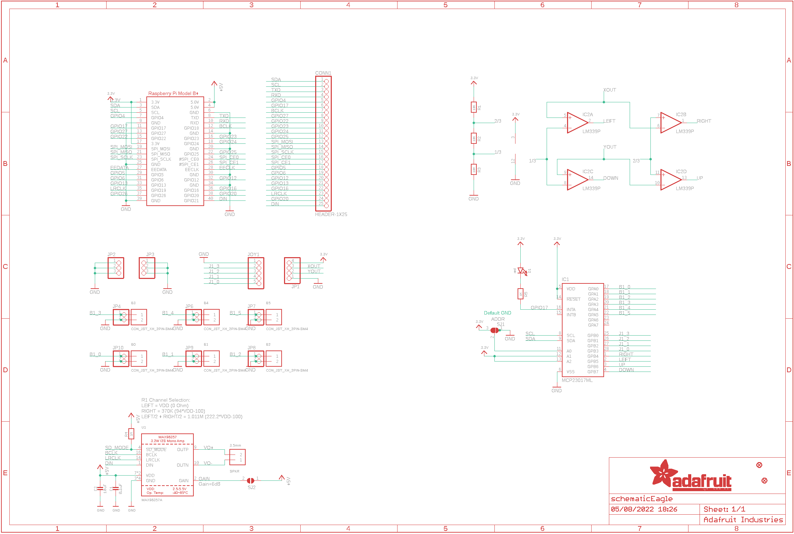

Contents
========

* [PRA3422 > Adafruit](#pra3422--adafruit)
	* [Schematic](#schematic)
	* [Interactive BOM](#interactive-bom)
	* [OOMP Parts](#oomp-parts)
	* [Images](#images)
	* [Tags](#tags)
  
![][im]
# PRA3422 > Adafruit

- ID: PROJ-ADAF-3422-STAN-01
- Hex ID: PRA3422
- Name: Adafruit
- Description: Adafruit
- Long Link: [http://oom.lt/PROJ-ADAF-3422-STAN-01](http://oom.lt/PROJ-ADAF-3422-STAN-01)
- Short Link: [http://oom.lt/PRA3422](http://oom.lt/PRA3422)

## Schematic
  

## Interactive BOM

- Interactive BOM page: [ibom.html](https://htmlpreview.github.io/?https://github.com/oomlout/oomlout_OOMP_projects/blob/main/PROJ-ADAF-3422-STAN-01/kicad/bom/ibom.html)

## OOMP Parts
  

|OOMP Parts|
| :---: |
|B0,UNMATCHED-UNMATCHED-X-UNMATCHED-01,B0,CON_JST_XH_2PIN-SM4,CON_JST_XH_2PIN-SM4,JST-XH-2-SM4,,,,,,,|
|B1,UNMATCHED-UNMATCHED-X-UNMATCHED-01,B1,CON_JST_XH_2PIN-SM4,CON_JST_XH_2PIN-SM4,JST-XH-2-SM4,,,,,,,|
|B2,UNMATCHED-UNMATCHED-X-UNMATCHED-01,B2,CON_JST_XH_2PIN-SM4,CON_JST_XH_2PIN-SM4,JST-XH-2-SM4,,,,,,,|
|B3,UNMATCHED-UNMATCHED-X-UNMATCHED-01,B3,CON_JST_XH_2PIN-SM4,CON_JST_XH_2PIN-SM4,JST-XH-2-SM4,,,,,,,|
|B4,UNMATCHED-UNMATCHED-X-UNMATCHED-01,B4,CON_JST_XH_2PIN-SM4,CON_JST_XH_2PIN-SM4,JST-XH-2-SM4,,,,,,,|
|B5,UNMATCHED-UNMATCHED-X-UNMATCHED-01,B5,CON_JST_XH_2PIN-SM4,CON_JST_XH_2PIN-SM4,JST-XH-2-SM4,,,,,,,|
|C1,CAPC-0603-X-NF100-V50,C1,0.1uF,CAP_CERAMIC0603_NO,0603-NO,Ceramic Capacitors,,,,,,|
|C2,CAPC-0805-X-UF10-V10,C2,10uF,CAP_CERAMIC0805-NOOUTLINE,0805-NO,Ceramic Capacitors,,,,,,|
|CONN1,HEAD-I01-X-PI25-01,CONN1,HEADER-1X25,HEADER-1X25,1X25_ROUND_70MIL,,,,,,,|
|D1,LEDS-0805-G-STAN-01,D1,red,LED0805_NOOUTLINE,CHIPLED_0805_NOOUTLINE,LED,,,,,,|
|IC1,UNMATCHED-UNMATCHED-X-UNMATCHED-01,FID2,FIDUCIAL,FIDUCIAL,FIDUCIAL_1MM,Fiducial Alignment Points,EXCLUDE,,,,,|
|IC2,UNMATCHED-UNMATCHED-X-UNMATCHED-01,FID3,FIDUCIAL,FIDUCIAL,FIDUCIAL_1MM,Fiducial Alignment Points,EXCLUDE,,,,,|
|JOY1,HEAD-I01-X-PI05-01,IC1,MCP23017ML,MCP23017ML,QFN28-ML_6X6MM,http://ww1.microchip.com/downloads/en/DeviceDoc/21952a.pdf,,MICROCHIP,MCP23017-E/SS,1467674,31K2960,|
|JP1,HEAD-I01-X-PI04-01,IC2,LM339P,LM339P,TSSOP14,Low Power Low Offset Voltage Quad Comparators,,,,,,|
|JP2,HEAD-I01-X-PI03-01,JOY1,,HEADER-1X5,1X05_OVAL,PIN HEADER,,,,,,|
|JP3,HEAD-I01-X-PI03-01,JP1,,HEADER-1X4,1X04_OVAL,PIN HEADER,,,,,,|
|JP4,HEAD-I01-X-PI02-01,JP2,,HEADER-1X3ROUND,1X03_ROUND,PIN HEADER,,,,,,|
|JP6,HEAD-I01-X-PI02-01,JP3,,HEADER-1X3ROUND,1X03_ROUND,PIN HEADER,,,,,,|
|JP7,HEAD-I01-X-PI02-01,JP4,,HEADER-1X2,1X02_OVAL,PIN HEADER,,,,,,|
|JP8,HEAD-I01-X-PI02-01,JP6,,HEADER-1X2,1X02_OVAL,PIN HEADER,,,,,,|
|JP9,HEAD-I01-X-PI02-01,JP7,,HEADER-1X2,1X02_OVAL,PIN HEADER,,,,,,|
|JP10,HEAD-I01-X-PI02-01,JP8,,HEADER-1X2,1X02_OVAL,PIN HEADER,,,,,,|
|R1,RESE-UNMATCHED-X-O103-01,JP9,,HEADER-1X2,1X02_OVAL,PIN HEADER,,,,,,|
|R2,RESE-0805-X-O103-01,JP10,,HEADER-1X2,1X02_OVAL,PIN HEADER,,,,,,|
|R3,RESE-0805-X-O103-01,R1,10K,RESISTOR0805_10MGAP,0805_10MGAP,Resistors,,,,,,|
|R4,RESE-0603-X-O105-01,R2,10K,RESISTOR0805_NOOUTLINE,0805-NO,Resistors,,,,,,|
|R5,RESE-0603-X-O102-01,R3,10K,RESISTOR0805_NOOUTLINE,0805-NO,Resistors,,,,,,|
|RPI1,UNMATCHED-UNMATCHED-X-UNMATCHED-01,R4,1M,RESISTOR_0603_NOOUT,0603-NO,Resistors,,,,,,|
|SPKR,UNMATCHED-UNMATCHED-X-UNMATCHED-01,R5,1K,RESISTOR_0603_NOOUT,0603-NO,Resistors,,,,,,|
|U1,UNMATCHED-UNMATCHED-X-UNMATCHED-01,RPI1,RASPBERRYPI_BPLUS_PHAT,RASPBERRYPI_BPLUS_PHAT,PI_BONNET,,,,,,,|

## Images
  
  

|kicadPcb3d|kicadPcb3dFront|kicadPcb3dBack|eagleImage|eagleSchemImage|
| :---: | :---: | :---: | :---: | :---: |
||||||

## Tags

- hexID: PRA3422
- oompType: PROJ
- oompSize: ADAF
- oompColor: 3422
- oompDesc: STAN
- oompIndex: 01
- oompName: Adafruit Arcade Bonnet PCB
- sources: All source files from https://github.com/adafruit/Adafruit-Arcade-Bonnet-PCB (source licence details in srcLicense.md)
- linkBuyPage: http://www.adafruit.com/products/3422
- oompID: PROJ-ADAF-3422-STAN-01
- oompParts: B0,UNMATCHED-UNMATCHED-X-UNMATCHED-01
- oompParts: B1,UNMATCHED-UNMATCHED-X-UNMATCHED-01
- oompParts: B2,UNMATCHED-UNMATCHED-X-UNMATCHED-01
- oompParts: B3,UNMATCHED-UNMATCHED-X-UNMATCHED-01
- oompParts: B4,UNMATCHED-UNMATCHED-X-UNMATCHED-01
- oompParts: B5,UNMATCHED-UNMATCHED-X-UNMATCHED-01
- oompParts: C1,CAPC-0603-X-NF100-V50
- oompParts: C2,CAPC-0805-X-UF10-V10
- oompParts: CONN1,HEAD-I01-X-PI25-01
- oompParts: D1,LEDS-0805-G-STAN-01
- oompParts: IC1,UNMATCHED-UNMATCHED-X-UNMATCHED-01
- oompParts: IC2,UNMATCHED-UNMATCHED-X-UNMATCHED-01
- oompParts: JOY1,HEAD-I01-X-PI05-01
- oompParts: JP1,HEAD-I01-X-PI04-01
- oompParts: JP2,HEAD-I01-X-PI03-01
- oompParts: JP3,HEAD-I01-X-PI03-01
- oompParts: JP4,HEAD-I01-X-PI02-01
- oompParts: JP6,HEAD-I01-X-PI02-01
- oompParts: JP7,HEAD-I01-X-PI02-01
- oompParts: JP8,HEAD-I01-X-PI02-01
- oompParts: JP9,HEAD-I01-X-PI02-01
- oompParts: JP10,HEAD-I01-X-PI02-01
- oompParts: R1,RESE-UNMATCHED-X-O103-01
- oompParts: R2,RESE-0805-X-O103-01
- oompParts: R3,RESE-0805-X-O103-01
- oompParts: R4,RESE-0603-X-O105-01
- oompParts: R5,RESE-0603-X-O102-01
- oompParts: RPI1,UNMATCHED-UNMATCHED-X-UNMATCHED-01
- oompParts: SPKR,UNMATCHED-UNMATCHED-X-UNMATCHED-01
- oompParts: U1,UNMATCHED-UNMATCHED-X-UNMATCHED-01
- rawParts: B0,CON_JST_XH_2PIN-SM4,CON_JST_XH_2PIN-SM4,JST-XH-2-SM4,,,,,,,
- rawParts: B1,CON_JST_XH_2PIN-SM4,CON_JST_XH_2PIN-SM4,JST-XH-2-SM4,,,,,,,
- rawParts: B2,CON_JST_XH_2PIN-SM4,CON_JST_XH_2PIN-SM4,JST-XH-2-SM4,,,,,,,
- rawParts: B3,CON_JST_XH_2PIN-SM4,CON_JST_XH_2PIN-SM4,JST-XH-2-SM4,,,,,,,
- rawParts: B4,CON_JST_XH_2PIN-SM4,CON_JST_XH_2PIN-SM4,JST-XH-2-SM4,,,,,,,
- rawParts: B5,CON_JST_XH_2PIN-SM4,CON_JST_XH_2PIN-SM4,JST-XH-2-SM4,,,,,,,
- rawParts: C1,0.1uF,CAP_CERAMIC0603_NO,0603-NO,Ceramic Capacitors,,,,,,
- rawParts: C2,10uF,CAP_CERAMIC0805-NOOUTLINE,0805-NO,Ceramic Capacitors,,,,,,
- rawParts: CONN1,HEADER-1X25,HEADER-1X25,1X25_ROUND_70MIL,,,,,,,
- rawParts: D1,red,LED0805_NOOUTLINE,CHIPLED_0805_NOOUTLINE,LED,,,,,,
- rawParts: FID2,FIDUCIAL,FIDUCIAL,FIDUCIAL_1MM,Fiducial Alignment Points,EXCLUDE,,,,,
- rawParts: FID3,FIDUCIAL,FIDUCIAL,FIDUCIAL_1MM,Fiducial Alignment Points,EXCLUDE,,,,,
- rawParts: IC1,MCP23017ML,MCP23017ML,QFN28-ML_6X6MM,http://ww1.microchip.com/downloads/en/DeviceDoc/21952a.pdf,,MICROCHIP,MCP23017-E/SS,1467674,31K2960,
- rawParts: IC2,LM339P,LM339P,TSSOP14,Low Power Low Offset Voltage Quad Comparators,,,,,,
- rawParts: JOY1,,HEADER-1X5,1X05_OVAL,PIN HEADER,,,,,,
- rawParts: JP1,,HEADER-1X4,1X04_OVAL,PIN HEADER,,,,,,
- rawParts: JP2,,HEADER-1X3ROUND,1X03_ROUND,PIN HEADER,,,,,,
- rawParts: JP3,,HEADER-1X3ROUND,1X03_ROUND,PIN HEADER,,,,,,
- rawParts: JP4,,HEADER-1X2,1X02_OVAL,PIN HEADER,,,,,,
- rawParts: JP6,,HEADER-1X2,1X02_OVAL,PIN HEADER,,,,,,
- rawParts: JP7,,HEADER-1X2,1X02_OVAL,PIN HEADER,,,,,,
- rawParts: JP8,,HEADER-1X2,1X02_OVAL,PIN HEADER,,,,,,
- rawParts: JP9,,HEADER-1X2,1X02_OVAL,PIN HEADER,,,,,,
- rawParts: JP10,,HEADER-1X2,1X02_OVAL,PIN HEADER,,,,,,
- rawParts: R1,10K,RESISTOR0805_10MGAP,0805_10MGAP,Resistors,,,,,,
- rawParts: R2,10K,RESISTOR0805_NOOUTLINE,0805-NO,Resistors,,,,,,
- rawParts: R3,10K,RESISTOR0805_NOOUTLINE,0805-NO,Resistors,,,,,,
- rawParts: R4,1M,RESISTOR_0603_NOOUT,0603-NO,Resistors,,,,,,
- rawParts: R5,1K,RESISTOR_0603_NOOUT,0603-NO,Resistors,,,,,,
- rawParts: RPI1,RASPBERRYPI_BPLUS_PHAT,RASPBERRYPI_BPLUS_PHAT,PI_BONNET,,,,,,,
- rawParts: SJ1,ADDR,SOLDERJUMPER_2WAY,SOLDERJUMPER_2WAY_OPEN_NOPASTE,2-Way Solder Jumper,,,,,,
- rawParts: SJ2,,SOLDERJUMPERCLOSED,SOLDERJUMPER_CLOSEDWIRE,SMD Solder JUMPER,,,,,,
- rawParts: SPKR,3.5mm,TERMBLOCK_1X2,TERMBLOCK_1X2-3.5MM,3.5mm Terminal block,,,,,,
- rawParts: U1,MAX98357A,AUDIOAMP_MAX98357,QFN16_3MM,MAX98357 - 3.2W I2S Mono Audio Amp,,,,,,

[im]: kicadPcb3d_450.png
