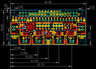
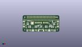
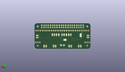
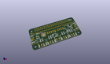

Contents
========

* [PROJ-ADAF-3422-STAN-01>Adafruit Arcade Bonnet PCB](#proj-adaf-3422-stan-01adafruit-arcade-bonnet-pcb)
	* [Images](#images)
	* [Interactive BOM](#interactive-bom)
	* [Tags](#tags)
  
![][im]
# PROJ-ADAF-3422-STAN-01>Adafruit Arcade Bonnet PCB

- ID: PROJ-ADAF-3422-STAN-01
- Hex ID: PRA3422
- Name: Adafruit Arcade Bonnet PCB
- Description: 

## Images
  
  

|eagleImage|kicadPcb3dFront|kicadPcb3dBack|kicadPcb3d|
| :---: | :---: | :---: | :---: |
|||||

## Interactive BOM

- Interactive BOM page: [ibom.html](kicad/bom/ibom.html)

## Tags

- hexID: PRA3422
- oompType: PROJ
- oompSize: ADAF
- oompColor: 3422
- oompDesc: STAN
- oompIndex: 01
- oompName: Adafruit Arcade Bonnet PCB
- sources: All source files from https://github.com/adafruit/Adafruit-Arcade-Bonnet-PCB (source licence details in srcLicense.md)
- linkBuyPage: http://www.adafruit.com/products/3422
- oompPart: UNMATCHED-UNMATCHED-X-UNMATCHED-01, B0, 6.858, 14.478, 90
- oompPart: UNMATCHED-UNMATCHED-X-UNMATCHED-01, B1, 12.446, 6.985, 180
- oompPart: UNMATCHED-UNMATCHED-X-UNMATCHED-01, B2, 23.622, 6.985, 180
- oompPart: UNMATCHED-UNMATCHED-X-UNMATCHED-01, B3, 41.656, 6.985, 180
- oompPart: UNMATCHED-UNMATCHED-X-UNMATCHED-01, B4, 52.705, 6.985, 180
- oompPart: UNMATCHED-UNMATCHED-X-UNMATCHED-01, B5, 57.912, 14.478, 270
- oompPart: CAPC-0603-X-NF100-V50, C1, 27.813, 9.652, 180
- oompPart: CAPC-0805-X-UF10-V25, C2, 27.94, 11.43, 180
- oompPart: UNMATCHED-UNMATCHED-X-UNMATCHED-01, CONN1, 32.766, 21.336, 0
- oompPart: UNMATCHED-UNMATCHED-X-UNMATCHED-01, D1, 10.287, 19.558, 270
- oompPart: SKIP-UNMATCHED-X-UNMATCHED-01, FID2, 58.547, 17.526, 0
- oompPart: SKIP-UNMATCHED-X-UNMATCHED-01, FID3, 5.969, 11.176, 0
- oompPart: UNMATCHED-UNMATCHED-X-UNMATCHED-01, IC1, 17.018, 15.621, 270
- oompPart: UNMATCHED-UNMATCHED-X-UNMATCHED-01, IC2, 49.276, 16.256, 0
- oompPart: UNMATCHED-UNMATCHED-X-UNMATCHED-01, JOY1, 27.94, 16.51, 180
- oompPart: UNMATCHED-UNMATCHED-X-UNMATCHED-01, JP1, 40.64, 16.51, 180
- oompPart: UNMATCHED-UNMATCHED-X-UNMATCHED-01, JP2, 61.341, 7.62, 0
- oompPart: UNMATCHED-UNMATCHED-X-UNMATCHED-01, JP3, 3.683, 7.62, 0
- oompPart: UNMATCHED-UNMATCHED-X-UNMATCHED-01, JP4, 41.656, 3.048, 180
- oompPart: UNMATCHED-UNMATCHED-X-UNMATCHED-01, JP6, 52.705, 3.048, 180
- oompPart: UNMATCHED-UNMATCHED-X-UNMATCHED-01, JP7, 61.849, 14.478, 270
- oompPart: UNMATCHED-UNMATCHED-X-UNMATCHED-01, JP8, 23.622, 3.048, 180
- oompPart: UNMATCHED-UNMATCHED-X-UNMATCHED-01, JP9, 12.446, 3.048, 180
- oompPart: UNMATCHED-UNMATCHED-X-UNMATCHED-01, JP10, 2.921, 14.478, 90
- oompPart: RESE-UNMATCHED-X-O103-01, R1, 48.895, 11.43, 0
- oompPart: RESE-0805-X-O103-01, R2, 53.086, 18.542, 270
- oompPart: RESE-0805-X-O103-01, R3, 48.387, 9.652, 180
- oompPart: RESE-0603-X-O105-01, R4, 31.242, 12.446, 180
- oompPart: RESE-0603-X-O102-01, R5, 13.589, 19.4945, 0
- oompPart: UNMATCHED-UNMATCHED-X-UNMATCHED-01, RPI1, 0.0, 0.0, 0
- oompPart: UNMATCHED-UNMATCHED-X-UNMATCHED-01, SJ1, 11.303, 15.875, M270
- oompPart: UNMATCHED-UNMATCHED-X-UNMATCHED-01, SJ2, 29.591, 10.541, M180
- oompPart: UNMATCHED-UNMATCHED-X-UNMATCHED-01, SPKR, 32.512, 4.064, 0
- oompPart: UNMATCHED-UNMATCHED-X-UNMATCHED-01, U1, 32.766, 9.652, 270
- rawPart: 

[im]: kicadPcb3d_450.png
