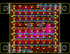
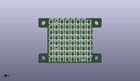
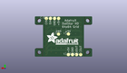
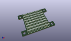

Contents
========

* [PROJ-ADAF-3444-STAN-01>DotStar 2020 8x8 Matrix PCB](#proj-adaf-3444-stan-01dotstar-2020-8x8-matrix-pcb)
	* [Images](#images)
	* [Interactive BOM](#interactive-bom)
	* [Tags](#tags)
  
![][im]
# PROJ-ADAF-3444-STAN-01>DotStar 2020 8x8 Matrix PCB

- ID: PROJ-ADAF-3444-STAN-01
- Hex ID: PRA3444
- Name: DotStar 2020 8x8 Matrix PCB
- Description: 

## Images
  
  

|eagleImage|kicadPcb3dFront|kicadPcb3dBack|kicadPcb3d|
| :---: | :---: | :---: | :---: |
|||||

## Interactive BOM

- Interactive BOM page: [ibom.html](kicad/bom/ibom.html)

## Tags

- hexID: PRA3444
- oompType: PROJ
- oompSize: ADAF
- oompColor: 3444
- oompDesc: STAN
- oompIndex: 01
- oompName: DotStar 2020 8x8 Matrix PCB
- sources: All source files from https://github.com/adafruit/DotStar-2020-8x8-Matrix-PCB (source licence details in srcLicense.md)
- linkBuyPage: http://www.adafruit.com/products/3444
- oompID: PROJ-ADAF-3444-STAN-01
- oompParts: CI,UNMATCHED-UNMATCHED-UNMATCHED-UNMATCHED-UNMATCHED
- oompParts: CO,UNMATCHED-UNMATCHED-UNMATCHED-UNMATCHED-UNMATCHED
- oompParts: DI,UNMATCHED-UNMATCHED-UNMATCHED-UNMATCHED-UNMATCHED
- oompParts: DO,UNMATCHED-UNMATCHED-UNMATCHED-UNMATCHED-UNMATCHED
- oompParts: G1,UNMATCHED-UNMATCHED-UNMATCHED-UNMATCHED-UNMATCHED
- oompParts: G2,UNMATCHED-UNMATCHED-UNMATCHED-UNMATCHED-UNMATCHED
- oompParts: G3,UNMATCHED-UNMATCHED-UNMATCHED-UNMATCHED-UNMATCHED
- oompParts: LED1,UNMATCHED-UNMATCHED-UNMATCHED-UNMATCHED-UNMATCHED
- oompParts: LED2,UNMATCHED-UNMATCHED-UNMATCHED-UNMATCHED-UNMATCHED
- oompParts: LED3,UNMATCHED-UNMATCHED-UNMATCHED-UNMATCHED-UNMATCHED
- oompParts: LED4,UNMATCHED-UNMATCHED-UNMATCHED-UNMATCHED-UNMATCHED
- oompParts: LED5,UNMATCHED-UNMATCHED-UNMATCHED-UNMATCHED-UNMATCHED
- oompParts: LED6,UNMATCHED-UNMATCHED-UNMATCHED-UNMATCHED-UNMATCHED
- oompParts: LED7,UNMATCHED-UNMATCHED-UNMATCHED-UNMATCHED-UNMATCHED
- oompParts: LED8,UNMATCHED-UNMATCHED-UNMATCHED-UNMATCHED-UNMATCHED
- oompParts: LED9,UNMATCHED-UNMATCHED-UNMATCHED-UNMATCHED-UNMATCHED
- oompParts: LED10,UNMATCHED-UNMATCHED-UNMATCHED-UNMATCHED-UNMATCHED
- oompParts: LED11,UNMATCHED-UNMATCHED-UNMATCHED-UNMATCHED-UNMATCHED
- oompParts: LED12,UNMATCHED-UNMATCHED-UNMATCHED-UNMATCHED-UNMATCHED
- oompParts: LED13,UNMATCHED-UNMATCHED-UNMATCHED-UNMATCHED-UNMATCHED
- oompParts: LED14,UNMATCHED-UNMATCHED-UNMATCHED-UNMATCHED-UNMATCHED
- oompParts: LED15,UNMATCHED-UNMATCHED-UNMATCHED-UNMATCHED-UNMATCHED
- oompParts: LED16,UNMATCHED-UNMATCHED-UNMATCHED-UNMATCHED-UNMATCHED
- oompParts: LED17,UNMATCHED-UNMATCHED-UNMATCHED-UNMATCHED-UNMATCHED
- oompParts: LED18,UNMATCHED-UNMATCHED-UNMATCHED-UNMATCHED-UNMATCHED
- oompParts: LED19,UNMATCHED-UNMATCHED-UNMATCHED-UNMATCHED-UNMATCHED
- oompParts: LED20,UNMATCHED-UNMATCHED-UNMATCHED-UNMATCHED-UNMATCHED
- oompParts: LED21,UNMATCHED-UNMATCHED-UNMATCHED-UNMATCHED-UNMATCHED
- oompParts: LED22,UNMATCHED-UNMATCHED-UNMATCHED-UNMATCHED-UNMATCHED
- oompParts: LED23,UNMATCHED-UNMATCHED-UNMATCHED-UNMATCHED-UNMATCHED
- oompParts: LED24,UNMATCHED-UNMATCHED-UNMATCHED-UNMATCHED-UNMATCHED
- oompParts: LED25,UNMATCHED-UNMATCHED-UNMATCHED-UNMATCHED-UNMATCHED
- oompParts: LED26,UNMATCHED-UNMATCHED-UNMATCHED-UNMATCHED-UNMATCHED
- oompParts: LED27,UNMATCHED-UNMATCHED-UNMATCHED-UNMATCHED-UNMATCHED
- oompParts: LED28,UNMATCHED-UNMATCHED-UNMATCHED-UNMATCHED-UNMATCHED
- oompParts: LED29,UNMATCHED-UNMATCHED-UNMATCHED-UNMATCHED-UNMATCHED
- oompParts: LED30,UNMATCHED-UNMATCHED-UNMATCHED-UNMATCHED-UNMATCHED
- oompParts: LED31,UNMATCHED-UNMATCHED-UNMATCHED-UNMATCHED-UNMATCHED
- oompParts: LED32,UNMATCHED-UNMATCHED-UNMATCHED-UNMATCHED-UNMATCHED
- oompParts: LED33,UNMATCHED-UNMATCHED-UNMATCHED-UNMATCHED-UNMATCHED
- oompParts: LED34,UNMATCHED-UNMATCHED-UNMATCHED-UNMATCHED-UNMATCHED
- oompParts: LED35,UNMATCHED-UNMATCHED-UNMATCHED-UNMATCHED-UNMATCHED
- oompParts: LED36,UNMATCHED-UNMATCHED-UNMATCHED-UNMATCHED-UNMATCHED
- oompParts: LED37,UNMATCHED-UNMATCHED-UNMATCHED-UNMATCHED-UNMATCHED
- oompParts: LED38,UNMATCHED-UNMATCHED-UNMATCHED-UNMATCHED-UNMATCHED
- oompParts: LED39,UNMATCHED-UNMATCHED-UNMATCHED-UNMATCHED-UNMATCHED
- oompParts: LED40,UNMATCHED-UNMATCHED-UNMATCHED-UNMATCHED-UNMATCHED
- oompParts: LED41,UNMATCHED-UNMATCHED-UNMATCHED-UNMATCHED-UNMATCHED
- oompParts: LED42,UNMATCHED-UNMATCHED-UNMATCHED-UNMATCHED-UNMATCHED
- oompParts: LED43,UNMATCHED-UNMATCHED-UNMATCHED-UNMATCHED-UNMATCHED
- oompParts: LED44,UNMATCHED-UNMATCHED-UNMATCHED-UNMATCHED-UNMATCHED
- oompParts: LED45,UNMATCHED-UNMATCHED-UNMATCHED-UNMATCHED-UNMATCHED
- oompParts: LED46,UNMATCHED-UNMATCHED-UNMATCHED-UNMATCHED-UNMATCHED
- oompParts: LED47,UNMATCHED-UNMATCHED-UNMATCHED-UNMATCHED-UNMATCHED
- oompParts: LED48,UNMATCHED-UNMATCHED-UNMATCHED-UNMATCHED-UNMATCHED
- oompParts: LED49,UNMATCHED-UNMATCHED-UNMATCHED-UNMATCHED-UNMATCHED
- oompParts: LED50,UNMATCHED-UNMATCHED-UNMATCHED-UNMATCHED-UNMATCHED
- oompParts: LED51,UNMATCHED-UNMATCHED-UNMATCHED-UNMATCHED-UNMATCHED
- oompParts: LED52,UNMATCHED-UNMATCHED-UNMATCHED-UNMATCHED-UNMATCHED
- oompParts: LED53,UNMATCHED-UNMATCHED-UNMATCHED-UNMATCHED-UNMATCHED
- oompParts: LED54,UNMATCHED-UNMATCHED-UNMATCHED-UNMATCHED-UNMATCHED
- oompParts: LED55,UNMATCHED-UNMATCHED-UNMATCHED-UNMATCHED-UNMATCHED
- oompParts: LED56,UNMATCHED-UNMATCHED-UNMATCHED-UNMATCHED-UNMATCHED
- oompParts: LED57,UNMATCHED-UNMATCHED-UNMATCHED-UNMATCHED-UNMATCHED
- oompParts: LED58,UNMATCHED-UNMATCHED-UNMATCHED-UNMATCHED-UNMATCHED
- oompParts: LED59,UNMATCHED-UNMATCHED-UNMATCHED-UNMATCHED-UNMATCHED
- oompParts: LED60,UNMATCHED-UNMATCHED-UNMATCHED-UNMATCHED-UNMATCHED
- oompParts: LED61,UNMATCHED-UNMATCHED-UNMATCHED-UNMATCHED-UNMATCHED
- oompParts: LED62,UNMATCHED-UNMATCHED-UNMATCHED-UNMATCHED-UNMATCHED
- oompParts: LED63,UNMATCHED-UNMATCHED-UNMATCHED-UNMATCHED-UNMATCHED
- oompParts: LED64,UNMATCHED-UNMATCHED-UNMATCHED-UNMATCHED-UNMATCHED
- oompParts: V1,UNMATCHED-UNMATCHED-UNMATCHED-UNMATCHED-UNMATCHED
- oompParts: V2,UNMATCHED-UNMATCHED-UNMATCHED-UNMATCHED-UNMATCHED
- oompParts: V3,UNMATCHED-UNMATCHED-UNMATCHED-UNMATCHED-UNMATCHED
- rawParts: CI,TPTP20R,TPTP20R,TP20R,Test pad,,
- rawParts: CO,TPTP20R,TPTP20R,TP20R,Test pad,,
- rawParts: DI,TPTP20R,TPTP20R,TP20R,Test pad,,
- rawParts: DO,TPTP20R,TPTP20R,TP20R,Test pad,,
- rawParts: FID1,FIDUCIAL_0.5MM,FIDUCIAL_0.5MM,FIDUCIAL_0.5MM,Fiducial Alignment Points,,
- rawParts: FID2,FIDUCIAL_0.5MM,FIDUCIAL_0.5MM,FIDUCIAL_0.5MM,Fiducial Alignment Points,,
- rawParts: FID3,FIDUCIAL_0.5MM,FIDUCIAL_0.5MM,FIDUCIAL_0.5MM,Fiducial Alignment Points,,
- rawParts: G1,TPTP20R,TPTP20R,TP20R,Test pad,,
- rawParts: G2,TPTP20R,TPTP20R,TP20R,Test pad,,
- rawParts: G3,TPTP20R,TPTP20R,TP20R,Test pad,,
- rawParts: LED1,,APA1022020,APA102_2020,APA102/DotStar Pixels,,
- rawParts: LED2,,APA1022020,APA102_2020,APA102/DotStar Pixels,,
- rawParts: LED3,,APA1022020,APA102_2020,APA102/DotStar Pixels,,
- rawParts: LED4,,APA1022020,APA102_2020,APA102/DotStar Pixels,,
- rawParts: LED5,,APA1022020,APA102_2020,APA102/DotStar Pixels,,
- rawParts: LED6,,APA1022020,APA102_2020,APA102/DotStar Pixels,,
- rawParts: LED7,,APA1022020,APA102_2020,APA102/DotStar Pixels,,
- rawParts: LED8,,APA1022020,APA102_2020,APA102/DotStar Pixels,,
- rawParts: LED9,,APA1022020,APA102_2020,APA102/DotStar Pixels,,
- rawParts: LED10,,APA1022020,APA102_2020,APA102/DotStar Pixels,,
- rawParts: LED11,,APA1022020,APA102_2020,APA102/DotStar Pixels,,
- rawParts: LED12,,APA1022020,APA102_2020,APA102/DotStar Pixels,,
- rawParts: LED13,,APA1022020,APA102_2020,APA102/DotStar Pixels,,
- rawParts: LED14,,APA1022020,APA102_2020,APA102/DotStar Pixels,,
- rawParts: LED15,,APA1022020,APA102_2020,APA102/DotStar Pixels,,
- rawParts: LED16,,APA1022020,APA102_2020,APA102/DotStar Pixels,,
- rawParts: LED17,,APA1022020,APA102_2020,APA102/DotStar Pixels,,
- rawParts: LED18,,APA1022020,APA102_2020,APA102/DotStar Pixels,,
- rawParts: LED19,,APA1022020,APA102_2020,APA102/DotStar Pixels,,
- rawParts: LED20,,APA1022020,APA102_2020,APA102/DotStar Pixels,,
- rawParts: LED21,,APA1022020,APA102_2020,APA102/DotStar Pixels,,
- rawParts: LED22,,APA1022020,APA102_2020,APA102/DotStar Pixels,,
- rawParts: LED23,,APA1022020,APA102_2020,APA102/DotStar Pixels,,
- rawParts: LED24,,APA1022020,APA102_2020,APA102/DotStar Pixels,,
- rawParts: LED25,,APA1022020,APA102_2020,APA102/DotStar Pixels,,
- rawParts: LED26,,APA1022020,APA102_2020,APA102/DotStar Pixels,,
- rawParts: LED27,,APA1022020,APA102_2020,APA102/DotStar Pixels,,
- rawParts: LED28,,APA1022020,APA102_2020,APA102/DotStar Pixels,,
- rawParts: LED29,,APA1022020,APA102_2020,APA102/DotStar Pixels,,
- rawParts: LED30,,APA1022020,APA102_2020,APA102/DotStar Pixels,,
- rawParts: LED31,,APA1022020,APA102_2020,APA102/DotStar Pixels,,
- rawParts: LED32,,APA1022020,APA102_2020,APA102/DotStar Pixels,,
- rawParts: LED33,,APA1022020,APA102_2020,APA102/DotStar Pixels,,
- rawParts: LED34,,APA1022020,APA102_2020,APA102/DotStar Pixels,,
- rawParts: LED35,,APA1022020,APA102_2020,APA102/DotStar Pixels,,
- rawParts: LED36,,APA1022020,APA102_2020,APA102/DotStar Pixels,,
- rawParts: LED37,,APA1022020,APA102_2020,APA102/DotStar Pixels,,
- rawParts: LED38,,APA1022020,APA102_2020,APA102/DotStar Pixels,,
- rawParts: LED39,,APA1022020,APA102_2020,APA102/DotStar Pixels,,
- rawParts: LED40,,APA1022020,APA102_2020,APA102/DotStar Pixels,,
- rawParts: LED41,,APA1022020,APA102_2020,APA102/DotStar Pixels,,
- rawParts: LED42,,APA1022020,APA102_2020,APA102/DotStar Pixels,,
- rawParts: LED43,,APA1022020,APA102_2020,APA102/DotStar Pixels,,
- rawParts: LED44,,APA1022020,APA102_2020,APA102/DotStar Pixels,,
- rawParts: LED45,,APA1022020,APA102_2020,APA102/DotStar Pixels,,
- rawParts: LED46,,APA1022020,APA102_2020,APA102/DotStar Pixels,,
- rawParts: LED47,,APA1022020,APA102_2020,APA102/DotStar Pixels,,
- rawParts: LED48,,APA1022020,APA102_2020,APA102/DotStar Pixels,,
- rawParts: LED49,,APA1022020,APA102_2020,APA102/DotStar Pixels,,
- rawParts: LED50,,APA1022020,APA102_2020,APA102/DotStar Pixels,,
- rawParts: LED51,,APA1022020,APA102_2020,APA102/DotStar Pixels,,
- rawParts: LED52,,APA1022020,APA102_2020,APA102/DotStar Pixels,,
- rawParts: LED53,,APA1022020,APA102_2020,APA102/DotStar Pixels,,
- rawParts: LED54,,APA1022020,APA102_2020,APA102/DotStar Pixels,,
- rawParts: LED55,,APA1022020,APA102_2020,APA102/DotStar Pixels,,
- rawParts: LED56,,APA1022020,APA102_2020,APA102/DotStar Pixels,,
- rawParts: LED57,,APA1022020,APA102_2020,APA102/DotStar Pixels,,
- rawParts: LED58,,APA1022020,APA102_2020,APA102/DotStar Pixels,,
- rawParts: LED59,,APA1022020,APA102_2020,APA102/DotStar Pixels,,
- rawParts: LED60,,APA1022020,APA102_2020,APA102/DotStar Pixels,,
- rawParts: LED61,,APA1022020,APA102_2020,APA102/DotStar Pixels,,
- rawParts: LED62,,APA1022020,APA102_2020,APA102/DotStar Pixels,,
- rawParts: LED63,,APA1022020,APA102_2020,APA102/DotStar Pixels,,
- rawParts: LED64,,APA1022020,APA102_2020,APA102/DotStar Pixels,,
- rawParts: V1,TPTP20R,TPTP20R,TP20R,Test pad,,
- rawParts: V2,TPTP20R,TPTP20R,TP20R,Test pad,,
- rawParts: V3,TPTP20R,TPTP20R,TP20R,Test pad,,

[im]: kicadPcb3d_450.png
