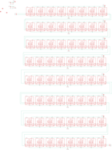

Contents
========

* [PRA3444 > Adafruit](#pra3444--adafruit)
	* [Schematic](#schematic)
	* [Interactive BOM](#interactive-bom)
	* [OOMP Parts](#oomp-parts)
	* [Images](#images)
	* [Tags](#tags)
  
![][im]
# PRA3444 > Adafruit

- ID: PROJ-ADAF-3444-STAN-01
- Hex ID: PRA3444
- Name: Adafruit
- Description: Adafruit
- Long Link: [http://oom.lt/PROJ-ADAF-3444-STAN-01](http://oom.lt/PROJ-ADAF-3444-STAN-01)
- Short Link: [http://oom.lt/PRA3444](http://oom.lt/PRA3444)

## Schematic
  

## Interactive BOM

- Interactive BOM page: [ibom.html](https://htmlpreview.github.io/?https://github.com/oomlout/oomlout_OOMP_projects/blob/main/PROJ-ADAF-3444-STAN-01/kicad/bom/ibom.html)

## OOMP Parts
  

|OOMP Parts|
| :---: |
|CI,UNMATCHED-UNMATCHED-X-UNMATCHED-01,CI,TPTP20R,TPTP20R,TP20R,Test pad,,|
|CO,UNMATCHED-UNMATCHED-X-UNMATCHED-01,CO,TPTP20R,TPTP20R,TP20R,Test pad,,|
|DI,UNMATCHED-UNMATCHED-X-UNMATCHED-01,DI,TPTP20R,TPTP20R,TP20R,Test pad,,|
|DO,UNMATCHED-UNMATCHED-X-UNMATCHED-01,DO,TPTP20R,TPTP20R,TP20R,Test pad,,|
|G1,UNMATCHED-UNMATCHED-X-UNMATCHED-01,FID1,FIDUCIAL_0.5MM,FIDUCIAL_0.5MM,FIDUCIAL_0.5MM,Fiducial Alignment Points,,|
|G2,UNMATCHED-UNMATCHED-X-UNMATCHED-01,FID2,FIDUCIAL_0.5MM,FIDUCIAL_0.5MM,FIDUCIAL_0.5MM,Fiducial Alignment Points,,|
|G3,UNMATCHED-UNMATCHED-X-UNMATCHED-01,FID3,FIDUCIAL_0.5MM,FIDUCIAL_0.5MM,FIDUCIAL_0.5MM,Fiducial Alignment Points,,|
|LED1,UNMATCHED-UNMATCHED-X-UNMATCHED-01,G1,TPTP20R,TPTP20R,TP20R,Test pad,,|
|LED2,UNMATCHED-UNMATCHED-X-UNMATCHED-01,G2,TPTP20R,TPTP20R,TP20R,Test pad,,|
|LED3,UNMATCHED-UNMATCHED-X-UNMATCHED-01,G3,TPTP20R,TPTP20R,TP20R,Test pad,,|
|LED4,UNMATCHED-UNMATCHED-X-UNMATCHED-01,LED1,,APA1022020,APA102_2020,APA102/DotStar Pixels,,|
|LED5,UNMATCHED-UNMATCHED-X-UNMATCHED-01,LED2,,APA1022020,APA102_2020,APA102/DotStar Pixels,,|
|LED6,UNMATCHED-UNMATCHED-X-UNMATCHED-01,LED3,,APA1022020,APA102_2020,APA102/DotStar Pixels,,|
|LED7,UNMATCHED-UNMATCHED-X-UNMATCHED-01,LED4,,APA1022020,APA102_2020,APA102/DotStar Pixels,,|
|LED8,UNMATCHED-UNMATCHED-X-UNMATCHED-01,LED5,,APA1022020,APA102_2020,APA102/DotStar Pixels,,|
|LED9,UNMATCHED-UNMATCHED-X-UNMATCHED-01,LED6,,APA1022020,APA102_2020,APA102/DotStar Pixels,,|
|LED10,UNMATCHED-UNMATCHED-X-UNMATCHED-01,LED7,,APA1022020,APA102_2020,APA102/DotStar Pixels,,|
|LED11,UNMATCHED-UNMATCHED-X-UNMATCHED-01,LED8,,APA1022020,APA102_2020,APA102/DotStar Pixels,,|
|LED12,UNMATCHED-UNMATCHED-X-UNMATCHED-01,LED9,,APA1022020,APA102_2020,APA102/DotStar Pixels,,|
|LED13,UNMATCHED-UNMATCHED-X-UNMATCHED-01,LED10,,APA1022020,APA102_2020,APA102/DotStar Pixels,,|
|LED14,UNMATCHED-UNMATCHED-X-UNMATCHED-01,LED11,,APA1022020,APA102_2020,APA102/DotStar Pixels,,|
|LED15,UNMATCHED-UNMATCHED-X-UNMATCHED-01,LED12,,APA1022020,APA102_2020,APA102/DotStar Pixels,,|
|LED16,UNMATCHED-UNMATCHED-X-UNMATCHED-01,LED13,,APA1022020,APA102_2020,APA102/DotStar Pixels,,|
|LED17,UNMATCHED-UNMATCHED-X-UNMATCHED-01,LED14,,APA1022020,APA102_2020,APA102/DotStar Pixels,,|
|LED18,UNMATCHED-UNMATCHED-X-UNMATCHED-01,LED15,,APA1022020,APA102_2020,APA102/DotStar Pixels,,|
|LED19,UNMATCHED-UNMATCHED-X-UNMATCHED-01,LED16,,APA1022020,APA102_2020,APA102/DotStar Pixels,,|
|LED20,UNMATCHED-UNMATCHED-X-UNMATCHED-01,LED17,,APA1022020,APA102_2020,APA102/DotStar Pixels,,|
|LED21,UNMATCHED-UNMATCHED-X-UNMATCHED-01,LED18,,APA1022020,APA102_2020,APA102/DotStar Pixels,,|
|LED22,UNMATCHED-UNMATCHED-X-UNMATCHED-01,LED19,,APA1022020,APA102_2020,APA102/DotStar Pixels,,|
|LED23,UNMATCHED-UNMATCHED-X-UNMATCHED-01,LED20,,APA1022020,APA102_2020,APA102/DotStar Pixels,,|
|LED24,UNMATCHED-UNMATCHED-X-UNMATCHED-01,LED21,,APA1022020,APA102_2020,APA102/DotStar Pixels,,|
|LED25,UNMATCHED-UNMATCHED-X-UNMATCHED-01,LED22,,APA1022020,APA102_2020,APA102/DotStar Pixels,,|
|LED26,UNMATCHED-UNMATCHED-X-UNMATCHED-01,LED23,,APA1022020,APA102_2020,APA102/DotStar Pixels,,|
|LED27,UNMATCHED-UNMATCHED-X-UNMATCHED-01,LED24,,APA1022020,APA102_2020,APA102/DotStar Pixels,,|
|LED28,UNMATCHED-UNMATCHED-X-UNMATCHED-01,LED25,,APA1022020,APA102_2020,APA102/DotStar Pixels,,|
|LED29,UNMATCHED-UNMATCHED-X-UNMATCHED-01,LED26,,APA1022020,APA102_2020,APA102/DotStar Pixels,,|
|LED30,UNMATCHED-UNMATCHED-X-UNMATCHED-01,LED27,,APA1022020,APA102_2020,APA102/DotStar Pixels,,|
|LED31,UNMATCHED-UNMATCHED-X-UNMATCHED-01,LED28,,APA1022020,APA102_2020,APA102/DotStar Pixels,,|
|LED32,UNMATCHED-UNMATCHED-X-UNMATCHED-01,LED29,,APA1022020,APA102_2020,APA102/DotStar Pixels,,|
|LED33,UNMATCHED-UNMATCHED-X-UNMATCHED-01,LED30,,APA1022020,APA102_2020,APA102/DotStar Pixels,,|
|LED34,UNMATCHED-UNMATCHED-X-UNMATCHED-01,LED31,,APA1022020,APA102_2020,APA102/DotStar Pixels,,|
|LED35,UNMATCHED-UNMATCHED-X-UNMATCHED-01,LED32,,APA1022020,APA102_2020,APA102/DotStar Pixels,,|
|LED36,UNMATCHED-UNMATCHED-X-UNMATCHED-01,LED33,,APA1022020,APA102_2020,APA102/DotStar Pixels,,|
|LED37,UNMATCHED-UNMATCHED-X-UNMATCHED-01,LED34,,APA1022020,APA102_2020,APA102/DotStar Pixels,,|
|LED38,UNMATCHED-UNMATCHED-X-UNMATCHED-01,LED35,,APA1022020,APA102_2020,APA102/DotStar Pixels,,|
|LED39,UNMATCHED-UNMATCHED-X-UNMATCHED-01,LED36,,APA1022020,APA102_2020,APA102/DotStar Pixels,,|
|LED40,UNMATCHED-UNMATCHED-X-UNMATCHED-01,LED37,,APA1022020,APA102_2020,APA102/DotStar Pixels,,|
|LED41,UNMATCHED-UNMATCHED-X-UNMATCHED-01,LED38,,APA1022020,APA102_2020,APA102/DotStar Pixels,,|
|LED42,UNMATCHED-UNMATCHED-X-UNMATCHED-01,LED39,,APA1022020,APA102_2020,APA102/DotStar Pixels,,|
|LED43,UNMATCHED-UNMATCHED-X-UNMATCHED-01,LED40,,APA1022020,APA102_2020,APA102/DotStar Pixels,,|
|LED44,UNMATCHED-UNMATCHED-X-UNMATCHED-01,LED41,,APA1022020,APA102_2020,APA102/DotStar Pixels,,|
|LED45,UNMATCHED-UNMATCHED-X-UNMATCHED-01,LED42,,APA1022020,APA102_2020,APA102/DotStar Pixels,,|
|LED46,UNMATCHED-UNMATCHED-X-UNMATCHED-01,LED43,,APA1022020,APA102_2020,APA102/DotStar Pixels,,|
|LED47,UNMATCHED-UNMATCHED-X-UNMATCHED-01,LED44,,APA1022020,APA102_2020,APA102/DotStar Pixels,,|
|LED48,UNMATCHED-UNMATCHED-X-UNMATCHED-01,LED45,,APA1022020,APA102_2020,APA102/DotStar Pixels,,|
|LED49,UNMATCHED-UNMATCHED-X-UNMATCHED-01,LED46,,APA1022020,APA102_2020,APA102/DotStar Pixels,,|
|LED50,UNMATCHED-UNMATCHED-X-UNMATCHED-01,LED47,,APA1022020,APA102_2020,APA102/DotStar Pixels,,|
|LED51,UNMATCHED-UNMATCHED-X-UNMATCHED-01,LED48,,APA1022020,APA102_2020,APA102/DotStar Pixels,,|
|LED52,UNMATCHED-UNMATCHED-X-UNMATCHED-01,LED49,,APA1022020,APA102_2020,APA102/DotStar Pixels,,|
|LED53,UNMATCHED-UNMATCHED-X-UNMATCHED-01,LED50,,APA1022020,APA102_2020,APA102/DotStar Pixels,,|
|LED54,UNMATCHED-UNMATCHED-X-UNMATCHED-01,LED51,,APA1022020,APA102_2020,APA102/DotStar Pixels,,|
|LED55,UNMATCHED-UNMATCHED-X-UNMATCHED-01,LED52,,APA1022020,APA102_2020,APA102/DotStar Pixels,,|
|LED56,UNMATCHED-UNMATCHED-X-UNMATCHED-01,LED53,,APA1022020,APA102_2020,APA102/DotStar Pixels,,|
|LED57,UNMATCHED-UNMATCHED-X-UNMATCHED-01,LED54,,APA1022020,APA102_2020,APA102/DotStar Pixels,,|
|LED58,UNMATCHED-UNMATCHED-X-UNMATCHED-01,LED55,,APA1022020,APA102_2020,APA102/DotStar Pixels,,|
|LED59,UNMATCHED-UNMATCHED-X-UNMATCHED-01,LED56,,APA1022020,APA102_2020,APA102/DotStar Pixels,,|
|LED60,UNMATCHED-UNMATCHED-X-UNMATCHED-01,LED57,,APA1022020,APA102_2020,APA102/DotStar Pixels,,|
|LED61,UNMATCHED-UNMATCHED-X-UNMATCHED-01,LED58,,APA1022020,APA102_2020,APA102/DotStar Pixels,,|
|LED62,UNMATCHED-UNMATCHED-X-UNMATCHED-01,LED59,,APA1022020,APA102_2020,APA102/DotStar Pixels,,|
|LED63,UNMATCHED-UNMATCHED-X-UNMATCHED-01,LED60,,APA1022020,APA102_2020,APA102/DotStar Pixels,,|
|LED64,UNMATCHED-UNMATCHED-X-UNMATCHED-01,LED61,,APA1022020,APA102_2020,APA102/DotStar Pixels,,|
|V1,UNMATCHED-UNMATCHED-X-UNMATCHED-01,LED62,,APA1022020,APA102_2020,APA102/DotStar Pixels,,|
|V2,UNMATCHED-UNMATCHED-X-UNMATCHED-01,LED63,,APA1022020,APA102_2020,APA102/DotStar Pixels,,|
|V3,UNMATCHED-UNMATCHED-X-UNMATCHED-01,LED64,,APA1022020,APA102_2020,APA102/DotStar Pixels,,|

## Images
  
  

|kicadPcb3d|kicadPcb3dFront|kicadPcb3dBack|eagleImage|eagleSchemImage|
| :---: | :---: | :---: | :---: | :---: |
||||||

## Tags

- hexID: PRA3444
- oompType: PROJ
- oompSize: ADAF
- oompColor: 3444
- oompDesc: STAN
- oompIndex: 01
- oompName: DotStar 2020 8x8 Matrix PCB
- sources: All source files from https://github.com/adafruit/DotStar-2020-8x8-Matrix-PCB (source licence details in srcLicense.md)
- linkBuyPage: http://www.adafruit.com/products/3444
- oompID: PROJ-ADAF-3444-STAN-01
- oompParts: CI,UNMATCHED-UNMATCHED-X-UNMATCHED-01
- oompParts: CO,UNMATCHED-UNMATCHED-X-UNMATCHED-01
- oompParts: DI,UNMATCHED-UNMATCHED-X-UNMATCHED-01
- oompParts: DO,UNMATCHED-UNMATCHED-X-UNMATCHED-01
- oompParts: G1,UNMATCHED-UNMATCHED-X-UNMATCHED-01
- oompParts: G2,UNMATCHED-UNMATCHED-X-UNMATCHED-01
- oompParts: G3,UNMATCHED-UNMATCHED-X-UNMATCHED-01
- oompParts: LED1,UNMATCHED-UNMATCHED-X-UNMATCHED-01
- oompParts: LED2,UNMATCHED-UNMATCHED-X-UNMATCHED-01
- oompParts: LED3,UNMATCHED-UNMATCHED-X-UNMATCHED-01
- oompParts: LED4,UNMATCHED-UNMATCHED-X-UNMATCHED-01
- oompParts: LED5,UNMATCHED-UNMATCHED-X-UNMATCHED-01
- oompParts: LED6,UNMATCHED-UNMATCHED-X-UNMATCHED-01
- oompParts: LED7,UNMATCHED-UNMATCHED-X-UNMATCHED-01
- oompParts: LED8,UNMATCHED-UNMATCHED-X-UNMATCHED-01
- oompParts: LED9,UNMATCHED-UNMATCHED-X-UNMATCHED-01
- oompParts: LED10,UNMATCHED-UNMATCHED-X-UNMATCHED-01
- oompParts: LED11,UNMATCHED-UNMATCHED-X-UNMATCHED-01
- oompParts: LED12,UNMATCHED-UNMATCHED-X-UNMATCHED-01
- oompParts: LED13,UNMATCHED-UNMATCHED-X-UNMATCHED-01
- oompParts: LED14,UNMATCHED-UNMATCHED-X-UNMATCHED-01
- oompParts: LED15,UNMATCHED-UNMATCHED-X-UNMATCHED-01
- oompParts: LED16,UNMATCHED-UNMATCHED-X-UNMATCHED-01
- oompParts: LED17,UNMATCHED-UNMATCHED-X-UNMATCHED-01
- oompParts: LED18,UNMATCHED-UNMATCHED-X-UNMATCHED-01
- oompParts: LED19,UNMATCHED-UNMATCHED-X-UNMATCHED-01
- oompParts: LED20,UNMATCHED-UNMATCHED-X-UNMATCHED-01
- oompParts: LED21,UNMATCHED-UNMATCHED-X-UNMATCHED-01
- oompParts: LED22,UNMATCHED-UNMATCHED-X-UNMATCHED-01
- oompParts: LED23,UNMATCHED-UNMATCHED-X-UNMATCHED-01
- oompParts: LED24,UNMATCHED-UNMATCHED-X-UNMATCHED-01
- oompParts: LED25,UNMATCHED-UNMATCHED-X-UNMATCHED-01
- oompParts: LED26,UNMATCHED-UNMATCHED-X-UNMATCHED-01
- oompParts: LED27,UNMATCHED-UNMATCHED-X-UNMATCHED-01
- oompParts: LED28,UNMATCHED-UNMATCHED-X-UNMATCHED-01
- oompParts: LED29,UNMATCHED-UNMATCHED-X-UNMATCHED-01
- oompParts: LED30,UNMATCHED-UNMATCHED-X-UNMATCHED-01
- oompParts: LED31,UNMATCHED-UNMATCHED-X-UNMATCHED-01
- oompParts: LED32,UNMATCHED-UNMATCHED-X-UNMATCHED-01
- oompParts: LED33,UNMATCHED-UNMATCHED-X-UNMATCHED-01
- oompParts: LED34,UNMATCHED-UNMATCHED-X-UNMATCHED-01
- oompParts: LED35,UNMATCHED-UNMATCHED-X-UNMATCHED-01
- oompParts: LED36,UNMATCHED-UNMATCHED-X-UNMATCHED-01
- oompParts: LED37,UNMATCHED-UNMATCHED-X-UNMATCHED-01
- oompParts: LED38,UNMATCHED-UNMATCHED-X-UNMATCHED-01
- oompParts: LED39,UNMATCHED-UNMATCHED-X-UNMATCHED-01
- oompParts: LED40,UNMATCHED-UNMATCHED-X-UNMATCHED-01
- oompParts: LED41,UNMATCHED-UNMATCHED-X-UNMATCHED-01
- oompParts: LED42,UNMATCHED-UNMATCHED-X-UNMATCHED-01
- oompParts: LED43,UNMATCHED-UNMATCHED-X-UNMATCHED-01
- oompParts: LED44,UNMATCHED-UNMATCHED-X-UNMATCHED-01
- oompParts: LED45,UNMATCHED-UNMATCHED-X-UNMATCHED-01
- oompParts: LED46,UNMATCHED-UNMATCHED-X-UNMATCHED-01
- oompParts: LED47,UNMATCHED-UNMATCHED-X-UNMATCHED-01
- oompParts: LED48,UNMATCHED-UNMATCHED-X-UNMATCHED-01
- oompParts: LED49,UNMATCHED-UNMATCHED-X-UNMATCHED-01
- oompParts: LED50,UNMATCHED-UNMATCHED-X-UNMATCHED-01
- oompParts: LED51,UNMATCHED-UNMATCHED-X-UNMATCHED-01
- oompParts: LED52,UNMATCHED-UNMATCHED-X-UNMATCHED-01
- oompParts: LED53,UNMATCHED-UNMATCHED-X-UNMATCHED-01
- oompParts: LED54,UNMATCHED-UNMATCHED-X-UNMATCHED-01
- oompParts: LED55,UNMATCHED-UNMATCHED-X-UNMATCHED-01
- oompParts: LED56,UNMATCHED-UNMATCHED-X-UNMATCHED-01
- oompParts: LED57,UNMATCHED-UNMATCHED-X-UNMATCHED-01
- oompParts: LED58,UNMATCHED-UNMATCHED-X-UNMATCHED-01
- oompParts: LED59,UNMATCHED-UNMATCHED-X-UNMATCHED-01
- oompParts: LED60,UNMATCHED-UNMATCHED-X-UNMATCHED-01
- oompParts: LED61,UNMATCHED-UNMATCHED-X-UNMATCHED-01
- oompParts: LED62,UNMATCHED-UNMATCHED-X-UNMATCHED-01
- oompParts: LED63,UNMATCHED-UNMATCHED-X-UNMATCHED-01
- oompParts: LED64,UNMATCHED-UNMATCHED-X-UNMATCHED-01
- oompParts: V1,UNMATCHED-UNMATCHED-X-UNMATCHED-01
- oompParts: V2,UNMATCHED-UNMATCHED-X-UNMATCHED-01
- oompParts: V3,UNMATCHED-UNMATCHED-X-UNMATCHED-01
- rawParts: CI,TPTP20R,TPTP20R,TP20R,Test pad,,
- rawParts: CO,TPTP20R,TPTP20R,TP20R,Test pad,,
- rawParts: DI,TPTP20R,TPTP20R,TP20R,Test pad,,
- rawParts: DO,TPTP20R,TPTP20R,TP20R,Test pad,,
- rawParts: FID1,FIDUCIAL_0.5MM,FIDUCIAL_0.5MM,FIDUCIAL_0.5MM,Fiducial Alignment Points,,
- rawParts: FID2,FIDUCIAL_0.5MM,FIDUCIAL_0.5MM,FIDUCIAL_0.5MM,Fiducial Alignment Points,,
- rawParts: FID3,FIDUCIAL_0.5MM,FIDUCIAL_0.5MM,FIDUCIAL_0.5MM,Fiducial Alignment Points,,
- rawParts: G1,TPTP20R,TPTP20R,TP20R,Test pad,,
- rawParts: G2,TPTP20R,TPTP20R,TP20R,Test pad,,
- rawParts: G3,TPTP20R,TPTP20R,TP20R,Test pad,,
- rawParts: LED1,,APA1022020,APA102_2020,APA102/DotStar Pixels,,
- rawParts: LED2,,APA1022020,APA102_2020,APA102/DotStar Pixels,,
- rawParts: LED3,,APA1022020,APA102_2020,APA102/DotStar Pixels,,
- rawParts: LED4,,APA1022020,APA102_2020,APA102/DotStar Pixels,,
- rawParts: LED5,,APA1022020,APA102_2020,APA102/DotStar Pixels,,
- rawParts: LED6,,APA1022020,APA102_2020,APA102/DotStar Pixels,,
- rawParts: LED7,,APA1022020,APA102_2020,APA102/DotStar Pixels,,
- rawParts: LED8,,APA1022020,APA102_2020,APA102/DotStar Pixels,,
- rawParts: LED9,,APA1022020,APA102_2020,APA102/DotStar Pixels,,
- rawParts: LED10,,APA1022020,APA102_2020,APA102/DotStar Pixels,,
- rawParts: LED11,,APA1022020,APA102_2020,APA102/DotStar Pixels,,
- rawParts: LED12,,APA1022020,APA102_2020,APA102/DotStar Pixels,,
- rawParts: LED13,,APA1022020,APA102_2020,APA102/DotStar Pixels,,
- rawParts: LED14,,APA1022020,APA102_2020,APA102/DotStar Pixels,,
- rawParts: LED15,,APA1022020,APA102_2020,APA102/DotStar Pixels,,
- rawParts: LED16,,APA1022020,APA102_2020,APA102/DotStar Pixels,,
- rawParts: LED17,,APA1022020,APA102_2020,APA102/DotStar Pixels,,
- rawParts: LED18,,APA1022020,APA102_2020,APA102/DotStar Pixels,,
- rawParts: LED19,,APA1022020,APA102_2020,APA102/DotStar Pixels,,
- rawParts: LED20,,APA1022020,APA102_2020,APA102/DotStar Pixels,,
- rawParts: LED21,,APA1022020,APA102_2020,APA102/DotStar Pixels,,
- rawParts: LED22,,APA1022020,APA102_2020,APA102/DotStar Pixels,,
- rawParts: LED23,,APA1022020,APA102_2020,APA102/DotStar Pixels,,
- rawParts: LED24,,APA1022020,APA102_2020,APA102/DotStar Pixels,,
- rawParts: LED25,,APA1022020,APA102_2020,APA102/DotStar Pixels,,
- rawParts: LED26,,APA1022020,APA102_2020,APA102/DotStar Pixels,,
- rawParts: LED27,,APA1022020,APA102_2020,APA102/DotStar Pixels,,
- rawParts: LED28,,APA1022020,APA102_2020,APA102/DotStar Pixels,,
- rawParts: LED29,,APA1022020,APA102_2020,APA102/DotStar Pixels,,
- rawParts: LED30,,APA1022020,APA102_2020,APA102/DotStar Pixels,,
- rawParts: LED31,,APA1022020,APA102_2020,APA102/DotStar Pixels,,
- rawParts: LED32,,APA1022020,APA102_2020,APA102/DotStar Pixels,,
- rawParts: LED33,,APA1022020,APA102_2020,APA102/DotStar Pixels,,
- rawParts: LED34,,APA1022020,APA102_2020,APA102/DotStar Pixels,,
- rawParts: LED35,,APA1022020,APA102_2020,APA102/DotStar Pixels,,
- rawParts: LED36,,APA1022020,APA102_2020,APA102/DotStar Pixels,,
- rawParts: LED37,,APA1022020,APA102_2020,APA102/DotStar Pixels,,
- rawParts: LED38,,APA1022020,APA102_2020,APA102/DotStar Pixels,,
- rawParts: LED39,,APA1022020,APA102_2020,APA102/DotStar Pixels,,
- rawParts: LED40,,APA1022020,APA102_2020,APA102/DotStar Pixels,,
- rawParts: LED41,,APA1022020,APA102_2020,APA102/DotStar Pixels,,
- rawParts: LED42,,APA1022020,APA102_2020,APA102/DotStar Pixels,,
- rawParts: LED43,,APA1022020,APA102_2020,APA102/DotStar Pixels,,
- rawParts: LED44,,APA1022020,APA102_2020,APA102/DotStar Pixels,,
- rawParts: LED45,,APA1022020,APA102_2020,APA102/DotStar Pixels,,
- rawParts: LED46,,APA1022020,APA102_2020,APA102/DotStar Pixels,,
- rawParts: LED47,,APA1022020,APA102_2020,APA102/DotStar Pixels,,
- rawParts: LED48,,APA1022020,APA102_2020,APA102/DotStar Pixels,,
- rawParts: LED49,,APA1022020,APA102_2020,APA102/DotStar Pixels,,
- rawParts: LED50,,APA1022020,APA102_2020,APA102/DotStar Pixels,,
- rawParts: LED51,,APA1022020,APA102_2020,APA102/DotStar Pixels,,
- rawParts: LED52,,APA1022020,APA102_2020,APA102/DotStar Pixels,,
- rawParts: LED53,,APA1022020,APA102_2020,APA102/DotStar Pixels,,
- rawParts: LED54,,APA1022020,APA102_2020,APA102/DotStar Pixels,,
- rawParts: LED55,,APA1022020,APA102_2020,APA102/DotStar Pixels,,
- rawParts: LED56,,APA1022020,APA102_2020,APA102/DotStar Pixels,,
- rawParts: LED57,,APA1022020,APA102_2020,APA102/DotStar Pixels,,
- rawParts: LED58,,APA1022020,APA102_2020,APA102/DotStar Pixels,,
- rawParts: LED59,,APA1022020,APA102_2020,APA102/DotStar Pixels,,
- rawParts: LED60,,APA1022020,APA102_2020,APA102/DotStar Pixels,,
- rawParts: LED61,,APA1022020,APA102_2020,APA102/DotStar Pixels,,
- rawParts: LED62,,APA1022020,APA102_2020,APA102/DotStar Pixels,,
- rawParts: LED63,,APA1022020,APA102_2020,APA102/DotStar Pixels,,
- rawParts: LED64,,APA1022020,APA102_2020,APA102/DotStar Pixels,,
- rawParts: V1,TPTP20R,TPTP20R,TP20R,Test pad,,
- rawParts: V2,TPTP20R,TPTP20R,TP20R,Test pad,,
- rawParts: V3,TPTP20R,TPTP20R,TP20R,Test pad,,

[im]: kicadPcb3d_450.png
