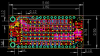
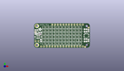
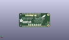
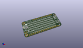

Contents
========

* [PROJ-ADAF-3449-STAN-01>Adafruit DotStar FeatherWing PCB](#proj-adaf-3449-stan-01adafruit-dotstar-featherwing-pcb)
	* [Images](#images)
	* [Interactive BOM](#interactive-bom)
	* [OOMP Parts](#oomp-parts)
	* [Tags](#tags)
  
![][im]
# PROJ-ADAF-3449-STAN-01>Adafruit DotStar FeatherWing PCB

- ID: PROJ-ADAF-3449-STAN-01
- Hex ID: PRA3449
- Name: Adafruit DotStar FeatherWing PCB
- Description: 

## Images
  
  

|eagleImage|kicadPcb3dFront|kicadPcb3dBack|kicadPcb3d|
| :---: | :---: | :---: | :---: |
|||||

## Interactive BOM

- Interactive BOM page: [ibom.html](kicad/bom/ibom.html)

## OOMP Parts
  

|OOMP Parts|
| :---: |
|CAPC-0805-X-UNMATCHED-01, C1, 49.529999999999994, 6.985, 270,C1, 10uF, 0805-NO, microbuilder, (1.95, 0.275), R270|
|CAPC-0805-X-UNMATCHED-01, C2, 46.863, 8.128, 180,C2, 10uF, 0805-NO, microbuilder, (1.845, 0.32), R180|
|CAPC-0805-X-UNMATCHED-01, C3, 49.529999999999994, 16.128999999999998, 270,C3, 10uF, 0805-NO, microbuilder, (1.95, 0.635), R270|
|CAPC-0805-X-UNMATCHED-01, C4, 46.863, 17.272000000000002, 180,C4, 10uF, 0805-NO, microbuilder, (1.845, 0.68), R180|
|CAPC-0805-X-UNMATCHED-01, C5, 46.863, 14.985999999999999, 180,C5, 10uF, 0805-NO, microbuilder, (1.845, 0.59), R180|
|CAPC-0805-X-UNMATCHED-01, C6, 46.863, 5.842, 180,C6, 10uF, 0805-NO, microbuilder, (1.845, 0.23), R180|
|CAPC-0805-X-UNMATCHED-01, C7, 5.460999999999999, 14.097000000000001, 180,C7, 10uF, 0805-NO, microbuilder, (0.215, 0.555), R180|
|CAPC-0805-X-UNMATCHED-01, C8, 6.223, 6.604, 270,C8, 10uF, 0805-NO, microbuilder, (0.245, 0.26), R270|
|UNMATCHED-UNMATCHED-X-UNMATCHED-01, D1, 2.921, 14.731999999999998, 90,D1, MBR120, SOD-123, microbuilder, (0.115, 0.58), R90|
|UNMATCHED-UNMATCHED-X-UNMATCHED-01, D2, 1.1429999999999998, 14.731999999999998, 90,D2, MBR120, SOD-123, microbuilder, (0.045, 0.58), R90|
|HEAD-I01-X-PI01-01, JP3, 3.8099999999999996, 6.35, 0,JP3, 1X01_ROUND, microbuilder, (0.15, 0.25), R0|
|HEAD-I01-X-PI01-01, JP4, 1.27, 6.35, 0,JP4, 1X01_ROUND, microbuilder, (0.05, 0.25), R0|
|UNMATCHED-UNMATCHED-X-UNMATCHED-01, LED1, 8.636000000000001, 3.8099999999999996, 180,LED1, APA102_2020, microbuilder, (0.34, 0.15), R180|
|UNMATCHED-UNMATCHED-X-UNMATCHED-01, LED2, 11.684, 3.8099999999999996, 180,LED2, APA102_2020, microbuilder, (0.46, 0.15), R180|
|UNMATCHED-UNMATCHED-X-UNMATCHED-01, LED3, 14.731999999999998, 3.8099999999999996, 180,LED3, APA102_2020, microbuilder, (0.58, 0.15), R180|
|UNMATCHED-UNMATCHED-X-UNMATCHED-01, LED4, 17.779999999999998, 3.8099999999999996, 180,LED4, APA102_2020, microbuilder, (0.7, 0.15), R180|
|UNMATCHED-UNMATCHED-X-UNMATCHED-01, LED5, 20.827999999999996, 3.8099999999999996, 180,LED5, APA102_2020, microbuilder, (0.82, 0.15), R180|
|UNMATCHED-UNMATCHED-X-UNMATCHED-01, LED6, 23.875999999999998, 3.8099999999999996, 180,LED6, APA102_2020, microbuilder, (0.94, 0.15), R180|
|UNMATCHED-UNMATCHED-X-UNMATCHED-01, LED7, 26.924, 3.8099999999999996, 180,LED7, APA102_2020, microbuilder, (1.06, 0.15), R180|
|UNMATCHED-UNMATCHED-X-UNMATCHED-01, LED8, 29.971999999999998, 3.8099999999999996, 180,LED8, APA102_2020, microbuilder, (1.18, 0.15), R180|
|UNMATCHED-UNMATCHED-X-UNMATCHED-01, LED9, 8.636000000000001, 6.858, 180,LED9, APA102_2020, microbuilder, (0.34, 0.27), R180|
|UNMATCHED-UNMATCHED-X-UNMATCHED-01, LED10, 11.684, 6.858, 180,LED10, APA102_2020, microbuilder, (0.46, 0.27), R180|
|UNMATCHED-UNMATCHED-X-UNMATCHED-01, LED11, 14.731999999999998, 6.858, 180,LED11, APA102_2020, microbuilder, (0.58, 0.27), R180|
|UNMATCHED-UNMATCHED-X-UNMATCHED-01, LED12, 17.779999999999998, 6.858, 180,LED12, APA102_2020, microbuilder, (0.7, 0.27), R180|
|UNMATCHED-UNMATCHED-X-UNMATCHED-01, LED13, 20.827999999999996, 6.858, 180,LED13, APA102_2020, microbuilder, (0.82, 0.27), R180|
|UNMATCHED-UNMATCHED-X-UNMATCHED-01, LED14, 23.875999999999998, 6.858, 180,LED14, APA102_2020, microbuilder, (0.94, 0.27), R180|
|UNMATCHED-UNMATCHED-X-UNMATCHED-01, LED15, 26.924, 6.858, 180,LED15, APA102_2020, microbuilder, (1.06, 0.27), R180|
|UNMATCHED-UNMATCHED-X-UNMATCHED-01, LED16, 29.971999999999998, 6.858, 180,LED16, APA102_2020, microbuilder, (1.18, 0.27), R180|
|UNMATCHED-UNMATCHED-X-UNMATCHED-01, LED17, 8.636000000000001, 9.906, 180,LED17, APA102_2020, microbuilder, (0.34, 0.39), R180|
|UNMATCHED-UNMATCHED-X-UNMATCHED-01, LED18, 11.684, 9.906, 180,LED18, APA102_2020, microbuilder, (0.46, 0.39), R180|
|UNMATCHED-UNMATCHED-X-UNMATCHED-01, LED19, 14.731999999999998, 9.906, 180,LED19, APA102_2020, microbuilder, (0.58, 0.39), R180|
|UNMATCHED-UNMATCHED-X-UNMATCHED-01, LED20, 17.779999999999998, 9.906, 180,LED20, APA102_2020, microbuilder, (0.7, 0.39), R180|
|UNMATCHED-UNMATCHED-X-UNMATCHED-01, LED21, 20.827999999999996, 9.906, 180,LED21, APA102_2020, microbuilder, (0.82, 0.39), R180|
|UNMATCHED-UNMATCHED-X-UNMATCHED-01, LED22, 23.875999999999998, 9.906, 180,LED22, APA102_2020, microbuilder, (0.94, 0.39), R180|
|UNMATCHED-UNMATCHED-X-UNMATCHED-01, LED23, 26.924, 9.906, 180,LED23, APA102_2020, microbuilder, (1.06, 0.39), R180|
|UNMATCHED-UNMATCHED-X-UNMATCHED-01, LED24, 29.971999999999998, 9.906, 180,LED24, APA102_2020, microbuilder, (1.18, 0.39), R180|
|UNMATCHED-UNMATCHED-X-UNMATCHED-01, LED25, 8.636000000000001, 12.953999999999999, 180,LED25, APA102_2020, microbuilder, (0.34, 0.51), R180|
|UNMATCHED-UNMATCHED-X-UNMATCHED-01, LED26, 11.684, 12.953999999999999, 180,LED26, APA102_2020, microbuilder, (0.46, 0.51), R180|
|UNMATCHED-UNMATCHED-X-UNMATCHED-01, LED27, 14.731999999999998, 12.953999999999999, 180,LED27, APA102_2020, microbuilder, (0.58, 0.51), R180|
|UNMATCHED-UNMATCHED-X-UNMATCHED-01, LED28, 17.779999999999998, 12.953999999999999, 180,LED28, APA102_2020, microbuilder, (0.7, 0.51), R180|
|UNMATCHED-UNMATCHED-X-UNMATCHED-01, LED29, 20.827999999999996, 12.953999999999999, 180,LED29, APA102_2020, microbuilder, (0.82, 0.51), R180|
|UNMATCHED-UNMATCHED-X-UNMATCHED-01, LED30, 23.875999999999998, 12.953999999999999, 180,LED30, APA102_2020, microbuilder, (0.94, 0.51), R180|
|UNMATCHED-UNMATCHED-X-UNMATCHED-01, LED31, 26.924, 12.953999999999999, 180,LED31, APA102_2020, microbuilder, (1.06, 0.51), R180|
|UNMATCHED-UNMATCHED-X-UNMATCHED-01, LED32, 29.971999999999998, 12.953999999999999, 180,LED32, APA102_2020, microbuilder, (1.18, 0.51), R180|
|UNMATCHED-UNMATCHED-X-UNMATCHED-01, LED33, 8.636000000000001, 16.002, 180,LED33, APA102_2020, microbuilder, (0.34, 0.63), R180|
|UNMATCHED-UNMATCHED-X-UNMATCHED-01, LED34, 11.684, 16.002, 180,LED34, APA102_2020, microbuilder, (0.46, 0.63), R180|
|UNMATCHED-UNMATCHED-X-UNMATCHED-01, LED35, 14.731999999999998, 16.002, 180,LED35, APA102_2020, microbuilder, (0.58, 0.63), R180|
|UNMATCHED-UNMATCHED-X-UNMATCHED-01, LED36, 17.779999999999998, 16.002, 180,LED36, APA102_2020, microbuilder, (0.7, 0.63), R180|
|UNMATCHED-UNMATCHED-X-UNMATCHED-01, LED37, 20.827999999999996, 16.002, 180,LED37, APA102_2020, microbuilder, (0.82, 0.63), R180|
|UNMATCHED-UNMATCHED-X-UNMATCHED-01, LED38, 23.875999999999998, 16.002, 180,LED38, APA102_2020, microbuilder, (0.94, 0.63), R180|
|UNMATCHED-UNMATCHED-X-UNMATCHED-01, LED39, 26.924, 16.002, 180,LED39, APA102_2020, microbuilder, (1.06, 0.63), R180|
|UNMATCHED-UNMATCHED-X-UNMATCHED-01, LED40, 29.971999999999998, 16.002, 180,LED40, APA102_2020, microbuilder, (1.18, 0.63), R180|
|UNMATCHED-UNMATCHED-X-UNMATCHED-01, LED41, 8.636000000000001, 19.049999999999997, 180,LED41, APA102_2020, microbuilder, (0.34, 0.75), R180|
|UNMATCHED-UNMATCHED-X-UNMATCHED-01, LED42, 11.684, 19.049999999999997, 180,LED42, APA102_2020, microbuilder, (0.46, 0.75), R180|
|UNMATCHED-UNMATCHED-X-UNMATCHED-01, LED43, 14.731999999999998, 19.049999999999997, 180,LED43, APA102_2020, microbuilder, (0.58, 0.75), R180|
|UNMATCHED-UNMATCHED-X-UNMATCHED-01, LED44, 17.779999999999998, 19.049999999999997, 180,LED44, APA102_2020, microbuilder, (0.7, 0.75), R180|
|UNMATCHED-UNMATCHED-X-UNMATCHED-01, LED45, 20.827999999999996, 19.049999999999997, 180,LED45, APA102_2020, microbuilder, (0.82, 0.75), R180|
|UNMATCHED-UNMATCHED-X-UNMATCHED-01, LED46, 23.875999999999998, 19.049999999999997, 180,LED46, APA102_2020, microbuilder, (0.94, 0.75), R180|
|UNMATCHED-UNMATCHED-X-UNMATCHED-01, LED47, 26.924, 19.049999999999997, 180,LED47, APA102_2020, microbuilder, (1.06, 0.75), R180|
|UNMATCHED-UNMATCHED-X-UNMATCHED-01, LED48, 29.971999999999998, 19.049999999999997, 180,LED48, APA102_2020, microbuilder, (1.18, 0.75), R180|
|UNMATCHED-UNMATCHED-X-UNMATCHED-01, LED49, 33.019999999999996, 3.8099999999999996, 180,LED49, APA102_2020, microbuilder, (1.3, 0.15), R180|
|UNMATCHED-UNMATCHED-X-UNMATCHED-01, LED50, 36.068, 3.8099999999999996, 180,LED50, APA102_2020, microbuilder, (1.42, 0.15), R180|
|UNMATCHED-UNMATCHED-X-UNMATCHED-01, LED51, 39.116, 3.8099999999999996, 180,LED51, APA102_2020, microbuilder, (1.54, 0.15), R180|
|UNMATCHED-UNMATCHED-X-UNMATCHED-01, LED52, 42.163999999999994, 3.8099999999999996, 180,LED52, APA102_2020, microbuilder, (1.66, 0.15), R180|
|UNMATCHED-UNMATCHED-X-UNMATCHED-01, LED53, 33.019999999999996, 6.858, 180,LED53, APA102_2020, microbuilder, (1.3, 0.27), R180|
|UNMATCHED-UNMATCHED-X-UNMATCHED-01, LED54, 36.068, 6.858, 180,LED54, APA102_2020, microbuilder, (1.42, 0.27), R180|
|UNMATCHED-UNMATCHED-X-UNMATCHED-01, LED55, 39.37, 6.858, 180,LED55, APA102_2020, microbuilder, (1.55, 0.27), R180|
|UNMATCHED-UNMATCHED-X-UNMATCHED-01, LED56, 42.163999999999994, 6.858, 180,LED56, APA102_2020, microbuilder, (1.66, 0.27), R180|
|UNMATCHED-UNMATCHED-X-UNMATCHED-01, LED57, 33.019999999999996, 9.906, 180,LED57, APA102_2020, microbuilder, (1.3, 0.39), R180|
|UNMATCHED-UNMATCHED-X-UNMATCHED-01, LED58, 36.068, 9.906, 180,LED58, APA102_2020, microbuilder, (1.42, 0.39), R180|
|UNMATCHED-UNMATCHED-X-UNMATCHED-01, LED59, 39.116, 9.906, 180,LED59, APA102_2020, microbuilder, (1.54, 0.39), R180|
|UNMATCHED-UNMATCHED-X-UNMATCHED-01, LED60, 42.163999999999994, 9.906, 180,LED60, APA102_2020, microbuilder, (1.66, 0.39), R180|
|UNMATCHED-UNMATCHED-X-UNMATCHED-01, LED61, 33.019999999999996, 12.953999999999999, 180,LED61, APA102_2020, microbuilder, (1.3, 0.51), R180|
|UNMATCHED-UNMATCHED-X-UNMATCHED-01, LED62, 36.068, 12.953999999999999, 180,LED62, APA102_2020, microbuilder, (1.42, 0.51), R180|
|UNMATCHED-UNMATCHED-X-UNMATCHED-01, LED63, 39.116, 12.953999999999999, 180,LED63, APA102_2020, microbuilder, (1.54, 0.51), R180|
|UNMATCHED-UNMATCHED-X-UNMATCHED-01, LED64, 42.163999999999994, 12.953999999999999, 180,LED64, APA102_2020, microbuilder, (1.66, 0.51), R180|
|UNMATCHED-UNMATCHED-X-UNMATCHED-01, LED65, 33.019999999999996, 16.002, 180,LED65, APA102_2020, microbuilder, (1.3, 0.63), R180|
|UNMATCHED-UNMATCHED-X-UNMATCHED-01, LED66, 36.068, 16.002, 180,LED66, APA102_2020, microbuilder, (1.42, 0.63), R180|
|UNMATCHED-UNMATCHED-X-UNMATCHED-01, LED67, 39.116, 16.002, 180,LED67, APA102_2020, microbuilder, (1.54, 0.63), R180|
|UNMATCHED-UNMATCHED-X-UNMATCHED-01, LED68, 42.163999999999994, 16.002, 180,LED68, APA102_2020, microbuilder, (1.66, 0.63), R180|
|UNMATCHED-UNMATCHED-X-UNMATCHED-01, LED69, 33.019999999999996, 19.049999999999997, 180,LED69, APA102_2020, microbuilder, (1.3, 0.75), R180|
|UNMATCHED-UNMATCHED-X-UNMATCHED-01, LED70, 36.068, 19.049999999999997, 180,LED70, APA102_2020, microbuilder, (1.42, 0.75), R180|
|UNMATCHED-UNMATCHED-X-UNMATCHED-01, LED71, 39.116, 19.049999999999997, 180,LED71, APA102_2020, microbuilder, (1.54, 0.75), R180|
|UNMATCHED-UNMATCHED-X-UNMATCHED-01, LED72, 42.163999999999994, 19.049999999999997, 180,LED72, APA102_2020, microbuilder, (1.66, 0.75), R180|
|UNMATCHED-UNMATCHED-X-UNMATCHED-01, MS1, 0.0, 0.0, 0,MS1, FEATHERWING, FEATHERWING, microbuilder, (0, 0), R0|
|UNMATCHED-UNMATCHED-X-UNMATCHED-01, Q1, 5.460999999999999, 10.16, 270,Q1, BSS138, SOT23-WIDE, microbuilder, (0.215, 0.4), R270|
|UNMATCHED-UNMATCHED-X-UNMATCHED-01, Q3, 1.9049999999999998, 10.16, 90,Q3, DMG3415U-7, SOT23-WIDE, microbuilder, (0.075, 0.4), R90|
|<table><tr><td></td><td> R12</td><td>[RESE-0603-X-O104-01 SMD (0603) 100k Ohm Resistor](https://github.com/oomlout/oomlout_OOMP_parts/tree/main/RESE-0603-X-O104-01/)</td><td>[R6104](https://github.com/oomlout/oomlout_OOMP_parts/tree/main/RESE-0603-X-O104-01/)</td></tr></table>|
|UNMATCHED-UNMATCHED-X-UNMATCHED-01, SW1, 47.625, 11.176, 0,SW1, KMR2, BTN_KMR2_4.6X2.8, microbuilder, (1.875, 0.44), R0|

## Tags

- hexID: PRA3449
- oompType: PROJ
- oompSize: ADAF
- oompColor: 3449
- oompDesc: STAN
- oompIndex: 01
- oompName: Adafruit DotStar FeatherWing PCB
- sources: All source files from https://github.com/adafruit/Adafruit-DotStar-FeatherWing-PCB (source licence details in srcLicense.md)
- linkBuyPage: http://www.adafruit.com/products/3449
- oompID: PROJ-ADAF-3449-STAN-01
- oompPart: CAPC-0805-X-UNMATCHED-01, C1, 49.529999999999994, 6.985, 270
- oompPart: CAPC-0805-X-UNMATCHED-01, C2, 46.863, 8.128, 180
- oompPart: CAPC-0805-X-UNMATCHED-01, C3, 49.529999999999994, 16.128999999999998, 270
- oompPart: CAPC-0805-X-UNMATCHED-01, C4, 46.863, 17.272000000000002, 180
- oompPart: CAPC-0805-X-UNMATCHED-01, C5, 46.863, 14.985999999999999, 180
- oompPart: CAPC-0805-X-UNMATCHED-01, C6, 46.863, 5.842, 180
- oompPart: CAPC-0805-X-UNMATCHED-01, C7, 5.460999999999999, 14.097000000000001, 180
- oompPart: CAPC-0805-X-UNMATCHED-01, C8, 6.223, 6.604, 270
- oompPart: UNMATCHED-UNMATCHED-X-UNMATCHED-01, D1, 2.921, 14.731999999999998, 90
- oompPart: UNMATCHED-UNMATCHED-X-UNMATCHED-01, D2, 1.1429999999999998, 14.731999999999998, 90
- oompPart: SKIP-UNMATCHED-X-UNMATCHED-01, FID1, 46.482, 0.7619999999999999, 0
- oompPart: SKIP-UNMATCHED-X-UNMATCHED-01, FID2, 1.1429999999999998, 14.6685, 0
- oompPart: SKIP-UNMATCHED-X-UNMATCHED-01, FID3, 49.657, 18.796, 0
- oompPart: HEAD-I01-X-PI01-01, JP3, 3.8099999999999996, 6.35, 0
- oompPart: HEAD-I01-X-PI01-01, JP4, 1.27, 6.35, 0
- oompPart: UNMATCHED-UNMATCHED-X-UNMATCHED-01, LED1, 8.636000000000001, 3.8099999999999996, 180
- oompPart: UNMATCHED-UNMATCHED-X-UNMATCHED-01, LED2, 11.684, 3.8099999999999996, 180
- oompPart: UNMATCHED-UNMATCHED-X-UNMATCHED-01, LED3, 14.731999999999998, 3.8099999999999996, 180
- oompPart: UNMATCHED-UNMATCHED-X-UNMATCHED-01, LED4, 17.779999999999998, 3.8099999999999996, 180
- oompPart: UNMATCHED-UNMATCHED-X-UNMATCHED-01, LED5, 20.827999999999996, 3.8099999999999996, 180
- oompPart: UNMATCHED-UNMATCHED-X-UNMATCHED-01, LED6, 23.875999999999998, 3.8099999999999996, 180
- oompPart: UNMATCHED-UNMATCHED-X-UNMATCHED-01, LED7, 26.924, 3.8099999999999996, 180
- oompPart: UNMATCHED-UNMATCHED-X-UNMATCHED-01, LED8, 29.971999999999998, 3.8099999999999996, 180
- oompPart: UNMATCHED-UNMATCHED-X-UNMATCHED-01, LED9, 8.636000000000001, 6.858, 180
- oompPart: UNMATCHED-UNMATCHED-X-UNMATCHED-01, LED10, 11.684, 6.858, 180
- oompPart: UNMATCHED-UNMATCHED-X-UNMATCHED-01, LED11, 14.731999999999998, 6.858, 180
- oompPart: UNMATCHED-UNMATCHED-X-UNMATCHED-01, LED12, 17.779999999999998, 6.858, 180
- oompPart: UNMATCHED-UNMATCHED-X-UNMATCHED-01, LED13, 20.827999999999996, 6.858, 180
- oompPart: UNMATCHED-UNMATCHED-X-UNMATCHED-01, LED14, 23.875999999999998, 6.858, 180
- oompPart: UNMATCHED-UNMATCHED-X-UNMATCHED-01, LED15, 26.924, 6.858, 180
- oompPart: UNMATCHED-UNMATCHED-X-UNMATCHED-01, LED16, 29.971999999999998, 6.858, 180
- oompPart: UNMATCHED-UNMATCHED-X-UNMATCHED-01, LED17, 8.636000000000001, 9.906, 180
- oompPart: UNMATCHED-UNMATCHED-X-UNMATCHED-01, LED18, 11.684, 9.906, 180
- oompPart: UNMATCHED-UNMATCHED-X-UNMATCHED-01, LED19, 14.731999999999998, 9.906, 180
- oompPart: UNMATCHED-UNMATCHED-X-UNMATCHED-01, LED20, 17.779999999999998, 9.906, 180
- oompPart: UNMATCHED-UNMATCHED-X-UNMATCHED-01, LED21, 20.827999999999996, 9.906, 180
- oompPart: UNMATCHED-UNMATCHED-X-UNMATCHED-01, LED22, 23.875999999999998, 9.906, 180
- oompPart: UNMATCHED-UNMATCHED-X-UNMATCHED-01, LED23, 26.924, 9.906, 180
- oompPart: UNMATCHED-UNMATCHED-X-UNMATCHED-01, LED24, 29.971999999999998, 9.906, 180
- oompPart: UNMATCHED-UNMATCHED-X-UNMATCHED-01, LED25, 8.636000000000001, 12.953999999999999, 180
- oompPart: UNMATCHED-UNMATCHED-X-UNMATCHED-01, LED26, 11.684, 12.953999999999999, 180
- oompPart: UNMATCHED-UNMATCHED-X-UNMATCHED-01, LED27, 14.731999999999998, 12.953999999999999, 180
- oompPart: UNMATCHED-UNMATCHED-X-UNMATCHED-01, LED28, 17.779999999999998, 12.953999999999999, 180
- oompPart: UNMATCHED-UNMATCHED-X-UNMATCHED-01, LED29, 20.827999999999996, 12.953999999999999, 180
- oompPart: UNMATCHED-UNMATCHED-X-UNMATCHED-01, LED30, 23.875999999999998, 12.953999999999999, 180
- oompPart: UNMATCHED-UNMATCHED-X-UNMATCHED-01, LED31, 26.924, 12.953999999999999, 180
- oompPart: UNMATCHED-UNMATCHED-X-UNMATCHED-01, LED32, 29.971999999999998, 12.953999999999999, 180
- oompPart: UNMATCHED-UNMATCHED-X-UNMATCHED-01, LED33, 8.636000000000001, 16.002, 180
- oompPart: UNMATCHED-UNMATCHED-X-UNMATCHED-01, LED34, 11.684, 16.002, 180
- oompPart: UNMATCHED-UNMATCHED-X-UNMATCHED-01, LED35, 14.731999999999998, 16.002, 180
- oompPart: UNMATCHED-UNMATCHED-X-UNMATCHED-01, LED36, 17.779999999999998, 16.002, 180
- oompPart: UNMATCHED-UNMATCHED-X-UNMATCHED-01, LED37, 20.827999999999996, 16.002, 180
- oompPart: UNMATCHED-UNMATCHED-X-UNMATCHED-01, LED38, 23.875999999999998, 16.002, 180
- oompPart: UNMATCHED-UNMATCHED-X-UNMATCHED-01, LED39, 26.924, 16.002, 180
- oompPart: UNMATCHED-UNMATCHED-X-UNMATCHED-01, LED40, 29.971999999999998, 16.002, 180
- oompPart: UNMATCHED-UNMATCHED-X-UNMATCHED-01, LED41, 8.636000000000001, 19.049999999999997, 180
- oompPart: UNMATCHED-UNMATCHED-X-UNMATCHED-01, LED42, 11.684, 19.049999999999997, 180
- oompPart: UNMATCHED-UNMATCHED-X-UNMATCHED-01, LED43, 14.731999999999998, 19.049999999999997, 180
- oompPart: UNMATCHED-UNMATCHED-X-UNMATCHED-01, LED44, 17.779999999999998, 19.049999999999997, 180
- oompPart: UNMATCHED-UNMATCHED-X-UNMATCHED-01, LED45, 20.827999999999996, 19.049999999999997, 180
- oompPart: UNMATCHED-UNMATCHED-X-UNMATCHED-01, LED46, 23.875999999999998, 19.049999999999997, 180
- oompPart: UNMATCHED-UNMATCHED-X-UNMATCHED-01, LED47, 26.924, 19.049999999999997, 180
- oompPart: UNMATCHED-UNMATCHED-X-UNMATCHED-01, LED48, 29.971999999999998, 19.049999999999997, 180
- oompPart: UNMATCHED-UNMATCHED-X-UNMATCHED-01, LED49, 33.019999999999996, 3.8099999999999996, 180
- oompPart: UNMATCHED-UNMATCHED-X-UNMATCHED-01, LED50, 36.068, 3.8099999999999996, 180
- oompPart: UNMATCHED-UNMATCHED-X-UNMATCHED-01, LED51, 39.116, 3.8099999999999996, 180
- oompPart: UNMATCHED-UNMATCHED-X-UNMATCHED-01, LED52, 42.163999999999994, 3.8099999999999996, 180
- oompPart: UNMATCHED-UNMATCHED-X-UNMATCHED-01, LED53, 33.019999999999996, 6.858, 180
- oompPart: UNMATCHED-UNMATCHED-X-UNMATCHED-01, LED54, 36.068, 6.858, 180
- oompPart: UNMATCHED-UNMATCHED-X-UNMATCHED-01, LED55, 39.37, 6.858, 180
- oompPart: UNMATCHED-UNMATCHED-X-UNMATCHED-01, LED56, 42.163999999999994, 6.858, 180
- oompPart: UNMATCHED-UNMATCHED-X-UNMATCHED-01, LED57, 33.019999999999996, 9.906, 180
- oompPart: UNMATCHED-UNMATCHED-X-UNMATCHED-01, LED58, 36.068, 9.906, 180
- oompPart: UNMATCHED-UNMATCHED-X-UNMATCHED-01, LED59, 39.116, 9.906, 180
- oompPart: UNMATCHED-UNMATCHED-X-UNMATCHED-01, LED60, 42.163999999999994, 9.906, 180
- oompPart: UNMATCHED-UNMATCHED-X-UNMATCHED-01, LED61, 33.019999999999996, 12.953999999999999, 180
- oompPart: UNMATCHED-UNMATCHED-X-UNMATCHED-01, LED62, 36.068, 12.953999999999999, 180
- oompPart: UNMATCHED-UNMATCHED-X-UNMATCHED-01, LED63, 39.116, 12.953999999999999, 180
- oompPart: UNMATCHED-UNMATCHED-X-UNMATCHED-01, LED64, 42.163999999999994, 12.953999999999999, 180
- oompPart: UNMATCHED-UNMATCHED-X-UNMATCHED-01, LED65, 33.019999999999996, 16.002, 180
- oompPart: UNMATCHED-UNMATCHED-X-UNMATCHED-01, LED66, 36.068, 16.002, 180
- oompPart: UNMATCHED-UNMATCHED-X-UNMATCHED-01, LED67, 39.116, 16.002, 180
- oompPart: UNMATCHED-UNMATCHED-X-UNMATCHED-01, LED68, 42.163999999999994, 16.002, 180
- oompPart: UNMATCHED-UNMATCHED-X-UNMATCHED-01, LED69, 33.019999999999996, 19.049999999999997, 180
- oompPart: UNMATCHED-UNMATCHED-X-UNMATCHED-01, LED70, 36.068, 19.049999999999997, 180
- oompPart: UNMATCHED-UNMATCHED-X-UNMATCHED-01, LED71, 39.116, 19.049999999999997, 180
- oompPart: UNMATCHED-UNMATCHED-X-UNMATCHED-01, LED72, 42.163999999999994, 19.049999999999997, 180
- oompPart: UNMATCHED-UNMATCHED-X-UNMATCHED-01, MS1, 0.0, 0.0, 0
- oompPart: UNMATCHED-UNMATCHED-X-UNMATCHED-01, Q1, 5.460999999999999, 10.16, 270
- oompPart: UNMATCHED-UNMATCHED-X-UNMATCHED-01, Q3, 1.9049999999999998, 10.16, 90
- oompPart: RESE-0603-X-O104-01, R12, 5.270499999999999, 12.5095, 180
- oompPart: SKIP-UNMATCHED-X-UNMATCHED-01, SJ1, 24.13, 18.923, M0
- oompPart: SKIP-UNMATCHED-X-UNMATCHED-01, SJ2, 28.955999999999996, 18.923, M0
- oompPart: UNMATCHED-UNMATCHED-X-UNMATCHED-01, SW1, 47.625, 11.176, 0
- oompPart: SKIP-UNMATCHED-X-UNMATCHED-01, TP1, 39.37, 18.923, M180
- oompPart: SKIP-UNMATCHED-X-UNMATCHED-01, TP2, 34.29, 18.923, M0
- oompPart: SKIP-UNMATCHED-X-UNMATCHED-01, TP3, 36.83, 18.923, M0
- oompPart: SKIP-UNMATCHED-X-UNMATCHED-01, TP4, 31.75, 18.923, M0
- oompPart: SKIP-UNMATCHED-X-UNMATCHED-01, TP5, 31.496, 3.429, M180
- oompPart: SKIP-UNMATCHED-X-UNMATCHED-01, TP6, 34.544000000000004, 3.429, M180
- oompPart: SKIP-UNMATCHED-X-UNMATCHED-01, TP7, 28.511499999999998, 3.429, M0
- oompPart: SKIP-UNMATCHED-X-UNMATCHED-01, TP8, 16.256, 3.429, M0
- oompPart: SKIP-UNMATCHED-X-UNMATCHED-01, TP9, 25.4, 3.3655, M0
- oompPart: SKIP-UNMATCHED-X-UNMATCHED-01, TP10, 22.415499999999998, 3.429, M0
- oompPart: SKIP-UNMATCHED-X-UNMATCHED-01, TP11, 19.304, 3.429, M0
- rawPart: C1, 10uF, 0805-NO, microbuilder, (1.95, 0.275), R270
- rawPart: C2, 10uF, 0805-NO, microbuilder, (1.845, 0.32), R180
- rawPart: C3, 10uF, 0805-NO, microbuilder, (1.95, 0.635), R270
- rawPart: C4, 10uF, 0805-NO, microbuilder, (1.845, 0.68), R180
- rawPart: C5, 10uF, 0805-NO, microbuilder, (1.845, 0.59), R180
- rawPart: C6, 10uF, 0805-NO, microbuilder, (1.845, 0.23), R180
- rawPart: C7, 10uF, 0805-NO, microbuilder, (0.215, 0.555), R180
- rawPart: C8, 10uF, 0805-NO, microbuilder, (0.245, 0.26), R270
- rawPart: D1, MBR120, SOD-123, microbuilder, (0.115, 0.58), R90
- rawPart: D2, MBR120, SOD-123, microbuilder, (0.045, 0.58), R90
- rawPart: FID1, FIDUCIAL_1MM, FIDUCIAL_1MM, microbuilder, (1.83, 0.03), R0
- rawPart: FID2, FIDUCIAL_1MM, FIDUCIAL_1MM, microbuilder, (0.045, 0.5775), R0
- rawPart: FID3, FIDUCIAL_1MM, FIDUCIAL_1MM, microbuilder, (1.955, 0.74), R0
- rawPart: JP3, 1X01_ROUND, microbuilder, (0.15, 0.25), R0
- rawPart: JP4, 1X01_ROUND, microbuilder, (0.05, 0.25), R0
- rawPart: LED1, APA102_2020, microbuilder, (0.34, 0.15), R180
- rawPart: LED2, APA102_2020, microbuilder, (0.46, 0.15), R180
- rawPart: LED3, APA102_2020, microbuilder, (0.58, 0.15), R180
- rawPart: LED4, APA102_2020, microbuilder, (0.7, 0.15), R180
- rawPart: LED5, APA102_2020, microbuilder, (0.82, 0.15), R180
- rawPart: LED6, APA102_2020, microbuilder, (0.94, 0.15), R180
- rawPart: LED7, APA102_2020, microbuilder, (1.06, 0.15), R180
- rawPart: LED8, APA102_2020, microbuilder, (1.18, 0.15), R180
- rawPart: LED9, APA102_2020, microbuilder, (0.34, 0.27), R180
- rawPart: LED10, APA102_2020, microbuilder, (0.46, 0.27), R180
- rawPart: LED11, APA102_2020, microbuilder, (0.58, 0.27), R180
- rawPart: LED12, APA102_2020, microbuilder, (0.7, 0.27), R180
- rawPart: LED13, APA102_2020, microbuilder, (0.82, 0.27), R180
- rawPart: LED14, APA102_2020, microbuilder, (0.94, 0.27), R180
- rawPart: LED15, APA102_2020, microbuilder, (1.06, 0.27), R180
- rawPart: LED16, APA102_2020, microbuilder, (1.18, 0.27), R180
- rawPart: LED17, APA102_2020, microbuilder, (0.34, 0.39), R180
- rawPart: LED18, APA102_2020, microbuilder, (0.46, 0.39), R180
- rawPart: LED19, APA102_2020, microbuilder, (0.58, 0.39), R180
- rawPart: LED20, APA102_2020, microbuilder, (0.7, 0.39), R180
- rawPart: LED21, APA102_2020, microbuilder, (0.82, 0.39), R180
- rawPart: LED22, APA102_2020, microbuilder, (0.94, 0.39), R180
- rawPart: LED23, APA102_2020, microbuilder, (1.06, 0.39), R180
- rawPart: LED24, APA102_2020, microbuilder, (1.18, 0.39), R180
- rawPart: LED25, APA102_2020, microbuilder, (0.34, 0.51), R180
- rawPart: LED26, APA102_2020, microbuilder, (0.46, 0.51), R180
- rawPart: LED27, APA102_2020, microbuilder, (0.58, 0.51), R180
- rawPart: LED28, APA102_2020, microbuilder, (0.7, 0.51), R180
- rawPart: LED29, APA102_2020, microbuilder, (0.82, 0.51), R180
- rawPart: LED30, APA102_2020, microbuilder, (0.94, 0.51), R180
- rawPart: LED31, APA102_2020, microbuilder, (1.06, 0.51), R180
- rawPart: LED32, APA102_2020, microbuilder, (1.18, 0.51), R180
- rawPart: LED33, APA102_2020, microbuilder, (0.34, 0.63), R180
- rawPart: LED34, APA102_2020, microbuilder, (0.46, 0.63), R180
- rawPart: LED35, APA102_2020, microbuilder, (0.58, 0.63), R180
- rawPart: LED36, APA102_2020, microbuilder, (0.7, 0.63), R180
- rawPart: LED37, APA102_2020, microbuilder, (0.82, 0.63), R180
- rawPart: LED38, APA102_2020, microbuilder, (0.94, 0.63), R180
- rawPart: LED39, APA102_2020, microbuilder, (1.06, 0.63), R180
- rawPart: LED40, APA102_2020, microbuilder, (1.18, 0.63), R180
- rawPart: LED41, APA102_2020, microbuilder, (0.34, 0.75), R180
- rawPart: LED42, APA102_2020, microbuilder, (0.46, 0.75), R180
- rawPart: LED43, APA102_2020, microbuilder, (0.58, 0.75), R180
- rawPart: LED44, APA102_2020, microbuilder, (0.7, 0.75), R180
- rawPart: LED45, APA102_2020, microbuilder, (0.82, 0.75), R180
- rawPart: LED46, APA102_2020, microbuilder, (0.94, 0.75), R180
- rawPart: LED47, APA102_2020, microbuilder, (1.06, 0.75), R180
- rawPart: LED48, APA102_2020, microbuilder, (1.18, 0.75), R180
- rawPart: LED49, APA102_2020, microbuilder, (1.3, 0.15), R180
- rawPart: LED50, APA102_2020, microbuilder, (1.42, 0.15), R180
- rawPart: LED51, APA102_2020, microbuilder, (1.54, 0.15), R180
- rawPart: LED52, APA102_2020, microbuilder, (1.66, 0.15), R180
- rawPart: LED53, APA102_2020, microbuilder, (1.3, 0.27), R180
- rawPart: LED54, APA102_2020, microbuilder, (1.42, 0.27), R180
- rawPart: LED55, APA102_2020, microbuilder, (1.55, 0.27), R180
- rawPart: LED56, APA102_2020, microbuilder, (1.66, 0.27), R180
- rawPart: LED57, APA102_2020, microbuilder, (1.3, 0.39), R180
- rawPart: LED58, APA102_2020, microbuilder, (1.42, 0.39), R180
- rawPart: LED59, APA102_2020, microbuilder, (1.54, 0.39), R180
- rawPart: LED60, APA102_2020, microbuilder, (1.66, 0.39), R180
- rawPart: LED61, APA102_2020, microbuilder, (1.3, 0.51), R180
- rawPart: LED62, APA102_2020, microbuilder, (1.42, 0.51), R180
- rawPart: LED63, APA102_2020, microbuilder, (1.54, 0.51), R180
- rawPart: LED64, APA102_2020, microbuilder, (1.66, 0.51), R180
- rawPart: LED65, APA102_2020, microbuilder, (1.3, 0.63), R180
- rawPart: LED66, APA102_2020, microbuilder, (1.42, 0.63), R180
- rawPart: LED67, APA102_2020, microbuilder, (1.54, 0.63), R180
- rawPart: LED68, APA102_2020, microbuilder, (1.66, 0.63), R180
- rawPart: LED69, APA102_2020, microbuilder, (1.3, 0.75), R180
- rawPart: LED70, APA102_2020, microbuilder, (1.42, 0.75), R180
- rawPart: LED71, APA102_2020, microbuilder, (1.54, 0.75), R180
- rawPart: LED72, APA102_2020, microbuilder, (1.66, 0.75), R180
- rawPart: MS1, FEATHERWING, FEATHERWING, microbuilder, (0, 0), R0
- rawPart: Q1, BSS138, SOT23-WIDE, microbuilder, (0.215, 0.4), R270
- rawPart: Q3, DMG3415U-7, SOT23-WIDE, microbuilder, (0.075, 0.4), R90
- rawPart: R12, 100k, 0603-NO, microbuilder, (0.2075, 0.4925), R180
- rawPart: SJ1, SOLDERJUMPER_CLOSEDWIRE, microbuilder, (0.95, 0.745), MR0
- rawPart: SJ2, SOLDERJUMPER_CLOSEDWIRE, microbuilder, (1.14, 0.745), MR0
- rawPart: SW1, KMR2, BTN_KMR2_4.6X2.8, microbuilder, (1.875, 0.44), R0
- rawPart: TP1, PAD-1.5X2.0, microbuilder, (1.55, 0.745), MR180
- rawPart: TP2, PAD-1.5X2.0, microbuilder, (1.35, 0.745), MR0
- rawPart: TP3, PAD-1.5X2.0, microbuilder, (1.45, 0.745), MR0
- rawPart: TP4, PAD-1.5X2.0, microbuilder, (1.25, 0.745), MR0
- rawPart: TP5, PAD-1.5X2.0, microbuilder, (1.24, 0.135), MR180
- rawPart: TP6, PAD-1.5X2.0, microbuilder, (1.36, 0.135), MR180
- rawPart: TP7, PAD-1.5X2.0, microbuilder, (1.1225, 0.135), MR0
- rawPart: TP8, PAD-1.5X2.0, microbuilder, (0.64, 0.135), MR0
- rawPart: TP9, PAD-1.5X2.0, microbuilder, (1, 0.1325), MR0
- rawPart: TP10, PAD-1.5X2.0, microbuilder, (0.8825, 0.135), MR0
- rawPart: TP11, PAD-1.5X2.0, microbuilder, (0.76, 0.135), MR0

[im]: kicadPcb3d_450.png
