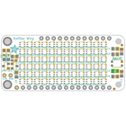
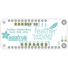
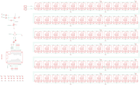
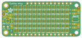
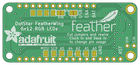

Contents
========

* [PRA3449 > Adafruit DotStar FeatherWing PCB](#pra3449--adafruit-dotstar-featherwing-pcb)
	* [Schematic](#schematic)
	* [PCB](#pcb)
	* [Interactive BOM](#interactive-bom)
	* [OOMP Parts](#oomp-parts)
	* [Images](#images)
	* [Tags](#tags)
  
![][im]
# PRA3449 > Adafruit DotStar FeatherWing PCB

- ID: PROJ-ADAF-3449-STAN-01
- Hex ID: PRA3449
- Name: Adafruit
- Description: Adafruit
- Long Link: [http://oom.lt/PROJ-ADAF-3449-STAN-01](http://oom.lt/PROJ-ADAF-3449-STAN-01)
- Short Link: [http://oom.lt/PRA3449](http://oom.lt/PRA3449)

## Schematic
  

## PCB
  

## Interactive BOM

- Interactive BOM page: [ibom.html](https://htmlpreview.github.io/?https://github.com/oomlout/oomlout_OOMP_projects/blob/main/PROJ-ADAF-3449-STAN-01/kicad/bom/ibom.html)

## OOMP Parts
  

|OOMP Parts|
| :---: |
|[CAPC-0805-X-UF10-V10  SMD (0805) 10 uF Capacitor (Ceramic) 10v  C1, C2, C3, C4, C5, C6, C7, C8](https://github.com/oomlout/oomlout_OOMP_parts/tree/main/CAPC-0805-X-UF10-V10/)|
|[DIOD-S123-X-KMBR120-01  SMD (SOD-123) MBR120 Diode  D1, D2](https://github.com/oomlout/oomlout_OOMP_parts/tree/main/DIOD-S123-X-KMBR120-01/)|
|HEAD-I01-X-PI01-01 JP3, JP4|
|[LEDS-2020-RGB-K102-01  SMD (2020) Smart Controller (APA102) RGB LED  LED1, LED2, LED3, LED4, LED5, LED6, LED7, LED8, LED9, LED10, LED11, LED12, LED13, LED14, LED15, LED16, LED17, LED18, LED19, LED20, LED21, LED22, LED23, LED24, LED25, LED26, LED27, LED28, LED29, LED30, LED31, LED32, LED33, LED34, LED35, LED36, LED37, LED38, LED39, LED40, LED41, LED42, LED43, LED44, LED45, LED46, LED47, LED48, LED49, LED50, LED51, LED52, LED53, LED54, LED55, LED56, LED57, LED58, LED59, LED60, LED61, LED62, LED63, LED64, LED65, LED66, LED67, LED68, LED69, LED70, LED71, LED72](https://github.com/oomlout/oomlout_OOMP_parts/tree/main/LEDS-2020-RGB-K102-01/)|
|UNMATCHED-UNMATCHED-X-UNMATCHED-01 MS1|
|[MOSN-SO23-X-KBSS138-01  SMD (SOT-23) BSS138 N-Ch. MOSFET  Q1](https://github.com/oomlout/oomlout_OOMP_parts/tree/main/MOSN-SO23-X-KBSS138-01/)|
|MOSP-SO23-X-UNMATCHED-01 Q3|
|RESE-0603-X-O1003-01 R12|
|[BUTA-4628-X-STAN-01  SMD (4628) Pushbutton (Tactile)  SW1](https://github.com/oomlout/oomlout_OOMP_parts/tree/main/BUTA-4628-X-STAN-01/)|

## Images
  
  

|bominteractivefront|bominteractiveback|kicadPcb3d|kicadPcb3dFront|kicadPcb3dBack|eagleImage|eagleSchemImage|pcbdraw|pcbdrawback|
| :---: | :---: | :---: | :---: | :---: | :---: | :---: | :---: | :---: |
||||||||||

## Tags

- hexID: PRA3449
- oompType: PROJ
- oompSize: ADAF
- oompColor: 3449
- oompDesc: STAN
- oompIndex: 01
- oompName: Adafruit DotStar FeatherWing PCB
- sources: All source files from https://github.com/adafruit/Adafruit-DotStar-FeatherWing-PCB (source licence details in srcLicense.md)
- linkBuyPage: http://www.adafruit.com/products/3449
- oompID: PROJ-ADAF-3449-STAN-01
- oompParts: C1,CAPC-0805-X-UF10-V10
- oompParts: C2,CAPC-0805-X-UF10-V10
- oompParts: C3,CAPC-0805-X-UF10-V10
- oompParts: C4,CAPC-0805-X-UF10-V10
- oompParts: C5,CAPC-0805-X-UF10-V10
- oompParts: C6,CAPC-0805-X-UF10-V10
- oompParts: C7,CAPC-0805-X-UF10-V10
- oompParts: C8,CAPC-0805-X-UF10-V10
- oompParts: D1,DIOD-S123-X-KMBR120-01
- oompParts: D2,DIOD-S123-X-KMBR120-01
- oompParts: JP3,HEAD-I01-X-PI01-01
- oompParts: JP4,HEAD-I01-X-PI01-01
- oompParts: LED1,LEDS-2020-RGB-K102-01
- oompParts: LED2,LEDS-2020-RGB-K102-01
- oompParts: LED3,LEDS-2020-RGB-K102-01
- oompParts: LED4,LEDS-2020-RGB-K102-01
- oompParts: LED5,LEDS-2020-RGB-K102-01
- oompParts: LED6,LEDS-2020-RGB-K102-01
- oompParts: LED7,LEDS-2020-RGB-K102-01
- oompParts: LED8,LEDS-2020-RGB-K102-01
- oompParts: LED9,LEDS-2020-RGB-K102-01
- oompParts: LED10,LEDS-2020-RGB-K102-01
- oompParts: LED11,LEDS-2020-RGB-K102-01
- oompParts: LED12,LEDS-2020-RGB-K102-01
- oompParts: LED13,LEDS-2020-RGB-K102-01
- oompParts: LED14,LEDS-2020-RGB-K102-01
- oompParts: LED15,LEDS-2020-RGB-K102-01
- oompParts: LED16,LEDS-2020-RGB-K102-01
- oompParts: LED17,LEDS-2020-RGB-K102-01
- oompParts: LED18,LEDS-2020-RGB-K102-01
- oompParts: LED19,LEDS-2020-RGB-K102-01
- oompParts: LED20,LEDS-2020-RGB-K102-01
- oompParts: LED21,LEDS-2020-RGB-K102-01
- oompParts: LED22,LEDS-2020-RGB-K102-01
- oompParts: LED23,LEDS-2020-RGB-K102-01
- oompParts: LED24,LEDS-2020-RGB-K102-01
- oompParts: LED25,LEDS-2020-RGB-K102-01
- oompParts: LED26,LEDS-2020-RGB-K102-01
- oompParts: LED27,LEDS-2020-RGB-K102-01
- oompParts: LED28,LEDS-2020-RGB-K102-01
- oompParts: LED29,LEDS-2020-RGB-K102-01
- oompParts: LED30,LEDS-2020-RGB-K102-01
- oompParts: LED31,LEDS-2020-RGB-K102-01
- oompParts: LED32,LEDS-2020-RGB-K102-01
- oompParts: LED33,LEDS-2020-RGB-K102-01
- oompParts: LED34,LEDS-2020-RGB-K102-01
- oompParts: LED35,LEDS-2020-RGB-K102-01
- oompParts: LED36,LEDS-2020-RGB-K102-01
- oompParts: LED37,LEDS-2020-RGB-K102-01
- oompParts: LED38,LEDS-2020-RGB-K102-01
- oompParts: LED39,LEDS-2020-RGB-K102-01
- oompParts: LED40,LEDS-2020-RGB-K102-01
- oompParts: LED41,LEDS-2020-RGB-K102-01
- oompParts: LED42,LEDS-2020-RGB-K102-01
- oompParts: LED43,LEDS-2020-RGB-K102-01
- oompParts: LED44,LEDS-2020-RGB-K102-01
- oompParts: LED45,LEDS-2020-RGB-K102-01
- oompParts: LED46,LEDS-2020-RGB-K102-01
- oompParts: LED47,LEDS-2020-RGB-K102-01
- oompParts: LED48,LEDS-2020-RGB-K102-01
- oompParts: LED49,LEDS-2020-RGB-K102-01
- oompParts: LED50,LEDS-2020-RGB-K102-01
- oompParts: LED51,LEDS-2020-RGB-K102-01
- oompParts: LED52,LEDS-2020-RGB-K102-01
- oompParts: LED53,LEDS-2020-RGB-K102-01
- oompParts: LED54,LEDS-2020-RGB-K102-01
- oompParts: LED55,LEDS-2020-RGB-K102-01
- oompParts: LED56,LEDS-2020-RGB-K102-01
- oompParts: LED57,LEDS-2020-RGB-K102-01
- oompParts: LED58,LEDS-2020-RGB-K102-01
- oompParts: LED59,LEDS-2020-RGB-K102-01
- oompParts: LED60,LEDS-2020-RGB-K102-01
- oompParts: LED61,LEDS-2020-RGB-K102-01
- oompParts: LED62,LEDS-2020-RGB-K102-01
- oompParts: LED63,LEDS-2020-RGB-K102-01
- oompParts: LED64,LEDS-2020-RGB-K102-01
- oompParts: LED65,LEDS-2020-RGB-K102-01
- oompParts: LED66,LEDS-2020-RGB-K102-01
- oompParts: LED67,LEDS-2020-RGB-K102-01
- oompParts: LED68,LEDS-2020-RGB-K102-01
- oompParts: LED69,LEDS-2020-RGB-K102-01
- oompParts: LED70,LEDS-2020-RGB-K102-01
- oompParts: LED71,LEDS-2020-RGB-K102-01
- oompParts: LED72,LEDS-2020-RGB-K102-01
- oompParts: MS1,UNMATCHED-UNMATCHED-X-UNMATCHED-01
- oompParts: Q1,MOSN-SO23-X-KBSS138-01
- oompParts: Q3,MOSP-SO23-X-UNMATCHED-01
- oompParts: R12,RESE-0603-X-O1003-01
- oompParts: SW1,BUTA-4628-X-STAN-01
- rawParts: C1,10uF,CAP_CERAMIC0805-NOOUTLINE,0805-NO,Ceramic Capacitors,,
- rawParts: C2,10uF,CAP_CERAMIC0805-NOOUTLINE,0805-NO,Ceramic Capacitors,,
- rawParts: C3,10uF,CAP_CERAMIC0805-NOOUTLINE,0805-NO,Ceramic Capacitors,,
- rawParts: C4,10uF,CAP_CERAMIC0805-NOOUTLINE,0805-NO,Ceramic Capacitors,,
- rawParts: C5,10uF,CAP_CERAMIC0805-NOOUTLINE,0805-NO,Ceramic Capacitors,,
- rawParts: C6,10uF,CAP_CERAMIC0805-NOOUTLINE,0805-NO,Ceramic Capacitors,,
- rawParts: C7,10uF,CAP_CERAMIC0805-NOOUTLINE,0805-NO,Ceramic Capacitors,,
- rawParts: C8,10uF,CAP_CERAMIC0805-NOOUTLINE,0805-NO,Ceramic Capacitors,,
- rawParts: D1,MBR120,DIODE-SCHOTTKYSOD-123,SOD-123,,,
- rawParts: D2,MBR120,DIODE-SCHOTTKYSOD-123,SOD-123,,,
- rawParts: FID1,FIDUCIAL_1MM,FIDUCIAL_1MM,FIDUCIAL_1MM,Fiducial Alignment Points,EXCLUDE,
- rawParts: FID2,FIDUCIAL_1MM,FIDUCIAL_1MM,FIDUCIAL_1MM,Fiducial Alignment Points,EXCLUDE,
- rawParts: FID3,FIDUCIAL_1MM,FIDUCIAL_1MM,FIDUCIAL_1MM,Fiducial Alignment Points,EXCLUDE,
- rawParts: JP3,,HEADER-1X1ROUND,1X01_ROUND,PIN HEADER,,
- rawParts: JP4,,HEADER-1X1ROUND,1X01_ROUND,PIN HEADER,,
- rawParts: LED1,,APA1022020,APA102_2020,APA102/DotStar Pixels,,
- rawParts: LED2,,APA1022020,APA102_2020,APA102/DotStar Pixels,,
- rawParts: LED3,,APA1022020,APA102_2020,APA102/DotStar Pixels,,
- rawParts: LED4,,APA1022020,APA102_2020,APA102/DotStar Pixels,,
- rawParts: LED5,,APA1022020,APA102_2020,APA102/DotStar Pixels,,
- rawParts: LED6,,APA1022020,APA102_2020,APA102/DotStar Pixels,,
- rawParts: LED7,,APA1022020,APA102_2020,APA102/DotStar Pixels,,
- rawParts: LED8,,APA1022020,APA102_2020,APA102/DotStar Pixels,,
- rawParts: LED9,,APA1022020,APA102_2020,APA102/DotStar Pixels,,
- rawParts: LED10,,APA1022020,APA102_2020,APA102/DotStar Pixels,,
- rawParts: LED11,,APA1022020,APA102_2020,APA102/DotStar Pixels,,
- rawParts: LED12,,APA1022020,APA102_2020,APA102/DotStar Pixels,,
- rawParts: LED13,,APA1022020,APA102_2020,APA102/DotStar Pixels,,
- rawParts: LED14,,APA1022020,APA102_2020,APA102/DotStar Pixels,,
- rawParts: LED15,,APA1022020,APA102_2020,APA102/DotStar Pixels,,
- rawParts: LED16,,APA1022020,APA102_2020,APA102/DotStar Pixels,,
- rawParts: LED17,,APA1022020,APA102_2020,APA102/DotStar Pixels,,
- rawParts: LED18,,APA1022020,APA102_2020,APA102/DotStar Pixels,,
- rawParts: LED19,,APA1022020,APA102_2020,APA102/DotStar Pixels,,
- rawParts: LED20,,APA1022020,APA102_2020,APA102/DotStar Pixels,,
- rawParts: LED21,,APA1022020,APA102_2020,APA102/DotStar Pixels,,
- rawParts: LED22,,APA1022020,APA102_2020,APA102/DotStar Pixels,,
- rawParts: LED23,,APA1022020,APA102_2020,APA102/DotStar Pixels,,
- rawParts: LED24,,APA1022020,APA102_2020,APA102/DotStar Pixels,,
- rawParts: LED25,,APA1022020,APA102_2020,APA102/DotStar Pixels,,
- rawParts: LED26,,APA1022020,APA102_2020,APA102/DotStar Pixels,,
- rawParts: LED27,,APA1022020,APA102_2020,APA102/DotStar Pixels,,
- rawParts: LED28,,APA1022020,APA102_2020,APA102/DotStar Pixels,,
- rawParts: LED29,,APA1022020,APA102_2020,APA102/DotStar Pixels,,
- rawParts: LED30,,APA1022020,APA102_2020,APA102/DotStar Pixels,,
- rawParts: LED31,,APA1022020,APA102_2020,APA102/DotStar Pixels,,
- rawParts: LED32,,APA1022020,APA102_2020,APA102/DotStar Pixels,,
- rawParts: LED33,,APA1022020,APA102_2020,APA102/DotStar Pixels,,
- rawParts: LED34,,APA1022020,APA102_2020,APA102/DotStar Pixels,,
- rawParts: LED35,,APA1022020,APA102_2020,APA102/DotStar Pixels,,
- rawParts: LED36,,APA1022020,APA102_2020,APA102/DotStar Pixels,,
- rawParts: LED37,,APA1022020,APA102_2020,APA102/DotStar Pixels,,
- rawParts: LED38,,APA1022020,APA102_2020,APA102/DotStar Pixels,,
- rawParts: LED39,,APA1022020,APA102_2020,APA102/DotStar Pixels,,
- rawParts: LED40,,APA1022020,APA102_2020,APA102/DotStar Pixels,,
- rawParts: LED41,,APA1022020,APA102_2020,APA102/DotStar Pixels,,
- rawParts: LED42,,APA1022020,APA102_2020,APA102/DotStar Pixels,,
- rawParts: LED43,,APA1022020,APA102_2020,APA102/DotStar Pixels,,
- rawParts: LED44,,APA1022020,APA102_2020,APA102/DotStar Pixels,,
- rawParts: LED45,,APA1022020,APA102_2020,APA102/DotStar Pixels,,
- rawParts: LED46,,APA1022020,APA102_2020,APA102/DotStar Pixels,,
- rawParts: LED47,,APA1022020,APA102_2020,APA102/DotStar Pixels,,
- rawParts: LED48,,APA1022020,APA102_2020,APA102/DotStar Pixels,,
- rawParts: LED49,,APA1022020,APA102_2020,APA102/DotStar Pixels,,
- rawParts: LED50,,APA1022020,APA102_2020,APA102/DotStar Pixels,,
- rawParts: LED51,,APA1022020,APA102_2020,APA102/DotStar Pixels,,
- rawParts: LED52,,APA1022020,APA102_2020,APA102/DotStar Pixels,,
- rawParts: LED53,,APA1022020,APA102_2020,APA102/DotStar Pixels,,
- rawParts: LED54,,APA1022020,APA102_2020,APA102/DotStar Pixels,,
- rawParts: LED55,,APA1022020,APA102_2020,APA102/DotStar Pixels,,
- rawParts: LED56,,APA1022020,APA102_2020,APA102/DotStar Pixels,,
- rawParts: LED57,,APA1022020,APA102_2020,APA102/DotStar Pixels,,
- rawParts: LED58,,APA1022020,APA102_2020,APA102/DotStar Pixels,,
- rawParts: LED59,,APA1022020,APA102_2020,APA102/DotStar Pixels,,
- rawParts: LED60,,APA1022020,APA102_2020,APA102/DotStar Pixels,,
- rawParts: LED61,,APA1022020,APA102_2020,APA102/DotStar Pixels,,
- rawParts: LED62,,APA1022020,APA102_2020,APA102/DotStar Pixels,,
- rawParts: LED63,,APA1022020,APA102_2020,APA102/DotStar Pixels,,
- rawParts: LED64,,APA1022020,APA102_2020,APA102/DotStar Pixels,,
- rawParts: LED65,,APA1022020,APA102_2020,APA102/DotStar Pixels,,
- rawParts: LED66,,APA1022020,APA102_2020,APA102/DotStar Pixels,,
- rawParts: LED67,,APA1022020,APA102_2020,APA102/DotStar Pixels,,
- rawParts: LED68,,APA1022020,APA102_2020,APA102/DotStar Pixels,,
- rawParts: LED69,,APA1022020,APA102_2020,APA102/DotStar Pixels,,
- rawParts: LED70,,APA1022020,APA102_2020,APA102/DotStar Pixels,,
- rawParts: LED71,,APA1022020,APA102_2020,APA102/DotStar Pixels,,
- rawParts: LED72,,APA1022020,APA102_2020,APA102/DotStar Pixels,,
- rawParts: MS1,FEATHERWING,FEATHERWING,FEATHERWING,,,
- rawParts: Q1,BSS138,MOSFET-NWIDE,SOT23-WIDE,N-Channel Mosfet,,
- rawParts: Q3,DMG3415U-7,MOSFET-PWIDE,SOT23-WIDE,P-Channel Mosfet,,
- rawParts: R12,100k,RESISTOR_0603_NOOUT,0603-NO,Resistors,,
- rawParts: SJ1,,SOLDERJUMPERCLOSED,SOLDERJUMPER_CLOSEDWIRE,SMD Solder JUMPER,,
- rawParts: SJ2,,SOLDERJUMPERCLOSED,SOLDERJUMPER_CLOSEDWIRE,SMD Solder JUMPER,,
- rawParts: SW1,KMR2,SWITCH_TACT_SMT4.6X2.8,BTN_KMR2_4.6X2.8,SMT Tact Switches,,
- rawParts: TP1,,TESTPOINT1.5X2.0MM_NOCREAM,PAD-1.5X2.0,Test Point,,
- rawParts: TP2,,TESTPOINT1.5X2.0MM_NOCREAM,PAD-1.5X2.0,Test Point,,
- rawParts: TP3,,TESTPOINT1.5X2.0MM_NOCREAM,PAD-1.5X2.0,Test Point,,
- rawParts: TP4,,TESTPOINT1.5X2.0MM_NOCREAM,PAD-1.5X2.0,Test Point,,
- rawParts: TP5,,TESTPOINT1.5X2.0MM_NOCREAM,PAD-1.5X2.0,Test Point,,
- rawParts: TP6,,TESTPOINT1.5X2.0MM_NOCREAM,PAD-1.5X2.0,Test Point,,
- rawParts: TP7,,TESTPOINT1.5X2.0MM_NOCREAM,PAD-1.5X2.0,Test Point,,
- rawParts: TP8,,TESTPOINT1.5X2.0MM_NOCREAM,PAD-1.5X2.0,Test Point,,
- rawParts: TP9,,TESTPOINT1.5X2.0MM_NOCREAM,PAD-1.5X2.0,Test Point,,
- rawParts: TP10,,TESTPOINT1.5X2.0MM_NOCREAM,PAD-1.5X2.0,Test Point,,
- rawParts: TP11,,TESTPOINT1.5X2.0MM_NOCREAM,PAD-1.5X2.0,Test Point,,

[im]: kicadPcb3d_450.png
