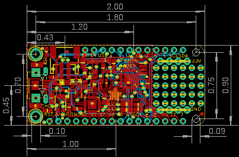
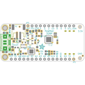
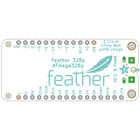
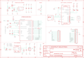
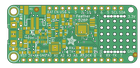
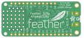

Contents
========

* [PRA3458 > Adafruit Feather 328P PCB](#pra3458--adafruit-feather-328p-pcb)
	* [Schematic](#schematic)
	* [PCB](#pcb)
	* [Interactive BOM](#interactive-bom)
	* [OOMP Parts](#oomp-parts)
	* [Images](#images)
	* [Tags](#tags)
  
![][im]
# PRA3458 > Adafruit Feather 328P PCB

- ID: PROJ-ADAF-3458-STAN-01
- Hex ID: PRA3458
- Name: Adafruit
- Description: Adafruit
- Long Link: [http://oom.lt/PROJ-ADAF-3458-STAN-01](http://oom.lt/PROJ-ADAF-3458-STAN-01)
- Short Link: [http://oom.lt/PRA3458](http://oom.lt/PRA3458)

## Schematic
  

## PCB
  

## Interactive BOM

- Interactive BOM page: [ibom.html](https://htmlpreview.github.io/?https://github.com/oomlout/oomlout_OOMP_projects/blob/main/PROJ-ADAF-3458-STAN-01/kicad/bom/ibom.html)

## OOMP Parts
  

|OOMP Parts|
| :---: |
|[CAPC-0805-X-UF10-V10  SMD (0805) 10 uF Capacitor (Ceramic) 10v  C1, C2, C3, C6, C7](https://github.com/oomlout/oomlout_OOMP_parts/tree/main/CAPC-0805-X-UF10-V10/)|
|[CAPC-0603-X-NF100-V50  SMD (0603) 100 nF Capacitor (Ceramic) 50v  C4, C5, C9, C10](https://github.com/oomlout/oomlout_OOMP_parts/tree/main/CAPC-0603-X-NF100-V50/)|
|[CAPC-0603-X-UF1-V25  SMD (0603) 1 uF Capacitor (Ceramic) 25v  C8, C11](https://github.com/oomlout/oomlout_OOMP_parts/tree/main/CAPC-0603-X-UF1-V25/)|
|LEDS-0805-O-STAN-01 CHG|
|[LEDS-0805-Y-STAN-01  SMD (0805) Yellow LED  D1, D5](https://github.com/oomlout/oomlout_OOMP_parts/tree/main/LEDS-0805-Y-STAN-01/)|
|[LEDS-0805-R-STAN-01  SMD (0805) Red LED  D3](https://github.com/oomlout/oomlout_OOMP_parts/tree/main/LEDS-0805-R-STAN-01/)|
|[DIOD-S123-X-KMBR120-01  SMD (SOD-123) MBR120 Diode  D4](https://github.com/oomlout/oomlout_OOMP_parts/tree/main/DIOD-S123-X-KMBR120-01/)|
|UNMATCHED-UNMATCHED-X-UNMATCHED-01 IC1, IC2, X1, X4, Y2|
|[HEAD-I01-X-PI16-01  2.54 mm 16 Pin Header  JP1](https://github.com/oomlout/oomlout_OOMP_parts/tree/main/HEAD-I01-X-PI16-01/)|
|[HEAD-I01-X-PI12-01  2.54 mm 12 Pin Header  JP3](https://github.com/oomlout/oomlout_OOMP_parts/tree/main/HEAD-I01-X-PI12-01/)|
|MOSP-SO23-X-UNMATCHED-01 Q3|
|[RESE-0603-X-O102-01  SMD (0603) 1k Ohm Resistor  R1, R2, R6, R7, R10](https://github.com/oomlout/oomlout_OOMP_parts/tree/main/RESE-0603-X-O102-01/)|
|[RESE-0603-X-O103-01  SMD (0603) 10k Ohm Resistor  R4, R8](https://github.com/oomlout/oomlout_OOMP_parts/tree/main/RESE-0603-X-O103-01/)|
|RESA-06038-X-O1003X4-01 R5|
|[BUTA-4628-X-STAN-01  SMD (4628) Pushbutton (Tactile)  SW2](https://github.com/oomlout/oomlout_OOMP_parts/tree/main/BUTA-4628-X-STAN-01/)|
|UNMATCHED-SO235-X-UNMATCHED-01 U2, U3|

## Images
  
  

|bominteractivefront|bominteractiveback|kicadPcb3d|kicadPcb3dFront|kicadPcb3dBack|eagleImage|eagleSchemImage|pcbdraw|pcbdrawback|
| :---: | :---: | :---: | :---: | :---: | :---: | :---: | :---: | :---: |
||||||||||

## Tags

- hexID: PRA3458
- oompType: PROJ
- oompSize: ADAF
- oompColor: 3458
- oompDesc: STAN
- oompIndex: 01
- oompName: Adafruit Feather 328P PCB
- sources: All source files from https://github.com/adafruit/Adafruit-Feather-328P-PCB (source licence details in srcLicense.md)
- linkBuyPage: http://www.adafruit.com/products/3458
- oompID: PROJ-ADAF-3458-STAN-01
- oompParts: C1,CAPC-0805-X-UF10-V10
- oompParts: C2,CAPC-0805-X-UF10-V10
- oompParts: C3,CAPC-0805-X-UF10-V10
- oompParts: C4,CAPC-0603-X-NF100-V50
- oompParts: C5,CAPC-0603-X-NF100-V50
- oompParts: C6,CAPC-0805-X-UF10-V10
- oompParts: C7,CAPC-0805-X-UF10-V10
- oompParts: C8,CAPC-0603-X-UF1-V25
- oompParts: C9,CAPC-0603-X-NF100-V50
- oompParts: C10,CAPC-0603-X-NF100-V50
- oompParts: C11,CAPC-0603-X-UF1-V25
- oompParts: CHG,LEDS-0805-O-STAN-01
- oompParts: D1,LEDS-0805-Y-STAN-01
- oompParts: D3,LEDS-0805-R-STAN-01
- oompParts: D4,DIOD-S123-X-KMBR120-01
- oompParts: D5,LEDS-0805-Y-STAN-01
- oompParts: IC1,UNMATCHED-UNMATCHED-X-UNMATCHED-01
- oompParts: IC2,UNMATCHED-UNMATCHED-X-UNMATCHED-01
- oompParts: JP1,HEAD-I01-X-PI16-01
- oompParts: JP3,HEAD-I01-X-PI12-01
- oompParts: Q3,MOSP-SO23-X-UNMATCHED-01
- oompParts: R1,RESE-0603-X-O102-01
- oompParts: R2,RESE-0603-X-O102-01
- oompParts: R4,RESE-0603-X-O103-01
- oompParts: R5,RESA-06038-X-O1003X4-01
- oompParts: R6,RESE-0603-X-O102-01
- oompParts: R7,RESE-0603-X-O102-01
- oompParts: R8,RESE-0603-X-O103-01
- oompParts: R10,RESE-0603-X-O102-01
- oompParts: SW2,BUTA-4628-X-STAN-01
- oompParts: U2,UNMATCHED-SO235-X-UNMATCHED-01
- oompParts: U3,UNMATCHED-SO235-X-UNMATCHED-01
- oompParts: X1,UNMATCHED-UNMATCHED-X-UNMATCHED-01
- oompParts: X4,UNMATCHED-UNMATCHED-X-UNMATCHED-01
- oompParts: Y2,UNMATCHED-UNMATCHED-X-UNMATCHED-01
- rawParts: C1,10uF,CAP_CERAMIC0805-NOOUTLINE,0805-NO,Ceramic Capacitors,,,,,,
- rawParts: C2,10uF,CAP_CERAMIC0805-NOOUTLINE,0805-NO,Ceramic Capacitors,,,,,,
- rawParts: C3,10µF,CAP_CERAMIC0805-NOOUTLINE,0805-NO,Ceramic Capacitors,,,,,,
- rawParts: C4,0.1uF,CAP_CERAMIC0603_NO,0603-NO,Ceramic Capacitors,,,,,,
- rawParts: C5,0.1uF,CAP_CERAMIC0603_NO,0603-NO,Ceramic Capacitors,,,,,,
- rawParts: C6,10µF,CAP_CERAMIC0805-NOOUTLINE,0805-NO,Ceramic Capacitors,,,,,,
- rawParts: C7,10uF,CAP_CERAMIC_0805MP,_0805MP,Ceramic Capacitors,,,,,,
- rawParts: C8,1uF,CAP_CERAMIC0603_NO,0603-NO,Ceramic Capacitors,,,,,,
- rawParts: C9,0.1uF,CAP_CERAMIC0603_NO,0603-NO,Ceramic Capacitors,,,,,,
- rawParts: C10,0.1uF,CAP_CERAMIC0603_NO,0603-NO,Ceramic Capacitors,,,,,,
- rawParts: C11,1uF,CAP_CERAMIC0603_NO,0603-NO,Ceramic Capacitors,,,,,,
- rawParts: CHG,ORANGE,LED0805_NOOUTLINE,CHIPLED_0805_NOOUTLINE,LED,,,,,,
- rawParts: D1,YELLOW,LED0805_NOOUTLINE,CHIPLED_0805_NOOUTLINE,LED,,,,,,
- rawParts: D3,RED,LED0805_NOOUTLINE,CHIPLED_0805_NOOUTLINE,LED,,,,,,
- rawParts: D4,MBR120,DIODE-SCHOTTKYSOD-123,SOD-123,,,,,,,
- rawParts: D5,YELLOW,LED0805_NOOUTLINE,CHIPLED_0805_NOOUTLINE,LED,,,,,,
- rawParts: IC1,CP2104,CP2104,QFN24_4MM_SMSC,CP2104 - USB to UART Bridge,,,,,,
- rawParts: IC2,ATMEGA328P,MEGA8-MI,MLF32-TH,MICROCONTROLLER,,,ATMEGA88PA-MU,1715491,15R0272,
- rawParts: JP1,,HEADER-1X16ROUND,1X16_ROUND,PIN HEADER,,,,,,
- rawParts: JP3,,HEADER-1X12,1X12_ROUND,,,,,,,
- rawParts: Q3,DMG341,MOSFET-P,SOT23-R,P-Channel Mosfet,,,,,,
- rawParts: R1,1K,RESISTOR_0603MP,_0603MP,Resistors,,,,,,
- rawParts: R2,1K,RESISTOR_0603_NOOUT,0603-NO,Resistors,,,,,,
- rawParts: R4,10K,RESISTOR_0603_NOOUT,0603-NO,Resistors,,,,,,
- rawParts: R5,100K,RESISTOR_4PACK,RESPACK_4X0603,Resistor Packs (4 resistors),,,,,,
- rawParts: R6,1K,RESISTOR_0603_NOOUT,0603-NO,Resistors,,,,,,
- rawParts: R7,1K,RESISTOR_0603_NOOUT,0603-NO,Resistors,,,,,,
- rawParts: R8,10K,RESISTOR_0603_NOOUT,0603-NO,Resistors,,,,,,
- rawParts: R10,1K,RESISTOR_0603_NOOUT,0603-NO,Resistors,,,,,,
- rawParts: SW2,KMR2,SWITCH_TACT_SMT4.6X2.8,BTN_KMR2_4.6X2.8,SMT Tact Switches,,,,,,
- rawParts: U$31,MOUNTINGHOLE2.5,MOUNTINGHOLE2.5,MOUNTINGHOLE_2.5_PLATED,Mounting Hole,EXCLUDE,,,,,
- rawParts: U$32,MOUNTINGHOLE2.5,MOUNTINGHOLE2.5,MOUNTINGHOLE_2.5_PLATED,Mounting Hole,EXCLUDE,,,,,
- rawParts: U$34,FIDUCIAL_1MM,FIDUCIAL_1MM,FIDUCIAL_1MM,Fiducial Alignment Points,EXCLUDE,,,,,
- rawParts: U$35,FIDUCIAL_1MM,FIDUCIAL_1MM,FIDUCIAL_1MM,Fiducial Alignment Points,EXCLUDE,,,,,
- rawParts: U2,AP2112-3.3,VREG_SOT23-5,SOT23-5,SOT23-5 Fixed Voltage Regulators,,,,,,
- rawParts: U3,MCP73831T-2ACI/OT,MCP73831/2,SOT23-5,MCP73831/2 LIPO Charger,,,,,,
- rawParts: X1,JSTPH,CON_JST_PH_2PIN,JSTPH2,JST 2-Pin Right-Angle Connector,,,,,,
- rawParts: X4,20329,USB_MICRO_20329_V2,4UCONN_20329_V2,USB Connectors,,,,,,
- rawParts: Y2,CSTNE8M00xx 8MHZ,RESONATORMU,RESONATOR,,,,,,,

[im]: kicadPcb3d_450.png
