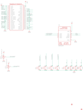

Contents
========

* [PRA3464 > Adafruit Joy Bonnet PCB](#pra3464--adafruit-joy-bonnet-pcb)
	* [Schematic](#schematic)
	* [PCB](#pcb)
	* [Interactive BOM](#interactive-bom)
	* [OOMP Parts](#oomp-parts)
	* [Images](#images)
	* [Tags](#tags)
  
![][im]
# PRA3464 > Adafruit Joy Bonnet PCB

- ID: PROJ-ADAF-3464-STAN-01
- Hex ID: PRA3464
- Name: Adafruit 3464
- Description: Adafruit 3464
- Long Link: [http://oom.lt/PROJ-ADAF-3464-STAN-01](http://oom.lt/PROJ-ADAF-3464-STAN-01)
- Short Link: [http://oom.lt/PRA3464](http://oom.lt/PRA3464)

## Schematic
  

## PCB
  

## Interactive BOM

- Interactive BOM page: [ibom.html](https://htmlpreview.github.io/?https://github.com/oomlout/oomlout_OOMP_projects/blob/main/PROJ-ADAF-3464-STAN-01/kicad/bom/ibom.html)

## OOMP Parts
  

|OOMP ID|Name|Identifier|
| :---: | :---: | :---: |
|[BUTA-4628-X-STAN-01](https://github.com/oomlout/oomlout_OOMP_parts/tree/main/BUTA-4628-X-STAN-01/)|[SMD (4628) Pushbutton (Tactile)](https://github.com/oomlout/oomlout_OOMP_parts/tree/main/BUTA-4628-X-STAN-01/)|[1, 2](https://github.com/oomlout/oomlout_OOMP_parts/tree/main/BUTA-4628-X-STAN-01/)|
|UNMATCHED-UNMATCHED-X-UNMATCHED-01||JOY1, RPI1, U1|
|[BUTA-6060-X-STAN-01](https://github.com/oomlout/oomlout_OOMP_parts/tree/main/BUTA-6060-X-STAN-01/)|[SMD (6060) Pushbutton (Tactile)](https://github.com/oomlout/oomlout_OOMP_parts/tree/main/BUTA-6060-X-STAN-01/)|[SW1, SW2, SW3, SW4, SW5, SW8](https://github.com/oomlout/oomlout_OOMP_parts/tree/main/BUTA-6060-X-STAN-01/)|

## Images
  
  

|bominteractivefront|bominteractiveback|kicadPcb3d|kicadPcb3dFront|kicadPcb3dBack|kicadSchem|eagleImage|eagleSchemImage|pcbdraw|pcbdrawback|
| :---: | :---: | :---: | :---: | :---: | :---: | :---: | :---: | :---: | :---: |
|||||||||||

## Tags

- hexID: PRA3464
- oompType: PROJ
- oompSize: ADAF
- oompColor: 3464
- oompDesc: STAN
- oompIndex: 01
- oompName: Adafruit Joy Bonnet PCB
- sources: All source files from https://github.com/adafruit/Adafruit-Joy-Bonnet-PCB (source licence details in srcLicense.md)
- linkBuyPage: http://www.adafruit.com/products/3464
- oompID: PROJ-ADAF-3464-STAN-01
- oompParts: 1,BUTA-4628-X-STAN-01
- oompParts: 2,BUTA-4628-X-STAN-01
- oompParts: JOY1,UNMATCHED-UNMATCHED-X-UNMATCHED-01
- oompParts: RPI1,UNMATCHED-UNMATCHED-X-UNMATCHED-01
- oompParts: SW1,BUTA-6060-X-STAN-01
- oompParts: SW2,BUTA-6060-X-STAN-01
- oompParts: SW3,BUTA-6060-X-STAN-01
- oompParts: SW4,BUTA-6060-X-STAN-01
- oompParts: SW5,BUTA-6060-X-STAN-01
- oompParts: SW8,BUTA-6060-X-STAN-01
- oompParts: U1,UNMATCHED-UNMATCHED-X-UNMATCHED-01
- rawParts: 1,KMR2,SWITCH_TACT_SMT4.6X2.8,BTN_KMR2_4.6X2.8,SMT Tact Switches,,
- rawParts: 2,KMR2,SWITCH_TACT_SMT4.6X2.8,BTN_KMR2_4.6X2.8,SMT Tact Switches,,
- rawParts: FID2,FIDUCIAL_1MM,FIDUCIAL_1MM,FIDUCIAL_1MM,Fiducial Alignment Points,EXCLUDE,
- rawParts: FID3,FIDUCIAL_1MM,FIDUCIAL_1MM,FIDUCIAL_1MM,Fiducial Alignment Points,EXCLUDE,
- rawParts: JOY1,JOYSTICK_ANALOG_XY,JOYSTICK_ANALOG_XY,JOYSTICK_ANALOG_MINITHM,,,
- rawParts: RPI1,RASPBERRYPI_BPLUS_BONNETSMT,RASPBERRYPI_BPLUS_BONNETSMT,PI_BONNET_SMT,,,
- rawParts: SW1,EVQQ,SWITCH_TACT_SMT_EVQQ2_SMALL,EVQ-Q2_SMALLER,SMT Tact Switches,,
- rawParts: SW2,EVQQ,SWITCH_TACT_SMT_EVQQ2_SMALL,EVQ-Q2_SMALLER,SMT Tact Switches,,
- rawParts: SW3,EVQQ,SWITCH_TACT_SMT_EVQQ2_SMALL,EVQ-Q2_SMALLER,SMT Tact Switches,,
- rawParts: SW4,EVQQ,SWITCH_TACT_SMT_EVQQ2_SMALL,EVQ-Q2_SMALLER,SMT Tact Switches,,
- rawParts: SW5,EVQQ,SWITCH_TACT_SMT_EVQQ2_SMALL,EVQ-Q2_SMALLER,SMT Tact Switches,,
- rawParts: SW8,EVQQ,SWITCH_TACT_SMT_EVQQ2_SMALL,EVQ-Q2_SMALLER,SMT Tact Switches,,
- rawParts: U1,ADS1015,ADC_ADS1015,MSOP10,ADS1015 - 12-bit 4-Channel I2C ADC with Internal PGA,,

[im]: kicadPcb3d_450.png
